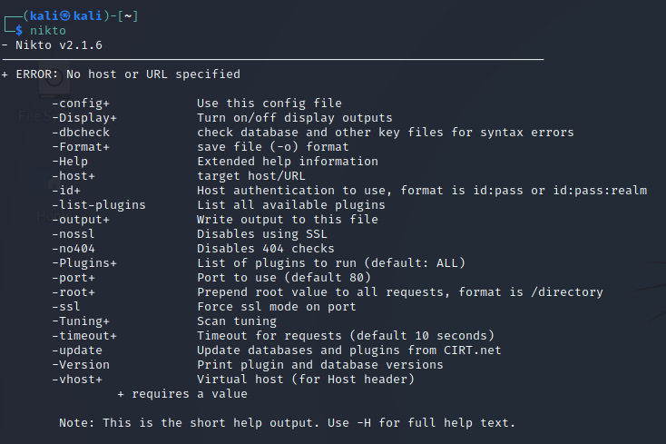

```bash
kali@kali:~$ nikto -host=http://www.megacorpone.com -maxtime=30s
- Nikto v2.1.6
---------------------------------------------------------------------------
+ Target IP: 38.100.193.76
+ Target Hostname: www.megacorpone.com
+ Target Port: 80
---------------------------------------------------------------------------
+ Server: Apache/2.2.22 (Ubuntu)
+ Server may leak inodes via ETags, header found with file /, inode:
152243, size: 12519, mtime: Fri May 17 06:26:28 2019
+ The anti-clickjacking X-Frame-Options header is not present.
+ The X-XSS-Protection header is not defined. This header can hint to
the user agent to protect against some forms of XSS
+ The X-Content-Type-Options header is not set. This could allow the
user agent to render the content of the site in a different fashion to
the MIME type
+ No CGI Directories found (use '-C all' to force check all possible dirs)
+ "robots.txt" contains 1 entry which should be manually viewed.
+ Apache/2.2.22 appears to be outdated (current is at least
Apache/2.4.37). Apache 2.2.34 is the EOL for the 2.x branch.
+ ERROR: Host maximum execution time of 30 seconds reached
+ ERROR: Host maximum execution time of 30 seconds reached
+ Scan terminated: 0 error(s) and 6 item(s) reported on remote host
+ End Time: 2019-06-05 11:22:35 (GMT-4) (31 seconds)
---------------------------------------------------------------------------
+ 1 host(s) tested
```