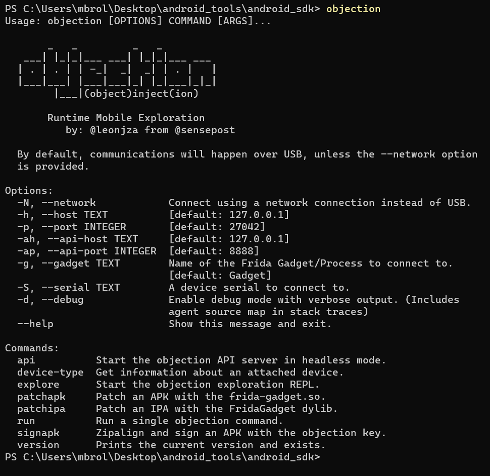
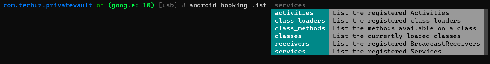

# Getting started

- https://github.com/sensepost/objection/wiki/Using-objection#getting-started-android-edition
- https://book.hacktricks.xyz/mobile-pentesting/android-app-pentesting/frida-tutorial/objection-tutorial

```bash
$ objection --gadget "com.techuz.privatevault" explore

# Browse the file system
com.techuz.privatevault on (google: 10) [usb] # pwd
Current directory: /data/user/0/com.techuz.privatevault/files
com.techuz.privatevault on (google: 10) [usb] # ls
Type       Last Modified            Read  Write  Hidden  Size     Name
---------  -----------------------  ----  -----  ------  -------  ----------------------------------------------------------------------------------------------------
Directory  2023-06-26 21:45:55 GMT  True  True   True    4.0 KiB  .com.google.firebase.crashlytics
File       2023-06-14 20:58:12 GMT  True  True   False   0.0 B    generatefid.lock
File       2023-06-22 20:44:06 GMT  True  True   False   570.0 B  PersistedInstallation.W0RFRkFVTFRd+MTo1Nzk3OTA4MDI0ODM6YW5kcm9pZDozMGNkMjJjMTU4MDVjNDRlY2M5ZDQ2.json

Readable: True  Writable: True
com.techuz.privatevault on (google: 10) [usb] # env

Name                    Path
----------------------  -------------------------------------------------------------------
cacheDirectory          /data/user/0/com.techuz.privatevault/cache
codeCacheDirectory      /data/user/0/com.techuz.privatevault/code_cache
externalCacheDirectory  /storage/emulated/0/Android/data/com.techuz.privatevault/cache
filesDirectory          /data/user/0/com.techuz.privatevault/files
obbDir                  /storage/emulated/0/Android/obb/com.techuz.privatevault
packageCodePath         /data/app/com.techuz.privatevault-kpKamwMgXiwpOJfM11eD3g==/base.apk

# Download file
com.techuz.privatevault on (google: 10) [usb] # file download file.txt file.txt

# List activities
com.techuz.privatevault on (google: 10) [usb] # android hooking list activities

# Launch intents
com.opera.mini.native on (samsung: 6.0.1) [usb] # android intent launch_activity com.facebook.ads.AudienceNetworkActivity
Launching Activity: com.facebook.ads.AudienceNetworkActivity...
```

## Patch APKs with frida using objection

You can use objection to patch and insert [Frida](Frida.md) inside any APK 

```sh
$ objection patchapk -s FridaTarget.apk

No architecture specified. Determining it using `adb`...
Detected target device architecture as: x86
Using latest Github gadget version: 16.5.2
Patcher will be using Gadget version: 16.5.2
Detected apktool version as: 2.10.0
Running apktool empty-framework-dir...
Press any key to continue . . .
Unpacking FridaTarget.apk
App already has android.permission.INTERNET
Setting extractNativeLibs to true...
Target class not specified, searching for launchable activity instead...
Smali not found in smali directory. This might be a multidex APK. Searching...
Found smali at: C:\Users\mbrol\AppData\Local\Temp\tmp8rx93sxv.apktemp\smali_classes6\io/hextree/fridatarget/MainActivity.smali
Reading smali from: C:\Users\mbrol\AppData\Local\Temp\tmp8rx93sxv.apktemp\smali_classes6\io/hextree/fridatarget/MainActivity.smali
Injecting loadLibrary call at line: 12
Attempting to fix the constructors .locals count
Current locals value is 0, updating to 1:
Writing patched smali back to: C:\Users\mbrol\AppData\Local\Temp\tmp8rx93sxv.apktemp\smali_classes6\io/hextree/fridatarget/MainActivity.smali
Copying Frida gadget to libs path...
Rebuilding the APK with the frida-gadget loaded...
Built new APK with injected loadLibrary and frida-gadget
Performing zipalign
Zipalign completed
Signing new APK.
Signed the new APK
Copying final apk from C:\Users\mbrol\AppData\Local\Temp\tmp8rx93sxv.apktemp.aligned.objection.apk to FridaTarget.objection.apk in current directory...
Cleaning up temp files...
```

>[!note]
>The application won't fully launch until you connect to it with frida/objection.
>`$ objection explore`