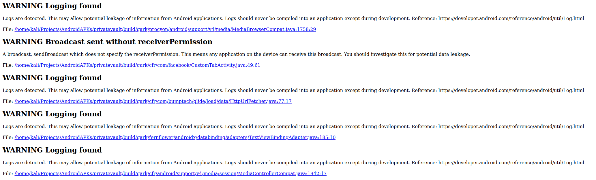

>[!summary]
>This tool is designed to look for several security related Android application vulnerabilities, either in source code or packaged APKs. The tool is also capable of creating "Proof-of-Concept" deployable APKs and/or ADB commands, capable of exploiting many of the vulnerabilities it finds.

>[!warning]
>Last pull on GitHub is from 2019. The tool may be in disuse.

Included in the types of security vulnerabilities this tool attempts to find are:

- Inadvertently exported components
- Improperly protected exported components
- Intents which are vulnerable to interception or eavesdropping
- Improper x.509 certificate validation
- Creation of world-readable or world-writeable files
- Activities which may leak data
- The use of Sticky Intents
- Insecurely created Pending Intents
- Sending of insecure Broadcast Intents
- Private keys embedded in the source
- Weak or improper cryptography use
- Potentially exploitable WebView configurations
- Exported Preference Activities
- Tapjacking
- Apps which enable backups
- Apps which are debuggable
- Apps supporting outdated API versions, with known vulnerabilities

# Scan

APK:
```bash
~ qark --apk path/to/my.apk
Running scans...
Finish scans...
Writing report...
Finish writing report to /home/kali/.local/lib/python3.11/site-packages/qark/report/report.html ...
```

Java source code files:
```bash
~ qark --java path/to/parent/java/folder
~ qark --java path/to/specific/java/file.java
```

## Report sample

