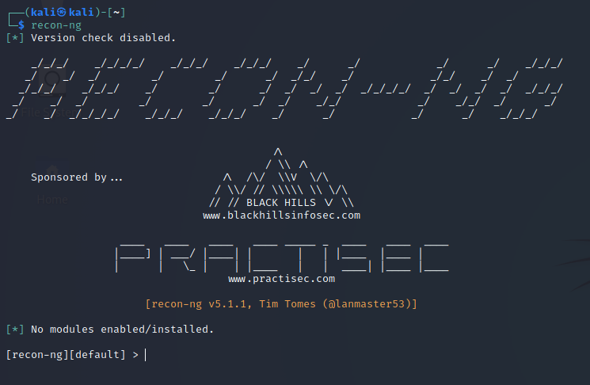

>[!warning]
>Many modules require credentials (API keys, OAuth access tokens, etc.) for accessing third party resources. Below is guidance for acquiring some of the credentials required by one or more modules. >A detailed list explaining how to obtain them can be found at this [page](https://github.com/lanmaster53/recon-ng-marketplace/wiki/API-Keys).



Search modules:

```bash
[recon-ng][default] > marketplace search github
[*] Searching module index for 'github'...

  +------------------------------------------------------------------------------------------------+
  |                       Path                      | Version |     Status    |  Updated   | D | K |
  +------------------------------------------------------------------------------------------------+
  | recon/companies-multi/github_miner              | 1.1     | not installed | 2020-05-15 |   | * |
  | recon/profiles-contacts/github_users            | 1.0     | not installed | 2019-06-24 |   | * |
  | recon/profiles-profiles/profiler                | 1.0     | not installed | 2019-06-24 |   |   |
  | recon/profiles-repositories/github_repos        | 1.1     | not installed | 2020-05-15 |   | * |
  | recon/repositories-profiles/github_commits      | 1.0     | not installed | 2019-06-24 |   | * |
  | recon/repositories-vulnerabilities/github_dorks | 1.0     | not installed | 2019-06-24 |   | * |
  +------------------------------------------------------------------------------------------------+

  D = Has dependencies. See info for details.
  K = Requires keys. See info for details.
```

### Info about a module

```bash
[recon-ng][default] > marketplace info recon/domains-hosts/google_site_web

  +---------------------------------------------------------------------------------------------------------------------------------+
  | path          | recon/domains-hosts/google_site_web                                                                             |
  | name          | Google Hostname Enumerator                                                                                      |
  | author        | Tim Tomes (@lanmaster53)                                                                                        |
  | version       | 1.0                                                                                                             |
  | last_updated  | 2019-06-24                                                                                                      |
  | description   | Harvests hosts from Google.com by using the 'site' search operator. Updates the 'hosts' table with the results. |
  | required_keys | []                                                                                                              |
  | dependencies  | []                                                                                                              |
  | files         | []                                                                                                              |
  | status        | not installed                                                                                                   |
  +---------------------------------------------------------------------------------------------------------------------------------+
```

### Install modules

```bash
[recon-ng][default] > marketplace install recon/domains-hosts/google_site_web
[*] Module installed: recon/domains-hosts/google_site_web
[*] Reloading modules...
```

### Load modules

```bash
[recon-ng][default] > modules load recon/domains-hosts/google_site_web
[recon-ng][default][google_site_web] > info

      Name: Google Hostname Enumerator
    Author: Tim Tomes (@lanmaster53)
   Version: 1.0

Description:
  Harvests hosts from Google.com by using the 'site' search operator. Updates the 'hosts' table with
  the results.

Options:
  Name    Current Value  Required  Description
  ------  -------------  --------  -----------
  SOURCE  default        yes       source of input (see 'info' for details)

Source Options:
  default        SELECT DISTINCT domain FROM domains WHERE domain IS NOT NULL
  <string>       string representing a single input
  <path>         path to a file containing a list of inputs
  query <sql>    database query returning one column of inputs
```

### Setting up modules and run

```bash
[recon-ng][default][google_site_web] > info

      Name: Google Hostname Enumerator
    Author: Tim Tomes (@lanmaster53)
   Version: 1.0

Description:
  Harvests hosts from Google.com by using the 'site' search operator. Updates the 'hosts' table with
  the results.

Options:
  Name    Current Value  Required  Description
  ------  -------------  --------  -----------
  SOURCE  default        yes       source of input (see 'info' for details)

Source Options:
  default        SELECT DISTINCT domain FROM domains WHERE domain IS NOT NULL
  <string>       string representing a single input
  <path>         path to a file containing a list of inputs
  query <sql>    database query returning one column of inputs

[recon-ng][default][google_site_web] > options set SOURCE megacorpone.com
SOURCE => megacorpone.com
[recon-ng][default][google_site_web] > run

---------------
MEGACORPONE.COM
---------------
[*] Searching Google for: site:megacorpone.com
[*] Country: None
[*] Host: www.megacorpone.com
[*] Ip_Address: None
[*] Latitude: None
[*] Longitude: None
[*] Notes: None
[*] Region: None
[*] --------------------------------------------------
[*] Searching Google for: site:megacorpone.com -site:www.megacorpone.com
[*] No New Subdomains Found on the Current Page. Jumping to Result 201.
...
```

### Retrieve old results from the db

```bash
[recon-ng][default] > show
Shows various framework items

Usage: show <companies|contacts|credentials|domains|hosts|leaks|locations|netblocks|ports|profiles|pushpins|repositories|vulnerabilities>

[recon-ng][default] > show hosts

  +--------------------------------------------------------------------------------------------------------------+
  | rowid |         host        | ip_address | region | country | latitude | longitude | notes |      module     |
  +--------------------------------------------------------------------------------------------------------------+
  | 1     | www.megacorpone.com |            |        |         |          |           |       | google_site_web |
  +--------------------------------------------------------------------------------------------------------------+

[*] 1 rows returned
```