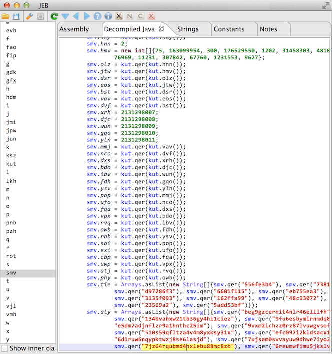
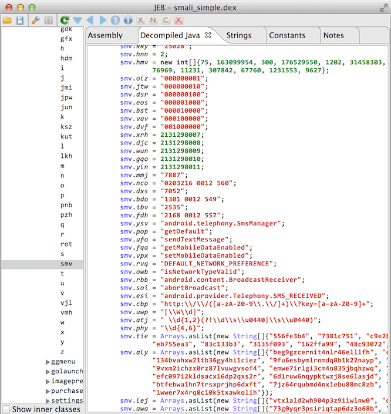

>[!summary]
>Simplify virtually executes an app to understand its behavior and then tries to optimize the code so that it behaves identically but is easier for a human to understand. Each optimization type is simple and generic, so it doesn't matter what the specific type of obfuscation is used.

## De-obfuscating decompiled smali code

```bash
$ simplify.jar -i "input smali files or folder" -o <output dex file>
```



