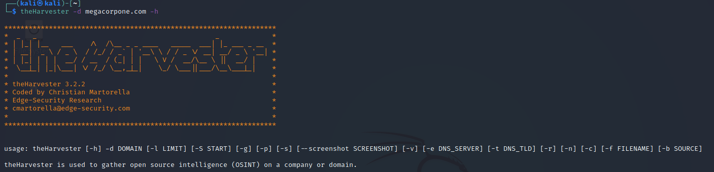

```bash
usage: theHarvester [-h] -d DOMAIN [-l LIMIT] [-S START] [-g] [-p] [-s] [--screenshot SCREENSHOT] [-v] [-e DNS_SERVER] [-t DNS_TLD] [-r] [-n] [-c] [-f FILENAME] [-b SOURCE]

theHarvester is used to gather open source intelligence (OSINT) on a company or domain.

optional arguments:
  -h, --help            show this help message and exit
  -d DOMAIN, --domain DOMAIN
                        Company name or domain to search.
  -l LIMIT, --limit LIMIT
                        Limit the number of search results, default=500.
  -S START, --start START
                        Start with result number X, default=0.
  -g, --google-dork     Use Google Dorks for Google search.
  -p, --proxies         Use proxies for requests, enter proxies in proxies.yaml.
  -s, --shodan          Use Shodan to query discovered hosts.
  --screenshot SCREENSHOT
                        Take screenshots of resolved domains specify output directory: --screenshot output_directory
  -v, --virtual-host    Verify host name via DNS resolution and search for virtual hosts.
  -e DNS_SERVER, --dns-server DNS_SERVER
                        DNS server to use for lookup.
  -t DNS_TLD, --dns-tld DNS_TLD
                        Perform a DNS TLD expansion discovery, default False.
  -r, --take-over       Check for takeovers.
  -n, --dns-lookup      Enable DNS server lookup, default False.
  -c, --dns-brute       Perform a DNS brute force on the domain.
  -f FILENAME, --filename FILENAME
                        Save the results to an HTML and/or XML file.
  -b SOURCE, --source SOURCE
                        baidu, bing, bingapi, bufferoverun, certspotter, crtsh, dnsdumpster, duckduckgo, exalead, github-code, google, hackertarget, hunter, intelx, linkedin, linkedin_links, netcraft, otx,
                        pentesttools, projectdiscovery, qwant, rapiddns, securityTrails, spyse, sublist3r, threatcrowd, threatminer, trello, twitter, urlscan, virustotal, yahoo

```

```bash
root@kali:~# theHarvester -d cisco.com -b google >google.txt
root@kali:~# theHarvester -d cisco.com -l 10 -b bing >bing.txt
```