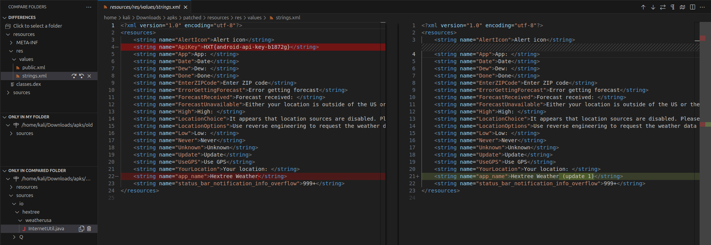

# Useful shortcuts

https://code.visualstudio.com/docs/editor/codebasics

Folding:
- **Toggle Fold** (`Ctrl+K Ctrl+L`): folds or unfolds the region at the cursor.
- **Fold All** (`Ctrl+K Ctrl+0`): folds all regions in the editor.
- **Unfold All** (`Ctrl+K Ctrl+J`): unfolds all regions in the editor.
- **Fold Level X** (`Ctrl+K Ctrl+2` for level 2): folds all regions of level X, except the region at the current cursor position.
- **Fold All Block Comments** (`Ctrl+K Ctrl+/`): folds all regions that start with a block comment token.
# vscode 101

`.vscode/launch.json`: is what contains the various definitions used for launching and/or debugging the project

```json
{
    // Use IntelliSense to learn about possible attributes.
    // Hover to view descriptions of existing attributes.
    // For more information, visit: https://go.microsoft.com/fwlink/?linkid=830387
    "version": "0.2.0",
    "configurations": [
        {
            "type": "node",
            "request": "launch",
            "name": "Launch Program",
            "program": "${file}"
        }
    ]
}
```

# Debug different languages
- [Remote Debugging NodeJS](../Dev,%20scripting%20&%20OS/JavaScript%20&%20NodeJS.md#Remote%20Debugging%20NodeJS)
- [Remote debug python application](../Dev,%20scripting%20&%20OS/Python.md#Remote%20debug%20python%20application)


# Useful extension

[Compare Folders](https://marketplace.visualstudio.com/items?itemName=moshfeu.compare-folders): useful for patch diffing and investigating newer/older/modified files 
  
  ^397c19