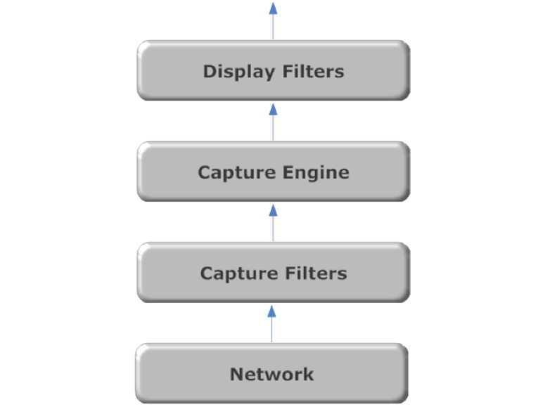

>[!info]
>Wireshark use **Libpcap** or **Winpcap**.

## Capture Filters

Allows to apply a first filtering rule on the traffic that we want to intercept.
Predefined capture filters: `Capture > Capture filters`

## Display Filters

Allows to apply a second filtering rule on the traffic that will be shown.

## Follow TCP Stream

