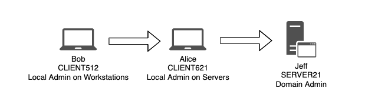

> [!info]
> Pre-requisite: [Active Directory 101](../Dev,%20scripting%20&%20OS/Active%20Directory%20101.md)

# Traditional Approach

The tradition approach is based on the methods showed in the section [Internal information gathering, Windows](Internal%20information%20gathering.md#Windows) with a specific focus on AD environment.

Enumerate **all local accounts**:

```powershell
C:\Users\Offsec.corp> net user
User accounts for \\CLIENT251
-------------------------------------------------------------------------------
admin 		Administrator 		DefaultAccount
Guest 		student 			    WDAGUtilityAccount
The command completed successfully.
```

Enumerate **all domain accounts**:

```powershell
C:\Users\Offsec.corp> net user /domain
The request will be processed at a domain controller for domain corp.com.
User accounts for \\DC01.corp.com
-------------------------------------------------------------------------------
adam 		  Administrator 		DefaultAccount
Guest 		iis_service 		  jeff_admin
krbtgt 		offsec 				    sql_service
The command completed successfully.
```

Enumerate **single user**:

```powershell
C:\Users\Offsec.corp> net user jeff_admin /domain
The request will be processed at a domain controller for domain corp.com.
User name 						    jeff_admin
Full Name 						    Jeff_Admin
Comment
User's comment
Country/region code 			    000 (System Default)
Account active 					    Yes
Account expires 				    Never
Password last set 				    2/19/2018 1:56:22 PM
Password expires 				    Never
Password changeable 			    2/19/2018 1:56:22 PM
Password required 				    Yes
User may change password 		    Yes
Workstations allowed 			    All
Logon script
User profile
Home directory
Last logon 						    Never
Logon hours allowed 			    All
Local Group Memberships
Global Group memberships 		   *Domain Users 	*Domain Admins
The command completed successfully.
```

Enumerate **domain groups**:

```powershell
C:\Users\Offsec.corp> net group /domain
The request will be processed at a domain controller for domain corp.com.
Group Accounts for \\DC01.corp.com
-------------------------------------------------------------------------------
*Another_Nested_Group
*Cloneable Domain Controllers
*DnsUpdateProxy
*Domain Admins
*Domain Computers
*Domain Controllers
*Domain Guests
*Domain Users
*Enterprise Admins
*Enterprise Key Admins
*Enterprise Read-only Domain Controllers
*Group Policy Creator Owners
*Key Admins
*Nested_Group
*Protected Users
*Read-only Domain Controllers
*Schema Admins
*Secret_Group
The command completed successfully.
```

---

# Modern Approach

- [Get-ADUser](https://docs.microsoft.com/en-us/powershell/module/addsadministration/get-aduser?view=win10-ps) (installed on AD as [RSAT](https://docs.microsoft.com/en-us/previous-versions/technet-magazine/gg413289(v=msdn.10)?redirectedfrom=MSDN) or on workstation as administrative service)
- [AD Enumeration](../Dev,%20scripting%20&%20OS/Powershell%20for%20pentesters.md#AD%20Enumeration) using [Powershell for pentesters](../Dev,%20scripting%20&%20OS/Powershell%20for%20pentesters.md)
- [Bloodhound](../Tools/Bloodhound.md)
- [impacket](../Tools/impacket.md)
- [ldapdomaindump](../Tools/ldapdomaindump.md)
- [CrackMapExec](../Tools/CrackMapExec.md)
- [Empire](../Tools/Empire.md)
- [PowerView.ps1](../Tools/Empire.md#PowerView.ps1)

## Enumerate Logged on Users



The two most reliable Windows functions that can help us to achieve these goals are the [NetWkstaUserEnum](https://msdn.microsoft.com/en-us/library/windows/desktop/aa370669(v=vs.85).aspx) and [NetSessionEnum](https://docs.microsoft.com/en-us/windows/win32/api/lmshare/nf-lmshare-netsessionenum) API.
While the former requires administrative permissions and returns the list of all users logged on to a target workstation, the latter can be used from a regular domain user and returns a list of active user sessions on servers such as fileservers or domain controllers.

> [!tip]
> During an assessment, after compromising a domain machine, we should enumerate every computer in the domain and then use NetWkstaUserEnum against the obtained list of targets. Keep in mind that this API will only list users logged on to a target if we have local administrator privileges on that target.
> Alternatively we could focus our efforts on discovering the domain controllers and any potential file servers (based on servers hostnames or open ports) in the network and use NetSessionEnum against these servers in order to enumerate all active users’ sessions.

Calling an operating system API from PowerShell is not completely straightforward. The most common solution is the use of [PowerView.ps1](../Tools/Empire.md#PowerView.ps1)

## Enumerate Through Service Principal Names (SPN)

An alternative to attacking a domain user account is to target so-called [service accounts](https://msdn.microsoft.com/en-us/library/windows/desktop/ms686005(v=vs.85).aspx) , which may also be members of high value groups.
When an application is executed, it must always do so in the context of an operating system user.
If a user launches an application, that user account defines the context. However, services launched by the system itself use the context based on a *Service Account* (like [LocalSystem](https://msdn.microsoft.com/en-us/library/windows/desktop/ms684190(v=vs.85).aspx), [LocalService](https://msdn.microsoft.com/en-us/library/windows/desktop/ms684188(v=vs.85).aspx), and [NetworkService](https://msdn.microsoft.com/en-us/library/windows/desktop/ms684272(v=vs.85).aspx)).

When applications like Exchange, SQL, or Internet Information Services (IIS) are integrated into Active Directory, a unique service instance identifier known as a *Service Principal Name* ([SPN](https://msdn.microsoft.com/en-us/library/ms677949(v=vs.85).aspx)) is used to associate a service on a specific server to a service account in Active Directory.

>[!tip]
>By enumerating all registered SPNs in the domain, we can obtain the IP address and port number of applications running on servers integrated with the target Active Directory, limiting the need for a broad port scan.

Since the information is registered and stored in Active Directory, it is present on the domain controller. To obtain the data, we will again query the domain controller [in search of specific service principal names](../Dev,%20scripting%20&%20OS/Powershell%20for%20pentesters.md#SPN%20enumeration).

```powershell
PS C:\Users\offsec.CORP> .\enumSPN.ps1
Name Value
---- -----
givenname {iis_service}
samaccountname {iis_service}
cn {iis_service}
pwdlastset {131623309820953450}
whencreated {05/02/2018 19.03.02}
badpwdcount {0}
displayname {iis_service}
lastlogon {131624786130434963}
samaccounttype {805306368}
countrycode {0}
objectguid {201 74 156 103 125 89 254 67 146 40 244 7 212 176 32 11}
usnchanged {28741}
whenchanged {07/02/2018 12.08.56}
name {iis_service}
objectsid {1 5 0 0 0 0 0 5 21 0 0 0 202 203 185 181 144 182 205 192 58 2
logoncount {3}
badpasswordtime {0}
accountexpires {9223372036854775807}
primarygroupid {513}
objectcategory {CN=Person,CN=Schema,CN=Configuration,DC=corp,DC=com}
userprincipalname {iis_service@corp.com}
useraccountcontrol {590336}
dscorepropagationdata {01/01/1601 00.00.00}
serviceprincipalname {HTTP/CorpWebServer.corp.com}
distinguishedname {CN=iis_service,OU=ServiceAccounts,OU=CorpUsers,DC=corp,DC=com
objectclass {top, person, organizationalPerson, user}
usncreated {12919}
lastlogontimestamp {131624773644330799}
adspath
{LDAP://CN=iis_service,OU=ServiceAccounts,OU=CorpUsers,DC=corp,DC=com}

PS C:\Users\offsec.CORP> nslookup CorpWebServer.corp.com
Server: UnKnown
Address: 192.168.1.110
Name: corpwebserver.corp.com
Address: 192.168.1.110
```

It is also possible to use

- [Empire](../Tools/Empire.md)
- [Get-SPN.ps1](https://github.com/EmpireProject/Empire/blob/master/data/module_source/situational_awareness/network/Get-SPN.ps1)
- [GetUserSPNs](../Tools/impacket.md#GetUserSPNs)