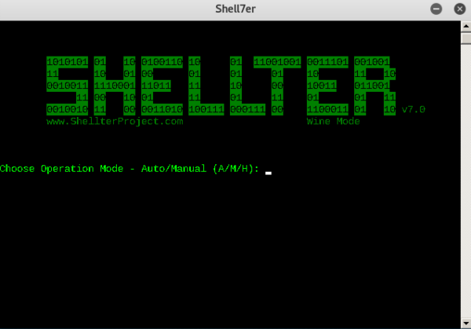

# Methods of Detecting Malicious Code

- **Signature-Based Detection**: An antivirus signature is a continuous sequence of bytes within malware that uniquely identifies it. Signature-based antivirus detection is mostly considered a blacklist technology. In other words, the filesystem is scanned for known malware signatures and if any are detected, the offending files are quarantined.

- **Heuristic-Based Detection**: relies on various rules and algorithms to determine whether or not an action is considered malicious. This is often achieved by stepping through the instruction set of a binary file or by attempting to decompile and then analyze the source code.

- **Behavioral-Based Detection**: dynamically analyzes the behavior of a binary file. This is often achieved by executing the file in question in an emulated environment, such as a small virtual machine, and looking for behaviors or actions that are considered malicious.

---

# Bypassing Antivirus Detection

## On-Disk Evasion

Focuses on modifying malicious files physically stored on disk in an attempt to evade AV detection.

- **Packers** (legacy)
Originally designed to simply reduce the size of executables, generating functionally equivalents with a completely new binary structure.
Tool: [UPX](https://upx.github.io/)

- **Obfuscators**
They reorganize and mutate code in a way that makes it more difficult to reverse-engineer (replace instructions with semantically equivalents, inserting dead code, etc.)

- **Crypters**
Alters executable code, adding a decrypting stub that restores the original code upon execution. This decryption happens in-memory, leaving only the encrypted code on-disk.

- **Software Protectors**
Combination of all of the previous techniques in addition to advanced ones (anti-reversing, anti-debugging, VM detection, etc)

## In-Memory Evasion (PE Injection)

Avoiding the disk entirely and therefore reducing the possibility of being detected. Usually done in C/C++ or [Powershell](Dev,%20ICT%20&%20Cybersec/Dev,%20scripting%20&%20OS/Powershell%20for%20pentesters.md) using [in-memory Injection](Dev,%20ICT%20&%20Cybersec/Dev,%20scripting%20&%20OS/Powershell%20for%20pentesters.md#In-memory%20Injection)

- **Remote Process Memory Injection**: Inject the payload into another PE that is not malicious by leveraging a set of Windows APIs.
    1. [OpenProcess](https://docs.microsoft.com/en-us/windows/desktop/api/processthreadsapi/nf-processthreadsapi-openprocess) function to obtain a valid [HANDLE](https://en.wikipedia.org/wiki/Handle_(computing)) to a target process that we have permissions to access
    2. Allocate memory in the context of that process calling a Windows API such as [VirtualAllocEx](https://docs.microsoft.com/en-us/windows/win32/api/memoryapi/nf-memoryapi-virtualallocex)
    3. Once the memory has been allocated, we would copy the malicious payload to the newly allocated memory using [WriteProcessMemory](https://docs.microsoft.com/en-us/windows/win32/api/memoryapi/nf-memoryapi-writeprocessmemory)
    4. Execute in memory in a separate thread using the [CreateRemoteThread](https://docs.microsoft.com/en-us/windows/desktop/api/processthreadsapi/nf-processthreadsapi-createremotethread) API

- **Reflective DLL Injection**:
Attempts to load a DLL stored by the attacker in the process memory ([ref](https://www.andreafortuna.org/2017/12/08/what-is-reflective-dll-injection-and-how-can-be-detected/)).
[LoadLibrary](https://docs.microsoft.com/en-us/windows/win32/api/libloaderapi/nf-libloaderapi-loadlibrarya) (used to inject DLL from disk) does not support loading from memory and Windows operating system does not expose any APIs to do that. Attackers who choose to use this technique must write their own version of the API

- **Process Hollowing** ([ref](https://ired.team/offensive-security/code-injection-process-injection/process-hollowing-and-pe-image-relocations)):
    1. Launch a non-malicious process in a suspended state
    2. Image of the process is removed from memory and replaced with a malicious executable image.
    3. Process is then resumed and malicious code is executed instead of the legitimate process.
- **Inline hooking**:
This technique involves modifying memory and introducing a hook (instructions that redirect the code execution) into a function to point the execution flow to our malicious code.
Upon executing our malicious code, the flow will return back to the modified function and resume execution, appearing as if only the original code had executed.

---

## Tools

- [msfvenom](../Tools/msfvenom.md)
- veilevasion
- hyperion
- [ps_encoder.py](https://github.com/darkoperator/powershell_scripts/blob/master/ps_encoder.py)
- Shellter (win): 
  Dynamic shellcode injection tool. Inject malicious payload inside legitimate executable.    
	
- private custom tools
    - Online backdoors
    - Self-programmed backdoors
- [Enigma Protector](http://www.enigmaprotector.com/en/home.html)
- [PrimeEncyptor](../../Readwise/Articles/Erik%20-%20Last%20Week%20in%20Security%20(LWiS)%20-%202025-04-28.md#^1581ef)