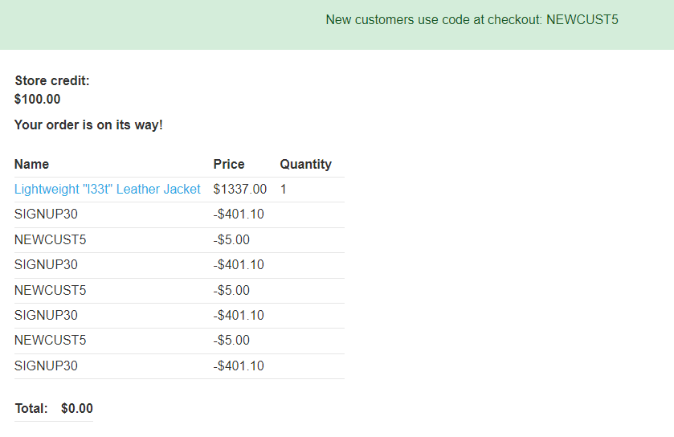
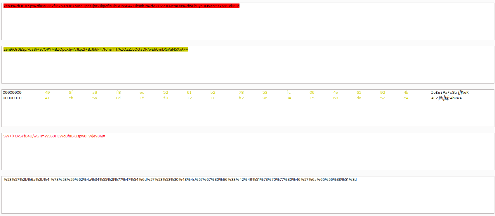

>[!summary] What are business logic vulnerabilities?
>Business logic vulnerabilities (also known as "application logic vulnerabilities" or "logic flaws") are flaws in the design and implementation of an application that allow an attacker to elicit unintended behavior. This potentially enables attackers to manipulate legitimate functionality to achieve a malicious goal. These flaws are generally the result of failing to anticipate unusual application states that may occur and, consequently, failing to handle them safely.

Logic-based vulnerabilities can be extremely diverse and are often unique to the application and its specific functionality. Identifying them often requires a certain amount of human knowledge, such as an understanding of the business domain or what goals an attacker might have in a given context. This makes them difficult to detect using automated vulnerability scanners. As a result, logic flaws are a great target for bug bounty hunters and manual testers in general.

## Examples

### Excessive trust in client-side controls 

Use-cases:

- Modify product prices
- Generates 2FA for other users
- etc.

### Failing to handle unconventional input

Use-cases:
- Send negatives values in order to increase money or get arbitrary discounts: 
- Exploit integers overflows to get arbitrary discounts:
    
- [SQL Truncation](SQL%20Truncation.md)
- [HTTP Parameter Pollution (HPP)](HTTP%20Parameter%20Pollution%20(HPP).md)

### Making flawed assumptions about user behavior

Use-cases:

- **Trusted users won't always remain trustworthy**: they can modify their already approved email, username, name, etc. to malicious values and perform various attacks once authenticated.

- **Users won't always supply mandatory input**: this is a particular issue in cases where multiple functions are implemented within the same server-side script. In this case, the presence or absence of a particular parameter may determine which code is executed. Removing parameter values may allow an attacker to access code paths that are supposed to be out of reach)
  >[!example]
>Assume there is an [Insecure Direct Object Reference](Access%20control%20vulnerabilities.md#Insecure%20Direct%20Object%20Reference) that allows to change other user's password altering the username id inside the following request:
>
>```http
>POST /my-account/change-password HTTP/1.1
>Host: 0a9e00980496b4b9c02da4e300020001.web-security-academy.net
>Cookie: session=adsihUOTd31TaeG29eYkiSEvXvSrvhdp
>Content-Length: 108
>Content-Type: application/x-www-form-urlencoded
>User-Agent: Mozilla/5.0 (Windows NT 10.0; Win64; x64) AppleWebKit/537.36 (KHTML, like Gecko) Chrome/108.0.0.0 Safari/537.36
>Connection: close
>
>csrf=Hze4X6W8zgRaCi8G4Q5WFrsPq6VTXjBk&username=user&current-password=peter&new-password-1=password&new-password-2=password
>```
>Theoretically not knowing the user's previous password should prevent account takeover, but if the server does not properly check the very existence of the field, it is possible to **remove the parameter completely** and thus perform identity theft: 
>
>```http
>POST /my-account/change-password HTTP/1.1
>Host: 0a9e00980496b4b9c02da4e300020001.web-security-academy.net
>Cookie: session=adsihUOTd31TaeG29eYkiSEvXvSrvhdp
>Content-Length: 108
>Content-Type: application/x-www-form-urlencoded
>User-Agent: Mozilla/5.0 (Windows NT 10.0; Win64; x64) AppleWebKit/537.36 (KHTML, like Gecko) Chrome/108.0.0.0 Safari/537.36
>Connection: close
>
>csrf=Hze4X6W8zgRaCi8G4Q5WFrsPq6VTXjBk&username=admin&new-password-1=password&new-password-2=password
>
>---
>
>HTTP/1.1 200 OK
>Content-Type: text/html; charset=utf-8
>Cache-Control: no-cache
>Connection: close
>Content-Length: 3885
>...
><p>Password changed successfully!</p>
>```

- **Users won't always follow the intended sequence**: Many transactions rely on predefined sequence of steps. The web interface will typically guide users through this process, however, attackers won't necessarily adhere to this intended sequence. Failing to account for this possibility can lead to dangerous flaws that may be relatively simple to exploit, like [multi-factor authentication bypasses](Authentication%20Attacks.md#Multi-factor%20authentication%20attacks), purchases using different item prices, [authentication bypasses](Authentication%20Attacks.md), etc.

### Domain-specific flaws

Logic flaws that are specific to the business domain or the purpose of the site. 

>[!example] Examples
>**Discounting functionality**: consider an online shop that offers a 10% discount on orders over $1000. This could be vulnerable to abuse if the business logic fails to check whether the order was changed after the discount is applied. In this case, an attacker could simply add items to their cart until they hit the $1000 threshold, then remove the items they don't want before placing the order. They would then receive the discount on their order even though it no longer satisfies the intended criteria. 
>
>Other possible vulnerabilities would be using the same one-shot discount code multiple times, using discount codes to buy more valuable promo codes, exploiting [Race Condition](Race%20Condition.md) (see [Diogenes' Rage](../../Play%20ground/CTFs/Diogenes'%20Rage.md)) and other misconfigurations.
> 

For e-commerce e stores refer to the following articles: 
- [Common Security Issues in FinanciallyOriented Web Applications](https://soroush.me/downloadable/common-security-issues-in-financially-orientated-web-applications.pdf), Soroush Dalili 
- [Hunting Down the Top 5 Most Common Price Manipulation Vulnerabilities in E-Commerce Websites](../../Readwise/Articles/intigriti%20-%20Hunting%20Down%20the%20Top%205%20Most%20Common%20Price%20Manipulation%20Vulnerabilities%20in%20E-Commerce%20Websites.md), Intigriti
### Providing an encryption oracle

Dangerous scenarios can occur when user-controllable input is encrypted and the resulting ciphertext is then made available to the user in some way. This kind of input is sometimes known as an "encryption oracle" [^whatsup-gold-cve]. An attacker can use this input to encrypt arbitrary data using the correct algorithm and asymmetric key.

[^whatsup-gold-cve]: [Breaking Down Barriers: Exploiting Pre-Auth SQL Injection in WhatsUp Gold CVE-2024-6670](../../Readwise/Articles/Summoning%20Team%20-%20Breaking%20Down%20Barriers%20Exploiting%20Pre-Auth%20SQL%20Injection%20in%20WhatsUp%20Gold%20CVE-2024-6670.md), Summoning Team

This becomes dangerous when there are other user-controllable inputs in the application that expect data encrypted with the same algorithm. In this case, an attacker could potentially use the encryption oracle to generate valid, encrypted input and then pass it into other sensitive functions.

This issue can be compounded if there is another user-controllable input on the site that provides the reverse function. This would enable the attacker to decrypt other data to identify the expected structure. This saves them some of the work involved in creating their malicious data but is not necessarily required to craft a successful exploit.

>[!example]
>The "stay logged in" feature set the following encrypted cookie once logged in: `stay-logged-in=BUud7NQ%2fCILgneMdBfPgLG%2boN0Yv7bpwg1fE9QmdbPM%3d;`
>
>The "change email" feature set an encrypted notification cookie **using user controllable data** to show error messages on-screen: 
>```http
>POST /my-account/change-email HTTP/1.1
>Host: 0af200b503f16117c1ed3aa000040088.web-security-academy.net
>Cookie: stay-logged-in=DQw46dDv0WDlotZV2JskliftCDvW1f%2bqG7gWa9P4Bxk%3d; session=wzBgZS5FSt8Hv4X2gZ4Vs4cnEmT2S49G
>Content-Length: 49
>Content-Type: application/x-www-form-urlencoded
>User-Agent: Mozilla/5.0 (Windows NT 10.0; Win64; x64) AppleWebKit/537.36 (KHTML, like Gecko) Chrome/108.0.0.0 Safari/537.36
>Connection: close
>
>email=pippo&csrf=mV6y9vBUE1ucfUfA0qLlSlBZYraFYWig
>
> ---
>
>HTTP/1.1 302 Found
>Location: /my-account
>Set-Cookie: notification=2en9%2fOr0ESp%2fk6a8%2f%2b97OBGXOFiVWFUSjFk1b26Y9OQ%3d; HttpOnly
>Connection: close
>Content-Length: 0
>```
>
>
>Assuming both the `notification` and the `stay-logged-in` cookie are encrypted using the same key, it's possible to abuse `/my-account/change-email` and the error message to leak the original `stay-logged-in` structure.
>
>
>
>Once obtained the information, we can re-use the `email` parameter and the `notification` cookie to encrypt a custom error message containing a new `stay-logged-in` cookie to escalate privileges to admin. 
>>[!warning]
>>**Be careful**: the crypted message also contains the "Invalid email address:" message. We must find the exact offset and generate a valid cookie that do not have this message, otherwise the cookie cannot be used as replacement to `notification`. Simply removing the same number of undesired characters do not work:
>>
>>You need to pad the "`Invalid email address: `" prefix (length 23) with enough bytes (9) so that the number of bytes you will remove is a multiple of 16.
>
> Padded the arbitrary cookie with 9 other random values: `XXXXXXXXXadministrator:1672756757959`
> Error message is now "Invalid email address: XXXXXXXXXadministrator:1672756757959" (prefix length to be removed is 32, a multiple of 16)
> The crypted error message is `2en9%2fOr0ESp%2fk6a8%2f%2b97OPYMBZOpqXJjvrVJkpZf%2bBJJb6P47FJhsnhT%2fAZOZZJLQctaDR%2fwEhCynDQVaN5XxA%3d%3d`
>
>Now we can URL-decode and base64-decode the cookie, remove 32 bytes and encode it again in order to have a valid padded value containing just our custom payload without other appended messages:
>
> 
> Now we can use the crafted payload to alter the `stay-logged-in` cookie and become administrator


### Order of operation bugs

- [Assetnote Research - Leveraging an Order of Operations Bug to Achieve RCE in Sitecore 8.x - 10.x](../../Readwise/Articles/Assetnote%20Research%20-%20Leveraging%20an%20Order%20of%20Operations%20Bug%20to%20Achieve%20RCE%20in%20Sitecore%208.x%20-%2010.x.md)


