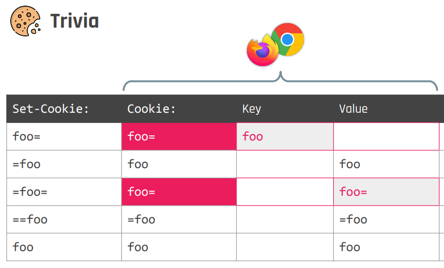

# Cookie Tossing

>[!info]
>If an **attacker can control a subdomain** or the apex domain of a company or finds an [XSS](Cross-Site%20Scripting%20(XSS).md) in a subdomain he will be able to perform this attacks.

Cookie Tossing is a [Cookie Fixation](Header%20Fixation.md) vulnerability performed from a child domain, without requiring any misconfiguration on the target domain.

Cookies do not follow [Same-origin policy (SOP)](Same-origin%20policy%20(SOP).md) because they are not bound to a specific Origin, they can be scoped to entire sites [^samesite].

[^samesite]: [SameSite 101](SameSite%20Cookie%20Attribute.md#SameSite%20101)

>[!warning]
>When a **cookie is set to a domain (specifying it) it will be used in the apex domain and subdomains.**
>
>An attacker is going to be able to set to the apex domain and subdomains a specific cookie doing something like
>
>`document.cookie="session=1234; Path=/app/login; domain=.example.com"`

Because of that, attackers can perform [Cookie Fixation](Header%20Fixation.md) attacks on arbitrary parent domains, resulting in cloned cookie and, so, fixated items instead of the original ones. 


*Image from [BH23 Cookie Crumbles](https://minimalblue.com/data/papers/BHUSA23_cookie_crumbles-slides.pdf), Marco Squarcina*

Cookie tossing can be useful in:
- [Session Fixation](Session%20Fixation.md) attacks
- [Cross-Origin Request Forgery (CORF)](Cross-Origin%20Request%20Forgery%20(CORF).md) attacks (because we are in a context of SameSite, so the [SameSite Cookie Attribute](SameSite%20Cookie%20Attribute.md) do not apply here)
- Self-[XSS](Cross-Site%20Scripting%20(XSS).md) in cookies [^zoom-ato]

[^zoom-ato]: [Zoom Session Takeover - Cookie Tossing Payloads, OAuth Dirty Dancing, Browser Permissions Hijacking, and WAF Abuse](../../Readwise/Articles/Harel%20Security%20Research%20-%20Zoom%20Session%20Takeover%20-%20Cookie%20Tossing%20Payloads,%20OAuth%20Dirty%20Dancing,%20Browser%20Permissions%20Hijacking,%20and%20WAF%20Abuse.md), Harel Security Research


<iframe width="560" height="315" src="https://www.youtube.com/embed/nNTAuT21xRg?si=jxzOe2ughrCT-o7I" title="YouTube video player" frameborder="0" allow="accelerometer; autoplay; clipboard-write; encrypted-media; gyroscope; picture-in-picture; web-share" referrerpolicy="strict-origin-when-cross-origin" allowfullscreen></iframe>
<iframe width="560" height="315" src="https://www.youtube.com/embed/Gp1YEm7pJhw?si=a3dG2WMHKefgr1FD" title="YouTube video player" frameborder="0" allow="accelerometer; autoplay; clipboard-write; encrypted-media; gyroscope; picture-in-picture; web-share" referrerpolicy="strict-origin-when-cross-origin" allowfullscreen></iframe>

## Cookie order

When a browser receives **two cookies with the same name affecting the same domain, subdomains and path**, the browser will **send both** values of the cookie when both are valid for the request.

Depending on who has **the most specific path** or which one is the **oldest one**, the browser will **set the value of the cookie first** and then the value of the other one like in: 

`Cookie: iduser=MoreSpecificAndOldestCookie; iduser=LessSpecific;`

>[!info]
>Most **websites will only use the first value**. Then, if an attacker wants to set a cookie it's better to set it before another one is set or set it with a more specific path.

>[!danger]
>The capability to **set a cookie in a more specific path** (eg. with [Cookie Fixation](Header%20Fixation.md)) is very interesting as you will be able to make the **victim work with his cookie except in the specific path where the malicious cookie set will be sent before**.

# Remediations

## Strict Secure

It's a protection against the Network threat model and MitM attacks.

If a cookie already exists, and has the **Secure flag** enabled, a different cookie having **the same name, without the Secure flag, and coming from a different origin (http) cannot be set**.

## Cookie prefixes

If you name a cookie `__Host-` something, you are defining a high-integrity cookie which inherit additional security protections from browsers.

The additional constraints are: 
- the cookie path attribute must be set to `/`
- it must has the Secure flag enabled
- it must not contain the domain attribute

If you have a cookie this way, it cannot be set by sibling domains.

## Bypass using nameless cookie



You can set a nameless cookie [^nameless-cookie] with every attribute and value you desire, and you will be able to **toss any Strict Secure or high-integrity cookie**:

[^nameless-cookie]: [Internet Security: the Danger of Nameless Cookies](https://www.tuwien.at/en/tu-wien/news/news-articles/news/internetsicherheit-gefahr-durch-namenlose-cookies), tuwien.at

```http title:legit-cookie
Set-Cookie: __Host-sess=good; Secure; Path=/ 
```


```http title:nameless-cookie
Set-Cookie: =__Host-sess=bad; Secure; Path=/app; domain=0xbro.red
```

Final result:
```http
HTTP /app HTTP/1.1
Host: 0xbro.red
Cookie: __Host-sess=bad; __Host-sess=good;
```

>[!warning]
>Currently browsers (Firefox and Chrome) do not accept nameless cookies starting with `__Host-` or `__Secure-`. However, you can use this technique to toss any other traditional or strict secure cookie.

### Bypass `__Host-` protection exploiting PHP differentials


The following cookies are all parsed by PHP < 8.1.11 as if they were the same cookie (CVE-2022-31629): 
```http
Cookie: __Host-sess=bad
Cookie: _ Host-sess=bad
Cookie: ..Host-sess=bad
```

From PHP 8.1.11 and above, you can still perform the bypass by exploiting how array are serialized:
```http
Cookie: _[Host-sess=bad
```

# External refences
- [Cookie Tossing](https://book.hacktricks.xyz/pentesting-web/hacking-with-cookies/cookie-tossing), HackTricks
- [BH23 Cookie Crumbles Slides](https://minimalblue.com/data/papers/BHUSA23_cookie_crumbles-slides.pdf), Marco Squarcina
- [USENIX23 Cookie Crumbles Slides](https://www.usenix.org/system/files/sec23_slides_squarcina-marco.pdf), Marco Squarcina
