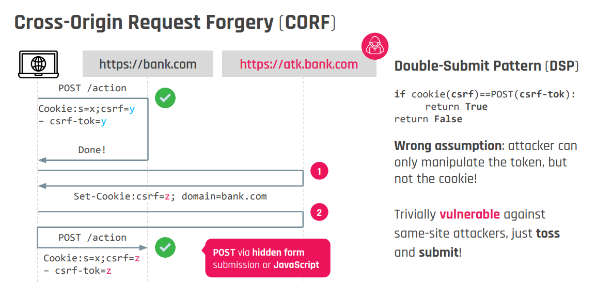
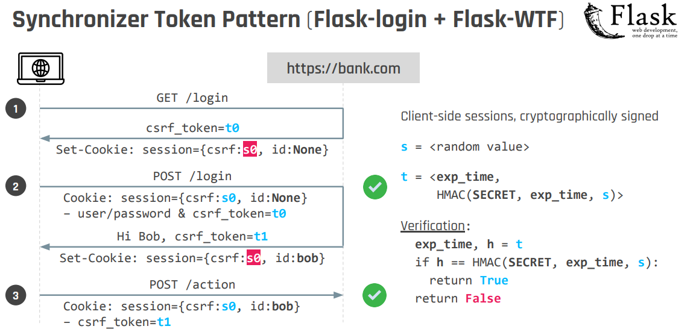
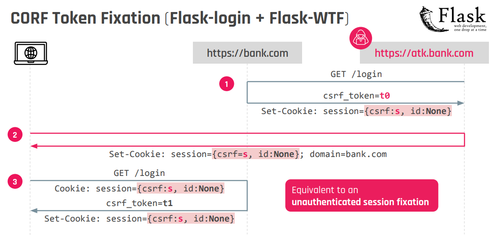
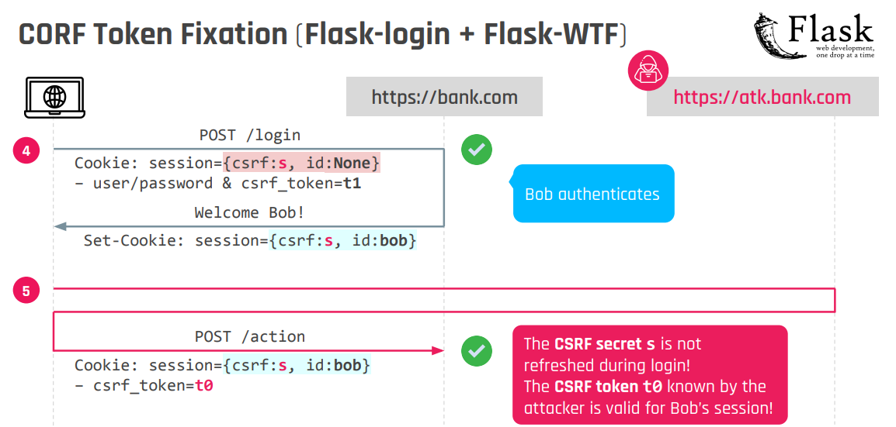

## Cross-Origin Request Forgery (CORF)

Cross-Origin Request Forgery attacks are a particular variation of [Cross-Site Request Forgery (CSRF)](Cross-Site%20Request%20Forgery%20(CSRF).md) attacks, when the attacker has already compromised a sub-domain for a specific target domain.

## Bypass double-submit pattern

Like for [CSRF](Cross-Site%20Request%20Forgery%20(CSRF).md#^a150b3) vulnerabilities, if you are able to perform [Cookie Tossing](Cookie%20Tossing.md), you can bypass the double-submit pattern protection by fixating a known CSRF-token and submitting it alongside the CSRF token embedded within the form.

## CORF Token Fixation (Bypass Synchronizer Token Pattern)

Scenario: the csrf token embedded within the session cookie is not refreshed after a user logs in:

>[!bug]
>If the secret csrf token is not refreshed, it becomes vulnerable to [Session Fixation](Session%20Fixation.md)! (eg. CVE-2022-35943)

1. An attacker can obtain a pre-session cookie containing the secret csrf token `s` and a csrf FORM token `t0` 
2. The attacker perform an unauthenticated [Session Fixation](Session%20Fixation.md) (potentially using [Cookie Tossing](Cookie%20Tossing.md)) 
3. The user visits the login page and obtain a FORM csrf token `t1`  starting from `s` (which is known to the attacker)
4. The victim logs in and the session is promoted to an authenticated one (note the CSRF secret is still `s`)
5. Now the attacker has a valid csrf FORM token `t0` binded to the user session that can use for the attack, and the session cookie containing the session of the victim.

<iframe width="560" height="315" src="https://www.youtube.com/embed/nNTAuT21xRg?si=uoU7uL39unlz1RVo&amp;start=1069" title="YouTube video player" frameborder="0" allow="accelerometer; autoplay; clipboard-write; encrypted-media; gyroscope; picture-in-picture; web-share" referrerpolicy="strict-origin-when-cross-origin" allowfullscreen></iframe>