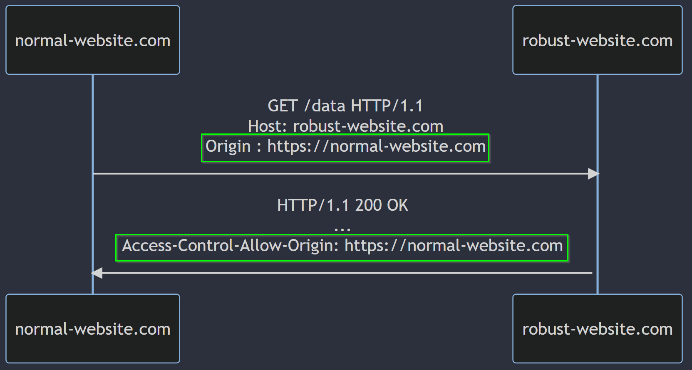
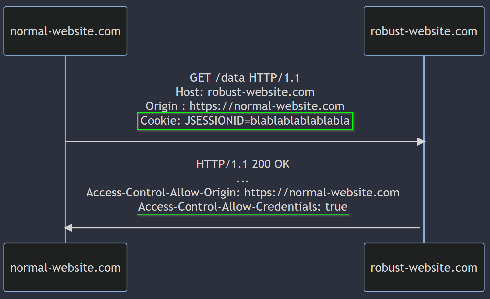

>[!summary] What is CORS?
>Cross-origin resource sharing (CORS) is a browser mechanism which enables controlled access to resources located outside of a given domain. Extends and adds flexibility to the [Same-origin policy (SOP)](Same-origin%20policy%20(SOP).md) but also provides potential for cross-domain attacks if it is misconfigured. 
>>[!warning]
>>CORS is not a protection against cross-origin attacks

# How does CORS work?

The cross-origin resource sharing protocol **uses a suite of HTTP headers** that **define trusted web origins and associated properties** such as whether authenticated access is permitted. These are combined in a header exchange between a browser and the cross-origin web site that it is trying to access. 
In this way it is possible to allow one origin to read responses returned from a different origin.

## The Access-Control-Allow-Origin header

The `Access-Control-Allow-Origin` header is **included in the response from one website to a request originating from another website** (and so having the `Origin` header), and identifies the **permitted origin** of the request. A web browser compares the `Access-Control-Allow-Origin` with the requesting website's origin and permits access to the response if they match.

>[!example]
>
>In this scenario, the browser will allow code running on `normal-website.com` to access the response because the origins match.

`Access-Control-Allow-Origin` allows:
- single origin
- multiple origins
- the value `null`
- the wildcard `*` (cannot be used inside other values, like `http://*.normal-website.com`)

## The Access-Control-Allow-Credentials header

The default behavior of cross-origin resource requests is for requests to be passed without credentials like cookies and the Authorization header. However, the cross-domain server can permit reading of the response when credentials are passed to it by setting the CORS `Access-Control-Allow-Credentials` header to true.

>[!example]
>If the requesting website uses JavaScript to declare that it is sending cookies with the request:
>
>Then the browser will permit the requesting website to read the response, because the `Access-Control-Allow-Credentials` response header is set to `true`. Otherwise, the browser will not allow access to the response.

## Pre-flight checks

>[!important]
>Under certain circumstances, when a cross-domain request includes a **non-standard HTTP method or headers**, the **cross-origin request is preceded by** a request using **the `OPTIONS` method**, and the CORS protocol necessitates an initial check on what methods and headers are permitted prior to allowing the cross-origin request. The server returns a list of allowed methods in addition to the trusted origin and the browser checks to see if the requesting website's method is allowed.

>[!example]
>Pre-flight request using the `PUT` method and a non-standard header:
```http
OPTIONS /data HTTP/1.1
Host: <some website>
...
Origin: https://normal-website.com
Access-Control-Request-Method: PUT
Access-Control-Request-Headers: Special-Request-Header
```
The server might return a response like the following:
```http
HTTP/1.1 204 No Content
...
Access-Control-Allow-Origin: https://normal-website.com
Access-Control-Allow-Methods: PUT, POST, OPTIONS
Access-Control-Allow-Headers: Special-Request-Header
Access-Control-Allow-Credentials: true
Access-Control-Max-Age: 240
```

This response sets out the allowed methods (`PUT`, `POST` and `OPTIONS`) and permitted request headers (`Special-Request-Header`). In this particular case the cross-domain server also allows the sending of credentials, and the `Access-Control-Max-Age` header defines a maximum timeframe for caching the pre-flight response for reuse. If the request methods and headers are permitted (as they are in this example) then the browser processes the cross-origin request in the usual way. Pre-flight checks add an extra HTTP request round-trip to the cross-domain request, so they increase the browsing overhead.

### Bypass

- [Cross-Site POST Requests Without a Content-Type Header](../../Readwise/Articles/Luke%20Jahnke%20-%20Cross-Site%20POST%20Requests%20Without%20a%20Content-Type%20Header.md)

## External tools for testing CORS

- [jakearchibald.com - How to Win at CORS](../../Readwise/Articles/jakearchibald.com%20-%20How%20to%20Win%20at%20CORS.md#^3625b2)