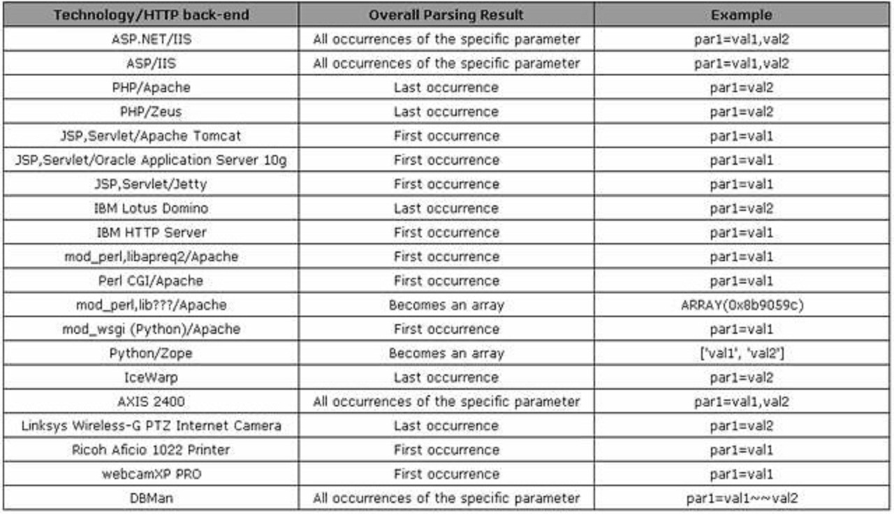
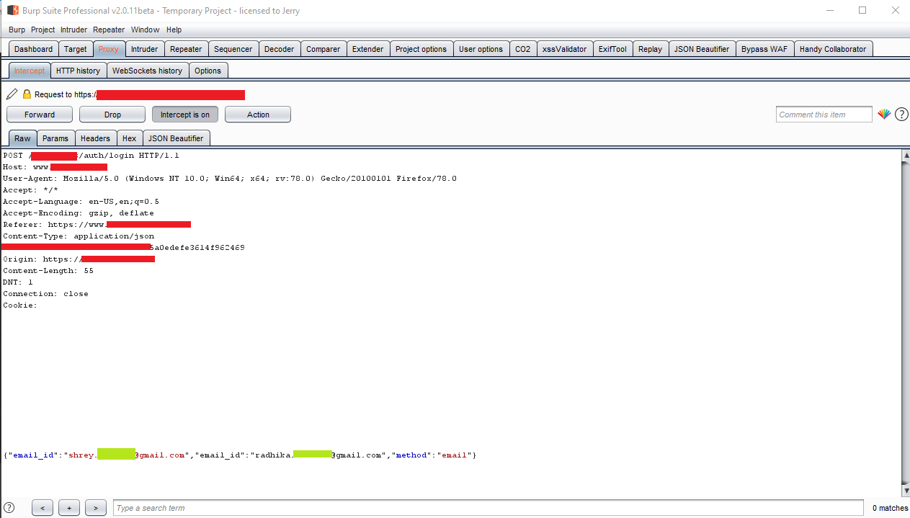

# HTTP Parameter Pollution
HTTP Parameter Pollution, as implied by the name, pollutes the HTTP parameters of a web application in order to perform or achieve a specific malicious task/attack different from the intended behavior of the web application. 

HPP injects encoded query string delimiters in existing or other HTTP parameters (i.e. GET/POST/Cookie), which make it feasible to supersede parameter values that already exist to inject a new parameter or exploit variables from direct access. This attack affects all web technologies, whether running client-side or server-side.

Generally, an attacker can use HPP vulnerabilities to:
- Supersede existing hardcoded HTTP parameters.
- Alter or modify the intended/normal application behavior and obtain [business logic vulnerabilities](Business%20logic%20vulnerabilities.md).
- Access and potentially exploit variables that are not been controlled properly.
- Bypass WAFs rules or input validation mechanisms.

HTTP allows the submission of the same parameter more than once. The manipulation of the value of each parameter depends on how each web technology is parsing these parameters. 

>[!question]
>So, what happens if the same parameter is provided more than one time?

Some web technologies parse the first or the last occurrence of the parameter, some concatenate all the inputs and others will create an array of parameters.



## Testing for server-side parameter pollution

>[!hint]
>To test for server-side parameter pollution in the query string, place query syntax characters like `#`, `&`, and = in your input and observe how the application responds. [^sspp]

[^sspp]: [Server-Side Parameter Pollution](https://portswigger.net/web-security/api-testing/server-side-parameter-pollution), portswigger.com

Consider a vulnerable application that enables you to search for other users based on their username. When you search for a user, your browser makes the following request:

```http
GET /userSearch?name=peter&back=/home
```

To retrieve user information, the server queries an internal API with the following request:

```http
GET /users/search?name=peter&publicProfile=true
```

You can use a URL-encoded `#` character to attempt to truncate the server-side request. To help you interpret the response, you could also add a string after the `#` character.

For example, you could modify the query string to the following:

```http
GET /userSearch?name=peter%23foo&back=/home
```

The front-end will try to access the following URL:

```http
GET /users/search?name=peter#foo&publicProfile=true
```

Review the response for clues about whether the query has been truncated. For example, if the response returns the user `peter`, the server-side query may have been truncated. If an `Invalid name` error message is returned, the application may have treated `foo` as part of the username. This suggests that the server-side request may not have been truncated.

If you're able to truncate the server-side request, this removes the requirement for the `publicProfile` field to be set to true. You may be able to exploit this to return non-public user profiles.
## Examples

### Business logic bypass

If with the request below accounA pays 1000 euros to accountB

```http
https://www.anybank.com/send/?from=accountA&to=accountB&amount=10000
```

Injecting a new `from` parameter at the end of the string may cause the payment coming from accountC instead of accountA

```http
https://www.anybank.com/send/?from=accountA&to=accountB&amount=10000%26from=accountC
```

### Authentication bypass and account takeover

The same issue can be used to achieve [authentication bypass](Authentication%20Attacks.md) or account takeover by intercepting 2FA or OTP intended for other users:



### OAuth redirect_url whitelist bypass

HPP can also be used to bypass `redirect_uri` whitelisting in [OAuth 2.0 attacks](OAuth%202.0%20attacks.md):
```http
https://oauth-authorization-server.com/?client_id=123&redirect_uri=client-app.com/callback&redirect_uri=evil-user.net
```

# External references

- https://owasp.org/www-pdf-archive/AppsecEU09_CarettoniDiPaola_v0.8.pdf
- https://www.madlab.it/slides/BHEU2011/whitepaper-bhEU2011.pdf
- https://book.hacktricks.xyz/pentesting-web/parameter-pollution