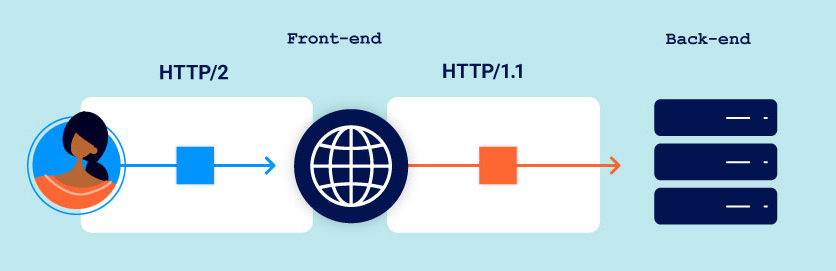
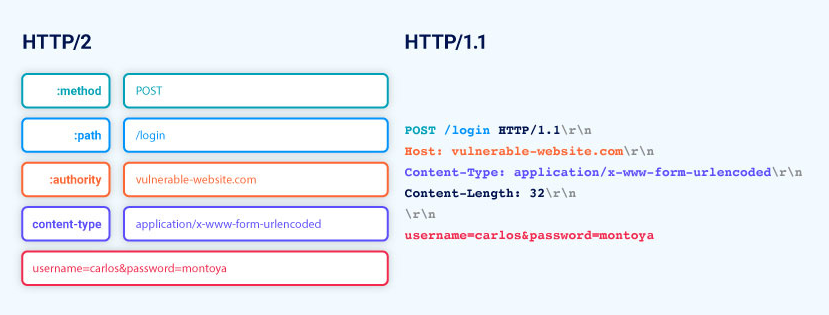

>[!question] What is HTTP/2 downgrading?
>[HTTP/2](HTTP-2.md) downgrading is the process of rewriting HTTP/2 requests using HTTP/1 syntax to generate an equivalent HTTP/1 request.
>Web servers and reverse proxies often do this in order to offer HTTP/2 support to clients while communicating with back-end servers that only speak HTTP/1

When the HTTP/1-speaking back-end issues a response, the front-end server reverses this process to generate the HTTP/2 response that it returns to the client.

HTTP/2's built-in length mechanism means that, when HTTP downgrading is used, there are potentially three different ways to specify the length of the same request, which is the basis of all [HTTP Request Smuggling](HTTP%20Request%20Smuggling.md) attacks.