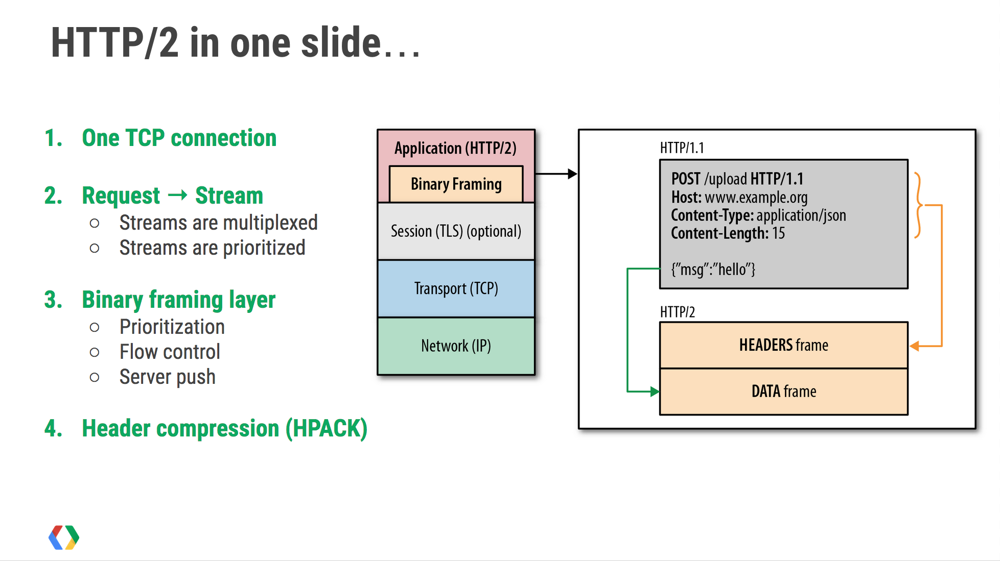

# Introduction

As an HTTP/1 request is a single, text-based entity, servers have to use string operations to identify and extract the data they need based on a series of special delimiter characters. For example, each header is separated by a newline, while the name and value are separated by a colon.

Although Burp displays HTTP/2 requests in two different, human-readable forms [^1], under the hood, they actually **use a binary format**. The point where each piece of information starts and ends is clearly defined, so there's no need for delimiter characters.

[^1]: https://portswigger.net/burp/documentation/desktop/http2

As a result, newlines, colons, and the like have **no special meaning within an HTTP/2** request and can be injected in ways that are not possible in HTTP/1.

> [!example]
> HTTP/2 header names and values are technically able to hold newline characters. Although this is officially prohibited according to the specification, by working with the Inspector, you can take advantage of the fact that some servers tolerate this anyway.

## Frames

On the wire, HTTP/2 messages are sent as one or more separate "frames". The headers frame is equivalent to the request line and headers section of an HTTP/1 request. This may be followed by a number of data frames that contain the message body data.

## Message length

Each frame of an HTTP/2 message is preceded by an explicit length field that tells the server how many bytes to read in. Therefore, servers can easily work out the overall length of the message by simply calculating the sum of its frame lengths.

## Header capitalization

In HTTP/1, header names are typically case insensitive. In HTTP/2, sending uppercase letters in a header name is technically possible, but it may lead to the request being rejected by the server as this does not conform to the HTTP/2 specification.

## Pseudo-headers

In HTTP/2, a series of "pseudo-headers" is used to send key information about the message.  All pseudo-headers should be sent before any ordinary headers.

>[!info] 
>When referring to pseudo-headers, it's common practice to prefix their names with a colon to help differentiate them from normal headers. Note that this is just one way of presenting this information in a human-readable format. On the wire, these names are just binary bytes and don't actually contain a colon.

In total, there are five pseudo-headers:

- `:method` - The HTTP method of the request, such as `GET` or `POST`.
- `:path` - The request path. Note that this includes the query string.
- `:authority` - Roughly equivalent to the `Host` header in HTTP/1.
- `:scheme` - The request scheme, typically `http` or `https`. HTTP/1 has no an equivalent header
- `:status` - The response status code.

# Hidden HTTP/2 support

Browsers and other clients, including Burp, typically only use HTTP/2 to communicate with servers that explicitly advertise support for it via ALPN as part of the TLS handshake.

Some servers support HTTP/2 but fail to declare this properly due to misconfiguration. In such cases, it can appear as though the server only supports HTTP/1.1 because clients default to this as a fallback option. As a result, testers may overlook viable HTTP/2 attack surface and miss protocol-level issues, such as [HTTP/2 request smuggling](Exploiting%20HTTP%20Request%20Smuggling.md#HTTP/2%20request%20smuggling) attacks.