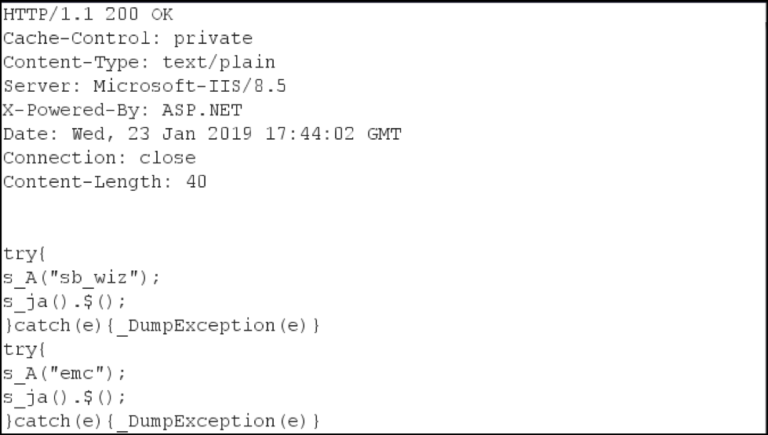

>[!question] What is MIME sniffing?
>"MIME sniffing" can be broadly defined as the practice adopted by browsers to determine the effective MIME type of a web resource by examining the content of the response instead of relying on the **Content-Type** header.


# MIME type

MIME stands for "Multipurpose Internet Mail Extensions". A browser usually identifies a resource’s MIME type by observing the `Content-Type` response header in an HTTP response.

```http
HTTP/1.1 200 OK
Content-Type: text/html

<!doctype html><html>...</html>
```

Sometimes, developers set values for **Content-Type** headers that are not appropriate for the response’s content:

>[!example]
>If a server sends **text/plain** value for a JavaScript resource, it is a mismatch. As per web standards, **text/plain** is not a [valid JavaScript MIME type](https://mimesniff.spec.whatwg.org/#javascript-mime-type).

However, browsers may parse and render such misrepresented resources so that the website will operate as intended. This is where MIME sniffing comes into picture.

# MIME sniffing

MIME sniffing happens when browsers try to guess the exact MIME type of a web resource by examining the content of the response instead of relying on the **Content-Type** header.



>[!note]
>MIME sniffing is performed only under specific conditions. Please note that MIME sniffing algorithms vary by browser. A [MIME sniffing standard](https://mimesniff.spec.whatwg.org/) has been defined on the Web Hypertext Application Technology Working Group (WHATWG) website.

To prevent this behavior, that can lead to security issues and leaks, the [X-Content-Type-Options](X-Content-Type-Options.md) HTTP header was invented.

## Cross-Site Scripting using MIME sniffing (MIME Confusion)

For an attacker to perform a [Cross-Site Scripting (XSS)](Cross-Site%20Scripting%20(XSS).md) attack by leveraging MIME sniffing, there are certain preconditions.

Preconditions on client side (both necessary for successful exploitation): 
- The attacker should be able to control content in the server’s response so that malicious JavaScript can be injected.
- The attacker should be able to introduce an executable context via HTML injection

Preconditions on the server side (only one necessary for successful exploitation): 
- If the server misrepresents a resource, the attack will be successful. Eg. developer sets **text/javascript** as the value of **Content-Type** header in a response containing text file.  
- The server represents a resource correctly. However, the browser’s MIME sniffing mechanism makes the resource “executable”. Eg. developer sets **text/plain** as the value of **Content-Type** header in a response containing text file. Although **text/plain** is the correct **Content-Type** for a text response, browser performs MIME sniffing and makes it possible for an attacker to execute malicious JavaScript from the text file.

## Bypass CSP using MIME sniffing

Let’s assume that **example.com** deploys a Content Security Policy (CSP) that mitigates XSS exploits by disallowing scripts included from remote hosts. 
An example of such CSP would be:
`Content-Security-Policy: default-src ‘self’; img-src https://example.com; script-src https://example.com`

In this case, an attacker cannot exploit an XSS vulnerability by using inline JavaScript or remotely hosted JavaScript because the payload will be blocked by CSP. However, attacker can make use of a resource hosted on **example.com** and MIME sniffing to bypass CSP. [^coalfire]

[^coalfire]: [MIME sniffing in browsers and the security implications](https://www.coalfire.com/the-coalfire-blog/mime-sniffing-in-browsers-and-the-security), coalfire.com

Let’s assume that an attacker can upload text files on **example.com**. The attacker can write malicious JavaScript in a text file and specify the text file as the source of a script tag.
`<script src=”https://example.com/attacker.txt” ></script>`

Even if the server sets **Content-Type** response header as **text/plain**, a browser may MIME sniff the response and parse the text file content as JavaScript.