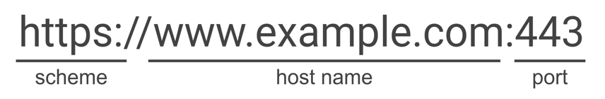

>[!abstract]
>The same-origin policy is a **restrictive cross-origin specification** implemented by browsers **that limits the ability for a website to interact with resources outside of the source domain**. The same-origin policy was defined many years ago in response to potentially malicious cross-domain interactions, such as one website stealing private data from another. It generally **allows a domain to issue requests to other domains, but not to access the responses.**

**Origin**: a URI scheme, domain and port number

When a browser sends an HTTP request from one origin to another, any cookies, including authentication session cookies, relevant to the other domain are also sent as part of the request. This means that the response will be generated within the user's session, and include any relevant data that is specific to the user. Without the same-origin policy, if you visited a malicious website, it would be able to read your emails from GMail, private messages from Facebook, etc.

See "Universal XSS" for further references about this kind of attacks.

## Same-origin policy examples

Example source: `http://normal-website.com/example/example.html`

| Url accessed                              | Access permitted                   |
| ----------------------------------------- | ---------------------------------- |
| `http://normal-website.com/example/`      | Yes: same scheme, domain, and port |
| `http://normal-website.com/example2/`     | Yes: same scheme, domain and port  |
| `https://normal-website.com/example/`     | No: different scheme and port      |
| `http://en.normal-website.com/example/`   | No: different domain               |
| `http://www.normal-website.com/example/`  | No: different domain               |
| `http://normal-website.com:8080/example/` | No: different port*                |
\**Internet Explorer will allow this access because IE does not take account of the port number when applying the same-origin policy.*

## Same-origin policy implementation

Same-origin policy generally controls the access that JavaScript code has to content that is loaded cross-domain. While these external resources can be loaded by the page, **any JavaScript on the page won't be able to read the contents of these resources**.

SOP allows to embed the following resources:

- `` tag for images
- `<video>` tag for media
- `<script>` tag for external JavaScript

SOA has also some exceptions:

- Some objects are writable but not readable cross-domain (e.g. `location` object and `location.href` property from iframes or new windows).
- Some objects are readable but not writable cross-domain (e.g. `length` property of the `window` object - which stores the number of frames-  and the `closed` property).
- `replace` function can generally be called cross-domain on the `location` object.
- You can call certain functions cross-domain. E.g. you can call the functions `close`, `blur` and `focus` on a new window. The `postMessage` function can also be called on iframes and new windows in order to send messages from one domain to another.
- **Cookies**: same-origin policy is more relaxed when dealing with cookies, so they are often accessible from all subdomains of a site (even though each subdomain is technically a different origin).

## Relaxing SOP

It's possible to relax same-origin policy using `document.domain`. This special property allows you to relax SOP for a specific domain, but only if it's part of your FQDN.

>[!example]
>You might have a domain `marketing.example.com` and you would like to read the contents of that domain on `example.com`. To do so, both domains need to set `document.domain` to `example.com`. Then SOP will allow access between the two domains despite their different origins.