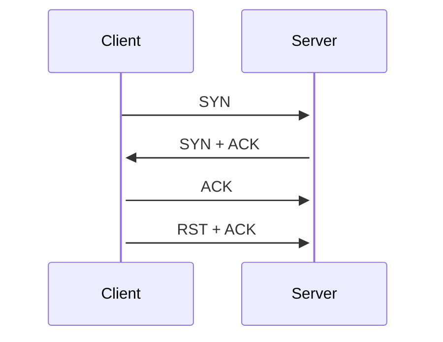
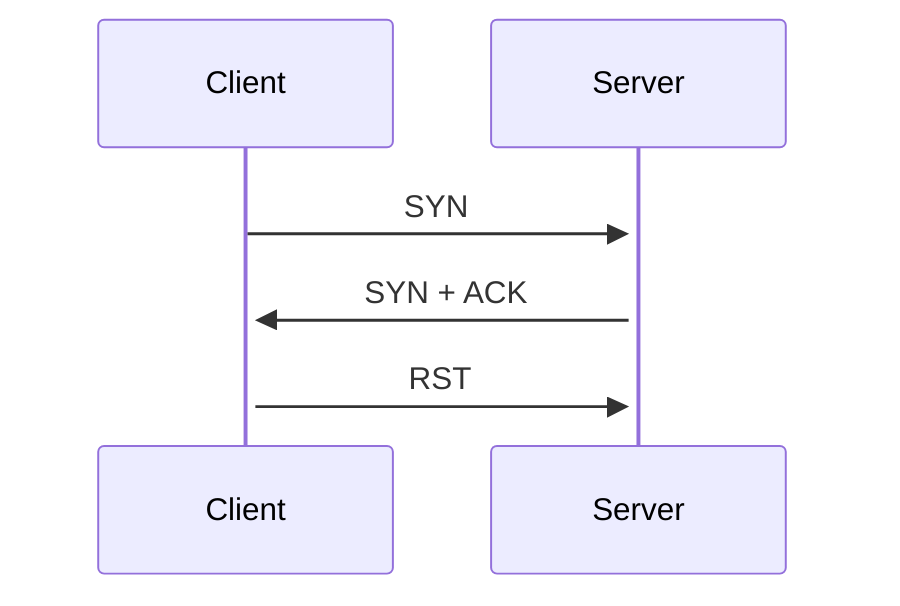
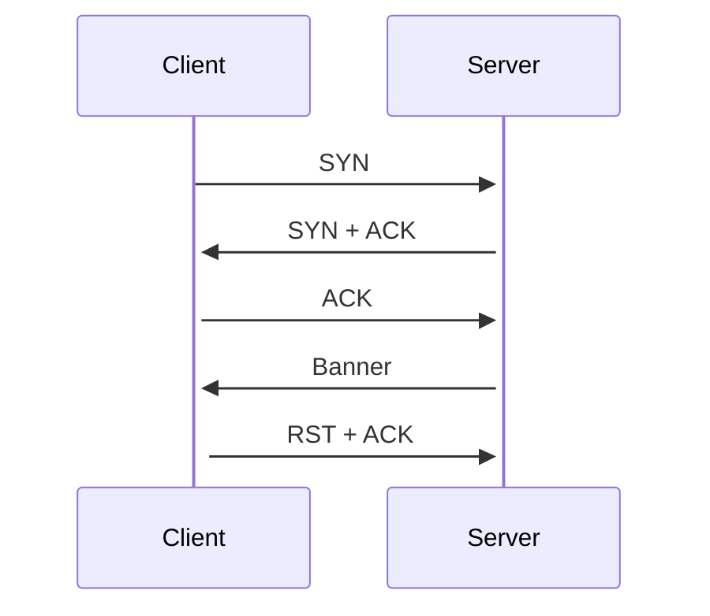
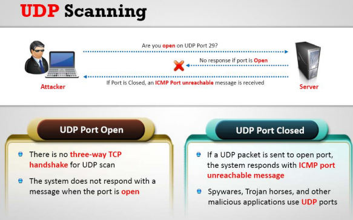
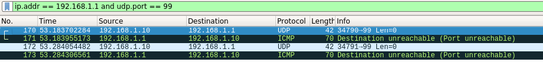

# TCP connect scan

```mermaid
sequenceDiagram
    Client->>+Server: SYN
    Server->>+Client: SYN + ACK
    Client->>+Server: ACK
    Client->>+Server: RST + ACK
```

# SYN scan

```mermaid
sequenceDiagram
    Client->>+Server: SYN
    Server->>+Client: SYN + ACK
    Client->>+Server: RST
```

# Version detection scan

```mermaid
sequenceDiagram
    Client->>+Server: SYN
    Server->>+Client: SYN + ACK
    Client->>+Server: ACK
    Server->>+Client: Banner
    Client->>+Server: RST + ACK
```

### UDP scan

