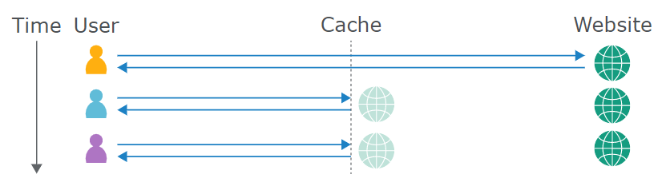

# What is a Cache

Caching is primarily a means of reducing the overload of the server. 
The cache sits between the server and the user, where it saves (caches) the responses to particular requests, usually for a fixed amount of time. If another user then sends an equivalent request, the cache simply serves a copy of the cached response directly to the user, without any interaction from the back-end.

## Cache keys

Caches identify equivalent requests by comparing a predefined subset of the request's components, known collectively as the "cache key". Typically, this would contain the **request line** and **`Host` header**. Components of the request that are not included in the cache key are said to be "unkeyed".

If the cache key of an incoming request matches the key of a previous request, then the cache considers them to be equivalent. As a result, it will serve a copy of the cached response that was generated for the original request. This applies to all subsequent requests with the matching cache key, until the cached response expires.

## Vary header

The Vary header specifies a list of additional headers that should be treated as part of the cache key even if they are normally unkeyed. It is commonly used to specify that the User-Agent header is keyed, for example, so that if the mobile version of a website is cached, this won't be served to non-mobile users by mistake.

In those cases it's still possible to perform poisoning attacks, but attackers are required to get in some way the value of specific user agents (or other keyed fields) using [Cross-Site Scripting (XSS)](Cross-Site%20Scripting%20(XSS).md) of other vulnerabilities.

## Interesting headers that make your life easier

- `Pragma: x-get-cache-key`
- `Pragma: akamai-x-get-cache-key`

# Web Cache Attacks

- [Web Cache Poisoning](Web%20Cache%20Poisoning.md)
- [Web Cache Deception](Web%20Cache%20Deception.md)